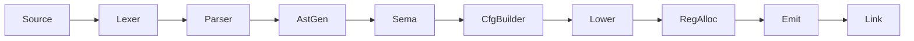

# CLAUDE.md

This file provides guidance to Claude Code (claude.ai/code) when working with code in this repository.

**Note**: This project uses [Linear](https://linear.app) (team: **Rue**) for issue tracking. Use the Linear MCP tools instead of markdown TODOs. See the Issue Tracking section below for workflow details.

## Quickstart

The 8 commands that cover ~90% of work here (all runnable from anywhere in the repo):

```bash
scripts/rue build                    # build the compiler -> refreshes bin/rue symlink
scripts/rue exec prog.rue            # compile prog.rue to a temp file AND run it (quick check)
RUE="$(scripts/rue-bin)"; "$RUE" a.rue b.rue -o out   # drive the real CLI (modules, multi-file)
scripts/rue test [pattern]           # full suite (= ./test.sh): unit + spec + UI + CLI + traceability
scripts/rue quick                    # unit tests only (~2-5s, fast inner loop)
scripts/rue spec 4.2                 # run spec tests matching a pattern
scripts/rue cli abi                  # run CLI integration tests matching a pattern
scripts/rue fmt                      # format (= ./fmt.sh) before committing
```

Key rules (details in the sections below):
- **Version control is `jj`, not git**, and this is a **fork** — never commit on `trunk`; work on a change and `jj git push -c @-` to PR a feature branch upstream. See [Version Control](#version-control).
- **Issue tracking is Linear** (team Rue, `RUE-NN`). See [Issue Tracking](#issue-tracking-with-linear).
- To get the compiler binary, use `scripts/rue-bin` (prints an absolute path; the old `buck2 ... --show-output | awk` one-liner returns a *relative* path that breaks when cwd changes).

## Project Overview

Rue is a systems programming language aiming for memory safety without garbage collection, with higher-level ergonomics than Rust/Zig. Currently in early development with Rust-like syntax.

## Build System

This project uses Buck2 (via `./buck2` wrapper script), not Cargo.

### Common Commands

```bash
# Build the compiler
./buck2 build //crates/rue:rue

# Build everything
./buck2 build //...

# Run all tests (unit + spec)
./test.sh

# Run unit tests only
./buck2 test //...

# Run spec tests only
./buck2 run //crates/rue-spec:rue-spec

# Run a specific crate's tests
./buck2 test //crates/rue-lexer:rue-lexer-test

# Filter spec tests by pattern
./buck2 run //crates/rue-spec:rue-spec -- "1.1"  # Section 1.1
./buck2 run //crates/rue-spec:rue-spec -- "zero" # Tests matching "zero"

# Compile and run a program (single file)
./buck2 run //crates/rue:rue -- source.rue output
./output

# Compile multiple files into one program
./buck2 run //crates/rue:rue -- main.rue utils.rue math.rue -o program
./program

# With shell glob expansion
./buck2 run //crates/rue:rue -- src/*.rue -o program

# Note: -o is required when compiling multiple files
./buck2 run //crates/rue:rue -- a.rue b.rue          # Error!
./buck2 run //crates/rue:rue -- a.rue b.rue -o out   # OK

# Emit intermediate representations (can specify multiple stages)
./buck2 run //crates/rue:rue -- --emit tokens source.rue  # Lexer tokens
./buck2 run //crates/rue:rue -- --emit ast source.rue     # Abstract syntax tree
./buck2 run //crates/rue:rue -- --emit rir source.rue     # Untyped IR
./buck2 run //crates/rue:rue -- --emit air source.rue     # Typed IR
./buck2 run //crates/rue:rue -- --emit cfg source.rue     # Control flow graph
./buck2 run //crates/rue:rue -- --emit mir source.rue     # Machine IR (virtual registers)
./buck2 run //crates/rue:rue -- --emit asm source.rue     # Assembly (physical registers)

# Chain multiple stages to see the full pipeline
./buck2 run //crates/rue:rue -- --emit tokens --emit ast --emit rir source.rue
```

## Architecture

The compiler pipeline transforms source through successive IRs:



| Stage | Pass | IR Produced | `--emit` flag |
|-------|------|-------------|---------------|
| 1 | Lexer | tokens | `tokens` |
| 2 | Parser | AST | `ast` |
| 3 | AstGen | RIR (untyped) | `rir` |
| 4 | Sema | AIR (typed) | `air` |
| 5 | CfgBuilder | CFG | `cfg` |
| 6 | Lower | MIR (machine) | `mir` |
| 7 | RegAlloc | MIR (allocated) | `asm` |
| 8 | Emit | bytes | - |
| 9 | Link | ELF | - |

### Crate Responsibilities

| Crate | Purpose |
|-------|---------|
| `rue` | CLI binary |
| `rue-compiler` | Pipeline orchestration |
| `rue-lexer` | Tokenization |
| `rue-parser` | AST construction |
| `rue-rir` | Untyped IR (post-parse, pre-typing) |
| `rue-cfg` | Control flow graph construction and optimization |
| `rue-air` | Typed IR (after semantic analysis) |
| `rue-codegen` | x86-64 machine code generation |
| `rue-linker` | ELF object file creation and linking |
| `rue-error` | Error types and diagnostics |
| `rue-span` | Source location tracking |
| `rue-target` | Target platform configuration |
| `rue-spec` | Specification test runner |
| `rue-ui-tests` | UI/diagnostics tests (warnings, error messages) |
| `rue-fuzz` | Fuzz testing infrastructure |
| `rue-runtime` | Runtime support |
| `rue-builtins` | Built-in type definitions (String, future Vec, etc.) |

### Multi-File Compilation

Rue supports compiling multiple source files into a single executable:

```bash
# All files share a flat global namespace (no modules yet)
rue main.rue utils.rue lib.rue -o program
```

**Key semantics:**
- All functions, structs, and enums are globally visible across files
- Duplicate definitions (same name in multiple files) cause a compile error
- `main()` must exist in exactly one file
- Files are parsed in parallel, then merged for semantic analysis

**Current limitations (will be addressed by the module system):**
- No visibility control (`pub`/private)
- No namespacing - all symbols share global scope
- No `mod` or `use` syntax
- Must list all files explicitly on command line

### Key Design Decisions

- **Architecture-specific MIR**: Each target gets its own machine IR (currently X86Mir), following Zig's approach
- **Index-based references**: Instructions stored in vectors, referenced by u32 indices (cache-friendly, no lifetimes)
- **Direct code emission**: No LLVM dependency; machine code emitted directly
- **Minimal ELF**: Static executables with direct syscalls (Linux x86-64 only)
- **Built-in types as synthetic structs**: Types like `String` are defined in `rue-builtins` and injected as synthetic structs, not as hardcoded `Type` enum variants (see [ADR-0020](docs/designs/0020-builtin-types-as-structs.md))

### Built-in Types Architecture

Built-in types (currently just `String`, future `Vec<T>`, etc.) are implemented as "synthetic structs" — the compiler injects them before processing user code. This architecture:

- **Eliminates special-casing**: Built-in types flow through the same code paths as user-defined structs
- **Centralizes metadata**: All type information (fields, methods, operators) lives in `rue-builtins`
- **Scales to new types**: Adding `Vec<T>` or `HashMap<K,V>` becomes "add an entry to `BUILTIN_TYPES`"

**Key components:**

| Component | Location | Purpose |
|-----------|----------|---------|
| Type definitions | `rue-builtins/src/lib.rs` | `BuiltinTypeDef` constants describing fields, methods, operators |
| Injection point | `rue-air/src/sema.rs` | `inject_builtin_types()` creates synthetic `StructDef` entries |
| Runtime functions | `rue-runtime/src/lib.rs` | Actual implementations (e.g., `String__len`, `__rue_drop_String`) |

**Adding a new built-in type:**

1. Define a `BuiltinTypeDef` in `rue-builtins/src/lib.rs`
2. Add it to the `BUILTIN_TYPES` slice
3. Implement runtime functions in `rue-runtime`

See the module documentation in `rue-builtins` for a detailed example with hypothetical `Vec` type.

## Testing

### Development Workflow

The test suite has three layers optimized for different stages of development:

| Test Type | Command | Speed | When to Use |
|-----------|---------|-------|-------------|
| Unit tests | `./quick-test.sh` | ~2-5s | During active development |
| Full suite | `./test.sh` | ~30-60s | Before committing |
| Targeted spec | `./buck2 run //crates/rue-spec:rue-spec -- "pattern"` | Varies | Testing specific features |

**Recommended workflow:**

```bash
# During development - fast feedback loop
./quick-test.sh                # Unit tests only

# Before committing - full verification
./test.sh                      # Unit + spec + UI + traceability

# Debugging specific areas
./buck2 run //crates/rue-spec:rue-spec -- "arithmetic"  # Specific spec tests
./buck2 test //crates/rue-codegen:rue-codegen-test      # Specific crate
```

### Choosing the Right Test Type

| If you're... | Use... | Why |
|--------------|--------|-----|
| Iterating on a fix | `./quick-test.sh` | Fast feedback, catches most issues |
| Adding a language feature | Spec tests | Required for traceability |
| Improving diagnostics | UI tests | Not spec-mandated behavior |
| About to commit | `./test.sh` | Ensures nothing is broken |

**Rule of thumb:**
- **Unit tests** catch logic errors quickly during development
- **Spec tests** verify language semantics and maintain spec traceability
- **UI tests** verify compiler quality-of-life features (warnings, error messages)

### Unit Tests
Add to relevant crate's source file with `#[cfg(test)]` modules. Ensure crate has `rust_test` target in its `BUCK` file.

The `rue-compiler` crate includes integration unit tests that test the full pipeline without execution. Use `compile_to_air()` and `compile_to_cfg()` helpers to test compilation without spawning processes.

### UI Tests

UI tests verify compiler behavior that is **not** part of the language specification, such as:
- Warning messages (unused variables, unreachable code)
- Diagnostic quality and formatting
- Compiler flags and options
- Error message wording

#### UI Test Directory Structure

UI tests are in `crates/rue-ui-tests/cases/`:

```
cases/
├── warnings/         # Warning detection tests
│   ├── unused.toml   # Unused variable/function warnings
│   └── unreachable.toml  # Unreachable code warnings
└── diagnostics/      # Error message quality tests (future)
```

#### UI Test Format

```toml
[section]
id = "warnings.unused"
name = "Unused Variable Warnings"
description = "Tests for detection of unused variables."

[[case]]
name = "unused_variable_warning"
source = """
fn main() -> i32 {
    let x = 42;
    0
}
"""
exit_code = 0
warning_contains = ["unused variable", "'x'"]
expected_warning_count = 1

[[case]]
name = "no_warnings_expected"
source = """
fn main() -> i32 {
    let x = 42;
    x
}
"""
exit_code = 42
no_warnings = true
```

#### Running UI Tests

```bash
# Run all UI tests
./buck2 run //crates/rue-ui-tests:rue-ui-tests

# Filter by pattern
./buck2 run //crates/rue-ui-tests:rue-ui-tests -- "unused"
```

#### When to Add UI Tests vs Spec Tests

- **Spec tests** (`crates/rue-spec/cases/`): Language semantics defined in the specification. These tests have `spec = [...]` references linking to spec paragraphs.
- **UI tests** (`crates/rue-ui-tests/cases/`): Compiler quality-of-life features not in the spec (warnings, diagnostics, CLI behavior).

### CLI Integration Tests

CLI integration tests (`crates/rue-cli-tests/cases/`) exercise the compiler **the way a user does**: the real `rue` binary invoked on real files in a temp directory with relative paths, env vars, and stdin piped to the compiled program. They catch driver-only bugs the spec harness can't see (module resolution from disk, ABI miscompilations, ICEs, CLI argument handling).

```bash
# Run all CLI integration tests
./buck2 run //crates/rue-cli-tests:rue-cli-tests

# Filter by pattern
./buck2 run //crates/rue-cli-tests:rue-cli-tests -- "abi"
```

Key conventions (see the doc comment in `crates/rue-cli-tests/src/main.rs` for the full case format):

- Each case lists `files` written to disk; the default invocation is `rue <first file> -o prog` with the temp dir as cwd
- Any compiler panic is reported as an **INTERNAL COMPILER ERROR** — a distinct failure class
- `known_bug = "RUE-NN"` marks an expected failure (xfail) referencing a Linear issue. The case still runs; if it unexpectedly PASSES, the suite fails and tells you to remove the marker — converting it into a regression test. **When fixing a bug, find and un-mark its cases.**
- `known_bug_on = ["x86-64-linux"]` scopes the xfail to specific platforms (for ABI bugs that manifest differently per target); on other platforms the case runs as a normal test. Platform names match `get_host_target()`: `x86-64-linux`, `aarch64-linux`, `aarch64-macos`
- Prefer adding a CLI case (not just a spec test) for any bug that involves the driver, the ABI, multiple files, or runtime I/O

### Specification Tests

The specification test system provides traceability between the language specification and tests.

#### Test Directory Structure

Tests are organized in `crates/rue-spec/cases/` by language feature:

```
cases/
├── lexical/          # Tokens, comments, whitespace
├── types/            # Integer, boolean, unit, never types
├── expressions/      # Literals, operators, control flow
├── statements/       # Let, assignment, expression statements
├── items/            # Functions, structs
├── arrays/           # Fixed-size arrays
├── runtime/          # Intrinsics, runtime behavior
├── golden/           # IR dump tests
└── errors/           # Compile-time error tests
```

#### Test Format

```toml
[section]
id = "expressions.arithmetic"
spec_chapter = "4.2"           # Links to spec chapter
name = "Arithmetic Operators"

# Run-pass test with spec traceability
[[case]]
name = "addition_basic"
spec = ["4.2:1", "4.2:2"]      # Spec paragraphs this test covers
source = "fn main() -> i32 { 1 + 2 }"
exit_code = 3

# Compile-fail test
[[case]]
name = "type_mismatch"
spec = ["4.2:5"]
source = "fn main() -> i32 { 1 + true }"
compile_fail = true
error_contains = "type mismatch"

# Golden test (exact IR output)
[[case]]
name = "simple_add_air"
spec = ["4.2:1"]
source = "fn main() -> i32 { 42 }"
expected_air = """
function main:
air (return_type: i32) {
    %0 : i32 = const 42
    %1 : i32 = ret %0
}
"""

# Preview feature test (allowed to fail)
[[case]]
name = "some_preview_feature"
spec = ["X.Y:Z"]
preview = "test_infra"           # Requires --preview test_infra
source = "..."
exit_code = 0

# Preview feature test (must pass)
[[case]]
name = "some_preview_feature_basic"
spec = ["X.Y:Z"]
preview = "test_infra"
preview_should_pass = true       # Fails CI if this test fails
source = "..."
exit_code = 0
```

#### Preview Feature Tests

Tests for preview features use two fields:
- `preview = "feature_name"` - Marks the test as requiring a preview feature. The test runs with `--preview feature_name` and is allowed to fail (shows as "ignored" in output).
- `preview_should_pass = true` - When combined with `preview`, makes the test required to pass. Use this for portions of preview features that are already implemented.

**Workflow for preview features:**
1. Initially, add tests with just `preview = "feature_name"` (allowed to fail)
2. As you implement parts of the feature, add `preview_should_pass = true` to tests that should now pass
3. When stabilizing the feature, remove both `preview` and `preview_should_pass` fields

The `preview` field must match a valid `PreviewFeature` variant name. The test runner validates all preview feature names on startup and will fail with a clear error if an unknown feature name is used.

#### Spec Paragraph References

The `spec` field links tests to specification paragraphs using the format `{chapter}.{section}:{paragraph}`:
- `3.1:1` - Chapter 3, Section 1, Paragraph 1
- `4.2:5` - Chapter 4, Section 2, Paragraph 5

### Language Specification

The formal language specification is in `docs/spec/src/`. It is integrated into the website via Zola.

#### Building the Spec

The spec is built as part of the website:

```bash
./website/build.sh
# Output in website/public/spec/
```

#### Spec Structure

```
docs/spec/src/
├── _index.md               # Spec root (Zola section)
├── 01-introduction.md      # Conformance, definitions
├── 02-lexical-structure/   # Tokens, comments, keywords
├── 03-types/               # Type system
├── 04-expressions/         # All expression forms
├── 05-statements/          # Statement forms
├── 06-items/               # Functions, structs
├── 07-arrays/              # Array types
├── 08-runtime-behavior/    # Overflow, bounds checking
└── appendices/             # Grammar, UB summary
```

#### Spec Paragraph Format

Each paragraph has an ID using the Zola shortcode format `{{ rule(id="X.Y:Z", cat="category") }}`:

```markdown
{{ rule(id="3.1:1", cat="normative") }}
A signed integer type is one of: `i8`, `i16`, `i32`, or `i64`.

{{ rule(id="3.1:2", cat="normative") }}
Signed integer arithmetic that overflows causes a runtime panic.

{{ rule(id="3.1:3", cat="example") }}
```rue
let x: i32 = 42;
```
```

The format is `{{ rule(id="X.Y:Z") }}` or `{{ rule(id="X.Y:Z", cat="category") }}` where:
- `X.Y` is the chapter and section (e.g., `3.1` for Chapter 3, Section 1)
- `Z` is the paragraph number within that section
- The colon (`:`) separates the structural location from the paragraph number
- `cat` is optional (defaults to `informative` if omitted)

**Paragraph categories:**
- `normative` - General normative rule (requires test coverage)
- `legality-rule` - Compile-time requirements (normative)
- `dynamic-semantics` - Runtime behavior (normative)
- `syntax` - Grammar rules (normative)
- `undefined-behavior` - UB conditions (normative)
- `example` - Code examples (informative)
- `informative` - Explanatory text (informative, default)

#### Traceability Report

Generate a report showing test coverage of spec paragraphs:

```bash
# Summary report
./buck2 run //crates/rue-spec:rue-spec -- --traceability

# Detailed matrix (shows all paragraphs and their covering tests)
./buck2 run //crates/rue-spec:rue-spec -- --traceability --detailed
```

The traceability check is run as part of `./test.sh` and fails if:
- Any spec paragraph has no covering test (coverage < 100%)
- Any test references a non-existent spec paragraph ID

### Fuzz Testing

The project has comprehensive fuzz testing infrastructure in `crates/rue-fuzz` that tests the compiler for crashes, panics, and security issues using both mutation-based and property-based fuzzing.

#### Available Fuzz Targets

```bash
# List all fuzz targets
./buck2 run //crates/rue-fuzz:rue-fuzz -- --list

# Available targets:
# - lexer: Tokenization only (~27,000 exec/s)
# - parser: Lexing + parsing (~6,500 exec/s)
# - sema: Semantic analysis (~4,000-8,000 exec/s)
# - compiler: Full frontend (~4,000-8,000 exec/s)
# - emitter: x86-64 instruction encoding (~15,000 exec/s)
# - emitter_sequence: Instruction sequences with labels/jumps (~10,000 exec/s)
```

#### Running Fuzz Tests

```bash
# Initialize corpus from spec tests
./buck2 run //crates/rue-fuzz:rue-fuzz -- --init-corpus crates/rue-fuzz/corpus

# Run a fuzz target with mutations
./buck2 run //crates/rue-fuzz:rue-fuzz -- --mutate lexer crates/rue-fuzz/corpus

# Run for a specific duration (300 seconds = 5 minutes)
./buck2 run //crates/rue-fuzz:rue-fuzz -- --mutate --max-time=300 parser crates/rue-fuzz/corpus

# Run for a specific number of iterations
./buck2 run //crates/rue-fuzz:rue-fuzz -- --max-runs=10000 sema crates/rue-fuzz/corpus

# Run all fuzz targets for 5 minutes each
for target in lexer parser sema compiler emitter emitter_sequence; do
    ./buck2 run //crates/rue-fuzz:rue-fuzz -- --mutate --max-time=300 $target crates/rue-fuzz/corpus
done
```

#### Property-Based Testing

The fuzzer includes proptest-based generators that create syntactically valid Rue programs:

```bash
# Run proptest-based fuzz tests
./buck2 test //crates/rue-fuzz:rue-fuzz-test
```

These generators create valid identifiers, types, expressions, statements, functions, and complete programs. This enables deeper testing than random byte mutation since the inputs exercise semantic analysis and type checking.

#### CI Integration

Fuzzing runs automatically in CI via `.github/workflows/fuzz.yml`. Each target runs for 5 minutes daily. Any crashes trigger a non-zero exit code and create an issue with the `fuzz-crash` label.

#### When a Crash is Found

If fuzzing finds a crash, the input is saved to `crates/rue-fuzz/crashes/`:

```bash
# Reproduce the crash
./buck2 run //crates/rue:rue -- crates/rue-fuzz/crashes/crash-*.txt output

# Or just tokenize to see the issue
./buck2 run //crates/rue:rue -- --emit tokens crates/rue-fuzz/crashes/crash-*.txt
```

See `crates/rue-fuzz/README.md` for complete documentation.

## Modifying the Language

When adding or changing language features, follow this checklist.

### Preview Features (Gating New Features)

**IMPORTANT**: New language features MUST be gated behind preview flags until complete. See [ADR-0005](docs/designs/0005-preview-features.md) for the full design.

#### When to Use Preview Features

Use preview gating when:
- Adding new syntax (keywords, operators, constructs)
- Adding new type system features
- Any feature that spans multiple implementation phases

#### How to Gate a Feature

1. **Add to PreviewFeature enum** in `rue-error/src/lib.rs`:
   ```rust
   pub enum PreviewFeature {
       YourNewFeature,  // Add your feature here
   }
   ```
   Also update `name()`, `adr()`, `all()`, and `FromStr` impl.

2. **Add the gate check in Sema** (`rue-air/src/sema.rs`):
   ```rust
   // At the point where the feature is used:
   self.require_preview(PreviewFeature::YourNewFeature, "your feature description", span)?;
   ```

   **This is the critical step that actually gates the feature!** Without this call, users can use the feature without `--preview`.

3. **Add spec tests with `preview` field**:
   ```toml
   [[case]]
   name = "your_feature_basic"
   spec = ["X.Y:Z"]
   preview = "your_new_feature"  # Matches PreviewFeature::name()
   source = """..."""
   exit_code = 42
   ```

4. **Test that the gate works**:
   - Without `--preview your_new_feature`: Should get "requires preview feature" error
   - With `--preview your_new_feature`: Should compile/run

#### Stabilizing a Feature

When all tests pass and the feature is complete:

1. Remove `preview = "..."` from spec tests
2. Remove the `require_preview()` call from Sema
3. Remove the variant from `PreviewFeature` enum
4. Update the ADR status to "Implemented"

### Implementation Steps

1. **Update the specification** (`docs/spec/src/`)
   - Add/modify spec paragraphs with proper IDs (e.g., `r[4.2:3#normative]`)
   - Include normative rules, dynamic semantics, and examples
   - Update the grammar appendix if syntax changes

2. **Update `rue-lexer`** if new tokens needed

3. **Update `rue-parser`** for new syntax

4. **Update `rue-rir`** for new IR instructions

5. **Update `rue-air`** for typed versions
   - **If this is a new feature**: Add the `require_preview()` gate (see above)

6. **Update `rue-codegen`** for code generation

7. **Add spec tests** in `crates/rue-spec/cases/`
   - Include `spec = ["X.Y:Z"]` references to link to spec paragraphs
   - Cover all normative paragraphs (traceability check enforces 100% coverage)
   - **If this is a preview feature**: Include `preview = "feature_name"` field

8. **Add UI tests** in `crates/rue-ui-tests/cases/` if the feature includes:
   - New warnings or lints
   - Changes to error message formatting
   - New compiler flags or options

9. **Run `./test.sh`** to verify all tests pass and traceability is maintained

## Codegen: Multi-Backend Considerations

**IMPORTANT**: The `rue-codegen` crate contains multiple architecture backends:
- `x86_64/` - Linux x86-64
- `aarch64/` - macOS ARM64

When making changes to codegen, **always check if the same change is needed in all backends**. Common areas that require parallel changes:

- **New MIR instructions**: Add to both `x86_64/mir.rs` and `aarch64/mir.rs`
- **Instruction emission**: Update both `x86_64/emit.rs` and `aarch64/emit.rs`
- **Register allocation**: Update both `x86_64/regalloc.rs` and `aarch64/regalloc.rs`
- **Liveness analysis**: Update both `x86_64/liveness.rs` and `aarch64/liveness.rs`
- **CFG lowering**: Update both `x86_64/cfg_lower.rs` and `aarch64/cfg_lower.rs`

Example: If adding a new comparison instruction variant (e.g., 64-bit compare):
1. Add `Cmp64RR` to both MIR definitions
2. Add emission logic to both emitters
3. Add register allocation handling to both allocators
4. Add liveness tracking to both liveness analyzers
5. Update CFG lowering in both backends to use the new instruction where appropriate

**Testing across backends**: The spec tests run on the host architecture only. If you only have access to one platform, note in your commit message that the other backend may need verification.

## Version Control

**IMPORTANT**: This project uses **Jujutsu (jj)**, NOT git. Never use git commands in this repository.

### Common jj Commands

| Instead of git... | Use jj... |
|-------------------|-----------|
| `git status` | `jj status` |
| `git diff` | `jj diff` |
| `git add . && git commit -m "msg"` | `jj commit -m "msg"` (auto-adds all changes) |
| `git log` | `jj log` |
| `git checkout -b branch` | `jj new -m "description"` |
| `git stash` | Not needed - jj auto-saves working changes |

### Key Differences from git

- **No staging area**: `jj commit` automatically includes all changes
- **Working copy is a commit**: Your uncommitted changes are already tracked
- **Use `jj describe`** to update the current commit message
- **Use `jj new`** to start a new change on top of current one

### Fork Workflow (IMPORTANT)

This is a **fork** setup. There are two git remotes:

- `upstream` = `rue-language/rue` — the canonical repo, the source of truth. You **cannot** push here; you open PRs into it.
- `origin` = `steveklabnik/rue` — your fork. You push feature branches here, then PR them upstream.

**Rules:**

1. **Never put your own commits on `origin/trunk`.** `origin/trunk` should only ever mirror `upstream/trunk`. Committing on `trunk` and PRing `trunk` causes hash-rewrite divergence every time upstream rebase/squash-merges.
2. **Work on a feature change**, then push it as a branch and PR it:
   ```bash
   jj rebase -d 'trunk()'          # rebase onto upstream's canonical trunk (a revset, not a bookmark)
   jj git push -c @-               # pushes as steveklabnik/push-<changeid> (see git_push_bookmark template)
   # then open a PR from that branch -> upstream/trunk using the URL the push prints
   ```
3. **`trunk()` is a revset alias = `trunk@upstream`** — always means upstream's latest, regardless of local bookmark state. Prefer `trunk()` over the bare `trunk` bookmark in rebase/log commands.
4. **After a PR merges**, just `jj git fetch` (configured to pull both remotes) and your base updates. If upstream rebase-merged (rewriting hashes), the old fork-side copies show as "divergent" — that's cosmetic; `jj abandon` the orphaned old-hash chain to tidy up.

**Required repo config** (machine-local; set on a fresh clone — jj does not read committed config):

```bash
jj config set --repo 'revset-aliases."trunk()"' 'trunk@upstream'   # base/immutability = canonical repo
jj config set --repo git.fetch '["origin", "upstream"]'            # always see both remotes
```

Without these, `jj git fetch` only pulls `origin` (you won't see upstream merges), and `trunk()`/immutability anchor to your fork instead of upstream.

### Commit Messages

When committing, use `jj commit -m "message"` or for multi-line messages:
```bash
jj commit -m "Short summary

Longer description here.

🤖 Generated with [Claude Code](https://claude.com/claude-code)

Co-Authored-By: Claude <noreply@anthropic.com>"
```

## Code Style

- Standard Rust formatting (rustfmt)
- Rust edition 2024

## Logging Guidelines

Rue uses the `tracing` crate for structured logging, following the **"wide events"** philosophy from [loggingsucks.com](https://loggingsucks.com/). This means:

1. **Canonical log lines** - One rich, structured log per operation containing all debugging context
2. **Structured format** - Key-value pairs instead of plain strings for queryability
3. **High-cardinality data** - Include contextual data like function names, counts, sizes

### Using the Logging

```bash
# Normal compilation (no logging by default)
rue source.rue output

# Show timing per pass
rue --time-passes source.rue output

# Enable debug logging
rue --log-level=debug source.rue output
RUST_LOG=debug rue source.rue output

# JSON format for tooling integration
rue --log-format=json --log-level=debug source.rue output

# Filter to specific module
RUST_LOG=rue_compiler::sema=trace rue source.rue output
```

### Adding Instrumentation

Each compilation pass should have a tracing span wrapping the work:

```rust
use tracing::{info_span, info};

pub fn my_pass(input: &Input) -> Result<Output> {
    // Create a span for the pass - includes timing automatically
    let _span = info_span!("my_pass").entered();

    // Do the work...
    let result = process(input)?;

    // Log completion with useful metrics
    info!(
        item_count = result.items.len(),
        "pass complete"
    );

    Ok(result)
}
```

### Logging Levels

| Level | Use for | Example |
|-------|---------|---------|
| `error` | Compilation failures, internal compiler errors | ICE, unrecoverable errors |
| `warn` | Suspicious patterns (surfaced via diagnostics) | Deprecated feature usage |
| `info` | Per-pass completion with summary metrics | "lexing complete", token counts |
| `debug` | Decision points, intermediate state | "resolving symbol X to Y" |
| `trace` | Detailed internal state, individual instructions | Instruction-by-instruction output |

### Good vs Bad Examples

**Good: Wide event with context**
```rust
let _span = info_span!(
    "codegen",
    arch = "x86_64",
    function_count = functions.len()
).entered();

// ... do code generation ...

info!(
    code_bytes = total_bytes,
    "code generation complete"
);
```

**Bad: Scattered debug statements**
```rust
println!("Starting codegen...");
for func in functions {
    println!("Generating function: {:?}", func.name);
    // ...
}
println!("Done!");
```

**Good: Structured key-value data**
```rust
info!(
    token_count = tokens.len(),
    source_bytes = source.len(),
    "lexing complete"
);
```

**Bad: String interpolation**
```rust
println!("Lexed {} tokens from {} bytes", tokens.len(), source.len());
```

### Key Principles

1. **Spans for timing**: Wrap passes in `info_span!()` - this enables `--time-passes`
2. **Events for outcomes**: Use `info!()` after completing work with metrics
3. **Context in spans**: Include high-level context (file, function count) in span fields
4. **Metrics in events**: Include computed metrics (instruction counts, sizes) in events
5. **Zero-cost when off**: Tracing has no overhead when no subscriber is active

## Issue Tracking with Linear

**IMPORTANT**: This project uses **Linear** for ALL issue tracking, in the **Rue** team. Do NOT use markdown TODOs, task lists, or other tracking methods.

### Access

In Claude Code, use the Linear MCP tools (`list_issues`, `get_issue`, `save_issue`, `save_comment`, `list_my_issues`, etc.). Issues are identified as `RUE-NN`.

### Quick Start

- **Find ready work**: list issues in the Rue team with state `Todo` or `Backlog`, ordered by priority; skip issues blocked by open issues
- **Create an issue**: `save_issue` with `team: "Rue"`, a clear title, and a Markdown description
- **Claim**: `save_issue` with `state: "In Progress"` and `assignee: "me"`
- **Complete**: `save_issue` with `state: "Done"`

### Conventions

- **Multi-phase features**: create a parent issue (the "epic") and sub-issues per phase via `parentId`; link the ADR in the description
- **Discovered work**: when you find new work mid-task, create a new issue with `relatedTo` (or `blockedBy` if it's a true dependency) pointing at the issue you were working on
- **Priorities (Linear semantics)**: `1` Urgent (security, broken builds), `2` High (major features, important bugs), `3` Medium (default), `4` Low (polish, backlog ideas)
- **Labels**: use `bug`, `feature`, `task`, `chore` to mirror issue types

### Workflow for AI Agents

1. **Check ready work**: list `Todo`/`Backlog` issues in the Rue team
2. **Claim your task**: set state to `In Progress`
3. **Describe the working commit**: `jj describe -m "WIP: RUE-42 - short description"`
   - This makes it easy to see what's being worked on in each workspace
   - Will be overwritten with the final commit message when complete
4. **Work on it**: Implement, test, document
5. **Discover new work?** Create a linked issue (`relatedTo` the current one)
6. **Complete**: put `Fixes RUE-42` in the **PR body** — the issue moves to `Done` automatically when the PR merges (see below). No manual state change is needed.

### Closing issues: GitHub ↔ Linear sync

The Linear ↔ GitHub integration is connected to both `steveklabnik/rue` (the fork) and `rue-language/rue` (upstream). A merged PR **auto-links and auto-closes** the issues it references, so you don't need to set issues to `Done` by hand.

- Put a closing keyword in the **PR body** (not just the commit message): `Fixes RUE-NN` (also accepts `Closes`/`Resolves`). The PR body is what the integration parses.
- **One issue per line** for a PR that fixes several issues — `Fixes RUE-28` / `Fixes RUE-60` / `Fixes RUE-98`, each on its own line. A bare comma list (`Fixes RUE-28, RUE-60`) only closes the first.
- The branch name (`steveklabnik/push-<changeid>`) does **not** carry the issue ID, so rely on the PR-body keywords, not branch-name linking. This also handles multi-issue PRs, which a branch name can't.
- On merge, the integration links the PR as an attachment on each issue **and** transitions it to `Done`. Marking `Done` manually is an optional backstop (e.g. for a PR that merged before the integration existed, which it won't retroactively process).

### Important Rules

- ✅ Use Linear for ALL task tracking
- ✅ Link discovered work to the issue it came from
- ✅ Reference issue IDs (RUE-NN) in commit messages
- ❌ Do NOT create markdown TODO lists
- ❌ Do NOT use other issue trackers
- ❌ Do NOT duplicate tracking systems
