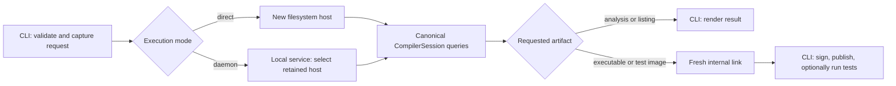

# ADR-0085: Persistent compiler daemon

## Status

Accepted on 2026-09-07 by Steve, incorporating Dorian's requirement that
`rue test` participate from the initial service release. The supported workflow
is a repeated check/test/build loop over one retained host, with request-specific
root sets. Implementation is authorized in reviewable phases; changing the
default to automatic daemon use remains gated by measurement and qualification.
This is a tooling and process-lifetime change, so rollout uses a driver option
rather than a language `PreviewFeature`.

ADR acceptance is tracked by RUE-2123; implementation is tracked by RUE-2126.

## Summary

Make ordinary Rue compiler invocations clients of an automatically started,
local compiler daemon. The daemon retains `FilesystemCompilerHost` instances
and their `CompilerSession` query graphs between invocations. Each command
re-observes its inputs and requests artifacts through the existing compiler
facade; unchanged computations can remain in memory after the client exits.
The CLI continues to own terminal interaction, output publication, and program
execution. An explicit direct mode uses the same compiler and remains available
for hermetic build actions, fresh-process measurements, and troubleshooting.

Start with an opt-in daemon for ordinary compilation, `rue test` (including
listing), and analysis-only requests through the existing semantic `--emit air`
surface. Internal linking is used when an executable or test image is needed.
Make it automatic for that supported surface after correctness, latency, and
resource behavior are demonstrated. Retain in-memory query results through
object production, perform a fresh link for image requests, and let the client
publish or execute the result. Disk-persistent query caches, incremental
linking, and editor protocols are independent extensions.

## Context

### What already exists

The following findings were checked against source and tests at
`b90243c49` on 2026-09-07. Tests cited here were read as evidence of existing
coverage; this research did not run a daemon prototype or measure a speedup.

| Current source | Implication for a daemon |
| --- | --- |
| [`FilesystemCompilerHost`](../../crates/rue/src/host.rs) owns filesystem discovery and a retained session. It exposes `reobserve`, reached-toolchain acquisition, presentation, executable, and test queries. | Keep this owner alive. Do not add another source loader or compiler phase machine. |
| [`main`](../../crates/rue/src/main.rs) opens a host for each ordinary invocation; [`watch::run`](../../crates/rue/src/watch.rs) keeps one across executable or test cycles. | Rue already has production warm consumers, but ordinary commands cannot share their state. |
| [`compile::drive`](../../crates/rue/src/compile.rs) owns the discovery gate, preflight, compilation, publication, and diagnostics for executable and test-image cycles. | Extend the existing cycle at the process boundary rather than introducing another executor with the same sequence. |
| [`CompilerSession`](../../crates/rue-compiler/src/session.rs) owns revisioned queries; [`pipeline_tests`](../../crates/rue-compiler/src/pipeline_tests.rs) exercise body-edit reuse and warm/fresh parity. | Incremental compilation exists. The new work is hosting it across client lifetimes. |
| [`codegen_query`](../../crates/rue-compiler/src/codegen_query.rs) keys backend results by semantic dependencies and codegen context. | Reuse the existing query identities instead of caching by source filename or command string. |
| [`rue-query::executor`](../../crates/rue-query/src/executor.rs) owns reusable OS workers. | Retention can amortize worker setup as well as compiler computation. |
| [`queries`](../../crates/rue-compiler/src/queries.rs) and [`linking`](../../crates/rue-compiler/src/linking.rs) link retained backend artifacts afresh. User archives are read at link time. | A daemon does not eliminate whole-program linking or justify reusing an executable solely because source files match. |
| [`CompilationCancellation`](../../crates/rue-compiler/src/unstable.rs) and the watch loop support cancellation and coherent successor observations. | Reuse these contracts for disconnects and watch supersession; service admission and protocol completion still need design. |
| [`rue-fuzz`'s `warm_session` target](../../crates/rue-fuzz/src/targets.rs) compares every step in bounded edit sequences with fresh compilation. | The historical absence of edit-sequence fuzzing has been removed. Extend this coverage to the process boundary. |

The strongest existing witness is
`platform_native_warm_single_function_edit_recomputes_one_codegen_unit_then_fresh_links`
in `pipeline_tests.rs`:
one module is reparsed, one semantic body/CFG/codegen unit is recomputed, an
unaffected caller is reused, and executable bytes and warnings agree with a
fresh compile. That demonstrates useful locality, not a prediction of daemon
latency on a large program.

### Remaining costs and current gaps

The CLI process still starts on every command. A new daemon must perform its
own startup and first compilation. Warm commands still pay for connection and
queueing, filesystem observation, dependency validation, changed computations,
fresh linking, transfer, signing, and output publication. Small programs may
lose more to communication than they gain from reuse.

Several relevant issues are present in current source:

- `configure_thread_pool` writes a process-global worker setting that new
  sessions snapshot. Each session has its own runtime budget. This is the
  unresolved configuration work tracked by RUE-1811, not a daemon-wide resource
  scheduler.
- [`retention.rs`](../../crates/rue-query/src/retention.rs) defaults to 8 GiB
  of retained artifact charge and four million dependency/input observations
  **per runtime**. These are soft accounting limits; protected results can
  exceed them. The filesystem host exposes metrics but no production budget
  configuration or trim operation. Multiplying these defaults across roots
  would be an unsuitable implicit daemon policy.
- [`source_loader::reload_from_filesystem`](../../crates/rue/src/source_loader.rs)
  re-observes the accepted closure and drives import discovery to a coherent
  successor. A daemon must still do that work. RUE-1817 tracks reducing the
  warm observation/validation floor; its older measurements are context, not
  measurements of this checkout.
- The driver has process-global tracing and panic formatting, successful
  one-shot `process::exit` behavior, and ambient path handling. System linking
  inherits cwd, environment, and temporary-directory selection. These must
  not become the configuration of whichever client happened to start a daemon.
- [`RevisionedQueryDatabase::drop`](../../crates/rue-compiler/src/revisioned_query_database/shared.rs)
  now explicitly stops and joins runtime workers; the worker-teardown leak is
  historical and removed. Its current ownership comment still documents strong
  evaluator cycles retaining runtime state. Dropping a host therefore does not
  by itself prove that all query memory was reclaimed.

RUE-1549's August 27 maintainer comment explicitly keeps the query architecture
as a product investment in incrementality. This decision follows that direction
and does not decide its remaining cold-overhead measurement work. RUE-1811 and
RUE-1817 were Backlog when researched; RUE-1807's warm fuzzing work was Done and
is visible in source. Their implementation scope remains separate from this
ADR's drafting and review issue.

### Lessons from Buck2

[Buck2's daemon](https://buck2.build/docs/concepts/daemon/) starts on demand and
retains state between commands, normally within a project. Its
[isolation directories](https://buck2.build/docs/concepts/isolation_dir/)
separate daemon state and allow independent instances at a resource cost.
That is the useful analogy: a short-lived command controls a longer-lived
computation owner, with an explicit identity and lifecycle.

Rue should adopt that separation without acquiring a build graph, remote action
cache, or package manager. Buck2 already decides whether a declared Rue action
needs to execute. Rue's retained queries reduce work *inside* an invocation
that actually executes; they do not replace Buck's action cache.

## Decision

### 1. One compiler with two process lifetimes

Extend the existing `compile::drive` cycle and `FilesystemCompilerHost` at an
explicit compiler-result/publication boundary. Both direct and daemon execution
use the same gates and artifact dispatch, with client-side publication consuming
an owned result. Keep filesystem observation and reached-toolchain acquisition
with the current host. The daemon adds session selection and lifetime management
around those owners; it does not introduce a peer request executor.

The graph shows one computation path with different owners. Direct mode must
not evolve into a separate batch frontend, and the daemon must not reconstruct
semantics from presentation output. Rust APIs remain governed by ADR-0061;
this decision does not stabilize internal compiler structs as a wire format.

### 2. Invocation policy and scope

Driver options are `--daemon=off|auto|required`:

| Mode | Behavior |
| --- | --- |
| `off` | Compile in this process with a fresh host; do not discover or contact a daemon. |
| `auto` | Use or start a compatible daemon for supported requests. An unsupported request or a service known not to have accepted the request uses direct execution. |
| `required` | Require daemon execution; incompatibility, unavailability, or an unsupported mode is an error. Useful for tests and reproducible performance experiments. |

The initial default remains `off`. The intended final default is `auto` for
ordinary internal-linker compilation, `rue test` and `rue test --list`, and
analysis-only `--emit air` requests. `--help`, `--version`, and `explain`
remain local. Initially `--watch`, other or combined `--emit` requests, explicit system linking,
`--time-passes`, the existing `--benchmark-json` contract, and compiler tracing
enabled by `--log-level` or `RUST_LOG` use direct mode under `auto`; `required`
rejects them before starting work. Tracing format retains its existing meaning
in direct mode. This support table must be documented and tested, so partial
rollout never silently changes their
existing stream or lifecycle contracts.

The analysis-only entry point uses the existing artifact query and its current
rooting semantics. This ADR does not add a new `rue check` command. The daemon
protocol must distinguish analysis, executable, test inventory, and test image
requests from its first usable release; analysis and listing do not link.
`rue test` cannot be deferred to an additional-consumer phase or silently sent
to a fresh compiler in an otherwise supported daemon invocation.

Expose explicit start, status, and stop controls under `rue daemon`, with a
source-root selector so the controls resolve the same daemon as compilation.
Status reports its identity, PID, scope, active request, queue, retained hosts,
resource policy, and pressure. Status and stop must not start a service. Stop
ends the selected service and drops its caches; it does not remove user outputs.

Scope service ownership to the current OS user, a directory, an optional
isolation name, and the exact compiler build identity. The default directory
is the canonical parent directory of the requested root source. An explicit
daemon-scope directory permits related roots to share one service. This scope
is only a process/resource grouping: it does not change the compiler's project
root, import containment, source manifest, or logical source identities. Do not
infer language semantics from a Git/Jujutsu repository root or `.buckconfig`.

Different worktrees are distinct scopes by default. A compiler rebuild gets a
different service namespace even if its pathname and printed version are
unchanged. Use a content-derived build identity covering executable and bundled
runtime implementation, plus a protocol version, in startup and handshake.
Validate the actual running executable identity, not only the path supplied by
the client. Old-version daemons retire when idle; do not kill an unrelated
active compilation just because a new compiler was installed.

### 3. Capture inputs at the client boundary

Each request carries an immutable, versioned description of its operation and
configuration. Capture cwd and resolve relative root, manifest, standard-library,
archive, and output arguments against that cwd. Preserve requested path and
symlink-route semantics; blindly canonicalizing every argument would erase
observations the source loader currently validates. Pass absolute spellings
and the necessary presentation context through explicit APIs. Reuse the
compiler-owned `normalize_module_path` authority already used by the source
loader after anchoring paths to the captured cwd.

Keep argument and declared-input validation in the shared invocation path,
including `--test-candidates` list validation even for ordinary compilation.
Service dispatch must not bypass checks the direct command performs today.

The server must never `chdir`, mutate its process environment, or rerun `main`
to serve a request. `RUE_STD_PATH` is captured for each invocation, preserving
the current meaning of an unset or empty value. Terminal formatting belongs
to that invocation, not to service startup. Future support
for system linkers must explicitly carry their executable resolution, ordered
archives, environment, cwd, and temporary-file policy, or perform that stage in
the client. Until then, those requests remain direct.

Keep three identities separate:

| Identity | Inputs and lifetime |
| --- | --- |
| Service | User, daemon scope/isolation, compiler build, protocol. |
| Retained host | Requested root and resolution context, configured std root, manifest selection/read regime, immutable session resource policy. |
| Compiler request | Target, optimization, preview features, root selection and requested artifact; link inputs and destination remain explicit downstream inputs. |

Use compiler-owned option/dependency identities for query reuse within a host.
A target or optimization change is not permission to reuse incompatible code;
the current query keys already distinguish these contexts. A changed host-open
configuration selects a different host or discards the previous one. Resolve
the configured standard-library root on each invocation so retargeting its
symlink cannot keep a host bound to the old toolchain directory. A changed
manifest at the same path is reloaded through the existing observation path.
Worker-policy changes must be honored explicitly, even if they require a new
host and lose warmth. Output destination and diagnostic rendering preferences
do not, by themselves, require another semantic cache.

For the same source root, read context, and compiler resource policy, build,
analysis, and test requests select the same retained host. `RootSelection` is
request input, not a service or host namespace. Execute each root set through
the existing canonical queries so shared parsing, declarations, bodies, and
backend artifacts can be reused when their dependencies permit it. Never
union the roots of successive requests, retain a previous request's diagnostics
as the next result, or reuse an executable entry point as a test dispatcher.

Test filters, test-process concurrency, and runner environment belong to the
client runner and do not partition the compiler session. Preserve `rue test
--jobs` as a limit on concurrent test processes; its compiler workers retain
the existing automatic policy. Every test invocation executes the selected
tests even when compilation reused everything. No test verdict cache is added.

### 4. Re-observe before reuse

For each admitted request, re-observe the selected host's inputs, complete
parser-owned import discovery, and acquire reached toolchain modules if the
requested artifact requires semantics. Only then query the requested result.
On a new host, opening performs initial discovery through the same owner.

Validate the exact accepted reads, missing import candidates, manifest policy,
requested/canonical paths and symlink routes, and acquired standard sources.
Metadata alone is not a content certificate. Reusing a previously unrestricted
observation must never let a manifest-restricted invocation read undeclared
files. A failed or canceled refresh must return an error/cancellation or a
coherent successor; it must never report the previous successful program as
the result of the new request.

No always-on filesystem watcher is required for the first daemon. Request-time
observation is the correctness boundary. Existing watch monitoring can later
provide hints and supersession using that same boundary. Losing an event must
cause revalidation, not incorrect reuse. Do not put a second dependency graph
in the daemon or special-case an unchanged command line as a cache hit.

Keep the current fresh link in every executable request, including rereading
ordered user archives. Retain query terminals and object projections already
authorized by the compiler. Neither final executable caching nor
[ADR-0081's proposed incremental linker](0081-incremental-linking-contract.md)
is a prerequisite for shipping this service.

### 5. Protocol and client-owned publication

Use a local Unix-domain socket on Rue's current Linux and macOS hosts. The
service directory is user-private and created outside the source/output tree;
verify ownership and peer identity. Do not listen on a network port. Serialize
startup with a lock, publish readiness only after the socket and identity are
usable, bound startup waits, and recover stale endpoint records without
treating a recorded PID alone as proof of a live matching daemon.

Use framed messages with explicit protocol version, bounded sizes, request ID,
acceptance, result/error/cancellation, and a terminal completion event. A
compatible executable on each end allows a deliberately narrow internal
protocol; it does not require a language-server protocol or serializing Rust
memory, query keys, arena indices, or live `Arc` handles.

Return owned diagnostic projections tied to the compiled snapshot and linked
bytes in bounded chunks. Include the source/presentation data and accepted
input observations needed to use the canonical rendering and publication
checks without rereading changed source as a diagnostic snapshot. Share those
projections between direct and daemon consumers. Bound buffering and stop
production when the client disconnects; do not retain every response forever.
Initial byte transfer is intentionally simple; measure its cost before adding
shared files, descriptor passing, or another artifact store.

Test-image responses also carry the canonical inventory and per-test
compile-failure attribution currently owned by `TestImageCompanion`. Preserve
the corresponding failure diagnostics and test-listing information so partial
compilation failures retain their existing `compile_error` verdicts. Linked
bytes and a rendered diagnostic stream alone are not a complete test result.

The client uses the existing [`output`](../../crates/rue/src/output.rs) and
[`platform_signing`](../../crates/rue/src/platform_signing.rs) path: preflight
source/output identity, write a temporary file beside the destination, sign
when required, revalidate the destination and observed inputs, then rename.
Generalize the watch publication checks as necessary through the same owner.
Serialize cooperating Rue publications to the same destination with a
client-held destination lock from request submission through publication;
direct, daemon, and watch execution must use that same policy. A queued request
observes inputs when admitted, not when it first started waiting.
Key that lock by normalized destination-entry identity across path aliases and
daemon scopes. Watch holds it for one compilation/publication cycle, not for
the lifetime of the watch process.

A successful server response means compilation or analysis completed. A build
reports success after publication; analysis and listing complete after rendering
their requested result. A test invocation continues through the client runner
and uses its existing verdict and exit semantics: successful compilation does
not make failing tests pass. Deleted executable outputs are recreated.
Cancellation, errors, or disconnection before the final rename preserve the
last successfully published file. Rename is the commit point: interruption
after it may leave a committed new output without observed CLI success. Do not
roll back that output or claim exactly-once completion across a client crash.
As with today's filesystem compiler,
this is an observed-snapshot contract, not an atomic transaction with arbitrary
external filesystem writers.

Preserve the CLI's existing exit semantics and
[JSON diagnostic framing](../process/diagnostics.md). Lifecycle chatter and
daemon logs must not enter diagnostic stderr or artifact stdout. Infrastructure
errors need an explicit driver diagnostic classification; cancellation is not
a source error. Initial `rue test` support leaves program execution, process
groups, stdin/stdout, and the [test event stream](../process/test-events.md)
with its existing client-side runner. User programs do not run inside the
compiler daemon.

### 6. Scheduling, cancellation, and failure

Begin with one active compile request per daemon and a bounded FIFO admission
queue. Internal compiler queries still use the selected parallel worker
budget. Control/cancellation messages remain serviceable while compilation
runs. Different invocations are independent: a newer ordinary command does
not cancel an older one merely because they use the same root. Supersession
belongs to an explicit watch/editor sequence.

Cancel queued work without starting it. For accepted work, client disconnect
or interruption signals `CompilationCancellation`; wait for its owned work to
finish before reusing the host. Reuse the source-observation cancellation
checkpoints too. An unresponsive cancellation is a service failure with bounded
recovery, not an indefinitely held queue. Output belongs to the client, so a
dead client cannot leave a background compile publishing its destination.

Automatic direct fallback requires proof that the request was not accepted:
failure before submission or an explicit rejection guaranteeing no work began.
A lost acceptance acknowledgement after submission is ambiguous and must fail,
even if the client never saw an acceptance message. Once work is
accepted, an ICE, crash, lost connection, or ambiguous response is reported as
a failed invocation; do not silently retry and hide the defect. A subsequent
invocation may start a fresh service. A compiler panic invalidates the service
process: report request-scoped ICE information where possible and retire it,
instead of resuming with potentially poisoned compiler state. Move request
formatting out of the current process-global panic-format switch.

### 7. Bound retained resources

Make immutable per-session resource configuration, including validation, a
prerequisite. RUE-1811 migrates ownership while preserving established session
defaults: automatic host worker selection, validated explicit worker counts up
to the CLI's existing maximum of 256, an 8 GiB soft retained-charge budget, and
four million dependency/input observations. Expose validated per-session
overrides. Do not tune daemon-wide defaults by changing ordinary compilation
defaults, or work around the ownership boundary by toggling a global.

Add service-level limits for retained host count, aggregate charged bytes and
observations, queued work, response buffers, and idle lifetime. Evict idle
hosts in least-recently-used order when admitting a new host or closing a
request under pressure. Release snapshots and response references and stop
workers with the host. Verify that evicted query state is actually reclaimed:
resolve the documented evaluator ownership cycles before relying on host
eviction as a memory bound, or retire the idle service as the reclamation
boundary. Retention metrics must account separately for query charge,
host/source state, response buffering, and observed process RSS.

These remain soft memory policies. A protected active request can exceed a
charge budget; it must remain correct and report pressure. Once it completes,
discard an oversized idle host if necessary. If allocator high-water memory
remains excessive, retire the idle process and let the next command start
fresh. Cache eviction and service restart may affect latency, never results.
Idle timeouts avoid leaving a daemon per abandoned worktree indefinitely.

Choose concrete defaults using release-built small, Lattice, and large-workload
measurements before automatic startup ships. Multiple user-selected scopes
can still consume multiple budgets; this ADR does not invent a host-global
scheduler. Expose this fact and the active policy in `daemon status`.

### 8. Preserve build-system and measurement contracts

Before enabling `auto` by default, explicitly select `off` in hermetic action
adapters and fresh-process test/performance runners. This includes both the
scan adapter and compile action in [`rue_rules.bzl`](../../rue_rules.bzl),
corpus/compiler wrappers, and the ADR-0071 reference runner. Do not rely on
detecting `CI`, on whether a source manifest happens to be present, or on a
sandbox accidentally blocking a socket.

A daemon with access to the developer filesystem must not service a sandboxed
build action through an ambient endpoint. A future build-system-managed host
must have explicit lifecycle, toolchain identity, input authority, scheduling,
and output ownership under that build system. Buck2's
[persistent-worker interface](https://buck2.build/docs/rule_authors/persistent_workers/)
is a separate integration option; its documented worker lifetime is one build
command, so it is not itself this cross-invocation service.

Keep `fresh_source_to_native_v1` unchanged: no daemon handoff or retained query
input is admitted. Add a distinct, validated daemon measurement regime under
ADR-0067/0068/0071 before emitting daemon performance observations. Its external
clock starts before client spawn and ends after the requested operation and
client exit, including connection, startup when applicable, queueing, input
observation, response transfer, and rendering or signing/publication as needed.
For tests, report compiler preparation through test-image publication separately
from the full invocation through runner completion; test execution time cannot
be reported as compiler latency or disappear from end-to-end workflow timing.

Report at least these separately:

- direct fresh-process compile;
- first client invocation that starts an empty daemon;
- unchanged rebuild in a prepared daemon;
- analysis/test/build loops in both directions, with shared query work and
  distinct root sets, outputs, diagnostics, and test runs;
- body-only edit, API/import edit, and error/fix/revert sequences;
- cache eviction/restart and contended requests.

Record compiler/input/configuration identities, daemon generation, session
reuse or recreation, structural work, observation/link/transfer costs, and
retained charge/RSS. Measure release-built Rue on maintained programs and
compare bytes, diagnostics, and behavior with direct compilation. No speedup
number is a conclusion of this ADR. The promotion decision needs measured
end-to-end benefit and an acceptable first-build/resource cost, not just a
count of query hits.

## Implementation Phases

Implementation is tracked under RUE-2126. RUE-1811 owns the configuration
migration; RUE-1817 remains related performance work, not permission to weaken
input validation. Each slice lands through its own reviewed PR and merge queue.

1. **Explicit request and session configuration — RUE-1811, RUE-2127.** First
   make session worker and retention configuration immutable. Adapt the shared
   cycle to return an owned compiler result for client publication; make cwd,
   request diagnostics, and resource policy explicit through the canonical
   path-resolution and host APIs. Migrate affected cycle consumers atomically.
   Preserve existing output contracts.
2. **Opt-in service — RUE-2128.** Add identity, startup/status/stop, the local protocol,
   bounded admission, one retained-host execution path, and client publication.
   Include build, test inventory/test-image, and analysis requests sharing the
   same host across root sets, plus cancellation and crash recovery, before
   treating it as usable.
3. **Correctness and resource qualification — RUE-2129.** Add bounded multi-host retention,
   idle retirement, process-boundary parity, and edit-sequence stress coverage.
   Verify both supported architectures on their native CI hosts.
4. **Performance regime and automatic-mode decision — RUE-2130.** Add separate daemon
   measurements, pin hermetic/fresh callers to `off`, calibrate policy, then
   decide whether the supported check/test/build workflow defaults to `auto`.
5. **Additional consumers — RUE-2131.** Move watch and remaining presentation modes
   onto the service when each has cancellation and stream-parity coverage.
   Replace their lifetime adapters while retaining the same executor.

Acceptance coverage must include unchanged/body/import/manifest/std/archive
changes; missing candidates appearing; symlink retargeting; target/options and
worker changes; errors followed by repair and revert; same-path compiler
replacement; startup races and stale sockets; disconnects during observation,
codegen, transfer and either side of the publication commit; two roots
targeting one output; deleted outputs; eviction; and a daemon crash with
queued clients. Compare each
completed request with direct compilation, including diagnostic ordering and
source locations. Include repeated analysis/test/build sequences on one root,
unreachable test-only errors not poisoning executable requests, executable-only
roots not leaking into test inventories, independent test filters, and test
execution on every repeated invocation. Assert eligible shared query reuse
across mode changes as well as warm/fresh result parity. Use deterministic
synchronization in lifecycle tests.

## Consequences

### Positive

- Ordinary edit/build commands can use the incremental graph already paid for
  by the compiler architecture, without keeping a terminal watch loop open.
- Parsed/semantic/backend artifacts and workers survive client exits.
- One filesystem host and compiler executor serve all process lifetimes.
- Explicit process, request, and resource ownership improve future embedding.

### Negative

- Startup coordination, IPC, request isolation, cancellation, and retirement
  become maintained product behavior.
- Retained state occupies memory between commands; multiple scopes and
  compiler versions multiply that cost until eviction or idle shutdown.
- First builds and tiny programs can become slower. Fresh linking and exact
  filesystem observation remain latency floors.
- Serial admission can introduce head-of-line blocking. Multiple active
  requests need a separately justified scheduling policy and stronger tests.

### Alternatives considered

**Keep only `--watch`.** It already offers a warm compiler for one continuous
workflow and remains useful. It does not share state between ordinary commands
or provide a reusable service lifecycle.

**Persist artifacts to disk first.** This would survive crashes and restarts,
but requires a canonical codec, compatibility epochs, storage policy, and
validation. Keeping existing typed values alive is a smaller first step;
disk persistence can later extend it.

**Cache whole executable results by command and source digest.** This duplicates
build-system caching and misses read policy, absent imports, toolchain and link
inputs unless it reconstructs the compiler's dependency authority. It also
provides no partial reuse after an edit. Keep reuse in canonical queries.

**Use a system-wide service or Buck-owned worker exclusively.** A system-wide
service couples unrelated projects and trust/resource contexts. A Buck-owned
worker can help declared actions but does not serve direct compiler users.
Start with user-owned, scoped services and preserve explicit build integration.

**Build a separate daemon compiler.** This would duplicate semantic authority
and correctness obligations. Process lifetime does not justify another frontend.

## Open Questions

- What daemon-wide host/charge/RSS/idle thresholds are appropriate on developer
  machines? The session migration preserves the defaults recorded above;
  daemon bounds require separate calibration before automatic startup.
- Is default scope by root-source directory sufficient for later workspace
  tooling? Initial scope follows the decision above; any later workspace
  marker must remain independent of language import-root semantics.
- What measured latency and memory thresholds should permit the `auto` default,
  and should very small or one-off compilations stay direct?
- Should system linking later consume retained objects in the client, or run
  in the service with a complete explicit subprocess context?

## Future Work

Disk-persistent query/artifact storage; ADR-0081 incremental linking; explicit
build-system worker integration; LSP/editor overlays with immutable virtual
snapshots; cross-root artifact sharing; parallel request admission; and remote
compilation are outside this decision. None may bypass the canonical compiler
or become an undeclared input to fresh-process measurements.

## References

- [ADR-0061: Compiler facade](0061-supported-compiler-facade.md).
- [ADR-0063: Incremental query architecture](0063-parallel-demand-driven-incremental-compilation.md), especially retention and future service use.
- [ADR-0068: Incremental edit measurements](0068-incremental-edit-performance-measurement.md).
- [ADR-0070: Declared Rue build actions](0070-rue-program-build-actions.md).
- [ADR-0071: Fresh compiler performance contract](0071-release-quality-compiler-performance-contract.md).
- [RUE-1549](https://linear.app/steve-klabnik/issue/RUE-1549), including the August 27 scope refinement retaining the query architecture.
- [RUE-1811](https://linear.app/steve-klabnik/issue/RUE-1811) and its August 28 default-policy ruling requirement.
- [RUE-1817](https://linear.app/steve-klabnik/issue/RUE-1817): warm re-observation performance.
- [RUE-1807](https://linear.app/steve-klabnik/issue/RUE-1807): completed warm edit-sequence fuzzing.
