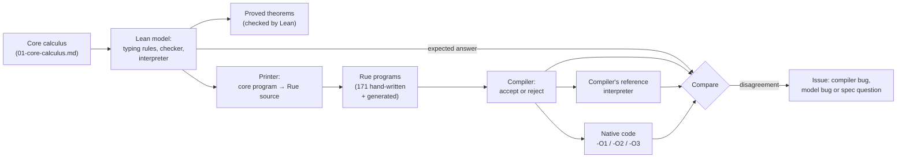

# What the proof says about the compiler

The Lean proofs in [lean/](lean/README.md) show that a precise model of a
small, borrow-free core of Rue keeps its ownership promises. The compiler is
**tested** against that model; nothing proves the compiler correct.

## What is modelled

The [core calculus](01-core-calculus.md), restated in Lean, defines a small core
of Rue: types, ownership (move, copy, drop, linear values) and execution.

The modelled fragment has integers, floats, `bool`, structs, enums with
`match`, fixed-length arrays, `let`, assignment, `if`, `loop`, functions
called by value, `return`, `@panic` and `@dbg`.

It does **not** have borrows or `inout` parameters, heap storage behind
growable containers, equality comparisons, generics, `comptime`, or most of
the standard library. Borrows and the heap are planned (RUE-2238, RUE-2240).

## What is proved

For programs in the core fragment that the typing rules accept:

- **They never get stuck**, that is, reach a state the rules give no meaning
  to, such as using a moved or dropped value. A run ends with a value of its
  declared type or a defined trap (overflow, division by zero, out of bounds,
  `@panic`), or runs forever.
- **No value is dropped twice.**
- **Every value needing a drop ends exactly once**: dropped, or consumed whole
  (moved into a `match`, say). A linear value is never leaked, overwritten or
  silently discarded. Two exceptions, where a value is never dropped: values
  alive at a trap, and a value computed for one argument when a later argument
  `return`s early (RUE-2316, open; the compiler has the same gap).
- **Drops happen in the promised order**: destructor, then fields in
  declaration order, array elements ascending, bindings newest first.
- **The Lean type checker never accepts a program the rules forbid.** It may
  reject some they allow.
- **The rules' step-by-step and whole-program descriptions of running agree.**

[03-metatheory.md](03-metatheory.md) names each theorem.

## How this connects to the compiler

The proofs are not about the compiler's code. The connection is **differential
testing against an executable specification**:

1. The Lean model accepts or rejects each program and runs it.
2. A printer turns it into Rue source whose destructors print.
3. The compiler accepts or rejects it; its reference interpreter and native
   code at `-O1`, `-O2` and `-O3` run it.
4. Every verdict and output must match.

Inputs: 171 hand-written programs, and random ones from a generator (1,200
across its two standard settings, all agreeing).

A disagreement means the compiler, model, spec or printer is wrong; a person
decides which. At least eight were compiler bugs, all fixed
(RUE-2290, RUE-2318, RUE-2335, RUE-2341, RUE-2344, RUE-2345, RUE-2347,
RUE-2348); others became spec questions.

One hand-written case knowingly disagrees: the spec forbids `a[0] = a[0]`, the
compiler accepts it, and the decision is open (RUE-2346).

This is **verification-guided development**, as AWS did for Cedar: prove an
executable model's properties, then test the product against it.

## What that does and does not guarantee

- For the compiler, agreement is **tested, not proved**: evidence, not a
  verified compiler.
- Only programs in the core fragment are covered.
- Bugs on program shapes the tests never produce can be missed, as can drops
  that run no destructor.
- The comparison is run by hand, not yet in CI (RUE-2241).

## How we know the proofs are right

- Lean's kernel checks every step of all 811 theorems; none is unfinished.
- Only two standard axioms, `propext` and `Quot.sound`, are used. IEEE 754
  float laws are stated assumptions.
- The kernel cannot check that the model matches the calculus, or that the
  printer is faithful. Review covers it: agent review of every slice, and at
  each phase a different AI model family's review with a maintainer (one of
  four done).

See [lean/TRUST.md](lean/TRUST.md) and [lean/GUIDE.md](lean/GUIDE.md).
