# The proof map

<!-- Generated by `lake exe ruecore-digest --map`; do not edit by hand. -->

How the mechanization's theorems hang together: which marked node's proof
rests on which, what each spine theorem's statement unfolds to, and where the
proof chain sits beside the compiler bridge. `README.md`, "The proof map",
explains what a **spine node** and a **milestone lemma** are and how this file
is generated. GitHub renders every diagram below inline.

40 spine theorems, 25 milestone lemmas: 65 marked nodes in all.

## The spine

Every marked node, grouped by the module it is declared in, with an edge
`A → B` when `B`'s proof uses `A` transitively through helper theorems that
are not themselves marked. From this diagram alone: every theorem with an
incoming edge from `Step.det` depends on it.

```mermaid
flowchart BT
  subgraph RueCore_Adequacy["RueCore.Adequacy (L2 proofs)"]
    eval_complete["eval_complete"]
    eval_diverges_iff["eval_diverges_iff"]
    eval_sim["eval_sim"]
    eval_sound["eval_sound"]
    eval_steps_of_outOfFuel["eval_steps_of_outOfFuel"]
    init_safeAt["init_safeAt"]
    never_stuck_iff["never_stuck_iff"]
    run_complete["run_complete"]
    run_sim["run_sim"]
    run_stuck_of_step_stuck["run_stuck_of_step_stuck"]
    step_never_stuck_of_run["step_never_stuck_of_run"]
    step_preservation["step_preservation"]
    step_progress["step_progress"]
    step_type_safety["step_type_safety"]
    step_value_typed["step_value_typed"]
  end
  subgraph RueCore_Checker["RueCore.Checker (L2 proofs)"]
    checkProgram_sound["checkProgram_sound"]
    check_sound["check_sound"]
  end
  subgraph RueCore_Float_Lemmas["RueCore.Float.Lemmas (L2 proofs)"]
    roundRat_wf["roundRat_wf"]
  end
  subgraph RueCore_Retire["RueCore.Retire (L2 proofs)"]
    run_no_use_after_drop["run_no_use_after_drop"]
    step_no_use_after_drop["step_no_use_after_drop"]
  end
  subgraph RueCore_Soundness["RueCore.Soundness (L2 proofs)"]
    LoopHead_backEdge["LoopHead.backEdge"]
    LoopHead_enter["LoopHead.enter"]
    fuel_mono["fuel_mono"]
    loop_exit_ok["loop_exit_ok"]
    no_linear_discard["no_linear_discard"]
    no_linear_leak["no_linear_leak"]
    no_linear_overwrite["no_linear_overwrite"]
    no_masking["no_masking"]
    no_use_after_drop["no_use_after_drop"]
    no_use_after_move["no_use_after_move"]
    no_violation["no_violation"]
    run_ne_returned["run_ne_returned"]
    run_safe["run_safe"]
    soundness["soundness"]
  end
  subgraph RueCore_Statics_Lemmas["RueCore.Statics.Lemmas (L2 proofs)"]
    Ctx_joinAll_perm["Ctx.joinAll_perm"]
    Ctx_join_absorb["Ctx.join_absorb"]
    Typed_wf["Typed.wf"]
    class_unique["class_unique"]
    enum_carriesLinear_iff["enum_carriesLinear_iff"]
    struct_carriesLinear_iff["struct_carriesLinear_iff"]
  end
  subgraph RueCore_Step_Lemmas["RueCore.Step.Lemmas (L2 proofs)"]
    Config_stuck_iff["Config.stuck_iff"]
    Config_trichotomy["Config.trichotomy"]
    Step_det["Step.det"]
    Step_terminal["Step.terminal"]
    destructure_plain["destructure_plain"]
    step_iff["step_iff"]
    step_stuck_isStuckState["step_stuck_isStuckState"]
    unwindLocs_plain["unwindLocs_plain"]
  end
  subgraph RueCore_Trace["RueCore.Trace (L2 proofs)"]
    dtor_once["dtor_once"]
    eval_conserves["eval_conserves"]
    freed_once["freed_once"]
    no_double_free["no_double_free"]
  end
  subgraph RueCore_TraceExact["RueCore.TraceExact (L2 proofs)"]
    drop_exactly_once["drop_exactly_once"]
    eval_tidy["eval_tidy"]
    pendingSafe_needed["pendingSafe_needed"]
    rest_exactly_once["rest_exactly_once"]
    rest_step["rest_step"]
  end
  subgraph RueCore_TraceOrder["RueCore.TraceOrder (L2 proofs)"]
    drop_glue_order["drop_glue_order"]
    drop_order["drop_order"]
    reachable_lifo["reachable_lifo"]
    reachable_nested["reachable_nested"]
    reachable_ordered["reachable_ordered"]
    run_blocks["run_blocks"]
    step_blocks["step_blocks"]
  end
  subgraph RueCore_TracePrefix["RueCore.TracePrefix (L2 proofs)"]
    step_no_double_free["step_no_double_free"]
  end
  Config_trichotomy --> step_never_stuck_of_run
  Ctx_join_absorb --> soundness
  LoopHead_backEdge --> soundness
  LoopHead_enter --> soundness
  Step_det --> eval_diverges_iff
  Step_det --> eval_sim
  Step_det --> eval_steps_of_outOfFuel
  Step_det --> run_complete
  Step_det --> run_stuck_of_step_stuck
  Step_det --> step_no_double_free
  Step_terminal --> eval_diverges_iff
  Step_terminal --> run_complete
  Step_terminal --> run_stuck_of_step_stuck
  Step_terminal --> step_no_double_free
  Typed_wf --> soundness
  check_sound --> checkProgram_sound
  check_sound --> pendingSafe_needed
  destructure_plain --> eval_sim
  dtor_once --> no_double_free
  eval_complete --> drop_glue_order
  eval_complete --> init_safeAt
  eval_complete --> step_blocks
  eval_conserves --> drop_glue_order
  eval_conserves --> dtor_once
  eval_conserves --> freed_once
  eval_conserves --> run_blocks
  eval_conserves --> step_no_double_free
  eval_sim --> eval_steps_of_outOfFuel
  eval_sim --> run_sim
  eval_sim --> step_no_double_free
  eval_steps_of_outOfFuel --> eval_diverges_iff
  eval_steps_of_outOfFuel --> run_complete
  eval_steps_of_outOfFuel --> run_stuck_of_step_stuck
  eval_steps_of_outOfFuel --> step_type_safety
  eval_tidy --> drop_exactly_once
  eval_tidy --> rest_exactly_once
  freed_once --> no_double_free
  fuel_mono --> no_masking
  init_safeAt --> step_preservation
  init_safeAt --> step_value_typed
  loop_exit_ok --> soundness
  no_violation --> eval_complete
  no_violation --> eval_diverges_iff
  no_violation --> eval_sound
  no_violation --> init_safeAt
  no_violation --> never_stuck_iff
  no_violation --> no_double_free
  no_violation --> no_linear_discard
  no_violation --> no_linear_leak
  no_violation --> no_linear_overwrite
  no_violation --> no_use_after_drop
  no_violation --> no_use_after_move
  no_violation --> step_no_double_free
  no_violation --> step_progress
  reachable_nested --> drop_order
  reachable_nested --> reachable_lifo
  reachable_ordered --> drop_order
  reachable_ordered --> step_no_double_free
  rest_step --> drop_exactly_once
  rest_step --> rest_exactly_once
  run_blocks --> step_blocks
  run_complete --> eval_complete
  run_ne_returned --> eval_diverges_iff
  run_ne_returned --> run_complete
  run_ne_returned --> run_safe
  run_ne_returned --> run_stuck_of_step_stuck
  run_ne_returned --> step_no_double_free
  run_safe --> init_safeAt
  run_safe --> no_violation
  run_safe --> step_type_safety
  run_sim --> eval_diverges_iff
  run_sim --> eval_sound
  run_sim --> run_complete
  run_sim --> run_stuck_of_step_stuck
  run_sim --> step_no_double_free
  run_sim --> step_type_safety
  run_stuck_of_step_stuck --> step_never_stuck_of_run
  soundness --> drop_exactly_once
  soundness --> rest_exactly_once
  soundness --> run_safe
  step_blocks --> drop_order
  step_iff --> Config_stuck_iff
  step_iff --> Config_trichotomy
  step_iff --> step_no_use_after_drop
  step_never_stuck_of_run --> init_safeAt
  step_never_stuck_of_run --> never_stuck_iff
  step_never_stuck_of_run --> step_progress
  struct_carriesLinear_iff --> Ctx_joinAll_perm
  unwindLocs_plain --> eval_sim
```

## Milestone lemmas

The load-bearing lemmas besides the spine (`RueCore/Map.lean`'s `milestones`
list), each with its one-line reason, its proof size, and the unmarked
helper theorems `Map.walk` counted under it before the next marked node:

| Milestone | Reason | Proof lines | Unmarked helpers under it |
| --- | --- | --- | --- |
| `Typed.wf` | every derivation preserves the state-shape invariant `OwnSt.wf`, which the join and the loop lemmas below all lean on | 127 | 90 |
| `Ctx.join_absorb` | the join's absorption law: re-entering a loop at its head with the same body derivation is sound (`LoopHead.backEdge`'s proof) | 23 | 28 |
| `Ctx.joinAll_perm` | the §5.5 n-way join fold is invariant under a permutation of the match arms it folds | 25 | 70 |
| `LoopHead.enter` | a loop body is typed at its head state on first entry | 21 | 43 |
| `LoopHead.backEdge` | a loop body re-typed at its head state after one turn still satisfies the head equation | 17 | 46 |
| `loop_exit_ok` | every one of a loop's delivered exits is typed at the state its `break` fires with | 51 | 68 |
| `class_unique` | §3's class assignment is unique; every derivation that reads a class off a type leans on this | 90 | 14 |
| `struct_carriesLinear_iff` | a struct's class carries `linear` iff a field's does — read off by the checker and by the destructure rules | 42 | 9 |
| `enum_carriesLinear_iff` | the same equation for an enum's variants | 23 | 11 |
| `init_safeAt` | `Config.init` is semantically safe; the fundamental lemma `step_preservation` inducts from | 18 | 2 |
| `eval_sim` | the simulation relation between `eval` and `Step`, proved for every expression, fuel and program | 46 | 60 |
| `eval_steps_of_outOfFuel` | exhausted fuel is a run of that many `Step`s — completeness modulo fuel, behind `eval_complete` | 42 | 63 |
| `step_value_typed` | every value a reachable `Step` configuration carries is typed | 10 | 0 |
| `destructure_plain` | a monitor removes no behaviour: the declared-linear destructure's residue check changes no step it does not refuse | 18 | 1 |
| `unwindLocs_plain` | a monitor removes no behaviour: an unwind's drops are the same with or without the monitors | 19 | 1 |
| `eval_conserves` | the conservation law over `eval`'s identities, proved by fuel induction, that `no_double_free` follows from | 390 | 173 |
| `eval_tidy` | every cell an evaluation allocates is retired by its end — the frame-pop invariant behind `drop_exactly_once` | 228 | 49 |
| `rest_step` | the ledger for the rest of every form, behind `rest_exactly_once` | 326 | 169 |
| `run_blocks` | every finished run's trace is in the block grammar `Blocks`: each drop marker followed by exactly its own walk | 6 | 79 |
| `step_blocks` | carries `run_blocks` to `Step` | 17 | 6 |
| `reachable_ordered` | every scope record is in location order | 13 | 23 |
| `reachable_nested` | scopes nest, a pending `endscope` being the tail of its record | 12 | 17 |
| `reachable_lifo` | the registration stack is dropped newest-first | 17 | 13 |
| `pendingSafe_needed` | the RUE-2316 carve-out (a by-value argument a sibling's `return` destroys) is load-bearing, not vacuous | 28 | 6 |
| `roundRat_wf` | rounding an exact rational lands in 𝔽_w — the float model's closure law the non-vacuity witness rests on | 19 | 34 |
## Definitions the statements rest on

Every definition any spine theorem's statement depends on, once each, with
its module and the calculus citations its doc-comment carries — what the
36 per-theorem `<details>` blocks below link into instead of repeating.

| Definition | Module | Calculus citations |
| --- | --- | --- |
| <a id="def-ArgsRes"></a>`ArgsRes` | `RueCore.Dynamics` | §6.2 |
| <a id="def-ArgsTag"></a>`ArgsTag` | `RueCore.Step` | §6.2 |
| <a id="def-Attr"></a>`Attr` | `RueCore.Syntax` | §3, (S) |
| <a id="def-Attr_lift"></a>`Attr.lift` | `RueCore.Syntax` | §3 |
| <a id="def-BinOp"></a>`BinOp` | `RueCore.Syntax` | §2, §5.8, (Arith), (Ord), (Float-Ord) |
| <a id="def-BinOp_floatAdmits"></a>`BinOp.floatAdmits` | `RueCore.Syntax` | §5.8, §2, (Float-Arith), (Float-Ord), (Total-Cmp), (Arith), (BitNot) |
| <a id="def-BinOp_intAdmits"></a>`BinOp.intAdmits` | `RueCore.Syntax` | §5.8, (Arith), (Ord) |
| <a id="def-BinOp_isCompare"></a>`BinOp.isCompare` | `RueCore.Syntax` | §2 |
| <a id="def-BinOp_resultTy"></a>`BinOp.resultTy` | `RueCore.Syntax` | §5.8, (Float-Ord), (Total-Cmp), (Float-Arith) |
| <a id="def-Blocks"></a>`Blocks` | `RueCore.Trace.Defs` | §6.11, §3.9 |
| <a id="def-BrokeOk"></a>`BrokeOk` | `RueCore.Soundness.Defs` | §6.10, §5.3, (D-Break) |
| <a id="def-CTy"></a>`CTy` | `RueCore.Checker.Defs` | §5.7, (Sub-Never) |
| <a id="def-CTy_fits"></a>`CTy.fits` | `RueCore.Checker.Defs` | §5.7, (Sub-Never) |
| <a id="def-CTy_fitsC"></a>`CTy.fitsC` | `RueCore.Checker.Defs` | — |
| <a id="def-CTy_meet"></a>`CTy.meet` | `RueCore.Checker.Defs` | §5.5, §5.7, (Sub-Never) |
| <a id="def-Cell"></a>`Cell` | `RueCore.Dynamics` | §6.1 |
| <a id="def-Cell_own"></a>`Cell.own` | `RueCore.Trace.Defs` | — |
| <a id="def-CellMatches"></a>`CellMatches` | `RueCore.Soundness.Defs` | §7, §5.5 |
| <a id="def-Config"></a>`Config` | `RueCore.Step` | §6.1, §6.12, (Result-Ok) |
| <a id="def-Config_SafeAt"></a>`Config.SafeAt` | `RueCore.Adequacy.Defs` | §7, §6.12, §5, (Result-Panic) |
| <a id="def-Config_Stuck"></a>`Config.Stuck` | `RueCore.Step` | §6, §7 |
| <a id="def-Config_Terminal"></a>`Config.Terminal` | `RueCore.Step` | (Result-Ok), (Result-Panic) |
| <a id="def-Config_init"></a>`Config.init` | `RueCore.Step` | §6.12, (D-Return-Main), (D-Return) |
| <a id="def-Config_stack"></a>`Config.stack` | `RueCore.Trace.Defs` | §6.1 |
| <a id="def-Config_trace"></a>`Config.trace` | `RueCore.Trace.Defs` | §6.12 |
| <a id="def-Contents"></a>`Contents` | `RueCore.Dynamics` | §6.1, §6.3, §4.2, §6.11, (D-Use-Move) |
| <a id="def-Contents_allCopyList"></a>`Contents.allCopyList` | `RueCore.Dynamics` | — |
| <a id="def-Contents_copyClosed"></a>`Contents.copyClosed` | `RueCore.Dynamics` | §3, §6, (D-Use-Copy), (D-Struct) |
| <a id="def-Contents_declaredLinear"></a>`Contents.declaredLinear` | `RueCore.Dynamics` | §6.1 |
| <a id="def-Contents_declaredPlan"></a>`Contents.declaredPlan` | `RueCore.Dynamics` | §6.3, §4.2 |
| <a id="def-Contents_destructure"></a>`Contents.destructure` | `RueCore.Dynamics` | §6.3 |
| <a id="def-Contents_holeFree"></a>`Contents.holeFree` | `RueCore.Soundness.Defs` | — |
| <a id="def-Contents_isHole"></a>`Contents.isHole` | `RueCore.Dynamics` | §6.1, §7 |
| <a id="def-Contents_mult"></a>`Contents.mult` | `RueCore.Dynamics` | §3, (T) |
| <a id="def-Contents_ofVal"></a>`Contents.ofVal` | `RueCore.Dynamics` | §6.8, §6.7, (D-Let) |
| <a id="def-Contents_ofVals"></a>`Contents.ofVals` | `RueCore.Dynamics` | — |
| <a id="def-Contents_own"></a>`Contents.own` | `RueCore.Trace.Defs` | §6.11 |
| <a id="def-Contents_ownList"></a>`Contents.ownList` | `RueCore.Trace.Defs` | — |
| <a id="def-Contents_readAt"></a>`Contents.readAt` | `RueCore.Dynamics` | §6.3, §7 |
| <a id="def-Contents_residualLinear"></a>`Contents.residualLinear` | `RueCore.Dynamics` | §5.6, §6.7, §6.9, §6.8, §6.11, (E), (E0406) |
| <a id="def-Contents_resolveDyn"></a>`Contents.resolveDyn` | `RueCore.Dynamics` | §6.5, §6.3, §6.8, (D-Index), (D-Index-Trap) |
| <a id="def-Contents_skeleton"></a>`Contents.skeleton` | `RueCore.Dynamics` | §6.3 |
| <a id="def-Contents_splitResidue"></a>`Contents.splitResidue` | `RueCore.Dynamics` | §6.3, §5.1 |
| <a id="def-Contents_toVal"></a>`Contents.toVal` | `RueCore.Dynamics` | §6.3, §7 |
| <a id="def-Contents_writeAt"></a>`Contents.writeAt` | `RueCore.Dynamics` | §6.3, §6.8, (D-Use-Move) |
| <a id="def-ContentsMatches"></a>`ContentsMatches` | `RueCore.Soundness.Defs` | §7, §5.5 |
| <a id="def-ContentsMatchesList"></a>`ContentsMatchesList` | `RueCore.Soundness.Defs` | — |
| <a id="def-ContentsTy"></a>`ContentsTy` | `RueCore.Soundness.Defs` | §2, §6.1, §5.8, (Struct-Intro) |
| <a id="def-ContentsTys"></a>`ContentsTys` | `RueCore.Soundness.Defs` | §5.8, §5.5, (Struct-Intro), (Array-Intro), (Enum-Intro) |
| <a id="def-Ctx"></a>`Ctx` | `RueCore.Statics` | §5 |
| <a id="def-Ctx_Wf"></a>`Ctx.Wf` | `RueCore.Statics` | §5.5, §5.6 |
| <a id="def-Ctx_join"></a>`Ctx.join` | `RueCore.Statics` | §5.5 |
| <a id="def-Ctx_joinAll"></a>`Ctx.joinAll` | `RueCore.Statics` | §5.5, (Match) |
| <a id="def-Ctx_joinFold"></a>`Ctx.joinFold` | `RueCore.Statics` | §5.5, (Match) |
| <a id="def-Ctx_joinOpt"></a>`Ctx.joinOpt` | `RueCore.Statics` | §5.5, §5.7, (Sub-Never) |
| <a id="def-Ctx_joinOpts"></a>`Ctx.joinOpts` | `RueCore.Statics` | §5.5, (Match) |
| <a id="def-Ctx_loopLocals"></a>`Ctx.loopLocals` | `RueCore.Statics` | §5.7, §5.6 |
| <a id="def-Ctx_outsideLoop"></a>`Ctx.outsideLoop` | `RueCore.Statics` | §5.7 |
| <a id="def-DeclId"></a>`DeclId` | `RueCore.Statics` | — |
| <a id="def-Decls"></a>`Decls` | `RueCore.Syntax` | §2, §3 |
| <a id="def-Decls_Names"></a>`Decls.Names` | `RueCore.Statics` | §3 |
| <a id="def-Decls_byValue"></a>`Decls.byValue` | `RueCore.Statics` | — |
| <a id="def-Decls_classOf"></a>`Decls.classOf` | `RueCore.Syntax` | §3, (S) |
| <a id="def-Decls_enumClassOf"></a>`Decls.enumClassOf` | `RueCore.Syntax` | §3, (E) |
| <a id="def-Decls_peel"></a>`Decls.peel` | `RueCore.Checker.Defs` | — |
| <a id="def-Decls_peelStep"></a>`Decls.peelStep` | `RueCore.Checker.Defs` | — |
| <a id="def-DropGlue"></a>`DropGlue` | `RueCore.Trace.Defs` | §6.11, §3 |
| <a id="def-DropGlueSeq"></a>`DropGlueSeq` | `RueCore.Trace.Defs` | §6.11 |
| <a id="def-DtorNotCopy"></a>`DtorNotCopy` | `RueCore.Trace.Defs` | — |
| <a id="def-DynPlace"></a>`DynPlace` | `RueCore.Dynamics` | — |
| <a id="def-DynStep"></a>`DynStep` | `RueCore.Dynamics` | §6.5 |
| <a id="def-Entry"></a>`Entry` | `RueCore.Statics` | §5 |
| <a id="def-Entry_join"></a>`Entry.join` | `RueCore.Statics` | §5.5 |
| <a id="def-Entry_setSt"></a>`Entry.setSt` | `RueCore.Statics` | — |
| <a id="def-Entry_wf"></a>`Entry.wf` | `RueCore.Statics` | §5 |
| <a id="def-EnumDecl"></a>`EnumDecl` | `RueCore.Syntax` | §2, §5.5, §3, §6.11, (Match), (E0417) |
| <a id="def-EnumDecl_Wf"></a>`EnumDecl.Wf` | `RueCore.Statics` | §3, §6.11, (E0417) |
| <a id="def-EnumDecl_payloadJoin"></a>`EnumDecl.payloadJoin` | `RueCore.Statics` | §3, (Tij) |
| <a id="def-Env"></a>`Env` | `RueCore.Dynamics` | §6.1 |
| <a id="def-EvalOk"></a>`EvalOk` | `RueCore.Soundness.Defs` | §5.3, §5.7 |
| <a id="def-EvalRes"></a>`EvalRes` | `RueCore.Dynamics` | §6.12, §6.9, §6.10, §6, (D-Return), (D-Break) |
| <a id="def-EvalRes_absorb"></a>`EvalRes.absorb` | `RueCore.Dynamics` | §6.9, §5.7, §5.8, §6.10, §6, (D-Return), (Fn) |
| <a id="def-EvalRes_andThen"></a>`EvalRes.andThen` | `RueCore.Dynamics` | §6.2, §6.12, §6.9, §6.10, (D-Return) |
| <a id="def-EvalRes_trace"></a>`EvalRes.trace` | `RueCore.Trace.Defs` | — |
| <a id="def-EvalRes_withTrace"></a>`EvalRes.withTrace` | `RueCore.Dynamics` | — |
| <a id="def-Event"></a>`Event` | `RueCore.Dynamics` | §6.11, §6.7, §6.9, §6.8 |
| <a id="def-Event_dtorIds"></a>`Event.dtorIds` | `RueCore.Trace.Defs` | §6.11 |
| <a id="def-Event_freed"></a>`Event.freed` | `RueCore.Trace.Defs` | §6.11 |
| <a id="def-Exact"></a>`Exact` | `RueCore.Trace.Defs` | — |
| <a id="def-Expr"></a>`Expr` | `RueCore.Syntax` | §2, §4.2, §5.2, §5.3, §6.9, §5.5, §6.1, §5.8, §5, §5.1, §6.5, §5.7, §6.10, (Panic-Operand), (Enum-Intro), (Array-Intro), (OrdinaryDynamic), (T), (Assign), (D-Index), (D-Index-Trap), (@Drop-Copy) |
| <a id="def-Expr_breaks"></a>`Expr.breaks` | `RueCore.Syntax` | §5.7, (Loop-Break) |
| <a id="def-Expr_nodes"></a>`Expr.nodes` | `RueCore.Checker.Defs` | §5.7 |
| <a id="def-Expr_pendingSafe"></a>`Expr.pendingSafe` | `RueCore.Trace.Defs` | §5.8, (Arith) |
| <a id="def-Expr_quietList"></a>`Expr.quietList` | `RueCore.Trace.Defs` | — |
| <a id="def-Expr_returns"></a>`Expr.returns` | `RueCore.Trace.Defs` | — |
| <a id="def-Expr_unwinds"></a>`Expr.unwinds` | `RueCore.Trace.Defs` | — |
| <a id="def-FloatArith"></a>`FloatArith` | `RueCore.Float` | §6.4, §5.8, (D-Float-Arith), (Float-Arith) |
| <a id="def-FloatDatum"></a>`FloatDatum` | `RueCore.Float` | §2, §9 |
| <a id="def-FloatDatum_Wf"></a>`FloatDatum.Wf` | `RueCore.Float` | §6.1, §7, §6.4 |
| <a id="def-FloatDatum_isNaN"></a>`FloatDatum.isNaN` | `RueCore.Float` | — |
| <a id="def-FloatDatum_le"></a>`FloatDatum.le` | `RueCore.Float` | (D-Float-Ord) |
| <a id="def-FloatDatum_lt"></a>`FloatDatum.lt` | `RueCore.Float` | §6.4, (D-Float-Ord) |
| <a id="def-FloatDatum_negate"></a>`FloatDatum.negate` | `RueCore.Float` | §6.4, (D-Float-Neg) |
| <a id="def-FloatDatum_roundOp"></a>`FloatDatum.roundOp` | `RueCore.Float` | §6.4, (D-Float-Round) |
| <a id="def-FloatDatum_succMag"></a>`FloatDatum.succMag` | `RueCore.Float` | — |
| <a id="def-FloatDatum_toIntIn"></a>`FloatDatum.toIntIn` | `RueCore.Float` | §6.4, (D-Float-To-Int) |
| <a id="def-FloatDatum_totalCmp"></a>`FloatDatum.totalCmp` | `RueCore.Float` | §6.4, (D-Total-Cmp) |
| <a id="def-FloatDatum_totalRank"></a>`FloatDatum.totalRank` | `RueCore.Float` | §6.4 |
| <a id="def-FloatDatum_truncToInt"></a>`FloatDatum.truncToInt` | `RueCore.Float` | (D-Float-To-Int) |
| <a id="def-FloatDatum_widen"></a>`FloatDatum.widen` | `RueCore.Float` | (D-Float-Cast) |
| <a id="def-FloatIntrin"></a>`FloatIntrin` | `RueCore.Syntax` | §2, §5.8, (Int-To-Float), (Float-To-Int), (Float-Cast), (Float-Round) |
| <a id="def-FloatIntrin_floatSrc"></a>`FloatIntrin.floatSrc` | `RueCore.Syntax` | (Float-Cast) |
| <a id="def-FloatIntrin_resTy"></a>`FloatIntrin.resTy` | `RueCore.Syntax` | §5.8 |
| <a id="def-FloatLit"></a>`FloatLit` | `RueCore.Float` | — |
| <a id="def-FloatLit_RoundsFinite"></a>`FloatLit.RoundsFinite` | `RueCore.Float` | §5.8, (Lit) |
| <a id="def-FloatLit_exact"></a>`FloatLit.exact` | `RueCore.Float` | — |
| <a id="def-FloatModel"></a>`FloatModel` | `RueCore.Float` | §7, §6.4 |
| <a id="def-FloatOps"></a>`FloatOps` | `RueCore.Float` | §6.4, §2 |
| <a id="def-FloatOps_cast"></a>`FloatOps.cast` | `RueCore.Float` | §6.4, §5.8, (D-Float-Cast), (Float-Cast) |
| <a id="def-FloatOps_roundIntrin"></a>`FloatOps.roundIntrin` | `RueCore.Float` | (D-Float-Round) |
| <a id="def-FloatRoundOp"></a>`FloatRoundOp` | `RueCore.Float` | (Float-Round) |
| <a id="def-FloatUnIntrin"></a>`FloatUnIntrin` | `RueCore.Float` | §6.4, (D-Float-Round) |
| <a id="def-FloatWidth"></a>`FloatWidth` | `RueCore.Float` | §2 |
| <a id="def-FloatWidth_eMin"></a>`FloatWidth.eMin` | `RueCore.Float` | — |
| <a id="def-FloatWidth_eTop"></a>`FloatWidth.eTop` | `RueCore.Float` | — |
| <a id="def-FloatWidth_overflowNum"></a>`FloatWidth.overflowNum` | `RueCore.Float` | — |
| <a id="def-FloatWidth_prec"></a>`FloatWidth.prec` | `RueCore.Float` | — |
| <a id="def-FnDef"></a>`FnDef` | `RueCore.Syntax` | §5.8 |
| <a id="def-Focus"></a>`Focus` | `RueCore.Step` | §6.2 |
| <a id="def-Frame"></a>`Frame` | `RueCore.Dynamics` | §6.1, §6.9 |
| <a id="def-Frame_empty"></a>`Frame.empty` | `RueCore.Adequacy.Defs` | — |
| <a id="def-Frame_popScope"></a>`Frame.popScope` | `RueCore.Step` | §6.7, (D-Let), (D-Match) |
| <a id="def-FrameMatches"></a>`FrameMatches` | `RueCore.Soundness.Defs` | §6.1, §6.9 |
| <a id="def-GlueBlocks"></a>`GlueBlocks` | `RueCore.Trace.Defs` | §6.11 |
| <a id="def-HasTy"></a>`HasTy` | `RueCore.Soundness.Defs` | §6.1, §2, §5.8, §7, (Struct-Intro) |
| <a id="def-HasTys"></a>`HasTys` | `RueCore.Soundness.Defs` | §5.8, (Call) |
| <a id="def-InBounds"></a>`InBounds` | `RueCore.Syntax` | §6.1, §6.4 |
| <a id="def-IntWidth"></a>`IntWidth` | `RueCore.Syntax` | §2 |
| <a id="def-IntWidth_bits"></a>`IntWidth.bits` | `RueCore.Syntax` | §2 |
| <a id="def-IntWidth_modulus"></a>`IntWidth.modulus` | `RueCore.Syntax` | §6.4 |
| <a id="def-Kont"></a>`Kont` | `RueCore.Step` | §6.1, §6.2, §6.7, §6.10, §6.9 |
| <a id="def-Kont_toCall"></a>`Kont.toCall` | `RueCore.Step` | §6.9, (D-Return) |
| <a id="def-Kont_toLoop"></a>`Kont.toLoop` | `RueCore.Step` | §6.10 |
| <a id="def-Lead"></a>`Lead` | `RueCore.Trace.Defs` | §6.10, (D-Break) |
| <a id="def-Lifo"></a>`Lifo` | `RueCore.Trace.Defs` | — |
| <a id="def-Local"></a>`Local` | `RueCore.Trace.Defs` | — |
| <a id="def-LoopHead"></a>`LoopHead` | `RueCore.Statics` | §5.7, §5.5 |
| <a id="def-Matches"></a>`Matches` | `RueCore.Soundness.Defs` | §7, §6.1 |
| <a id="def-Mult"></a>`Mult` | `RueCore.Syntax` | §3 |
| <a id="def-Mult_join"></a>`Mult.join` | `RueCore.Syntax` | §3 |
| <a id="def-Mult_rank"></a>`Mult.rank` | `RueCore.Syntax` | §3 |
| <a id="def-NewestFirst"></a>`NewestFirst` | `RueCore.Trace.Defs` | — |
| <a id="def-NoResidualLinear"></a>`NoResidualLinear` | `RueCore.Statics` | §5.6, §5.8, (Fn) |
| <a id="def-OpRes"></a>`OpRes` | `RueCore.Dynamics` | §6.12 |
| <a id="def-OpRes_toRes"></a>`OpRes.toRes` | `RueCore.Dynamics` | — |
| <a id="def-OpRes_toStep"></a>`OpRes.toStep` | `RueCore.Step` | §6.2, (Panic-Lift) |
| <a id="def-Out"></a>`Out` | `RueCore.Statics` | §5.3 |
| <a id="def-Out_add"></a>`Out.add` | `RueCore.Statics` | §5.3 |
| <a id="def-OwnSt"></a>`OwnSt` | `RueCore.Statics` | §5, §5.1, (Use-Move) |
| <a id="def-OwnSt_decEq"></a>`OwnSt.decEq` | `RueCore.Statics` | §5.7 |
| <a id="def-OwnSt_fieldAt"></a>`OwnSt.fieldAt` | `RueCore.Statics` | — |
| <a id="def-OwnSt_fieldStates"></a>`OwnSt.fieldStates` | `RueCore.Statics` | — |
| <a id="def-OwnSt_fullyOwned"></a>`OwnSt.fullyOwned` | `RueCore.Statics` | §5, §5.1, (Use-Move) |
| <a id="def-OwnSt_get"></a>`OwnSt.get` | `RueCore.Statics` | §5, §5.1, (Owned-Base) |
| <a id="def-OwnSt_isOwned"></a>`OwnSt.isOwned` | `RueCore.Statics` | §5, §5.1, §5.3, (Use-Copy), (@Drop) |
| <a id="def-OwnSt_join"></a>`OwnSt.join` | `RueCore.Statics` | §5.5 |
| <a id="def-OwnSt_setAt"></a>`OwnSt.setAt` | `RueCore.Statics` | §5.1, §5.2, §5.3 |
| <a id="def-OwnSt_setField"></a>`OwnSt.setField` | `RueCore.Statics` | — |
| <a id="def-OwnSt_wf"></a>`OwnSt.wf` | `RueCore.Statics` | §5, §5.5 |
| <a id="def-PanicKind"></a>`PanicKind` | `RueCore.Dynamics` | §6.12 |
| <a id="def-Param"></a>`Param` | `RueCore.Syntax` | §5.8, §5.2, §6.9 |
| <a id="def-Place"></a>`Place` | `RueCore.Syntax` | §5, §2, §9 |
| <a id="def-Place_path"></a>`Place.path` | `RueCore.Syntax` | §6.3 |
| <a id="def-Place_root"></a>`Place.root` | `RueCore.Syntax` | §5 |
| <a id="def-Program"></a>`Program` | `RueCore.Syntax` | §2, §5.8, §5.5, (Struct-Intro), (Enum-Intro), (Match), (Call) |
| <a id="def-Program_pendingSafe"></a>`Program.pendingSafe` | `RueCore.Trace.Defs` | — |
| <a id="def-ProgramTyped"></a>`ProgramTyped` | `RueCore.Statics` | §6.12, §5.8, §3, (Fn), (Call) |
| <a id="def-Retired"></a>`Retired` | `RueCore.Trace.Defs` | — |
| <a id="def-Settled"></a>`Settled` | `RueCore.Trace.Defs` | — |
| <a id="def-Sign"></a>`Sign` | `RueCore.Syntax` | §2 |
| <a id="def-Step"></a>`Step` | `RueCore.Step` | §6, §6.4, §6.2, (Search), (Panic-Lift) |
| <a id="def-StepOut"></a>`StepOut` | `RueCore.Step` | §6 |
| <a id="def-Steps"></a>`Steps` | `RueCore.Step` | §6.12 |
| <a id="def-StepsN"></a>`StepsN` | `RueCore.Adequacy.Defs` | §6 |
| <a id="def-Stk"></a>`Stk` | `RueCore.Trace.Defs` | §6.9 |
| <a id="def-Store"></a>`Store` | `RueCore.Dynamics` | §6.1 |
| <a id="def-StoreCC"></a>`StoreCC` | `RueCore.Trace.Defs` | — |
| <a id="def-StructDecl"></a>`StructDecl` | `RueCore.Syntax` | §2, §3, §6.11, §5.8, (Struct-Intro) |
| <a id="def-StructDecl_Wf"></a>`StructDecl.Wf` | `RueCore.Statics` | §3 |
| <a id="def-StructDecl_baseOf"></a>`StructDecl.baseOf` | `RueCore.Statics` | §3, (Ti) |
| <a id="def-Tidy"></a>`Tidy` | `RueCore.Trace.Defs` | §6.7, §6.9, §6.10 |
| <a id="def-Ty"></a>`Ty` | `RueCore.Syntax` | §2 |
| <a id="def-Ty_atDyn"></a>`Ty.atDyn` | `RueCore.Syntax` | — |
| <a id="def-Ty_atPath"></a>`Ty.atPath` | `RueCore.Syntax` | §5 |
| <a id="def-Ty_declIds"></a>`Ty.declIds` | `RueCore.Statics` | — |
| <a id="def-Ty_declaredLinear"></a>`Ty.declaredLinear` | `RueCore.Syntax` | §4.2, §5.6 |
| <a id="def-Ty_dynNoDeclared"></a>`Ty.dynNoDeclared` | `RueCore.Syntax` | §4.2, (DeclaredLinearDynamic) |
| <a id="def-Ty_fieldAt"></a>`Ty.fieldAt` | `RueCore.Syntax` | §5, §6.3 |
| <a id="def-Ty_grounded"></a>`Ty.grounded` | `RueCore.Checker.Defs` | (E0483) |
| <a id="def-Ty_isInt"></a>`Ty.isInt` | `RueCore.Syntax` | §2 |
| <a id="def-Ty_mult"></a>`Ty.mult` | `RueCore.Syntax` | §3, (T) |
| <a id="def-Ty_observable"></a>`Ty.observable` | `RueCore.Syntax` | §5.8, (Dbg), (E0702) |
| <a id="def-Typed"></a>`Typed` | `RueCore.Statics` | §5, §5.3, §5.7, §5.1, §4.2, §5.8, §5.5, §2, §5.2, §5.6, (Strict-Bottom), (Seq-Bottom), (Let-Bottom), (Let), (Return-Bottom), (Sub-Never), (Return-Value), (Panic), (Use-Copy), (Use-Move), (Use-Declared-Linear-Destructure), (Arith), (Ord), (Neg), (Not), (BitNot), (Int-Cast), (Dbg), (@Drop-Copy), (@Drop), (Struct-Intro), (Enum-Intro), (Array-Intro), (Use-Untrackable-Dynamic-Copy), (Assign), (Match), (Seq), (If), (Call), (Break), (Loop-Div-Backedge), (Loop-Div), (Loop-Break) |
| <a id="def-TypedArgs"></a>`TypedArgs` | `RueCore.Statics` | §5.8, (Call), (Struct-Intro) |
| <a id="def-TypedArms"></a>`TypedArms` | `RueCore.Statics` | §5.5, §5.6, (Match) |
| <a id="def-UnOp"></a>`UnOp` | `RueCore.Syntax` | §2, §5.8, §6.4, (Neg), (Float-Neg), (Not), (BitNot) |
| <a id="def-Untouched"></a>`Untouched` | `RueCore.Soundness.Defs` | §6.9, (D-Call) |
| <a id="def-Val"></a>`Val` | `RueCore.Dynamics` | §6.1, §2, §6.6, §6.11, (D-Match) |
| <a id="def-Val_ints"></a>`Val.ints` | `RueCore.Dynamics` | — |
| <a id="def-Val_mult"></a>`Val.mult` | `RueCore.Dynamics` | §3, (T) |
| <a id="def-Val_observable"></a>`Val.observable` | `RueCore.Dynamics` | §6.12, §5.8, (Dbg) |
| <a id="def-Val_own"></a>`Val.own` | `RueCore.Trace.Defs` | — |
| <a id="def-Violation"></a>`Violation` | `RueCore.Dynamics` | §7 |
| <a id="def-Violation_isStuckState"></a>`Violation.isStuckState` | `RueCore.Step` | §6, §6.3, §6.5, §6.7, §6.8 |
| <a id="def-WfDecls"></a>`WfDecls` | `RueCore.Statics` | §3 |
| <a id="def-WfEnums"></a>`WfEnums` | `RueCore.Statics` | §3 |
| <a id="def-WfFn"></a>`WfFn` | `RueCore.Statics` | §5.8, §5.6, §5.7, (Fn) |
| <a id="def-WfNames"></a>`WfNames` | `RueCore.Statics` | §3, (E0483) |
| <a id="def-WfProgram"></a>`WfProgram` | `RueCore.Statics` | §3, §5.8, (Fn), (Call) |
| <a id="def-WfStructs"></a>`WfStructs` | `RueCore.Statics` | §3 |
| <a id="def-anyLinearOther"></a>`anyLinearOther` | `RueCore.Syntax` | §5.1 |
| <a id="def-armCtx"></a>`armCtx` | `RueCore.Statics` | §5.5, §2, (Match) |
| <a id="def-arrayPrefix"></a>`arrayPrefix` | `RueCore.Syntax` | — |
| <a id="def-assignArrayOk"></a>`assignArrayOk` | `RueCore.Statics` | §5.2, (Assign), (T) |
| <a id="def-binOpFloat"></a>`binOpFloat` | `RueCore.Dynamics` | §6.4, §5.8, (D-Float-Arith), (D-Arith-Trap), (D-Div-Zero), (D-Div-Overflow), (D-Float-Ord), (D-Total-Cmp) |
| <a id="def-binOpInt"></a>`binOpInt` | `RueCore.Dynamics` | §6.4, (D-Arith), (D-Arith-Trap), (D-Div), (D-Div-Zero), (D-Div-Overflow), (D-Bit), (D-Shl), (D-Shr) |
| <a id="def-bitsOf"></a>`bitsOf` | `RueCore.Syntax` | §6.4 |
| <a id="def-canonAux"></a>`canonAux` | `RueCore.Float` | — |
| <a id="def-canonNum"></a>`canonNum` | `RueCore.Float` | — |
| <a id="def-check"></a>`check` | `RueCore.Checker.Defs` | §5, §5.3, §5.8, §5.7, (Call), (Return-Value) |
| <a id="def-checkDecls"></a>`checkDecls` | `RueCore.Checker.Defs` | §3 |
| <a id="def-checkEnumDecl"></a>`checkEnumDecl` | `RueCore.Checker.Defs` | §3 |
| <a id="def-checkEnums"></a>`checkEnums` | `RueCore.Checker.Defs` | §3 |
| <a id="def-checkFn"></a>`checkFn` | `RueCore.Checker.Defs` | §5.8, §5.6, (Fn) |
| <a id="def-checkNoCycle"></a>`checkNoCycle` | `RueCore.Checker.Defs` | §3, (E0483) |
| <a id="def-checkProgram"></a>`checkProgram` | `RueCore.Checker.Defs` | §3, §5.8, §6.12, (Fn) |
| <a id="def-checkStructDecl"></a>`checkStructDecl` | `RueCore.Checker.Defs` | §3 |
| <a id="def-checkStructs"></a>`checkStructs` | `RueCore.Checker.Defs` | §3 |
| <a id="def-cmpScaled"></a>`cmpScaled` | `RueCore.Float` | — |
| <a id="def-declaredPrefix"></a>`declaredPrefix` | `RueCore.Syntax` | §4.2, §5.1, §5.6, (DeclaredLinearDynamic) |
| <a id="def-dropCell"></a>`dropCell` | `RueCore.Dynamics` | §6.11, §5.3, (@Drop-Copy) |
| <a id="def-dropContents"></a>`dropContents` | `RueCore.Dynamics` | §6.11, §7, §3, (E0417) |
| <a id="def-dropEvents"></a>`dropEvents` | `RueCore.Dynamics` | §6.11 |
| <a id="def-dropLocs"></a>`dropLocs` | `RueCore.Trace.Defs` | — |
| <a id="def-dropResidue"></a>`dropResidue` | `RueCore.Dynamics` | §6.3, §6.11, §5.1, (E0474) |
| <a id="def-dropRetire"></a>`dropRetire` | `RueCore.Dynamics` | §6.1, §6.11, §5.6, §6.7, §6.9 |
| <a id="def-dtorIds"></a>`dtorIds` | `RueCore.Trace.Defs` | §7 |
| <a id="def-dynPlace"></a>`dynPlace` | `RueCore.Dynamics` | §6.3, §6.5 |
| <a id="def-eval"></a>`eval` | `RueCore.Dynamics` | §2, §7, §6.3, §6.4, §6.12, §5.8, §6.11, §6.7, §6.8, §6.5, §6.2, §6.6, §6.10, §6.9, (D-Use-Declared-Linear), (D-Use-Copy), (D-Use-Move), (D-Panic), (Dbg), (D-Let), (D-EndScope), (D-Assign), (D-Seq), (D-Struct), (D-Array), (D-Index), (D-Index-Trap), (D-Enum-Intro), (D-Match), (D-If-T), (D-If-F), (D-Call), (D-Return-Value), (D-Return), (D-Loop-Enter), (D-Loop-Iter), (D-Break) |
| <a id="def-evalArgs"></a>`evalArgs` | `RueCore.Dynamics` | §6.2, §6.9 |
| <a id="def-evalBinOp"></a>`evalBinOp` | `RueCore.Dynamics` | §6.4, §5.8 |
| <a id="def-evalFintrin"></a>`evalFintrin` | `RueCore.Dynamics` | §6.4, §6.12, (D-Int-To-Float), (D-Float-To-Int), (D-Float-To-Int-Trap), (D-Float-Cast), (D-Float-Round) |
| <a id="def-evalIntCast"></a>`evalIntCast` | `RueCore.Dynamics` | — |
| <a id="def-evalUnOp"></a>`evalUnOp` | `RueCore.Dynamics` | §6.4, §5.8, (D-Arith), (D-Float-Neg) |
| <a id="def-fnCtx"></a>`fnCtx` | `RueCore.Statics` | §5.8, (Fn) |
| <a id="def-freedIds"></a>`freedIds` | `RueCore.Trace.Defs` | §7 |
| <a id="def-headIter"></a>`headIter` | `RueCore.Checker.Defs` | §5.7 |
| <a id="def-headNext"></a>`headNext` | `RueCore.Checker.Defs` | — |
| <a id="def-inBoundsIdx"></a>`inBoundsIdx` | `RueCore.Dynamics` | §6.5, §7, (D-Index), (D-Index-Trap) |
| <a id="def-instDecidableEqEntry_decEq"></a>`instDecidableEqEntry.decEq` | `RueCore.Statics` | — |
| <a id="def-instDecidableEqTy_decEq"></a>`instDecidableEqTy.decEq` | `RueCore.Syntax` | — |
| <a id="def-intMax"></a>`intMax` | `RueCore.Syntax` | §6.1 |
| <a id="def-intMin"></a>`intMin` | `RueCore.Syntax` | §6.1 |
| <a id="def-intResult"></a>`intResult` | `RueCore.Dynamics` | §6.4, (D-Arith), (D-Arith-Trap) |
| <a id="def-introVal"></a>`introVal` | `RueCore.Dynamics` | §6.5, §6.6, §6.1, (D-Array), (D-Enum-Intro), (H) |
| <a id="def-linearResidue"></a>`linearResidue` | `RueCore.Syntax` | §5.1 |
| <a id="def-magCmp"></a>`magCmp` | `RueCore.Float` | — |
| <a id="def-matchConsume"></a>`matchConsume` | `RueCore.Dynamics` | — |
| <a id="def-mintParams"></a>`mintParams` | `RueCore.Dynamics` | §6.9, (D-Call) |
| <a id="def-noArrayStep"></a>`noArrayStep` | `RueCore.Syntax` | — |
| <a id="def-noDtorPrefix"></a>`noDtorPrefix` | `RueCore.Syntax` | §5.1, §5.3, (Use-Move), (@Drop), (E0456) |
| <a id="def-overwriteOk"></a>`overwriteOk` | `RueCore.Statics` | §5.2, §5.6, §5.5, (Assign), (T) |
| <a id="def-ownedJoinOk"></a>`ownedJoinOk` | `RueCore.Statics` | §5.6, (T) |
| <a id="def-ownedJoinOkList"></a>`ownedJoinOkList` | `RueCore.Statics` | — |
| <a id="def-plainDestructure"></a>`plainDestructure` | `RueCore.Step` | §6.3, (Use-Declared-Linear-Destructure), (D-Use-Declared-Linear) |
| <a id="def-plainDropRetire"></a>`plainDropRetire` | `RueCore.Step` | §6.1, §6 |
| <a id="def-plainResidue"></a>`plainResidue` | `RueCore.Step` | §6.3, §6.11 |
| <a id="def-plainUnwind"></a>`plainUnwind` | `RueCore.Step` | §6.1, (D-EndScope), (D-Return-Value), (D-Return), (D-Break) |
| <a id="def-residualLinear"></a>`residualLinear` | `RueCore.Statics` | §5.6, §3, §5.3, §4.2, (T) |
| <a id="def-residualLinearBelow"></a>`residualLinearBelow` | `RueCore.Statics` | §5.6, §5.3, (@Drop) |
| <a id="def-residualLinearFields"></a>`residualLinearFields` | `RueCore.Statics` | §5.6 |
| <a id="def-residueMark"></a>`residueMark` | `RueCore.Dynamics` | — |
| <a id="def-rootCell"></a>`rootCell` | `RueCore.Step` | §6.3, §6 |
| <a id="def-rootIdxOnly"></a>`rootIdxOnly` | `RueCore.Syntax` | §4.2, §5, §5.1, §5.3, §5.2, (Use-Move), (@Drop), (Assign) |
| <a id="def-run"></a>`run` | `RueCore.Dynamics` | §6.12, (D-Return-Main), (D-Return-Value) |
| <a id="def-runAllScopeDrops"></a>`runAllScopeDrops` | `RueCore.Dynamics` | §6.1, §6.9, (D-Return-Value), (D-Return) |
| <a id="def-shiftAmount"></a>`shiftAmount` | `RueCore.Dynamics` | §6.4, (D-Shl), (D-Shr) |
| <a id="def-step"></a>`step` | `RueCore.Step` | §6.12, §6, (Result-Ok), (Result-Panic) |
| <a id="def-stepArgs"></a>`stepArgs` | `RueCore.Step` | (D-Struct), (D-Enum-Intro), (D-Array), (D-Call), (D-Index), (D-Index-Trap), (D-Assign) |
| <a id="def-stepEval"></a>`stepEval` | `RueCore.Step` | §6.3, §6.11, §6.12, §6.10, §6.2, (D-Panic), (D-Loop-Enter), (D-Break), (Search) |
| <a id="def-stepRet"></a>`stepRet` | `RueCore.Step` | §6.2, §6.4, (Search), (D-Match), (D-If-T), (D-If-F), (D-Let), (D-EndScope), (D-Seq), (D-Assign), (D-Return-Value), (D-Return), (D-Loop-Iter) |
| <a id="def-storeOwn"></a>`storeOwn` | `RueCore.Trace.Defs` | — |
| <a id="def-unwindLocs"></a>`unwindLocs` | `RueCore.Dynamics` | §6.1, (RAII) |
| <a id="def-valOf"></a>`valOf` | `RueCore.Syntax` | §6.4 |
| <a id="def-wrapInt"></a>`wrapInt` | `RueCore.Syntax` | §6.4, (D-Bit), (D-Shl), (D-Shr) |

## Per-spine-theorem diagrams

One small diagram per spine theorem: its milestone ancestors, and the
definitions its statement depends on (the per-statement trusted-base
closure, `Lint.trustedBase`'s aggregate computed here one statement at a
time), each with the `§N.M` and `(Rule-Name)` citations its doc-comment
carries. Capped at 25 definitions; a capped diagram says how many more there
were, and links the full list into "Definitions the statements rest on"
above.

### `soundness`

```mermaid
flowchart BT
  thm["soundness"]
  subgraph mile["Milestone ancestors"]
    Ctx_join_absorb["Ctx.join_absorb"] --> thm
    LoopHead_backEdge["LoopHead.backEdge"] --> thm
    LoopHead_enter["LoopHead.enter"] --> thm
    Typed_wf["Typed.wf"] --> thm
    loop_exit_ok["loop_exit_ok"] --> thm
  end
  subgraph defs_["Definitions the statement depends on"]
    ArgsRes["ArgsRes<br/>§6.2"] -.-> thm
    Attr["Attr<br/>§3, (S)"] -.-> thm
    Attr_lift["Attr.lift<br/>§3"] -.-> thm
    BinOp["BinOp<br/>§2, §5.8, (Arith), (Ord), (Float-Ord)"] -.-> thm
    BinOp_floatAdmits["BinOp.floatAdmits<br/>§5.8, §2, (Float-Arith), (Float-Ord), (Total-Cmp), (Arith), (BitNot)"] -.-> thm
    BinOp_intAdmits["BinOp.intAdmits<br/>§5.8, (Arith), (Ord)"] -.-> thm
    BinOp_isCompare["BinOp.isCompare<br/>§2"] -.-> thm
    BinOp_resultTy["BinOp.resultTy<br/>§5.8, (Float-Ord), (Total-Cmp), (Float-Arith)"] -.-> thm
    BrokeOk["BrokeOk<br/>§6.10, §5.3, (D-Break)"] -.-> thm
    Cell["Cell<br/>§6.1"] -.-> thm
    CellMatches["CellMatches<br/>§7, §5.5"] -.-> thm
    Contents["Contents<br/>§6.1, §6.3, §4.2, §6.11, (D-Use-Move)"] -.-> thm
    Contents_allCopyList["Contents.allCopyList"] -.-> thm
    Contents_copyClosed["Contents.copyClosed<br/>§3, §6, (D-Use-Copy), (D-Struct)"] -.-> thm
    Contents_declaredLinear["Contents.declaredLinear<br/>§6.1"] -.-> thm
    Contents_declaredPlan["Contents.declaredPlan<br/>§6.3, §4.2"] -.-> thm
    Contents_destructure["Contents.destructure<br/>§6.3"] -.-> thm
    Contents_holeFree["Contents.holeFree"] -.-> thm
    Contents_isHole["Contents.isHole<br/>§6.1, §7"] -.-> thm
    Contents_mult["Contents.mult<br/>§3, (T)"] -.-> thm
    Contents_ofVal["Contents.ofVal<br/>§6.8, §6.7, (D-Let)"] -.-> thm
    Contents_readAt["Contents.readAt<br/>§6.3, §7"] -.-> thm
    Contents_residualLinear["Contents.residualLinear<br/>§5.6, §6.7, §6.9, §6.8, §6.11, (E), (E0406)"] -.-> thm
    Contents_resolveDyn["Contents.resolveDyn<br/>§6.5, §6.3, §6.8, (D-Index), (D-Index-Trap)"] -.-> thm
    Contents_skeleton["Contents.skeleton<br/>§6.3"] -.-> thm
  end
```

(183 more definitions the statement depends on, past the 25 cap.)

<details>
<summary>All 208 definitions soundness's statement depends on</summary>

[`ArgsRes`](#def-ArgsRes), [`Attr`](#def-Attr), [`Attr.lift`](#def-Attr_lift), [`BinOp`](#def-BinOp), [`BinOp.floatAdmits`](#def-BinOp_floatAdmits), [`BinOp.intAdmits`](#def-BinOp_intAdmits), [`BinOp.isCompare`](#def-BinOp_isCompare), [`BinOp.resultTy`](#def-BinOp_resultTy), [`BrokeOk`](#def-BrokeOk), [`Cell`](#def-Cell), [`CellMatches`](#def-CellMatches), [`Contents`](#def-Contents), [`Contents.allCopyList`](#def-Contents_allCopyList), [`Contents.copyClosed`](#def-Contents_copyClosed), [`Contents.declaredLinear`](#def-Contents_declaredLinear), [`Contents.declaredPlan`](#def-Contents_declaredPlan), [`Contents.destructure`](#def-Contents_destructure), [`Contents.holeFree`](#def-Contents_holeFree), [`Contents.isHole`](#def-Contents_isHole), [`Contents.mult`](#def-Contents_mult), [`Contents.ofVal`](#def-Contents_ofVal), [`Contents.readAt`](#def-Contents_readAt), [`Contents.residualLinear`](#def-Contents_residualLinear), [`Contents.resolveDyn`](#def-Contents_resolveDyn), [`Contents.skeleton`](#def-Contents_skeleton), [`Contents.splitResidue`](#def-Contents_splitResidue), [`Contents.toVal`](#def-Contents_toVal), [`Contents.writeAt`](#def-Contents_writeAt), [`ContentsMatches`](#def-ContentsMatches), [`ContentsMatchesList`](#def-ContentsMatchesList), [`ContentsTy`](#def-ContentsTy), [`ContentsTys`](#def-ContentsTys), [`Ctx`](#def-Ctx), [`Ctx.Wf`](#def-Ctx_Wf), [`Ctx.join`](#def-Ctx_join), [`Ctx.joinAll`](#def-Ctx_joinAll), [`Ctx.joinFold`](#def-Ctx_joinFold), [`Ctx.joinOpt`](#def-Ctx_joinOpt), [`Ctx.joinOpts`](#def-Ctx_joinOpts), [`Ctx.loopLocals`](#def-Ctx_loopLocals), [`Ctx.outsideLoop`](#def-Ctx_outsideLoop), [`DeclId`](#def-DeclId), [`Decls`](#def-Decls), [`Decls.Names`](#def-Decls_Names), [`Decls.byValue`](#def-Decls_byValue), [`Decls.classOf`](#def-Decls_classOf), [`Decls.enumClassOf`](#def-Decls_enumClassOf), [`DynPlace`](#def-DynPlace), [`DynStep`](#def-DynStep), [`Entry`](#def-Entry), [`Entry.join`](#def-Entry_join), [`Entry.setSt`](#def-Entry_setSt), [`Entry.wf`](#def-Entry_wf), [`EnumDecl`](#def-EnumDecl), [`EnumDecl.Wf`](#def-EnumDecl_Wf), [`EnumDecl.payloadJoin`](#def-EnumDecl_payloadJoin), [`Env`](#def-Env), [`EvalOk`](#def-EvalOk), [`EvalRes`](#def-EvalRes), [`EvalRes.absorb`](#def-EvalRes_absorb), [`EvalRes.andThen`](#def-EvalRes_andThen), [`EvalRes.withTrace`](#def-EvalRes_withTrace), [`Event`](#def-Event), [`Expr`](#def-Expr), [`Expr.breaks`](#def-Expr_breaks), [`FloatArith`](#def-FloatArith), [`FloatDatum`](#def-FloatDatum), [`FloatDatum.Wf`](#def-FloatDatum_Wf), [`FloatDatum.isNaN`](#def-FloatDatum_isNaN), [`FloatDatum.le`](#def-FloatDatum_le), [`FloatDatum.lt`](#def-FloatDatum_lt), [`FloatDatum.negate`](#def-FloatDatum_negate), [`FloatDatum.roundOp`](#def-FloatDatum_roundOp), [`FloatDatum.succMag`](#def-FloatDatum_succMag), [`FloatDatum.toIntIn`](#def-FloatDatum_toIntIn), [`FloatDatum.totalCmp`](#def-FloatDatum_totalCmp), [`FloatDatum.totalRank`](#def-FloatDatum_totalRank), [`FloatDatum.truncToInt`](#def-FloatDatum_truncToInt), [`FloatDatum.widen`](#def-FloatDatum_widen), [`FloatIntrin`](#def-FloatIntrin), [`FloatIntrin.floatSrc`](#def-FloatIntrin_floatSrc), [`FloatIntrin.resTy`](#def-FloatIntrin_resTy), [`FloatLit`](#def-FloatLit), [`FloatLit.RoundsFinite`](#def-FloatLit_RoundsFinite), [`FloatLit.exact`](#def-FloatLit_exact), [`FloatModel`](#def-FloatModel), [`FloatOps`](#def-FloatOps), [`FloatOps.cast`](#def-FloatOps_cast), [`FloatOps.roundIntrin`](#def-FloatOps_roundIntrin), [`FloatRoundOp`](#def-FloatRoundOp), [`FloatUnIntrin`](#def-FloatUnIntrin), [`FloatWidth`](#def-FloatWidth), [`FloatWidth.eMin`](#def-FloatWidth_eMin), [`FloatWidth.eTop`](#def-FloatWidth_eTop), [`FloatWidth.overflowNum`](#def-FloatWidth_overflowNum), [`FloatWidth.prec`](#def-FloatWidth_prec), [`FnDef`](#def-FnDef), [`Frame`](#def-Frame), [`FrameMatches`](#def-FrameMatches), [`HasTy`](#def-HasTy), [`HasTys`](#def-HasTys), [`InBounds`](#def-InBounds), [`IntWidth`](#def-IntWidth), [`IntWidth.bits`](#def-IntWidth_bits), [`IntWidth.modulus`](#def-IntWidth_modulus), [`LoopHead`](#def-LoopHead), [`Matches`](#def-Matches), [`Mult`](#def-Mult), [`Mult.join`](#def-Mult_join), [`Mult.rank`](#def-Mult_rank), [`NoResidualLinear`](#def-NoResidualLinear), [`OpRes`](#def-OpRes), [`OpRes.toRes`](#def-OpRes_toRes), [`Out`](#def-Out), [`Out.add`](#def-Out_add), [`OwnSt`](#def-OwnSt), [`OwnSt.fieldAt`](#def-OwnSt_fieldAt), [`OwnSt.fieldStates`](#def-OwnSt_fieldStates), [`OwnSt.fullyOwned`](#def-OwnSt_fullyOwned), [`OwnSt.get`](#def-OwnSt_get), [`OwnSt.isOwned`](#def-OwnSt_isOwned), [`OwnSt.join`](#def-OwnSt_join), [`OwnSt.setAt`](#def-OwnSt_setAt), [`OwnSt.setField`](#def-OwnSt_setField), [`OwnSt.wf`](#def-OwnSt_wf), [`PanicKind`](#def-PanicKind), [`Param`](#def-Param), [`Place`](#def-Place), [`Place.path`](#def-Place_path), [`Place.root`](#def-Place_root), [`Program`](#def-Program), [`Sign`](#def-Sign), [`Store`](#def-Store), [`StructDecl`](#def-StructDecl), [`StructDecl.Wf`](#def-StructDecl_Wf), [`StructDecl.baseOf`](#def-StructDecl_baseOf), [`Ty`](#def-Ty), [`Ty.atDyn`](#def-Ty_atDyn), [`Ty.atPath`](#def-Ty_atPath), [`Ty.declIds`](#def-Ty_declIds), [`Ty.declaredLinear`](#def-Ty_declaredLinear), [`Ty.dynNoDeclared`](#def-Ty_dynNoDeclared), [`Ty.fieldAt`](#def-Ty_fieldAt), [`Ty.isInt`](#def-Ty_isInt), [`Ty.mult`](#def-Ty_mult), [`Ty.observable`](#def-Ty_observable), [`Typed`](#def-Typed), [`TypedArgs`](#def-TypedArgs), [`TypedArms`](#def-TypedArms), [`UnOp`](#def-UnOp), [`Untouched`](#def-Untouched), [`Val`](#def-Val), [`Val.ints`](#def-Val_ints), [`Val.mult`](#def-Val_mult), [`Val.observable`](#def-Val_observable), [`Violation`](#def-Violation), [`WfDecls`](#def-WfDecls), [`WfEnums`](#def-WfEnums), [`WfFn`](#def-WfFn), [`WfNames`](#def-WfNames), [`WfProgram`](#def-WfProgram), [`WfStructs`](#def-WfStructs), [`anyLinearOther`](#def-anyLinearOther), [`armCtx`](#def-armCtx), [`arrayPrefix`](#def-arrayPrefix), [`assignArrayOk`](#def-assignArrayOk), [`binOpFloat`](#def-binOpFloat), [`binOpInt`](#def-binOpInt), [`bitsOf`](#def-bitsOf), [`canonAux`](#def-canonAux), [`canonNum`](#def-canonNum), [`cmpScaled`](#def-cmpScaled), [`declaredPrefix`](#def-declaredPrefix), [`dropCell`](#def-dropCell), [`dropContents`](#def-dropContents), [`dropResidue`](#def-dropResidue), [`dropRetire`](#def-dropRetire), [`dynPlace`](#def-dynPlace), [`eval`](#def-eval), [`evalArgs`](#def-evalArgs), [`evalBinOp`](#def-evalBinOp), [`evalFintrin`](#def-evalFintrin), [`evalIntCast`](#def-evalIntCast), [`evalUnOp`](#def-evalUnOp), [`fnCtx`](#def-fnCtx), [`inBoundsIdx`](#def-inBoundsIdx), [`intMax`](#def-intMax), [`intMin`](#def-intMin), [`intResult`](#def-intResult), [`introVal`](#def-introVal), [`linearResidue`](#def-linearResidue), [`magCmp`](#def-magCmp), [`matchConsume`](#def-matchConsume), [`mintParams`](#def-mintParams), [`noArrayStep`](#def-noArrayStep), [`noDtorPrefix`](#def-noDtorPrefix), [`ownedJoinOk`](#def-ownedJoinOk), [`ownedJoinOkList`](#def-ownedJoinOkList), [`residualLinear`](#def-residualLinear), [`residualLinearBelow`](#def-residualLinearBelow), [`residualLinearFields`](#def-residualLinearFields), [`residueMark`](#def-residueMark), [`rootIdxOnly`](#def-rootIdxOnly), [`runAllScopeDrops`](#def-runAllScopeDrops), [`shiftAmount`](#def-shiftAmount), [`unwindLocs`](#def-unwindLocs), [`valOf`](#def-valOf), [`wrapInt`](#def-wrapInt)

</details>

### `run_safe`

```mermaid
flowchart BT
  thm["run_safe"]
  subgraph defs_["Definitions the statement depends on"]
    ArgsRes["ArgsRes<br/>§6.2"] -.-> thm
    Attr["Attr<br/>§3, (S)"] -.-> thm
    Attr_lift["Attr.lift<br/>§3"] -.-> thm
    BinOp["BinOp<br/>§2, §5.8, (Arith), (Ord), (Float-Ord)"] -.-> thm
    BinOp_floatAdmits["BinOp.floatAdmits<br/>§5.8, §2, (Float-Arith), (Float-Ord), (Total-Cmp), (Arith), (BitNot)"] -.-> thm
    BinOp_intAdmits["BinOp.intAdmits<br/>§5.8, (Arith), (Ord)"] -.-> thm
    BinOp_isCompare["BinOp.isCompare<br/>§2"] -.-> thm
    BinOp_resultTy["BinOp.resultTy<br/>§5.8, (Float-Ord), (Total-Cmp), (Float-Arith)"] -.-> thm
    Cell["Cell<br/>§6.1"] -.-> thm
    Contents["Contents<br/>§6.1, §6.3, §4.2, §6.11, (D-Use-Move)"] -.-> thm
    Contents_allCopyList["Contents.allCopyList"] -.-> thm
    Contents_copyClosed["Contents.copyClosed<br/>§3, §6, (D-Use-Copy), (D-Struct)"] -.-> thm
    Contents_declaredLinear["Contents.declaredLinear<br/>§6.1"] -.-> thm
    Contents_declaredPlan["Contents.declaredPlan<br/>§6.3, §4.2"] -.-> thm
    Contents_destructure["Contents.destructure<br/>§6.3"] -.-> thm
    Contents_isHole["Contents.isHole<br/>§6.1, §7"] -.-> thm
    Contents_mult["Contents.mult<br/>§3, (T)"] -.-> thm
    Contents_ofVal["Contents.ofVal<br/>§6.8, §6.7, (D-Let)"] -.-> thm
    Contents_readAt["Contents.readAt<br/>§6.3, §7"] -.-> thm
    Contents_residualLinear["Contents.residualLinear<br/>§5.6, §6.7, §6.9, §6.8, §6.11, (E), (E0406)"] -.-> thm
    Contents_resolveDyn["Contents.resolveDyn<br/>§6.5, §6.3, §6.8, (D-Index), (D-Index-Trap)"] -.-> thm
    Contents_skeleton["Contents.skeleton<br/>§6.3"] -.-> thm
    Contents_splitResidue["Contents.splitResidue<br/>§6.3, §5.1"] -.-> thm
    Contents_toVal["Contents.toVal<br/>§6.3, §7"] -.-> thm
    Contents_writeAt["Contents.writeAt<br/>§6.3, §6.8, (D-Use-Move)"] -.-> thm
  end
```

(173 more definitions the statement depends on, past the 25 cap.)

<details>
<summary>All 198 definitions run_safe's statement depends on</summary>

[`ArgsRes`](#def-ArgsRes), [`Attr`](#def-Attr), [`Attr.lift`](#def-Attr_lift), [`BinOp`](#def-BinOp), [`BinOp.floatAdmits`](#def-BinOp_floatAdmits), [`BinOp.intAdmits`](#def-BinOp_intAdmits), [`BinOp.isCompare`](#def-BinOp_isCompare), [`BinOp.resultTy`](#def-BinOp_resultTy), [`Cell`](#def-Cell), [`Contents`](#def-Contents), [`Contents.allCopyList`](#def-Contents_allCopyList), [`Contents.copyClosed`](#def-Contents_copyClosed), [`Contents.declaredLinear`](#def-Contents_declaredLinear), [`Contents.declaredPlan`](#def-Contents_declaredPlan), [`Contents.destructure`](#def-Contents_destructure), [`Contents.isHole`](#def-Contents_isHole), [`Contents.mult`](#def-Contents_mult), [`Contents.ofVal`](#def-Contents_ofVal), [`Contents.readAt`](#def-Contents_readAt), [`Contents.residualLinear`](#def-Contents_residualLinear), [`Contents.resolveDyn`](#def-Contents_resolveDyn), [`Contents.skeleton`](#def-Contents_skeleton), [`Contents.splitResidue`](#def-Contents_splitResidue), [`Contents.toVal`](#def-Contents_toVal), [`Contents.writeAt`](#def-Contents_writeAt), [`Ctx`](#def-Ctx), [`Ctx.Wf`](#def-Ctx_Wf), [`Ctx.join`](#def-Ctx_join), [`Ctx.joinAll`](#def-Ctx_joinAll), [`Ctx.joinFold`](#def-Ctx_joinFold), [`Ctx.joinOpt`](#def-Ctx_joinOpt), [`Ctx.joinOpts`](#def-Ctx_joinOpts), [`Ctx.loopLocals`](#def-Ctx_loopLocals), [`Ctx.outsideLoop`](#def-Ctx_outsideLoop), [`DeclId`](#def-DeclId), [`Decls`](#def-Decls), [`Decls.Names`](#def-Decls_Names), [`Decls.byValue`](#def-Decls_byValue), [`Decls.classOf`](#def-Decls_classOf), [`Decls.enumClassOf`](#def-Decls_enumClassOf), [`DynPlace`](#def-DynPlace), [`DynStep`](#def-DynStep), [`Entry`](#def-Entry), [`Entry.join`](#def-Entry_join), [`Entry.setSt`](#def-Entry_setSt), [`Entry.wf`](#def-Entry_wf), [`EnumDecl`](#def-EnumDecl), [`EnumDecl.Wf`](#def-EnumDecl_Wf), [`EnumDecl.payloadJoin`](#def-EnumDecl_payloadJoin), [`Env`](#def-Env), [`EvalRes`](#def-EvalRes), [`EvalRes.absorb`](#def-EvalRes_absorb), [`EvalRes.andThen`](#def-EvalRes_andThen), [`EvalRes.withTrace`](#def-EvalRes_withTrace), [`Event`](#def-Event), [`Expr`](#def-Expr), [`Expr.breaks`](#def-Expr_breaks), [`FloatArith`](#def-FloatArith), [`FloatDatum`](#def-FloatDatum), [`FloatDatum.Wf`](#def-FloatDatum_Wf), [`FloatDatum.isNaN`](#def-FloatDatum_isNaN), [`FloatDatum.le`](#def-FloatDatum_le), [`FloatDatum.lt`](#def-FloatDatum_lt), [`FloatDatum.negate`](#def-FloatDatum_negate), [`FloatDatum.roundOp`](#def-FloatDatum_roundOp), [`FloatDatum.succMag`](#def-FloatDatum_succMag), [`FloatDatum.toIntIn`](#def-FloatDatum_toIntIn), [`FloatDatum.totalCmp`](#def-FloatDatum_totalCmp), [`FloatDatum.totalRank`](#def-FloatDatum_totalRank), [`FloatDatum.truncToInt`](#def-FloatDatum_truncToInt), [`FloatDatum.widen`](#def-FloatDatum_widen), [`FloatIntrin`](#def-FloatIntrin), [`FloatIntrin.floatSrc`](#def-FloatIntrin_floatSrc), [`FloatIntrin.resTy`](#def-FloatIntrin_resTy), [`FloatLit`](#def-FloatLit), [`FloatLit.RoundsFinite`](#def-FloatLit_RoundsFinite), [`FloatLit.exact`](#def-FloatLit_exact), [`FloatModel`](#def-FloatModel), [`FloatOps`](#def-FloatOps), [`FloatOps.cast`](#def-FloatOps_cast), [`FloatOps.roundIntrin`](#def-FloatOps_roundIntrin), [`FloatRoundOp`](#def-FloatRoundOp), [`FloatUnIntrin`](#def-FloatUnIntrin), [`FloatWidth`](#def-FloatWidth), [`FloatWidth.eMin`](#def-FloatWidth_eMin), [`FloatWidth.eTop`](#def-FloatWidth_eTop), [`FloatWidth.overflowNum`](#def-FloatWidth_overflowNum), [`FloatWidth.prec`](#def-FloatWidth_prec), [`FnDef`](#def-FnDef), [`Frame`](#def-Frame), [`HasTy`](#def-HasTy), [`HasTys`](#def-HasTys), [`InBounds`](#def-InBounds), [`IntWidth`](#def-IntWidth), [`IntWidth.bits`](#def-IntWidth_bits), [`IntWidth.modulus`](#def-IntWidth_modulus), [`LoopHead`](#def-LoopHead), [`Mult`](#def-Mult), [`Mult.join`](#def-Mult_join), [`Mult.rank`](#def-Mult_rank), [`NoResidualLinear`](#def-NoResidualLinear), [`OpRes`](#def-OpRes), [`OpRes.toRes`](#def-OpRes_toRes), [`Out`](#def-Out), [`Out.add`](#def-Out_add), [`OwnSt`](#def-OwnSt), [`OwnSt.fieldAt`](#def-OwnSt_fieldAt), [`OwnSt.fieldStates`](#def-OwnSt_fieldStates), [`OwnSt.fullyOwned`](#def-OwnSt_fullyOwned), [`OwnSt.get`](#def-OwnSt_get), [`OwnSt.isOwned`](#def-OwnSt_isOwned), [`OwnSt.join`](#def-OwnSt_join), [`OwnSt.setAt`](#def-OwnSt_setAt), [`OwnSt.setField`](#def-OwnSt_setField), [`OwnSt.wf`](#def-OwnSt_wf), [`PanicKind`](#def-PanicKind), [`Param`](#def-Param), [`Place`](#def-Place), [`Place.path`](#def-Place_path), [`Place.root`](#def-Place_root), [`Program`](#def-Program), [`Sign`](#def-Sign), [`Store`](#def-Store), [`StructDecl`](#def-StructDecl), [`StructDecl.Wf`](#def-StructDecl_Wf), [`StructDecl.baseOf`](#def-StructDecl_baseOf), [`Ty`](#def-Ty), [`Ty.atDyn`](#def-Ty_atDyn), [`Ty.atPath`](#def-Ty_atPath), [`Ty.declIds`](#def-Ty_declIds), [`Ty.declaredLinear`](#def-Ty_declaredLinear), [`Ty.dynNoDeclared`](#def-Ty_dynNoDeclared), [`Ty.fieldAt`](#def-Ty_fieldAt), [`Ty.isInt`](#def-Ty_isInt), [`Ty.mult`](#def-Ty_mult), [`Ty.observable`](#def-Ty_observable), [`Typed`](#def-Typed), [`TypedArgs`](#def-TypedArgs), [`TypedArms`](#def-TypedArms), [`UnOp`](#def-UnOp), [`Val`](#def-Val), [`Val.ints`](#def-Val_ints), [`Val.mult`](#def-Val_mult), [`Val.observable`](#def-Val_observable), [`Violation`](#def-Violation), [`WfDecls`](#def-WfDecls), [`WfEnums`](#def-WfEnums), [`WfFn`](#def-WfFn), [`WfNames`](#def-WfNames), [`WfProgram`](#def-WfProgram), [`WfStructs`](#def-WfStructs), [`anyLinearOther`](#def-anyLinearOther), [`armCtx`](#def-armCtx), [`arrayPrefix`](#def-arrayPrefix), [`assignArrayOk`](#def-assignArrayOk), [`binOpFloat`](#def-binOpFloat), [`binOpInt`](#def-binOpInt), [`bitsOf`](#def-bitsOf), [`canonAux`](#def-canonAux), [`canonNum`](#def-canonNum), [`cmpScaled`](#def-cmpScaled), [`declaredPrefix`](#def-declaredPrefix), [`dropCell`](#def-dropCell), [`dropContents`](#def-dropContents), [`dropResidue`](#def-dropResidue), [`dropRetire`](#def-dropRetire), [`dynPlace`](#def-dynPlace), [`eval`](#def-eval), [`evalArgs`](#def-evalArgs), [`evalBinOp`](#def-evalBinOp), [`evalFintrin`](#def-evalFintrin), [`evalIntCast`](#def-evalIntCast), [`evalUnOp`](#def-evalUnOp), [`fnCtx`](#def-fnCtx), [`inBoundsIdx`](#def-inBoundsIdx), [`intMax`](#def-intMax), [`intMin`](#def-intMin), [`intResult`](#def-intResult), [`introVal`](#def-introVal), [`linearResidue`](#def-linearResidue), [`magCmp`](#def-magCmp), [`matchConsume`](#def-matchConsume), [`mintParams`](#def-mintParams), [`noArrayStep`](#def-noArrayStep), [`noDtorPrefix`](#def-noDtorPrefix), [`ownedJoinOk`](#def-ownedJoinOk), [`ownedJoinOkList`](#def-ownedJoinOkList), [`residualLinear`](#def-residualLinear), [`residualLinearBelow`](#def-residualLinearBelow), [`residualLinearFields`](#def-residualLinearFields), [`residueMark`](#def-residueMark), [`rootIdxOnly`](#def-rootIdxOnly), [`run`](#def-run), [`runAllScopeDrops`](#def-runAllScopeDrops), [`shiftAmount`](#def-shiftAmount), [`unwindLocs`](#def-unwindLocs), [`valOf`](#def-valOf), [`wrapInt`](#def-wrapInt)

</details>

### `no_violation`

```mermaid
flowchart BT
  thm["no_violation"]
  subgraph defs_["Definitions the statement depends on"]
    ArgsRes["ArgsRes<br/>§6.2"] -.-> thm
    Attr["Attr<br/>§3, (S)"] -.-> thm
    Attr_lift["Attr.lift<br/>§3"] -.-> thm
    BinOp["BinOp<br/>§2, §5.8, (Arith), (Ord), (Float-Ord)"] -.-> thm
    BinOp_floatAdmits["BinOp.floatAdmits<br/>§5.8, §2, (Float-Arith), (Float-Ord), (Total-Cmp), (Arith), (BitNot)"] -.-> thm
    BinOp_intAdmits["BinOp.intAdmits<br/>§5.8, (Arith), (Ord)"] -.-> thm
    BinOp_isCompare["BinOp.isCompare<br/>§2"] -.-> thm
    BinOp_resultTy["BinOp.resultTy<br/>§5.8, (Float-Ord), (Total-Cmp), (Float-Arith)"] -.-> thm
    Cell["Cell<br/>§6.1"] -.-> thm
    Contents["Contents<br/>§6.1, §6.3, §4.2, §6.11, (D-Use-Move)"] -.-> thm
    Contents_allCopyList["Contents.allCopyList"] -.-> thm
    Contents_copyClosed["Contents.copyClosed<br/>§3, §6, (D-Use-Copy), (D-Struct)"] -.-> thm
    Contents_declaredLinear["Contents.declaredLinear<br/>§6.1"] -.-> thm
    Contents_declaredPlan["Contents.declaredPlan<br/>§6.3, §4.2"] -.-> thm
    Contents_destructure["Contents.destructure<br/>§6.3"] -.-> thm
    Contents_isHole["Contents.isHole<br/>§6.1, §7"] -.-> thm
    Contents_mult["Contents.mult<br/>§3, (T)"] -.-> thm
    Contents_ofVal["Contents.ofVal<br/>§6.8, §6.7, (D-Let)"] -.-> thm
    Contents_readAt["Contents.readAt<br/>§6.3, §7"] -.-> thm
    Contents_residualLinear["Contents.residualLinear<br/>§5.6, §6.7, §6.9, §6.8, §6.11, (E), (E0406)"] -.-> thm
    Contents_resolveDyn["Contents.resolveDyn<br/>§6.5, §6.3, §6.8, (D-Index), (D-Index-Trap)"] -.-> thm
    Contents_skeleton["Contents.skeleton<br/>§6.3"] -.-> thm
    Contents_splitResidue["Contents.splitResidue<br/>§6.3, §5.1"] -.-> thm
    Contents_toVal["Contents.toVal<br/>§6.3, §7"] -.-> thm
    Contents_writeAt["Contents.writeAt<br/>§6.3, §6.8, (D-Use-Move)"] -.-> thm
  end
```

(172 more definitions the statement depends on, past the 25 cap.)

<details>
<summary>All 197 definitions no_violation's statement depends on</summary>

[`ArgsRes`](#def-ArgsRes), [`Attr`](#def-Attr), [`Attr.lift`](#def-Attr_lift), [`BinOp`](#def-BinOp), [`BinOp.floatAdmits`](#def-BinOp_floatAdmits), [`BinOp.intAdmits`](#def-BinOp_intAdmits), [`BinOp.isCompare`](#def-BinOp_isCompare), [`BinOp.resultTy`](#def-BinOp_resultTy), [`Cell`](#def-Cell), [`Contents`](#def-Contents), [`Contents.allCopyList`](#def-Contents_allCopyList), [`Contents.copyClosed`](#def-Contents_copyClosed), [`Contents.declaredLinear`](#def-Contents_declaredLinear), [`Contents.declaredPlan`](#def-Contents_declaredPlan), [`Contents.destructure`](#def-Contents_destructure), [`Contents.isHole`](#def-Contents_isHole), [`Contents.mult`](#def-Contents_mult), [`Contents.ofVal`](#def-Contents_ofVal), [`Contents.readAt`](#def-Contents_readAt), [`Contents.residualLinear`](#def-Contents_residualLinear), [`Contents.resolveDyn`](#def-Contents_resolveDyn), [`Contents.skeleton`](#def-Contents_skeleton), [`Contents.splitResidue`](#def-Contents_splitResidue), [`Contents.toVal`](#def-Contents_toVal), [`Contents.writeAt`](#def-Contents_writeAt), [`Ctx`](#def-Ctx), [`Ctx.Wf`](#def-Ctx_Wf), [`Ctx.join`](#def-Ctx_join), [`Ctx.joinAll`](#def-Ctx_joinAll), [`Ctx.joinFold`](#def-Ctx_joinFold), [`Ctx.joinOpt`](#def-Ctx_joinOpt), [`Ctx.joinOpts`](#def-Ctx_joinOpts), [`Ctx.loopLocals`](#def-Ctx_loopLocals), [`Ctx.outsideLoop`](#def-Ctx_outsideLoop), [`DeclId`](#def-DeclId), [`Decls`](#def-Decls), [`Decls.Names`](#def-Decls_Names), [`Decls.byValue`](#def-Decls_byValue), [`Decls.classOf`](#def-Decls_classOf), [`Decls.enumClassOf`](#def-Decls_enumClassOf), [`DynPlace`](#def-DynPlace), [`DynStep`](#def-DynStep), [`Entry`](#def-Entry), [`Entry.join`](#def-Entry_join), [`Entry.setSt`](#def-Entry_setSt), [`Entry.wf`](#def-Entry_wf), [`EnumDecl`](#def-EnumDecl), [`EnumDecl.Wf`](#def-EnumDecl_Wf), [`EnumDecl.payloadJoin`](#def-EnumDecl_payloadJoin), [`Env`](#def-Env), [`EvalRes`](#def-EvalRes), [`EvalRes.absorb`](#def-EvalRes_absorb), [`EvalRes.andThen`](#def-EvalRes_andThen), [`EvalRes.withTrace`](#def-EvalRes_withTrace), [`Event`](#def-Event), [`Expr`](#def-Expr), [`Expr.breaks`](#def-Expr_breaks), [`FloatArith`](#def-FloatArith), [`FloatDatum`](#def-FloatDatum), [`FloatDatum.Wf`](#def-FloatDatum_Wf), [`FloatDatum.isNaN`](#def-FloatDatum_isNaN), [`FloatDatum.le`](#def-FloatDatum_le), [`FloatDatum.lt`](#def-FloatDatum_lt), [`FloatDatum.negate`](#def-FloatDatum_negate), [`FloatDatum.roundOp`](#def-FloatDatum_roundOp), [`FloatDatum.succMag`](#def-FloatDatum_succMag), [`FloatDatum.toIntIn`](#def-FloatDatum_toIntIn), [`FloatDatum.totalCmp`](#def-FloatDatum_totalCmp), [`FloatDatum.totalRank`](#def-FloatDatum_totalRank), [`FloatDatum.truncToInt`](#def-FloatDatum_truncToInt), [`FloatDatum.widen`](#def-FloatDatum_widen), [`FloatIntrin`](#def-FloatIntrin), [`FloatIntrin.floatSrc`](#def-FloatIntrin_floatSrc), [`FloatIntrin.resTy`](#def-FloatIntrin_resTy), [`FloatLit`](#def-FloatLit), [`FloatLit.RoundsFinite`](#def-FloatLit_RoundsFinite), [`FloatLit.exact`](#def-FloatLit_exact), [`FloatModel`](#def-FloatModel), [`FloatOps`](#def-FloatOps), [`FloatOps.cast`](#def-FloatOps_cast), [`FloatOps.roundIntrin`](#def-FloatOps_roundIntrin), [`FloatRoundOp`](#def-FloatRoundOp), [`FloatUnIntrin`](#def-FloatUnIntrin), [`FloatWidth`](#def-FloatWidth), [`FloatWidth.eMin`](#def-FloatWidth_eMin), [`FloatWidth.eTop`](#def-FloatWidth_eTop), [`FloatWidth.overflowNum`](#def-FloatWidth_overflowNum), [`FloatWidth.prec`](#def-FloatWidth_prec), [`FnDef`](#def-FnDef), [`Frame`](#def-Frame), [`InBounds`](#def-InBounds), [`IntWidth`](#def-IntWidth), [`IntWidth.bits`](#def-IntWidth_bits), [`IntWidth.modulus`](#def-IntWidth_modulus), [`LoopHead`](#def-LoopHead), [`Mult`](#def-Mult), [`Mult.join`](#def-Mult_join), [`Mult.rank`](#def-Mult_rank), [`NoResidualLinear`](#def-NoResidualLinear), [`OpRes`](#def-OpRes), [`OpRes.toRes`](#def-OpRes_toRes), [`Out`](#def-Out), [`Out.add`](#def-Out_add), [`OwnSt`](#def-OwnSt), [`OwnSt.fieldAt`](#def-OwnSt_fieldAt), [`OwnSt.fieldStates`](#def-OwnSt_fieldStates), [`OwnSt.fullyOwned`](#def-OwnSt_fullyOwned), [`OwnSt.get`](#def-OwnSt_get), [`OwnSt.isOwned`](#def-OwnSt_isOwned), [`OwnSt.join`](#def-OwnSt_join), [`OwnSt.setAt`](#def-OwnSt_setAt), [`OwnSt.setField`](#def-OwnSt_setField), [`OwnSt.wf`](#def-OwnSt_wf), [`PanicKind`](#def-PanicKind), [`Param`](#def-Param), [`Place`](#def-Place), [`Place.path`](#def-Place_path), [`Place.root`](#def-Place_root), [`Program`](#def-Program), [`ProgramTyped`](#def-ProgramTyped), [`Sign`](#def-Sign), [`Store`](#def-Store), [`StructDecl`](#def-StructDecl), [`StructDecl.Wf`](#def-StructDecl_Wf), [`StructDecl.baseOf`](#def-StructDecl_baseOf), [`Ty`](#def-Ty), [`Ty.atDyn`](#def-Ty_atDyn), [`Ty.atPath`](#def-Ty_atPath), [`Ty.declIds`](#def-Ty_declIds), [`Ty.declaredLinear`](#def-Ty_declaredLinear), [`Ty.dynNoDeclared`](#def-Ty_dynNoDeclared), [`Ty.fieldAt`](#def-Ty_fieldAt), [`Ty.isInt`](#def-Ty_isInt), [`Ty.mult`](#def-Ty_mult), [`Ty.observable`](#def-Ty_observable), [`Typed`](#def-Typed), [`TypedArgs`](#def-TypedArgs), [`TypedArms`](#def-TypedArms), [`UnOp`](#def-UnOp), [`Val`](#def-Val), [`Val.ints`](#def-Val_ints), [`Val.mult`](#def-Val_mult), [`Val.observable`](#def-Val_observable), [`Violation`](#def-Violation), [`WfDecls`](#def-WfDecls), [`WfEnums`](#def-WfEnums), [`WfFn`](#def-WfFn), [`WfNames`](#def-WfNames), [`WfProgram`](#def-WfProgram), [`WfStructs`](#def-WfStructs), [`anyLinearOther`](#def-anyLinearOther), [`armCtx`](#def-armCtx), [`arrayPrefix`](#def-arrayPrefix), [`assignArrayOk`](#def-assignArrayOk), [`binOpFloat`](#def-binOpFloat), [`binOpInt`](#def-binOpInt), [`bitsOf`](#def-bitsOf), [`canonAux`](#def-canonAux), [`canonNum`](#def-canonNum), [`cmpScaled`](#def-cmpScaled), [`declaredPrefix`](#def-declaredPrefix), [`dropCell`](#def-dropCell), [`dropContents`](#def-dropContents), [`dropResidue`](#def-dropResidue), [`dropRetire`](#def-dropRetire), [`dynPlace`](#def-dynPlace), [`eval`](#def-eval), [`evalArgs`](#def-evalArgs), [`evalBinOp`](#def-evalBinOp), [`evalFintrin`](#def-evalFintrin), [`evalIntCast`](#def-evalIntCast), [`evalUnOp`](#def-evalUnOp), [`fnCtx`](#def-fnCtx), [`inBoundsIdx`](#def-inBoundsIdx), [`intMax`](#def-intMax), [`intMin`](#def-intMin), [`intResult`](#def-intResult), [`introVal`](#def-introVal), [`linearResidue`](#def-linearResidue), [`magCmp`](#def-magCmp), [`matchConsume`](#def-matchConsume), [`mintParams`](#def-mintParams), [`noArrayStep`](#def-noArrayStep), [`noDtorPrefix`](#def-noDtorPrefix), [`ownedJoinOk`](#def-ownedJoinOk), [`ownedJoinOkList`](#def-ownedJoinOkList), [`residualLinear`](#def-residualLinear), [`residualLinearBelow`](#def-residualLinearBelow), [`residualLinearFields`](#def-residualLinearFields), [`residueMark`](#def-residueMark), [`rootIdxOnly`](#def-rootIdxOnly), [`run`](#def-run), [`runAllScopeDrops`](#def-runAllScopeDrops), [`shiftAmount`](#def-shiftAmount), [`unwindLocs`](#def-unwindLocs), [`valOf`](#def-valOf), [`wrapInt`](#def-wrapInt)

</details>

### `no_use_after_move`

```mermaid
flowchart BT
  thm["no_use_after_move"]
  subgraph defs_["Definitions the statement depends on"]
    ArgsRes["ArgsRes<br/>§6.2"] -.-> thm
    Attr["Attr<br/>§3, (S)"] -.-> thm
    Attr_lift["Attr.lift<br/>§3"] -.-> thm
    BinOp["BinOp<br/>§2, §5.8, (Arith), (Ord), (Float-Ord)"] -.-> thm
    BinOp_floatAdmits["BinOp.floatAdmits<br/>§5.8, §2, (Float-Arith), (Float-Ord), (Total-Cmp), (Arith), (BitNot)"] -.-> thm
    BinOp_intAdmits["BinOp.intAdmits<br/>§5.8, (Arith), (Ord)"] -.-> thm
    BinOp_isCompare["BinOp.isCompare<br/>§2"] -.-> thm
    BinOp_resultTy["BinOp.resultTy<br/>§5.8, (Float-Ord), (Total-Cmp), (Float-Arith)"] -.-> thm
    Cell["Cell<br/>§6.1"] -.-> thm
    Contents["Contents<br/>§6.1, §6.3, §4.2, §6.11, (D-Use-Move)"] -.-> thm
    Contents_allCopyList["Contents.allCopyList"] -.-> thm
    Contents_copyClosed["Contents.copyClosed<br/>§3, §6, (D-Use-Copy), (D-Struct)"] -.-> thm
    Contents_declaredLinear["Contents.declaredLinear<br/>§6.1"] -.-> thm
    Contents_declaredPlan["Contents.declaredPlan<br/>§6.3, §4.2"] -.-> thm
    Contents_destructure["Contents.destructure<br/>§6.3"] -.-> thm
    Contents_isHole["Contents.isHole<br/>§6.1, §7"] -.-> thm
    Contents_mult["Contents.mult<br/>§3, (T)"] -.-> thm
    Contents_ofVal["Contents.ofVal<br/>§6.8, §6.7, (D-Let)"] -.-> thm
    Contents_readAt["Contents.readAt<br/>§6.3, §7"] -.-> thm
    Contents_residualLinear["Contents.residualLinear<br/>§5.6, §6.7, §6.9, §6.8, §6.11, (E), (E0406)"] -.-> thm
    Contents_resolveDyn["Contents.resolveDyn<br/>§6.5, §6.3, §6.8, (D-Index), (D-Index-Trap)"] -.-> thm
    Contents_skeleton["Contents.skeleton<br/>§6.3"] -.-> thm
    Contents_splitResidue["Contents.splitResidue<br/>§6.3, §5.1"] -.-> thm
    Contents_toVal["Contents.toVal<br/>§6.3, §7"] -.-> thm
    Contents_writeAt["Contents.writeAt<br/>§6.3, §6.8, (D-Use-Move)"] -.-> thm
  end
```

(172 more definitions the statement depends on, past the 25 cap.)

<details>
<summary>All 197 definitions no_use_after_move's statement depends on</summary>

[`ArgsRes`](#def-ArgsRes), [`Attr`](#def-Attr), [`Attr.lift`](#def-Attr_lift), [`BinOp`](#def-BinOp), [`BinOp.floatAdmits`](#def-BinOp_floatAdmits), [`BinOp.intAdmits`](#def-BinOp_intAdmits), [`BinOp.isCompare`](#def-BinOp_isCompare), [`BinOp.resultTy`](#def-BinOp_resultTy), [`Cell`](#def-Cell), [`Contents`](#def-Contents), [`Contents.allCopyList`](#def-Contents_allCopyList), [`Contents.copyClosed`](#def-Contents_copyClosed), [`Contents.declaredLinear`](#def-Contents_declaredLinear), [`Contents.declaredPlan`](#def-Contents_declaredPlan), [`Contents.destructure`](#def-Contents_destructure), [`Contents.isHole`](#def-Contents_isHole), [`Contents.mult`](#def-Contents_mult), [`Contents.ofVal`](#def-Contents_ofVal), [`Contents.readAt`](#def-Contents_readAt), [`Contents.residualLinear`](#def-Contents_residualLinear), [`Contents.resolveDyn`](#def-Contents_resolveDyn), [`Contents.skeleton`](#def-Contents_skeleton), [`Contents.splitResidue`](#def-Contents_splitResidue), [`Contents.toVal`](#def-Contents_toVal), [`Contents.writeAt`](#def-Contents_writeAt), [`Ctx`](#def-Ctx), [`Ctx.Wf`](#def-Ctx_Wf), [`Ctx.join`](#def-Ctx_join), [`Ctx.joinAll`](#def-Ctx_joinAll), [`Ctx.joinFold`](#def-Ctx_joinFold), [`Ctx.joinOpt`](#def-Ctx_joinOpt), [`Ctx.joinOpts`](#def-Ctx_joinOpts), [`Ctx.loopLocals`](#def-Ctx_loopLocals), [`Ctx.outsideLoop`](#def-Ctx_outsideLoop), [`DeclId`](#def-DeclId), [`Decls`](#def-Decls), [`Decls.Names`](#def-Decls_Names), [`Decls.byValue`](#def-Decls_byValue), [`Decls.classOf`](#def-Decls_classOf), [`Decls.enumClassOf`](#def-Decls_enumClassOf), [`DynPlace`](#def-DynPlace), [`DynStep`](#def-DynStep), [`Entry`](#def-Entry), [`Entry.join`](#def-Entry_join), [`Entry.setSt`](#def-Entry_setSt), [`Entry.wf`](#def-Entry_wf), [`EnumDecl`](#def-EnumDecl), [`EnumDecl.Wf`](#def-EnumDecl_Wf), [`EnumDecl.payloadJoin`](#def-EnumDecl_payloadJoin), [`Env`](#def-Env), [`EvalRes`](#def-EvalRes), [`EvalRes.absorb`](#def-EvalRes_absorb), [`EvalRes.andThen`](#def-EvalRes_andThen), [`EvalRes.withTrace`](#def-EvalRes_withTrace), [`Event`](#def-Event), [`Expr`](#def-Expr), [`Expr.breaks`](#def-Expr_breaks), [`FloatArith`](#def-FloatArith), [`FloatDatum`](#def-FloatDatum), [`FloatDatum.Wf`](#def-FloatDatum_Wf), [`FloatDatum.isNaN`](#def-FloatDatum_isNaN), [`FloatDatum.le`](#def-FloatDatum_le), [`FloatDatum.lt`](#def-FloatDatum_lt), [`FloatDatum.negate`](#def-FloatDatum_negate), [`FloatDatum.roundOp`](#def-FloatDatum_roundOp), [`FloatDatum.succMag`](#def-FloatDatum_succMag), [`FloatDatum.toIntIn`](#def-FloatDatum_toIntIn), [`FloatDatum.totalCmp`](#def-FloatDatum_totalCmp), [`FloatDatum.totalRank`](#def-FloatDatum_totalRank), [`FloatDatum.truncToInt`](#def-FloatDatum_truncToInt), [`FloatDatum.widen`](#def-FloatDatum_widen), [`FloatIntrin`](#def-FloatIntrin), [`FloatIntrin.floatSrc`](#def-FloatIntrin_floatSrc), [`FloatIntrin.resTy`](#def-FloatIntrin_resTy), [`FloatLit`](#def-FloatLit), [`FloatLit.RoundsFinite`](#def-FloatLit_RoundsFinite), [`FloatLit.exact`](#def-FloatLit_exact), [`FloatModel`](#def-FloatModel), [`FloatOps`](#def-FloatOps), [`FloatOps.cast`](#def-FloatOps_cast), [`FloatOps.roundIntrin`](#def-FloatOps_roundIntrin), [`FloatRoundOp`](#def-FloatRoundOp), [`FloatUnIntrin`](#def-FloatUnIntrin), [`FloatWidth`](#def-FloatWidth), [`FloatWidth.eMin`](#def-FloatWidth_eMin), [`FloatWidth.eTop`](#def-FloatWidth_eTop), [`FloatWidth.overflowNum`](#def-FloatWidth_overflowNum), [`FloatWidth.prec`](#def-FloatWidth_prec), [`FnDef`](#def-FnDef), [`Frame`](#def-Frame), [`InBounds`](#def-InBounds), [`IntWidth`](#def-IntWidth), [`IntWidth.bits`](#def-IntWidth_bits), [`IntWidth.modulus`](#def-IntWidth_modulus), [`LoopHead`](#def-LoopHead), [`Mult`](#def-Mult), [`Mult.join`](#def-Mult_join), [`Mult.rank`](#def-Mult_rank), [`NoResidualLinear`](#def-NoResidualLinear), [`OpRes`](#def-OpRes), [`OpRes.toRes`](#def-OpRes_toRes), [`Out`](#def-Out), [`Out.add`](#def-Out_add), [`OwnSt`](#def-OwnSt), [`OwnSt.fieldAt`](#def-OwnSt_fieldAt), [`OwnSt.fieldStates`](#def-OwnSt_fieldStates), [`OwnSt.fullyOwned`](#def-OwnSt_fullyOwned), [`OwnSt.get`](#def-OwnSt_get), [`OwnSt.isOwned`](#def-OwnSt_isOwned), [`OwnSt.join`](#def-OwnSt_join), [`OwnSt.setAt`](#def-OwnSt_setAt), [`OwnSt.setField`](#def-OwnSt_setField), [`OwnSt.wf`](#def-OwnSt_wf), [`PanicKind`](#def-PanicKind), [`Param`](#def-Param), [`Place`](#def-Place), [`Place.path`](#def-Place_path), [`Place.root`](#def-Place_root), [`Program`](#def-Program), [`ProgramTyped`](#def-ProgramTyped), [`Sign`](#def-Sign), [`Store`](#def-Store), [`StructDecl`](#def-StructDecl), [`StructDecl.Wf`](#def-StructDecl_Wf), [`StructDecl.baseOf`](#def-StructDecl_baseOf), [`Ty`](#def-Ty), [`Ty.atDyn`](#def-Ty_atDyn), [`Ty.atPath`](#def-Ty_atPath), [`Ty.declIds`](#def-Ty_declIds), [`Ty.declaredLinear`](#def-Ty_declaredLinear), [`Ty.dynNoDeclared`](#def-Ty_dynNoDeclared), [`Ty.fieldAt`](#def-Ty_fieldAt), [`Ty.isInt`](#def-Ty_isInt), [`Ty.mult`](#def-Ty_mult), [`Ty.observable`](#def-Ty_observable), [`Typed`](#def-Typed), [`TypedArgs`](#def-TypedArgs), [`TypedArms`](#def-TypedArms), [`UnOp`](#def-UnOp), [`Val`](#def-Val), [`Val.ints`](#def-Val_ints), [`Val.mult`](#def-Val_mult), [`Val.observable`](#def-Val_observable), [`Violation`](#def-Violation), [`WfDecls`](#def-WfDecls), [`WfEnums`](#def-WfEnums), [`WfFn`](#def-WfFn), [`WfNames`](#def-WfNames), [`WfProgram`](#def-WfProgram), [`WfStructs`](#def-WfStructs), [`anyLinearOther`](#def-anyLinearOther), [`armCtx`](#def-armCtx), [`arrayPrefix`](#def-arrayPrefix), [`assignArrayOk`](#def-assignArrayOk), [`binOpFloat`](#def-binOpFloat), [`binOpInt`](#def-binOpInt), [`bitsOf`](#def-bitsOf), [`canonAux`](#def-canonAux), [`canonNum`](#def-canonNum), [`cmpScaled`](#def-cmpScaled), [`declaredPrefix`](#def-declaredPrefix), [`dropCell`](#def-dropCell), [`dropContents`](#def-dropContents), [`dropResidue`](#def-dropResidue), [`dropRetire`](#def-dropRetire), [`dynPlace`](#def-dynPlace), [`eval`](#def-eval), [`evalArgs`](#def-evalArgs), [`evalBinOp`](#def-evalBinOp), [`evalFintrin`](#def-evalFintrin), [`evalIntCast`](#def-evalIntCast), [`evalUnOp`](#def-evalUnOp), [`fnCtx`](#def-fnCtx), [`inBoundsIdx`](#def-inBoundsIdx), [`intMax`](#def-intMax), [`intMin`](#def-intMin), [`intResult`](#def-intResult), [`introVal`](#def-introVal), [`linearResidue`](#def-linearResidue), [`magCmp`](#def-magCmp), [`matchConsume`](#def-matchConsume), [`mintParams`](#def-mintParams), [`noArrayStep`](#def-noArrayStep), [`noDtorPrefix`](#def-noDtorPrefix), [`ownedJoinOk`](#def-ownedJoinOk), [`ownedJoinOkList`](#def-ownedJoinOkList), [`residualLinear`](#def-residualLinear), [`residualLinearBelow`](#def-residualLinearBelow), [`residualLinearFields`](#def-residualLinearFields), [`residueMark`](#def-residueMark), [`rootIdxOnly`](#def-rootIdxOnly), [`run`](#def-run), [`runAllScopeDrops`](#def-runAllScopeDrops), [`shiftAmount`](#def-shiftAmount), [`unwindLocs`](#def-unwindLocs), [`valOf`](#def-valOf), [`wrapInt`](#def-wrapInt)

</details>

### `no_use_after_drop`


(172 more definitions the statement depends on, past the 25 cap.)

<details>
<summary>All 197 definitions no_use_after_drop's statement depends on</summary>

[`ArgsRes`](#def-ArgsRes), [`Attr`](#def-Attr), [`Attr.lift`](#def-Attr_lift), [`BinOp`](#def-BinOp), [`BinOp.floatAdmits`](#def-BinOp_floatAdmits), [`BinOp.intAdmits`](#def-BinOp_intAdmits), [`BinOp.isCompare`](#def-BinOp_isCompare), [`BinOp.resultTy`](#def-BinOp_resultTy), [`Cell`](#def-Cell), [`Contents`](#def-Contents), [`Contents.allCopyList`](#def-Contents_allCopyList), [`Contents.copyClosed`](#def-Contents_copyClosed), [`Contents.declaredLinear`](#def-Contents_declaredLinear), [`Contents.declaredPlan`](#def-Contents_declaredPlan), [`Contents.destructure`](#def-Contents_destructure), [`Contents.isHole`](#def-Contents_isHole), [`Contents.mult`](#def-Contents_mult), [`Contents.ofVal`](#def-Contents_ofVal), [`Contents.readAt`](#def-Contents_readAt), [`Contents.residualLinear`](#def-Contents_residualLinear), [`Contents.resolveDyn`](#def-Contents_resolveDyn), [`Contents.skeleton`](#def-Contents_skeleton), [`Contents.splitResidue`](#def-Contents_splitResidue), [`Contents.toVal`](#def-Contents_toVal), [`Contents.writeAt`](#def-Contents_writeAt), [`Ctx`](#def-Ctx), [`Ctx.Wf`](#def-Ctx_Wf), [`Ctx.join`](#def-Ctx_join), [`Ctx.joinAll`](#def-Ctx_joinAll), [`Ctx.joinFold`](#def-Ctx_joinFold), [`Ctx.joinOpt`](#def-Ctx_joinOpt), [`Ctx.joinOpts`](#def-Ctx_joinOpts), [`Ctx.loopLocals`](#def-Ctx_loopLocals), [`Ctx.outsideLoop`](#def-Ctx_outsideLoop), [`DeclId`](#def-DeclId), [`Decls`](#def-Decls), [`Decls.Names`](#def-Decls_Names), [`Decls.byValue`](#def-Decls_byValue), [`Decls.classOf`](#def-Decls_classOf), [`Decls.enumClassOf`](#def-Decls_enumClassOf), [`DynPlace`](#def-DynPlace), [`DynStep`](#def-DynStep), [`Entry`](#def-Entry), [`Entry.join`](#def-Entry_join), [`Entry.setSt`](#def-Entry_setSt), [`Entry.wf`](#def-Entry_wf), [`EnumDecl`](#def-EnumDecl), [`EnumDecl.Wf`](#def-EnumDecl_Wf), [`EnumDecl.payloadJoin`](#def-EnumDecl_payloadJoin), [`Env`](#def-Env), [`EvalRes`](#def-EvalRes), [`EvalRes.absorb`](#def-EvalRes_absorb), [`EvalRes.andThen`](#def-EvalRes_andThen), [`EvalRes.withTrace`](#def-EvalRes_withTrace), [`Event`](#def-Event), [`Expr`](#def-Expr), [`Expr.breaks`](#def-Expr_breaks), [`FloatArith`](#def-FloatArith), [`FloatDatum`](#def-FloatDatum), [`FloatDatum.Wf`](#def-FloatDatum_Wf), [`FloatDatum.isNaN`](#def-FloatDatum_isNaN), [`FloatDatum.le`](#def-FloatDatum_le), [`FloatDatum.lt`](#def-FloatDatum_lt), [`FloatDatum.negate`](#def-FloatDatum_negate), [`FloatDatum.roundOp`](#def-FloatDatum_roundOp), [`FloatDatum.succMag`](#def-FloatDatum_succMag), [`FloatDatum.toIntIn`](#def-FloatDatum_toIntIn), [`FloatDatum.totalCmp`](#def-FloatDatum_totalCmp), [`FloatDatum.totalRank`](#def-FloatDatum_totalRank), [`FloatDatum.truncToInt`](#def-FloatDatum_truncToInt), [`FloatDatum.widen`](#def-FloatDatum_widen), [`FloatIntrin`](#def-FloatIntrin), [`FloatIntrin.floatSrc`](#def-FloatIntrin_floatSrc), [`FloatIntrin.resTy`](#def-FloatIntrin_resTy), [`FloatLit`](#def-FloatLit), [`FloatLit.RoundsFinite`](#def-FloatLit_RoundsFinite), [`FloatLit.exact`](#def-FloatLit_exact), [`FloatModel`](#def-FloatModel), [`FloatOps`](#def-FloatOps), [`FloatOps.cast`](#def-FloatOps_cast), [`FloatOps.roundIntrin`](#def-FloatOps_roundIntrin), [`FloatRoundOp`](#def-FloatRoundOp), [`FloatUnIntrin`](#def-FloatUnIntrin), [`FloatWidth`](#def-FloatWidth), [`FloatWidth.eMin`](#def-FloatWidth_eMin), [`FloatWidth.eTop`](#def-FloatWidth_eTop), [`FloatWidth.overflowNum`](#def-FloatWidth_overflowNum), [`FloatWidth.prec`](#def-FloatWidth_prec), [`FnDef`](#def-FnDef), [`Frame`](#def-Frame), [`InBounds`](#def-InBounds), [`IntWidth`](#def-IntWidth), [`IntWidth.bits`](#def-IntWidth_bits), [`IntWidth.modulus`](#def-IntWidth_modulus), [`LoopHead`](#def-LoopHead), [`Mult`](#def-Mult), [`Mult.join`](#def-Mult_join), [`Mult.rank`](#def-Mult_rank), [`NoResidualLinear`](#def-NoResidualLinear), [`OpRes`](#def-OpRes), [`OpRes.toRes`](#def-OpRes_toRes), [`Out`](#def-Out), [`Out.add`](#def-Out_add), [`OwnSt`](#def-OwnSt), [`OwnSt.fieldAt`](#def-OwnSt_fieldAt), [`OwnSt.fieldStates`](#def-OwnSt_fieldStates), [`OwnSt.fullyOwned`](#def-OwnSt_fullyOwned), [`OwnSt.get`](#def-OwnSt_get), [`OwnSt.isOwned`](#def-OwnSt_isOwned), [`OwnSt.join`](#def-OwnSt_join), [`OwnSt.setAt`](#def-OwnSt_setAt), [`OwnSt.setField`](#def-OwnSt_setField), [`OwnSt.wf`](#def-OwnSt_wf), [`PanicKind`](#def-PanicKind), [`Param`](#def-Param), [`Place`](#def-Place), [`Place.path`](#def-Place_path), [`Place.root`](#def-Place_root), [`Program`](#def-Program), [`ProgramTyped`](#def-ProgramTyped), [`Sign`](#def-Sign), [`Store`](#def-Store), [`StructDecl`](#def-StructDecl), [`StructDecl.Wf`](#def-StructDecl_Wf), [`StructDecl.baseOf`](#def-StructDecl_baseOf), [`Ty`](#def-Ty), [`Ty.atDyn`](#def-Ty_atDyn), [`Ty.atPath`](#def-Ty_atPath), [`Ty.declIds`](#def-Ty_declIds), [`Ty.declaredLinear`](#def-Ty_declaredLinear), [`Ty.dynNoDeclared`](#def-Ty_dynNoDeclared), [`Ty.fieldAt`](#def-Ty_fieldAt), [`Ty.isInt`](#def-Ty_isInt), [`Ty.mult`](#def-Ty_mult), [`Ty.observable`](#def-Ty_observable), [`Typed`](#def-Typed), [`TypedArgs`](#def-TypedArgs), [`TypedArms`](#def-TypedArms), [`UnOp`](#def-UnOp), [`Val`](#def-Val), [`Val.ints`](#def-Val_ints), [`Val.mult`](#def-Val_mult), [`Val.observable`](#def-Val_observable), [`Violation`](#def-Violation), [`WfDecls`](#def-WfDecls), [`WfEnums`](#def-WfEnums), [`WfFn`](#def-WfFn), [`WfNames`](#def-WfNames), [`WfProgram`](#def-WfProgram), [`WfStructs`](#def-WfStructs), [`anyLinearOther`](#def-anyLinearOther), [`armCtx`](#def-armCtx), [`arrayPrefix`](#def-arrayPrefix), [`assignArrayOk`](#def-assignArrayOk), [`binOpFloat`](#def-binOpFloat), [`binOpInt`](#def-binOpInt), [`bitsOf`](#def-bitsOf), [`canonAux`](#def-canonAux), [`canonNum`](#def-canonNum), [`cmpScaled`](#def-cmpScaled), [`declaredPrefix`](#def-declaredPrefix), [`dropCell`](#def-dropCell), [`dropContents`](#def-dropContents), [`dropResidue`](#def-dropResidue), [`dropRetire`](#def-dropRetire), [`dynPlace`](#def-dynPlace), [`eval`](#def-eval), [`evalArgs`](#def-evalArgs), [`evalBinOp`](#def-evalBinOp), [`evalFintrin`](#def-evalFintrin), [`evalIntCast`](#def-evalIntCast), [`evalUnOp`](#def-evalUnOp), [`fnCtx`](#def-fnCtx), [`inBoundsIdx`](#def-inBoundsIdx), [`intMax`](#def-intMax), [`intMin`](#def-intMin), [`intResult`](#def-intResult), [`introVal`](#def-introVal), [`linearResidue`](#def-linearResidue), [`magCmp`](#def-magCmp), [`matchConsume`](#def-matchConsume), [`mintParams`](#def-mintParams), [`noArrayStep`](#def-noArrayStep), [`noDtorPrefix`](#def-noDtorPrefix), [`ownedJoinOk`](#def-ownedJoinOk), [`ownedJoinOkList`](#def-ownedJoinOkList), [`residualLinear`](#def-residualLinear), [`residualLinearBelow`](#def-residualLinearBelow), [`residualLinearFields`](#def-residualLinearFields), [`residueMark`](#def-residueMark), [`rootIdxOnly`](#def-rootIdxOnly), [`run`](#def-run), [`runAllScopeDrops`](#def-runAllScopeDrops), [`shiftAmount`](#def-shiftAmount), [`unwindLocs`](#def-unwindLocs), [`valOf`](#def-valOf), [`wrapInt`](#def-wrapInt)

</details>

### `run_no_use_after_drop`

```mermaid
flowchart BT
  thm["run_no_use_after_drop"]
  subgraph defs_["Definitions the statement depends on"]
    ArgsRes["ArgsRes<br/>§6.2"] -.-> thm
    Attr["Attr<br/>§3, (S)"] -.-> thm
    BinOp["BinOp<br/>§2, §5.8, (Arith), (Ord), (Float-Ord)"] -.-> thm
    Cell["Cell<br/>§6.1"] -.-> thm
    Contents["Contents<br/>§6.1, §6.3, §4.2, §6.11, (D-Use-Move)"] -.-> thm
    Contents_allCopyList["Contents.allCopyList"] -.-> thm
    Contents_copyClosed["Contents.copyClosed<br/>§3, §6, (D-Use-Copy), (D-Struct)"] -.-> thm
    Contents_declaredLinear["Contents.declaredLinear<br/>§6.1"] -.-> thm
    Contents_declaredPlan["Contents.declaredPlan<br/>§6.3, §4.2"] -.-> thm
    Contents_destructure["Contents.destructure<br/>§6.3"] -.-> thm
    Contents_isHole["Contents.isHole<br/>§6.1, §7"] -.-> thm
    Contents_mult["Contents.mult<br/>§3, (T)"] -.-> thm
    Contents_ofVal["Contents.ofVal<br/>§6.8, §6.7, (D-Let)"] -.-> thm
    Contents_readAt["Contents.readAt<br/>§6.3, §7"] -.-> thm
    Contents_residualLinear["Contents.residualLinear<br/>§5.6, §6.7, §6.9, §6.8, §6.11, (E), (E0406)"] -.-> thm
    Contents_resolveDyn["Contents.resolveDyn<br/>§6.5, §6.3, §6.8, (D-Index), (D-Index-Trap)"] -.-> thm
    Contents_skeleton["Contents.skeleton<br/>§6.3"] -.-> thm
    Contents_splitResidue["Contents.splitResidue<br/>§6.3, §5.1"] -.-> thm
    Contents_toVal["Contents.toVal<br/>§6.3, §7"] -.-> thm
    Contents_writeAt["Contents.writeAt<br/>§6.3, §6.8, (D-Use-Move)"] -.-> thm
    Decls["Decls<br/>§2, §3"] -.-> thm
    Decls_classOf["Decls.classOf<br/>§3, (S)"] -.-> thm
    Decls_enumClassOf["Decls.enumClassOf<br/>§3, (E)"] -.-> thm
    DynPlace["DynPlace"] -.-> thm
    DynStep["DynStep<br/>§6.5"] -.-> thm
  end
```

(87 more definitions the statement depends on, past the 25 cap.)

<details>
<summary>All 112 definitions run_no_use_after_drop's statement depends on</summary>

[`ArgsRes`](#def-ArgsRes), [`Attr`](#def-Attr), [`BinOp`](#def-BinOp), [`Cell`](#def-Cell), [`Contents`](#def-Contents), [`Contents.allCopyList`](#def-Contents_allCopyList), [`Contents.copyClosed`](#def-Contents_copyClosed), [`Contents.declaredLinear`](#def-Contents_declaredLinear), [`Contents.declaredPlan`](#def-Contents_declaredPlan), [`Contents.destructure`](#def-Contents_destructure), [`Contents.isHole`](#def-Contents_isHole), [`Contents.mult`](#def-Contents_mult), [`Contents.ofVal`](#def-Contents_ofVal), [`Contents.readAt`](#def-Contents_readAt), [`Contents.residualLinear`](#def-Contents_residualLinear), [`Contents.resolveDyn`](#def-Contents_resolveDyn), [`Contents.skeleton`](#def-Contents_skeleton), [`Contents.splitResidue`](#def-Contents_splitResidue), [`Contents.toVal`](#def-Contents_toVal), [`Contents.writeAt`](#def-Contents_writeAt), [`Decls`](#def-Decls), [`Decls.classOf`](#def-Decls_classOf), [`Decls.enumClassOf`](#def-Decls_enumClassOf), [`DynPlace`](#def-DynPlace), [`DynStep`](#def-DynStep), [`EnumDecl`](#def-EnumDecl), [`Env`](#def-Env), [`EvalRes`](#def-EvalRes), [`EvalRes.absorb`](#def-EvalRes_absorb), [`EvalRes.andThen`](#def-EvalRes_andThen), [`EvalRes.withTrace`](#def-EvalRes_withTrace), [`Event`](#def-Event), [`Expr`](#def-Expr), [`FloatArith`](#def-FloatArith), [`FloatDatum`](#def-FloatDatum), [`FloatDatum.isNaN`](#def-FloatDatum_isNaN), [`FloatDatum.le`](#def-FloatDatum_le), [`FloatDatum.lt`](#def-FloatDatum_lt), [`FloatDatum.negate`](#def-FloatDatum_negate), [`FloatDatum.roundOp`](#def-FloatDatum_roundOp), [`FloatDatum.succMag`](#def-FloatDatum_succMag), [`FloatDatum.toIntIn`](#def-FloatDatum_toIntIn), [`FloatDatum.totalCmp`](#def-FloatDatum_totalCmp), [`FloatDatum.totalRank`](#def-FloatDatum_totalRank), [`FloatDatum.truncToInt`](#def-FloatDatum_truncToInt), [`FloatDatum.widen`](#def-FloatDatum_widen), [`FloatIntrin`](#def-FloatIntrin), [`FloatLit`](#def-FloatLit), [`FloatOps`](#def-FloatOps), [`FloatOps.cast`](#def-FloatOps_cast), [`FloatOps.roundIntrin`](#def-FloatOps_roundIntrin), [`FloatRoundOp`](#def-FloatRoundOp), [`FloatUnIntrin`](#def-FloatUnIntrin), [`FloatWidth`](#def-FloatWidth), [`FnDef`](#def-FnDef), [`Frame`](#def-Frame), [`InBounds`](#def-InBounds), [`IntWidth`](#def-IntWidth), [`IntWidth.bits`](#def-IntWidth_bits), [`IntWidth.modulus`](#def-IntWidth_modulus), [`Mult`](#def-Mult), [`OpRes`](#def-OpRes), [`OpRes.toRes`](#def-OpRes_toRes), [`PanicKind`](#def-PanicKind), [`Param`](#def-Param), [`Place`](#def-Place), [`Place.path`](#def-Place_path), [`Place.root`](#def-Place_root), [`Program`](#def-Program), [`Sign`](#def-Sign), [`Store`](#def-Store), [`StructDecl`](#def-StructDecl), [`Ty`](#def-Ty), [`Ty.mult`](#def-Ty_mult), [`UnOp`](#def-UnOp), [`Val`](#def-Val), [`Val.ints`](#def-Val_ints), [`Val.mult`](#def-Val_mult), [`Val.observable`](#def-Val_observable), [`Violation`](#def-Violation), [`binOpFloat`](#def-binOpFloat), [`binOpInt`](#def-binOpInt), [`bitsOf`](#def-bitsOf), [`canonAux`](#def-canonAux), [`canonNum`](#def-canonNum), [`cmpScaled`](#def-cmpScaled), [`dropCell`](#def-dropCell), [`dropContents`](#def-dropContents), [`dropResidue`](#def-dropResidue), [`dropRetire`](#def-dropRetire), [`dynPlace`](#def-dynPlace), [`eval`](#def-eval), [`evalArgs`](#def-evalArgs), [`evalBinOp`](#def-evalBinOp), [`evalFintrin`](#def-evalFintrin), [`evalIntCast`](#def-evalIntCast), [`evalUnOp`](#def-evalUnOp), [`inBoundsIdx`](#def-inBoundsIdx), [`intMax`](#def-intMax), [`intMin`](#def-intMin), [`intResult`](#def-intResult), [`introVal`](#def-introVal), [`magCmp`](#def-magCmp), [`matchConsume`](#def-matchConsume), [`mintParams`](#def-mintParams), [`residueMark`](#def-residueMark), [`run`](#def-run), [`runAllScopeDrops`](#def-runAllScopeDrops), [`shiftAmount`](#def-shiftAmount), [`unwindLocs`](#def-unwindLocs), [`valOf`](#def-valOf), [`wrapInt`](#def-wrapInt)

</details>

### `no_linear_leak`

```mermaid
flowchart BT
  thm["no_linear_leak"]
  subgraph defs_["Definitions the statement depends on"]
    ArgsRes["ArgsRes<br/>§6.2"] -.-> thm
    Attr["Attr<br/>§3, (S)"] -.-> thm
    Attr_lift["Attr.lift<br/>§3"] -.-> thm
    BinOp["BinOp<br/>§2, §5.8, (Arith), (Ord), (Float-Ord)"] -.-> thm
    BinOp_floatAdmits["BinOp.floatAdmits<br/>§5.8, §2, (Float-Arith), (Float-Ord), (Total-Cmp), (Arith), (BitNot)"] -.-> thm
    BinOp_intAdmits["BinOp.intAdmits<br/>§5.8, (Arith), (Ord)"] -.-> thm
    BinOp_isCompare["BinOp.isCompare<br/>§2"] -.-> thm
    BinOp_resultTy["BinOp.resultTy<br/>§5.8, (Float-Ord), (Total-Cmp), (Float-Arith)"] -.-> thm
    Cell["Cell<br/>§6.1"] -.-> thm
    Contents["Contents<br/>§6.1, §6.3, §4.2, §6.11, (D-Use-Move)"] -.-> thm
    Contents_allCopyList["Contents.allCopyList"] -.-> thm
    Contents_copyClosed["Contents.copyClosed<br/>§3, §6, (D-Use-Copy), (D-Struct)"] -.-> thm
    Contents_declaredLinear["Contents.declaredLinear<br/>§6.1"] -.-> thm
    Contents_declaredPlan["Contents.declaredPlan<br/>§6.3, §4.2"] -.-> thm
    Contents_destructure["Contents.destructure<br/>§6.3"] -.-> thm
    Contents_isHole["Contents.isHole<br/>§6.1, §7"] -.-> thm
    Contents_mult["Contents.mult<br/>§3, (T)"] -.-> thm
    Contents_ofVal["Contents.ofVal<br/>§6.8, §6.7, (D-Let)"] -.-> thm
    Contents_readAt["Contents.readAt<br/>§6.3, §7"] -.-> thm
    Contents_residualLinear["Contents.residualLinear<br/>§5.6, §6.7, §6.9, §6.8, §6.11, (E), (E0406)"] -.-> thm
    Contents_resolveDyn["Contents.resolveDyn<br/>§6.5, §6.3, §6.8, (D-Index), (D-Index-Trap)"] -.-> thm
    Contents_skeleton["Contents.skeleton<br/>§6.3"] -.-> thm
    Contents_splitResidue["Contents.splitResidue<br/>§6.3, §5.1"] -.-> thm
    Contents_toVal["Contents.toVal<br/>§6.3, §7"] -.-> thm
    Contents_writeAt["Contents.writeAt<br/>§6.3, §6.8, (D-Use-Move)"] -.-> thm
  end
```

(172 more definitions the statement depends on, past the 25 cap.)

<details>
<summary>All 197 definitions no_linear_leak's statement depends on</summary>

[`ArgsRes`](#def-ArgsRes), [`Attr`](#def-Attr), [`Attr.lift`](#def-Attr_lift), [`BinOp`](#def-BinOp), [`BinOp.floatAdmits`](#def-BinOp_floatAdmits), [`BinOp.intAdmits`](#def-BinOp_intAdmits), [`BinOp.isCompare`](#def-BinOp_isCompare), [`BinOp.resultTy`](#def-BinOp_resultTy), [`Cell`](#def-Cell), [`Contents`](#def-Contents), [`Contents.allCopyList`](#def-Contents_allCopyList), [`Contents.copyClosed`](#def-Contents_copyClosed), [`Contents.declaredLinear`](#def-Contents_declaredLinear), [`Contents.declaredPlan`](#def-Contents_declaredPlan), [`Contents.destructure`](#def-Contents_destructure), [`Contents.isHole`](#def-Contents_isHole), [`Contents.mult`](#def-Contents_mult), [`Contents.ofVal`](#def-Contents_ofVal), [`Contents.readAt`](#def-Contents_readAt), [`Contents.residualLinear`](#def-Contents_residualLinear), [`Contents.resolveDyn`](#def-Contents_resolveDyn), [`Contents.skeleton`](#def-Contents_skeleton), [`Contents.splitResidue`](#def-Contents_splitResidue), [`Contents.toVal`](#def-Contents_toVal), [`Contents.writeAt`](#def-Contents_writeAt), [`Ctx`](#def-Ctx), [`Ctx.Wf`](#def-Ctx_Wf), [`Ctx.join`](#def-Ctx_join), [`Ctx.joinAll`](#def-Ctx_joinAll), [`Ctx.joinFold`](#def-Ctx_joinFold), [`Ctx.joinOpt`](#def-Ctx_joinOpt), [`Ctx.joinOpts`](#def-Ctx_joinOpts), [`Ctx.loopLocals`](#def-Ctx_loopLocals), [`Ctx.outsideLoop`](#def-Ctx_outsideLoop), [`DeclId`](#def-DeclId), [`Decls`](#def-Decls), [`Decls.Names`](#def-Decls_Names), [`Decls.byValue`](#def-Decls_byValue), [`Decls.classOf`](#def-Decls_classOf), [`Decls.enumClassOf`](#def-Decls_enumClassOf), [`DynPlace`](#def-DynPlace), [`DynStep`](#def-DynStep), [`Entry`](#def-Entry), [`Entry.join`](#def-Entry_join), [`Entry.setSt`](#def-Entry_setSt), [`Entry.wf`](#def-Entry_wf), [`EnumDecl`](#def-EnumDecl), [`EnumDecl.Wf`](#def-EnumDecl_Wf), [`EnumDecl.payloadJoin`](#def-EnumDecl_payloadJoin), [`Env`](#def-Env), [`EvalRes`](#def-EvalRes), [`EvalRes.absorb`](#def-EvalRes_absorb), [`EvalRes.andThen`](#def-EvalRes_andThen), [`EvalRes.withTrace`](#def-EvalRes_withTrace), [`Event`](#def-Event), [`Expr`](#def-Expr), [`Expr.breaks`](#def-Expr_breaks), [`FloatArith`](#def-FloatArith), [`FloatDatum`](#def-FloatDatum), [`FloatDatum.Wf`](#def-FloatDatum_Wf), [`FloatDatum.isNaN`](#def-FloatDatum_isNaN), [`FloatDatum.le`](#def-FloatDatum_le), [`FloatDatum.lt`](#def-FloatDatum_lt), [`FloatDatum.negate`](#def-FloatDatum_negate), [`FloatDatum.roundOp`](#def-FloatDatum_roundOp), [`FloatDatum.succMag`](#def-FloatDatum_succMag), [`FloatDatum.toIntIn`](#def-FloatDatum_toIntIn), [`FloatDatum.totalCmp`](#def-FloatDatum_totalCmp), [`FloatDatum.totalRank`](#def-FloatDatum_totalRank), [`FloatDatum.truncToInt`](#def-FloatDatum_truncToInt), [`FloatDatum.widen`](#def-FloatDatum_widen), [`FloatIntrin`](#def-FloatIntrin), [`FloatIntrin.floatSrc`](#def-FloatIntrin_floatSrc), [`FloatIntrin.resTy`](#def-FloatIntrin_resTy), [`FloatLit`](#def-FloatLit), [`FloatLit.RoundsFinite`](#def-FloatLit_RoundsFinite), [`FloatLit.exact`](#def-FloatLit_exact), [`FloatModel`](#def-FloatModel), [`FloatOps`](#def-FloatOps), [`FloatOps.cast`](#def-FloatOps_cast), [`FloatOps.roundIntrin`](#def-FloatOps_roundIntrin), [`FloatRoundOp`](#def-FloatRoundOp), [`FloatUnIntrin`](#def-FloatUnIntrin), [`FloatWidth`](#def-FloatWidth), [`FloatWidth.eMin`](#def-FloatWidth_eMin), [`FloatWidth.eTop`](#def-FloatWidth_eTop), [`FloatWidth.overflowNum`](#def-FloatWidth_overflowNum), [`FloatWidth.prec`](#def-FloatWidth_prec), [`FnDef`](#def-FnDef), [`Frame`](#def-Frame), [`InBounds`](#def-InBounds), [`IntWidth`](#def-IntWidth), [`IntWidth.bits`](#def-IntWidth_bits), [`IntWidth.modulus`](#def-IntWidth_modulus), [`LoopHead`](#def-LoopHead), [`Mult`](#def-Mult), [`Mult.join`](#def-Mult_join), [`Mult.rank`](#def-Mult_rank), [`NoResidualLinear`](#def-NoResidualLinear), [`OpRes`](#def-OpRes), [`OpRes.toRes`](#def-OpRes_toRes), [`Out`](#def-Out), [`Out.add`](#def-Out_add), [`OwnSt`](#def-OwnSt), [`OwnSt.fieldAt`](#def-OwnSt_fieldAt), [`OwnSt.fieldStates`](#def-OwnSt_fieldStates), [`OwnSt.fullyOwned`](#def-OwnSt_fullyOwned), [`OwnSt.get`](#def-OwnSt_get), [`OwnSt.isOwned`](#def-OwnSt_isOwned), [`OwnSt.join`](#def-OwnSt_join), [`OwnSt.setAt`](#def-OwnSt_setAt), [`OwnSt.setField`](#def-OwnSt_setField), [`OwnSt.wf`](#def-OwnSt_wf), [`PanicKind`](#def-PanicKind), [`Param`](#def-Param), [`Place`](#def-Place), [`Place.path`](#def-Place_path), [`Place.root`](#def-Place_root), [`Program`](#def-Program), [`ProgramTyped`](#def-ProgramTyped), [`Sign`](#def-Sign), [`Store`](#def-Store), [`StructDecl`](#def-StructDecl), [`StructDecl.Wf`](#def-StructDecl_Wf), [`StructDecl.baseOf`](#def-StructDecl_baseOf), [`Ty`](#def-Ty), [`Ty.atDyn`](#def-Ty_atDyn), [`Ty.atPath`](#def-Ty_atPath), [`Ty.declIds`](#def-Ty_declIds), [`Ty.declaredLinear`](#def-Ty_declaredLinear), [`Ty.dynNoDeclared`](#def-Ty_dynNoDeclared), [`Ty.fieldAt`](#def-Ty_fieldAt), [`Ty.isInt`](#def-Ty_isInt), [`Ty.mult`](#def-Ty_mult), [`Ty.observable`](#def-Ty_observable), [`Typed`](#def-Typed), [`TypedArgs`](#def-TypedArgs), [`TypedArms`](#def-TypedArms), [`UnOp`](#def-UnOp), [`Val`](#def-Val), [`Val.ints`](#def-Val_ints), [`Val.mult`](#def-Val_mult), [`Val.observable`](#def-Val_observable), [`Violation`](#def-Violation), [`WfDecls`](#def-WfDecls), [`WfEnums`](#def-WfEnums), [`WfFn`](#def-WfFn), [`WfNames`](#def-WfNames), [`WfProgram`](#def-WfProgram), [`WfStructs`](#def-WfStructs), [`anyLinearOther`](#def-anyLinearOther), [`armCtx`](#def-armCtx), [`arrayPrefix`](#def-arrayPrefix), [`assignArrayOk`](#def-assignArrayOk), [`binOpFloat`](#def-binOpFloat), [`binOpInt`](#def-binOpInt), [`bitsOf`](#def-bitsOf), [`canonAux`](#def-canonAux), [`canonNum`](#def-canonNum), [`cmpScaled`](#def-cmpScaled), [`declaredPrefix`](#def-declaredPrefix), [`dropCell`](#def-dropCell), [`dropContents`](#def-dropContents), [`dropResidue`](#def-dropResidue), [`dropRetire`](#def-dropRetire), [`dynPlace`](#def-dynPlace), [`eval`](#def-eval), [`evalArgs`](#def-evalArgs), [`evalBinOp`](#def-evalBinOp), [`evalFintrin`](#def-evalFintrin), [`evalIntCast`](#def-evalIntCast), [`evalUnOp`](#def-evalUnOp), [`fnCtx`](#def-fnCtx), [`inBoundsIdx`](#def-inBoundsIdx), [`intMax`](#def-intMax), [`intMin`](#def-intMin), [`intResult`](#def-intResult), [`introVal`](#def-introVal), [`linearResidue`](#def-linearResidue), [`magCmp`](#def-magCmp), [`matchConsume`](#def-matchConsume), [`mintParams`](#def-mintParams), [`noArrayStep`](#def-noArrayStep), [`noDtorPrefix`](#def-noDtorPrefix), [`ownedJoinOk`](#def-ownedJoinOk), [`ownedJoinOkList`](#def-ownedJoinOkList), [`residualLinear`](#def-residualLinear), [`residualLinearBelow`](#def-residualLinearBelow), [`residualLinearFields`](#def-residualLinearFields), [`residueMark`](#def-residueMark), [`rootIdxOnly`](#def-rootIdxOnly), [`run`](#def-run), [`runAllScopeDrops`](#def-runAllScopeDrops), [`shiftAmount`](#def-shiftAmount), [`unwindLocs`](#def-unwindLocs), [`valOf`](#def-valOf), [`wrapInt`](#def-wrapInt)

</details>

### `no_linear_overwrite`

```mermaid
flowchart BT
  thm["no_linear_overwrite"]
  subgraph defs_["Definitions the statement depends on"]
    ArgsRes["ArgsRes<br/>§6.2"] -.-> thm
    Attr["Attr<br/>§3, (S)"] -.-> thm
    Attr_lift["Attr.lift<br/>§3"] -.-> thm
    BinOp["BinOp<br/>§2, §5.8, (Arith), (Ord), (Float-Ord)"] -.-> thm
    BinOp_floatAdmits["BinOp.floatAdmits<br/>§5.8, §2, (Float-Arith), (Float-Ord), (Total-Cmp), (Arith), (BitNot)"] -.-> thm
    BinOp_intAdmits["BinOp.intAdmits<br/>§5.8, (Arith), (Ord)"] -.-> thm
    BinOp_isCompare["BinOp.isCompare<br/>§2"] -.-> thm
    BinOp_resultTy["BinOp.resultTy<br/>§5.8, (Float-Ord), (Total-Cmp), (Float-Arith)"] -.-> thm
    Cell["Cell<br/>§6.1"] -.-> thm
    Contents["Contents<br/>§6.1, §6.3, §4.2, §6.11, (D-Use-Move)"] -.-> thm
    Contents_allCopyList["Contents.allCopyList"] -.-> thm
    Contents_copyClosed["Contents.copyClosed<br/>§3, §6, (D-Use-Copy), (D-Struct)"] -.-> thm
    Contents_declaredLinear["Contents.declaredLinear<br/>§6.1"] -.-> thm
    Contents_declaredPlan["Contents.declaredPlan<br/>§6.3, §4.2"] -.-> thm
    Contents_destructure["Contents.destructure<br/>§6.3"] -.-> thm
    Contents_isHole["Contents.isHole<br/>§6.1, §7"] -.-> thm
    Contents_mult["Contents.mult<br/>§3, (T)"] -.-> thm
    Contents_ofVal["Contents.ofVal<br/>§6.8, §6.7, (D-Let)"] -.-> thm
    Contents_readAt["Contents.readAt<br/>§6.3, §7"] -.-> thm
    Contents_residualLinear["Contents.residualLinear<br/>§5.6, §6.7, §6.9, §6.8, §6.11, (E), (E0406)"] -.-> thm
    Contents_resolveDyn["Contents.resolveDyn<br/>§6.5, §6.3, §6.8, (D-Index), (D-Index-Trap)"] -.-> thm
    Contents_skeleton["Contents.skeleton<br/>§6.3"] -.-> thm
    Contents_splitResidue["Contents.splitResidue<br/>§6.3, §5.1"] -.-> thm
    Contents_toVal["Contents.toVal<br/>§6.3, §7"] -.-> thm
    Contents_writeAt["Contents.writeAt<br/>§6.3, §6.8, (D-Use-Move)"] -.-> thm
  end
```

(172 more definitions the statement depends on, past the 25 cap.)

<details>
<summary>All 197 definitions no_linear_overwrite's statement depends on</summary>

[`ArgsRes`](#def-ArgsRes), [`Attr`](#def-Attr), [`Attr.lift`](#def-Attr_lift), [`BinOp`](#def-BinOp), [`BinOp.floatAdmits`](#def-BinOp_floatAdmits), [`BinOp.intAdmits`](#def-BinOp_intAdmits), [`BinOp.isCompare`](#def-BinOp_isCompare), [`BinOp.resultTy`](#def-BinOp_resultTy), [`Cell`](#def-Cell), [`Contents`](#def-Contents), [`Contents.allCopyList`](#def-Contents_allCopyList), [`Contents.copyClosed`](#def-Contents_copyClosed), [`Contents.declaredLinear`](#def-Contents_declaredLinear), [`Contents.declaredPlan`](#def-Contents_declaredPlan), [`Contents.destructure`](#def-Contents_destructure), [`Contents.isHole`](#def-Contents_isHole), [`Contents.mult`](#def-Contents_mult), [`Contents.ofVal`](#def-Contents_ofVal), [`Contents.readAt`](#def-Contents_readAt), [`Contents.residualLinear`](#def-Contents_residualLinear), [`Contents.resolveDyn`](#def-Contents_resolveDyn), [`Contents.skeleton`](#def-Contents_skeleton), [`Contents.splitResidue`](#def-Contents_splitResidue), [`Contents.toVal`](#def-Contents_toVal), [`Contents.writeAt`](#def-Contents_writeAt), [`Ctx`](#def-Ctx), [`Ctx.Wf`](#def-Ctx_Wf), [`Ctx.join`](#def-Ctx_join), [`Ctx.joinAll`](#def-Ctx_joinAll), [`Ctx.joinFold`](#def-Ctx_joinFold), [`Ctx.joinOpt`](#def-Ctx_joinOpt), [`Ctx.joinOpts`](#def-Ctx_joinOpts), [`Ctx.loopLocals`](#def-Ctx_loopLocals), [`Ctx.outsideLoop`](#def-Ctx_outsideLoop), [`DeclId`](#def-DeclId), [`Decls`](#def-Decls), [`Decls.Names`](#def-Decls_Names), [`Decls.byValue`](#def-Decls_byValue), [`Decls.classOf`](#def-Decls_classOf), [`Decls.enumClassOf`](#def-Decls_enumClassOf), [`DynPlace`](#def-DynPlace), [`DynStep`](#def-DynStep), [`Entry`](#def-Entry), [`Entry.join`](#def-Entry_join), [`Entry.setSt`](#def-Entry_setSt), [`Entry.wf`](#def-Entry_wf), [`EnumDecl`](#def-EnumDecl), [`EnumDecl.Wf`](#def-EnumDecl_Wf), [`EnumDecl.payloadJoin`](#def-EnumDecl_payloadJoin), [`Env`](#def-Env), [`EvalRes`](#def-EvalRes), [`EvalRes.absorb`](#def-EvalRes_absorb), [`EvalRes.andThen`](#def-EvalRes_andThen), [`EvalRes.withTrace`](#def-EvalRes_withTrace), [`Event`](#def-Event), [`Expr`](#def-Expr), [`Expr.breaks`](#def-Expr_breaks), [`FloatArith`](#def-FloatArith), [`FloatDatum`](#def-FloatDatum), [`FloatDatum.Wf`](#def-FloatDatum_Wf), [`FloatDatum.isNaN`](#def-FloatDatum_isNaN), [`FloatDatum.le`](#def-FloatDatum_le), [`FloatDatum.lt`](#def-FloatDatum_lt), [`FloatDatum.negate`](#def-FloatDatum_negate), [`FloatDatum.roundOp`](#def-FloatDatum_roundOp), [`FloatDatum.succMag`](#def-FloatDatum_succMag), [`FloatDatum.toIntIn`](#def-FloatDatum_toIntIn), [`FloatDatum.totalCmp`](#def-FloatDatum_totalCmp), [`FloatDatum.totalRank`](#def-FloatDatum_totalRank), [`FloatDatum.truncToInt`](#def-FloatDatum_truncToInt), [`FloatDatum.widen`](#def-FloatDatum_widen), [`FloatIntrin`](#def-FloatIntrin), [`FloatIntrin.floatSrc`](#def-FloatIntrin_floatSrc), [`FloatIntrin.resTy`](#def-FloatIntrin_resTy), [`FloatLit`](#def-FloatLit), [`FloatLit.RoundsFinite`](#def-FloatLit_RoundsFinite), [`FloatLit.exact`](#def-FloatLit_exact), [`FloatModel`](#def-FloatModel), [`FloatOps`](#def-FloatOps), [`FloatOps.cast`](#def-FloatOps_cast), [`FloatOps.roundIntrin`](#def-FloatOps_roundIntrin), [`FloatRoundOp`](#def-FloatRoundOp), [`FloatUnIntrin`](#def-FloatUnIntrin), [`FloatWidth`](#def-FloatWidth), [`FloatWidth.eMin`](#def-FloatWidth_eMin), [`FloatWidth.eTop`](#def-FloatWidth_eTop), [`FloatWidth.overflowNum`](#def-FloatWidth_overflowNum), [`FloatWidth.prec`](#def-FloatWidth_prec), [`FnDef`](#def-FnDef), [`Frame`](#def-Frame), [`InBounds`](#def-InBounds), [`IntWidth`](#def-IntWidth), [`IntWidth.bits`](#def-IntWidth_bits), [`IntWidth.modulus`](#def-IntWidth_modulus), [`LoopHead`](#def-LoopHead), [`Mult`](#def-Mult), [`Mult.join`](#def-Mult_join), [`Mult.rank`](#def-Mult_rank), [`NoResidualLinear`](#def-NoResidualLinear), [`OpRes`](#def-OpRes), [`OpRes.toRes`](#def-OpRes_toRes), [`Out`](#def-Out), [`Out.add`](#def-Out_add), [`OwnSt`](#def-OwnSt), [`OwnSt.fieldAt`](#def-OwnSt_fieldAt), [`OwnSt.fieldStates`](#def-OwnSt_fieldStates), [`OwnSt.fullyOwned`](#def-OwnSt_fullyOwned), [`OwnSt.get`](#def-OwnSt_get), [`OwnSt.isOwned`](#def-OwnSt_isOwned), [`OwnSt.join`](#def-OwnSt_join), [`OwnSt.setAt`](#def-OwnSt_setAt), [`OwnSt.setField`](#def-OwnSt_setField), [`OwnSt.wf`](#def-OwnSt_wf), [`PanicKind`](#def-PanicKind), [`Param`](#def-Param), [`Place`](#def-Place), [`Place.path`](#def-Place_path), [`Place.root`](#def-Place_root), [`Program`](#def-Program), [`ProgramTyped`](#def-ProgramTyped), [`Sign`](#def-Sign), [`Store`](#def-Store), [`StructDecl`](#def-StructDecl), [`StructDecl.Wf`](#def-StructDecl_Wf), [`StructDecl.baseOf`](#def-StructDecl_baseOf), [`Ty`](#def-Ty), [`Ty.atDyn`](#def-Ty_atDyn), [`Ty.atPath`](#def-Ty_atPath), [`Ty.declIds`](#def-Ty_declIds), [`Ty.declaredLinear`](#def-Ty_declaredLinear), [`Ty.dynNoDeclared`](#def-Ty_dynNoDeclared), [`Ty.fieldAt`](#def-Ty_fieldAt), [`Ty.isInt`](#def-Ty_isInt), [`Ty.mult`](#def-Ty_mult), [`Ty.observable`](#def-Ty_observable), [`Typed`](#def-Typed), [`TypedArgs`](#def-TypedArgs), [`TypedArms`](#def-TypedArms), [`UnOp`](#def-UnOp), [`Val`](#def-Val), [`Val.ints`](#def-Val_ints), [`Val.mult`](#def-Val_mult), [`Val.observable`](#def-Val_observable), [`Violation`](#def-Violation), [`WfDecls`](#def-WfDecls), [`WfEnums`](#def-WfEnums), [`WfFn`](#def-WfFn), [`WfNames`](#def-WfNames), [`WfProgram`](#def-WfProgram), [`WfStructs`](#def-WfStructs), [`anyLinearOther`](#def-anyLinearOther), [`armCtx`](#def-armCtx), [`arrayPrefix`](#def-arrayPrefix), [`assignArrayOk`](#def-assignArrayOk), [`binOpFloat`](#def-binOpFloat), [`binOpInt`](#def-binOpInt), [`bitsOf`](#def-bitsOf), [`canonAux`](#def-canonAux), [`canonNum`](#def-canonNum), [`cmpScaled`](#def-cmpScaled), [`declaredPrefix`](#def-declaredPrefix), [`dropCell`](#def-dropCell), [`dropContents`](#def-dropContents), [`dropResidue`](#def-dropResidue), [`dropRetire`](#def-dropRetire), [`dynPlace`](#def-dynPlace), [`eval`](#def-eval), [`evalArgs`](#def-evalArgs), [`evalBinOp`](#def-evalBinOp), [`evalFintrin`](#def-evalFintrin), [`evalIntCast`](#def-evalIntCast), [`evalUnOp`](#def-evalUnOp), [`fnCtx`](#def-fnCtx), [`inBoundsIdx`](#def-inBoundsIdx), [`intMax`](#def-intMax), [`intMin`](#def-intMin), [`intResult`](#def-intResult), [`introVal`](#def-introVal), [`linearResidue`](#def-linearResidue), [`magCmp`](#def-magCmp), [`matchConsume`](#def-matchConsume), [`mintParams`](#def-mintParams), [`noArrayStep`](#def-noArrayStep), [`noDtorPrefix`](#def-noDtorPrefix), [`ownedJoinOk`](#def-ownedJoinOk), [`ownedJoinOkList`](#def-ownedJoinOkList), [`residualLinear`](#def-residualLinear), [`residualLinearBelow`](#def-residualLinearBelow), [`residualLinearFields`](#def-residualLinearFields), [`residueMark`](#def-residueMark), [`rootIdxOnly`](#def-rootIdxOnly), [`run`](#def-run), [`runAllScopeDrops`](#def-runAllScopeDrops), [`shiftAmount`](#def-shiftAmount), [`unwindLocs`](#def-unwindLocs), [`valOf`](#def-valOf), [`wrapInt`](#def-wrapInt)

</details>

### `no_linear_discard`

```mermaid
flowchart BT
  thm["no_linear_discard"]
  subgraph defs_["Definitions the statement depends on"]
    ArgsRes["ArgsRes<br/>§6.2"] -.-> thm
    Attr["Attr<br/>§3, (S)"] -.-> thm
    Attr_lift["Attr.lift<br/>§3"] -.-> thm
    BinOp["BinOp<br/>§2, §5.8, (Arith), (Ord), (Float-Ord)"] -.-> thm
    BinOp_floatAdmits["BinOp.floatAdmits<br/>§5.8, §2, (Float-Arith), (Float-Ord), (Total-Cmp), (Arith), (BitNot)"] -.-> thm
    BinOp_intAdmits["BinOp.intAdmits<br/>§5.8, (Arith), (Ord)"] -.-> thm
    BinOp_isCompare["BinOp.isCompare<br/>§2"] -.-> thm
    BinOp_resultTy["BinOp.resultTy<br/>§5.8, (Float-Ord), (Total-Cmp), (Float-Arith)"] -.-> thm
    Cell["Cell<br/>§6.1"] -.-> thm
    Contents["Contents<br/>§6.1, §6.3, §4.2, §6.11, (D-Use-Move)"] -.-> thm
    Contents_allCopyList["Contents.allCopyList"] -.-> thm
    Contents_copyClosed["Contents.copyClosed<br/>§3, §6, (D-Use-Copy), (D-Struct)"] -.-> thm
    Contents_declaredLinear["Contents.declaredLinear<br/>§6.1"] -.-> thm
    Contents_declaredPlan["Contents.declaredPlan<br/>§6.3, §4.2"] -.-> thm
    Contents_destructure["Contents.destructure<br/>§6.3"] -.-> thm
    Contents_isHole["Contents.isHole<br/>§6.1, §7"] -.-> thm
    Contents_mult["Contents.mult<br/>§3, (T)"] -.-> thm
    Contents_ofVal["Contents.ofVal<br/>§6.8, §6.7, (D-Let)"] -.-> thm
    Contents_readAt["Contents.readAt<br/>§6.3, §7"] -.-> thm
    Contents_residualLinear["Contents.residualLinear<br/>§5.6, §6.7, §6.9, §6.8, §6.11, (E), (E0406)"] -.-> thm
    Contents_resolveDyn["Contents.resolveDyn<br/>§6.5, §6.3, §6.8, (D-Index), (D-Index-Trap)"] -.-> thm
    Contents_skeleton["Contents.skeleton<br/>§6.3"] -.-> thm
    Contents_splitResidue["Contents.splitResidue<br/>§6.3, §5.1"] -.-> thm
    Contents_toVal["Contents.toVal<br/>§6.3, §7"] -.-> thm
    Contents_writeAt["Contents.writeAt<br/>§6.3, §6.8, (D-Use-Move)"] -.-> thm
  end
```

(172 more definitions the statement depends on, past the 25 cap.)

<details>
<summary>All 197 definitions no_linear_discard's statement depends on</summary>

[`ArgsRes`](#def-ArgsRes), [`Attr`](#def-Attr), [`Attr.lift`](#def-Attr_lift), [`BinOp`](#def-BinOp), [`BinOp.floatAdmits`](#def-BinOp_floatAdmits), [`BinOp.intAdmits`](#def-BinOp_intAdmits), [`BinOp.isCompare`](#def-BinOp_isCompare), [`BinOp.resultTy`](#def-BinOp_resultTy), [`Cell`](#def-Cell), [`Contents`](#def-Contents), [`Contents.allCopyList`](#def-Contents_allCopyList), [`Contents.copyClosed`](#def-Contents_copyClosed), [`Contents.declaredLinear`](#def-Contents_declaredLinear), [`Contents.declaredPlan`](#def-Contents_declaredPlan), [`Contents.destructure`](#def-Contents_destructure), [`Contents.isHole`](#def-Contents_isHole), [`Contents.mult`](#def-Contents_mult), [`Contents.ofVal`](#def-Contents_ofVal), [`Contents.readAt`](#def-Contents_readAt), [`Contents.residualLinear`](#def-Contents_residualLinear), [`Contents.resolveDyn`](#def-Contents_resolveDyn), [`Contents.skeleton`](#def-Contents_skeleton), [`Contents.splitResidue`](#def-Contents_splitResidue), [`Contents.toVal`](#def-Contents_toVal), [`Contents.writeAt`](#def-Contents_writeAt), [`Ctx`](#def-Ctx), [`Ctx.Wf`](#def-Ctx_Wf), [`Ctx.join`](#def-Ctx_join), [`Ctx.joinAll`](#def-Ctx_joinAll), [`Ctx.joinFold`](#def-Ctx_joinFold), [`Ctx.joinOpt`](#def-Ctx_joinOpt), [`Ctx.joinOpts`](#def-Ctx_joinOpts), [`Ctx.loopLocals`](#def-Ctx_loopLocals), [`Ctx.outsideLoop`](#def-Ctx_outsideLoop), [`DeclId`](#def-DeclId), [`Decls`](#def-Decls), [`Decls.Names`](#def-Decls_Names), [`Decls.byValue`](#def-Decls_byValue), [`Decls.classOf`](#def-Decls_classOf), [`Decls.enumClassOf`](#def-Decls_enumClassOf), [`DynPlace`](#def-DynPlace), [`DynStep`](#def-DynStep), [`Entry`](#def-Entry), [`Entry.join`](#def-Entry_join), [`Entry.setSt`](#def-Entry_setSt), [`Entry.wf`](#def-Entry_wf), [`EnumDecl`](#def-EnumDecl), [`EnumDecl.Wf`](#def-EnumDecl_Wf), [`EnumDecl.payloadJoin`](#def-EnumDecl_payloadJoin), [`Env`](#def-Env), [`EvalRes`](#def-EvalRes), [`EvalRes.absorb`](#def-EvalRes_absorb), [`EvalRes.andThen`](#def-EvalRes_andThen), [`EvalRes.withTrace`](#def-EvalRes_withTrace), [`Event`](#def-Event), [`Expr`](#def-Expr), [`Expr.breaks`](#def-Expr_breaks), [`FloatArith`](#def-FloatArith), [`FloatDatum`](#def-FloatDatum), [`FloatDatum.Wf`](#def-FloatDatum_Wf), [`FloatDatum.isNaN`](#def-FloatDatum_isNaN), [`FloatDatum.le`](#def-FloatDatum_le), [`FloatDatum.lt`](#def-FloatDatum_lt), [`FloatDatum.negate`](#def-FloatDatum_negate), [`FloatDatum.roundOp`](#def-FloatDatum_roundOp), [`FloatDatum.succMag`](#def-FloatDatum_succMag), [`FloatDatum.toIntIn`](#def-FloatDatum_toIntIn), [`FloatDatum.totalCmp`](#def-FloatDatum_totalCmp), [`FloatDatum.totalRank`](#def-FloatDatum_totalRank), [`FloatDatum.truncToInt`](#def-FloatDatum_truncToInt), [`FloatDatum.widen`](#def-FloatDatum_widen), [`FloatIntrin`](#def-FloatIntrin), [`FloatIntrin.floatSrc`](#def-FloatIntrin_floatSrc), [`FloatIntrin.resTy`](#def-FloatIntrin_resTy), [`FloatLit`](#def-FloatLit), [`FloatLit.RoundsFinite`](#def-FloatLit_RoundsFinite), [`FloatLit.exact`](#def-FloatLit_exact), [`FloatModel`](#def-FloatModel), [`FloatOps`](#def-FloatOps), [`FloatOps.cast`](#def-FloatOps_cast), [`FloatOps.roundIntrin`](#def-FloatOps_roundIntrin), [`FloatRoundOp`](#def-FloatRoundOp), [`FloatUnIntrin`](#def-FloatUnIntrin), [`FloatWidth`](#def-FloatWidth), [`FloatWidth.eMin`](#def-FloatWidth_eMin), [`FloatWidth.eTop`](#def-FloatWidth_eTop), [`FloatWidth.overflowNum`](#def-FloatWidth_overflowNum), [`FloatWidth.prec`](#def-FloatWidth_prec), [`FnDef`](#def-FnDef), [`Frame`](#def-Frame), [`InBounds`](#def-InBounds), [`IntWidth`](#def-IntWidth), [`IntWidth.bits`](#def-IntWidth_bits), [`IntWidth.modulus`](#def-IntWidth_modulus), [`LoopHead`](#def-LoopHead), [`Mult`](#def-Mult), [`Mult.join`](#def-Mult_join), [`Mult.rank`](#def-Mult_rank), [`NoResidualLinear`](#def-NoResidualLinear), [`OpRes`](#def-OpRes), [`OpRes.toRes`](#def-OpRes_toRes), [`Out`](#def-Out), [`Out.add`](#def-Out_add), [`OwnSt`](#def-OwnSt), [`OwnSt.fieldAt`](#def-OwnSt_fieldAt), [`OwnSt.fieldStates`](#def-OwnSt_fieldStates), [`OwnSt.fullyOwned`](#def-OwnSt_fullyOwned), [`OwnSt.get`](#def-OwnSt_get), [`OwnSt.isOwned`](#def-OwnSt_isOwned), [`OwnSt.join`](#def-OwnSt_join), [`OwnSt.setAt`](#def-OwnSt_setAt), [`OwnSt.setField`](#def-OwnSt_setField), [`OwnSt.wf`](#def-OwnSt_wf), [`PanicKind`](#def-PanicKind), [`Param`](#def-Param), [`Place`](#def-Place), [`Place.path`](#def-Place_path), [`Place.root`](#def-Place_root), [`Program`](#def-Program), [`ProgramTyped`](#def-ProgramTyped), [`Sign`](#def-Sign), [`Store`](#def-Store), [`StructDecl`](#def-StructDecl), [`StructDecl.Wf`](#def-StructDecl_Wf), [`StructDecl.baseOf`](#def-StructDecl_baseOf), [`Ty`](#def-Ty), [`Ty.atDyn`](#def-Ty_atDyn), [`Ty.atPath`](#def-Ty_atPath), [`Ty.declIds`](#def-Ty_declIds), [`Ty.declaredLinear`](#def-Ty_declaredLinear), [`Ty.dynNoDeclared`](#def-Ty_dynNoDeclared), [`Ty.fieldAt`](#def-Ty_fieldAt), [`Ty.isInt`](#def-Ty_isInt), [`Ty.mult`](#def-Ty_mult), [`Ty.observable`](#def-Ty_observable), [`Typed`](#def-Typed), [`TypedArgs`](#def-TypedArgs), [`TypedArms`](#def-TypedArms), [`UnOp`](#def-UnOp), [`Val`](#def-Val), [`Val.ints`](#def-Val_ints), [`Val.mult`](#def-Val_mult), [`Val.observable`](#def-Val_observable), [`Violation`](#def-Violation), [`WfDecls`](#def-WfDecls), [`WfEnums`](#def-WfEnums), [`WfFn`](#def-WfFn), [`WfNames`](#def-WfNames), [`WfProgram`](#def-WfProgram), [`WfStructs`](#def-WfStructs), [`anyLinearOther`](#def-anyLinearOther), [`armCtx`](#def-armCtx), [`arrayPrefix`](#def-arrayPrefix), [`assignArrayOk`](#def-assignArrayOk), [`binOpFloat`](#def-binOpFloat), [`binOpInt`](#def-binOpInt), [`bitsOf`](#def-bitsOf), [`canonAux`](#def-canonAux), [`canonNum`](#def-canonNum), [`cmpScaled`](#def-cmpScaled), [`declaredPrefix`](#def-declaredPrefix), [`dropCell`](#def-dropCell), [`dropContents`](#def-dropContents), [`dropResidue`](#def-dropResidue), [`dropRetire`](#def-dropRetire), [`dynPlace`](#def-dynPlace), [`eval`](#def-eval), [`evalArgs`](#def-evalArgs), [`evalBinOp`](#def-evalBinOp), [`evalFintrin`](#def-evalFintrin), [`evalIntCast`](#def-evalIntCast), [`evalUnOp`](#def-evalUnOp), [`fnCtx`](#def-fnCtx), [`inBoundsIdx`](#def-inBoundsIdx), [`intMax`](#def-intMax), [`intMin`](#def-intMin), [`intResult`](#def-intResult), [`introVal`](#def-introVal), [`linearResidue`](#def-linearResidue), [`magCmp`](#def-magCmp), [`matchConsume`](#def-matchConsume), [`mintParams`](#def-mintParams), [`noArrayStep`](#def-noArrayStep), [`noDtorPrefix`](#def-noDtorPrefix), [`ownedJoinOk`](#def-ownedJoinOk), [`ownedJoinOkList`](#def-ownedJoinOkList), [`residualLinear`](#def-residualLinear), [`residualLinearBelow`](#def-residualLinearBelow), [`residualLinearFields`](#def-residualLinearFields), [`residueMark`](#def-residueMark), [`rootIdxOnly`](#def-rootIdxOnly), [`run`](#def-run), [`runAllScopeDrops`](#def-runAllScopeDrops), [`shiftAmount`](#def-shiftAmount), [`unwindLocs`](#def-unwindLocs), [`valOf`](#def-valOf), [`wrapInt`](#def-wrapInt)

</details>

### `fuel_mono`

```mermaid
flowchart BT
  thm["fuel_mono"]
  subgraph defs_["Definitions the statement depends on"]
    ArgsRes["ArgsRes<br/>§6.2"] -.-> thm
    Attr["Attr<br/>§3, (S)"] -.-> thm
    BinOp["BinOp<br/>§2, §5.8, (Arith), (Ord), (Float-Ord)"] -.-> thm
    Cell["Cell<br/>§6.1"] -.-> thm
    Contents["Contents<br/>§6.1, §6.3, §4.2, §6.11, (D-Use-Move)"] -.-> thm
    Contents_allCopyList["Contents.allCopyList"] -.-> thm
    Contents_copyClosed["Contents.copyClosed<br/>§3, §6, (D-Use-Copy), (D-Struct)"] -.-> thm
    Contents_declaredLinear["Contents.declaredLinear<br/>§6.1"] -.-> thm
    Contents_declaredPlan["Contents.declaredPlan<br/>§6.3, §4.2"] -.-> thm
    Contents_destructure["Contents.destructure<br/>§6.3"] -.-> thm
    Contents_isHole["Contents.isHole<br/>§6.1, §7"] -.-> thm
    Contents_mult["Contents.mult<br/>§3, (T)"] -.-> thm
    Contents_ofVal["Contents.ofVal<br/>§6.8, §6.7, (D-Let)"] -.-> thm
    Contents_readAt["Contents.readAt<br/>§6.3, §7"] -.-> thm
    Contents_residualLinear["Contents.residualLinear<br/>§5.6, §6.7, §6.9, §6.8, §6.11, (E), (E0406)"] -.-> thm
    Contents_resolveDyn["Contents.resolveDyn<br/>§6.5, §6.3, §6.8, (D-Index), (D-Index-Trap)"] -.-> thm
    Contents_skeleton["Contents.skeleton<br/>§6.3"] -.-> thm
    Contents_splitResidue["Contents.splitResidue<br/>§6.3, §5.1"] -.-> thm
    Contents_toVal["Contents.toVal<br/>§6.3, §7"] -.-> thm
    Contents_writeAt["Contents.writeAt<br/>§6.3, §6.8, (D-Use-Move)"] -.-> thm
    Decls["Decls<br/>§2, §3"] -.-> thm
    Decls_classOf["Decls.classOf<br/>§3, (S)"] -.-> thm
    Decls_enumClassOf["Decls.enumClassOf<br/>§3, (E)"] -.-> thm
    DynPlace["DynPlace"] -.-> thm
    DynStep["DynStep<br/>§6.5"] -.-> thm
  end
```

(86 more definitions the statement depends on, past the 25 cap.)

<details>
<summary>All 111 definitions fuel_mono's statement depends on</summary>

[`ArgsRes`](#def-ArgsRes), [`Attr`](#def-Attr), [`BinOp`](#def-BinOp), [`Cell`](#def-Cell), [`Contents`](#def-Contents), [`Contents.allCopyList`](#def-Contents_allCopyList), [`Contents.copyClosed`](#def-Contents_copyClosed), [`Contents.declaredLinear`](#def-Contents_declaredLinear), [`Contents.declaredPlan`](#def-Contents_declaredPlan), [`Contents.destructure`](#def-Contents_destructure), [`Contents.isHole`](#def-Contents_isHole), [`Contents.mult`](#def-Contents_mult), [`Contents.ofVal`](#def-Contents_ofVal), [`Contents.readAt`](#def-Contents_readAt), [`Contents.residualLinear`](#def-Contents_residualLinear), [`Contents.resolveDyn`](#def-Contents_resolveDyn), [`Contents.skeleton`](#def-Contents_skeleton), [`Contents.splitResidue`](#def-Contents_splitResidue), [`Contents.toVal`](#def-Contents_toVal), [`Contents.writeAt`](#def-Contents_writeAt), [`Decls`](#def-Decls), [`Decls.classOf`](#def-Decls_classOf), [`Decls.enumClassOf`](#def-Decls_enumClassOf), [`DynPlace`](#def-DynPlace), [`DynStep`](#def-DynStep), [`EnumDecl`](#def-EnumDecl), [`Env`](#def-Env), [`EvalRes`](#def-EvalRes), [`EvalRes.absorb`](#def-EvalRes_absorb), [`EvalRes.andThen`](#def-EvalRes_andThen), [`EvalRes.withTrace`](#def-EvalRes_withTrace), [`Event`](#def-Event), [`Expr`](#def-Expr), [`FloatArith`](#def-FloatArith), [`FloatDatum`](#def-FloatDatum), [`FloatDatum.isNaN`](#def-FloatDatum_isNaN), [`FloatDatum.le`](#def-FloatDatum_le), [`FloatDatum.lt`](#def-FloatDatum_lt), [`FloatDatum.negate`](#def-FloatDatum_negate), [`FloatDatum.roundOp`](#def-FloatDatum_roundOp), [`FloatDatum.succMag`](#def-FloatDatum_succMag), [`FloatDatum.toIntIn`](#def-FloatDatum_toIntIn), [`FloatDatum.totalCmp`](#def-FloatDatum_totalCmp), [`FloatDatum.totalRank`](#def-FloatDatum_totalRank), [`FloatDatum.truncToInt`](#def-FloatDatum_truncToInt), [`FloatDatum.widen`](#def-FloatDatum_widen), [`FloatIntrin`](#def-FloatIntrin), [`FloatLit`](#def-FloatLit), [`FloatOps`](#def-FloatOps), [`FloatOps.cast`](#def-FloatOps_cast), [`FloatOps.roundIntrin`](#def-FloatOps_roundIntrin), [`FloatRoundOp`](#def-FloatRoundOp), [`FloatUnIntrin`](#def-FloatUnIntrin), [`FloatWidth`](#def-FloatWidth), [`FnDef`](#def-FnDef), [`Frame`](#def-Frame), [`InBounds`](#def-InBounds), [`IntWidth`](#def-IntWidth), [`IntWidth.bits`](#def-IntWidth_bits), [`IntWidth.modulus`](#def-IntWidth_modulus), [`Mult`](#def-Mult), [`OpRes`](#def-OpRes), [`OpRes.toRes`](#def-OpRes_toRes), [`PanicKind`](#def-PanicKind), [`Param`](#def-Param), [`Place`](#def-Place), [`Place.path`](#def-Place_path), [`Place.root`](#def-Place_root), [`Program`](#def-Program), [`Sign`](#def-Sign), [`Store`](#def-Store), [`StructDecl`](#def-StructDecl), [`Ty`](#def-Ty), [`Ty.mult`](#def-Ty_mult), [`UnOp`](#def-UnOp), [`Val`](#def-Val), [`Val.ints`](#def-Val_ints), [`Val.mult`](#def-Val_mult), [`Val.observable`](#def-Val_observable), [`Violation`](#def-Violation), [`binOpFloat`](#def-binOpFloat), [`binOpInt`](#def-binOpInt), [`bitsOf`](#def-bitsOf), [`canonAux`](#def-canonAux), [`canonNum`](#def-canonNum), [`cmpScaled`](#def-cmpScaled), [`dropCell`](#def-dropCell), [`dropContents`](#def-dropContents), [`dropResidue`](#def-dropResidue), [`dropRetire`](#def-dropRetire), [`dynPlace`](#def-dynPlace), [`eval`](#def-eval), [`evalArgs`](#def-evalArgs), [`evalBinOp`](#def-evalBinOp), [`evalFintrin`](#def-evalFintrin), [`evalIntCast`](#def-evalIntCast), [`evalUnOp`](#def-evalUnOp), [`inBoundsIdx`](#def-inBoundsIdx), [`intMax`](#def-intMax), [`intMin`](#def-intMin), [`intResult`](#def-intResult), [`introVal`](#def-introVal), [`magCmp`](#def-magCmp), [`matchConsume`](#def-matchConsume), [`mintParams`](#def-mintParams), [`residueMark`](#def-residueMark), [`runAllScopeDrops`](#def-runAllScopeDrops), [`shiftAmount`](#def-shiftAmount), [`unwindLocs`](#def-unwindLocs), [`valOf`](#def-valOf), [`wrapInt`](#def-wrapInt)

</details>

### `no_masking`


(86 more definitions the statement depends on, past the 25 cap.)

<details>
<summary>All 111 definitions no_masking's statement depends on</summary>

[`ArgsRes`](#def-ArgsRes), [`Attr`](#def-Attr), [`BinOp`](#def-BinOp), [`Cell`](#def-Cell), [`Contents`](#def-Contents), [`Contents.allCopyList`](#def-Contents_allCopyList), [`Contents.copyClosed`](#def-Contents_copyClosed), [`Contents.declaredLinear`](#def-Contents_declaredLinear), [`Contents.declaredPlan`](#def-Contents_declaredPlan), [`Contents.destructure`](#def-Contents_destructure), [`Contents.isHole`](#def-Contents_isHole), [`Contents.mult`](#def-Contents_mult), [`Contents.ofVal`](#def-Contents_ofVal), [`Contents.readAt`](#def-Contents_readAt), [`Contents.residualLinear`](#def-Contents_residualLinear), [`Contents.resolveDyn`](#def-Contents_resolveDyn), [`Contents.skeleton`](#def-Contents_skeleton), [`Contents.splitResidue`](#def-Contents_splitResidue), [`Contents.toVal`](#def-Contents_toVal), [`Contents.writeAt`](#def-Contents_writeAt), [`Decls`](#def-Decls), [`Decls.classOf`](#def-Decls_classOf), [`Decls.enumClassOf`](#def-Decls_enumClassOf), [`DynPlace`](#def-DynPlace), [`DynStep`](#def-DynStep), [`EnumDecl`](#def-EnumDecl), [`Env`](#def-Env), [`EvalRes`](#def-EvalRes), [`EvalRes.absorb`](#def-EvalRes_absorb), [`EvalRes.andThen`](#def-EvalRes_andThen), [`EvalRes.withTrace`](#def-EvalRes_withTrace), [`Event`](#def-Event), [`Expr`](#def-Expr), [`FloatArith`](#def-FloatArith), [`FloatDatum`](#def-FloatDatum), [`FloatDatum.isNaN`](#def-FloatDatum_isNaN), [`FloatDatum.le`](#def-FloatDatum_le), [`FloatDatum.lt`](#def-FloatDatum_lt), [`FloatDatum.negate`](#def-FloatDatum_negate), [`FloatDatum.roundOp`](#def-FloatDatum_roundOp), [`FloatDatum.succMag`](#def-FloatDatum_succMag), [`FloatDatum.toIntIn`](#def-FloatDatum_toIntIn), [`FloatDatum.totalCmp`](#def-FloatDatum_totalCmp), [`FloatDatum.totalRank`](#def-FloatDatum_totalRank), [`FloatDatum.truncToInt`](#def-FloatDatum_truncToInt), [`FloatDatum.widen`](#def-FloatDatum_widen), [`FloatIntrin`](#def-FloatIntrin), [`FloatLit`](#def-FloatLit), [`FloatOps`](#def-FloatOps), [`FloatOps.cast`](#def-FloatOps_cast), [`FloatOps.roundIntrin`](#def-FloatOps_roundIntrin), [`FloatRoundOp`](#def-FloatRoundOp), [`FloatUnIntrin`](#def-FloatUnIntrin), [`FloatWidth`](#def-FloatWidth), [`FnDef`](#def-FnDef), [`Frame`](#def-Frame), [`InBounds`](#def-InBounds), [`IntWidth`](#def-IntWidth), [`IntWidth.bits`](#def-IntWidth_bits), [`IntWidth.modulus`](#def-IntWidth_modulus), [`Mult`](#def-Mult), [`OpRes`](#def-OpRes), [`OpRes.toRes`](#def-OpRes_toRes), [`PanicKind`](#def-PanicKind), [`Param`](#def-Param), [`Place`](#def-Place), [`Place.path`](#def-Place_path), [`Place.root`](#def-Place_root), [`Program`](#def-Program), [`Sign`](#def-Sign), [`Store`](#def-Store), [`StructDecl`](#def-StructDecl), [`Ty`](#def-Ty), [`Ty.mult`](#def-Ty_mult), [`UnOp`](#def-UnOp), [`Val`](#def-Val), [`Val.ints`](#def-Val_ints), [`Val.mult`](#def-Val_mult), [`Val.observable`](#def-Val_observable), [`Violation`](#def-Violation), [`binOpFloat`](#def-binOpFloat), [`binOpInt`](#def-binOpInt), [`bitsOf`](#def-bitsOf), [`canonAux`](#def-canonAux), [`canonNum`](#def-canonNum), [`cmpScaled`](#def-cmpScaled), [`dropCell`](#def-dropCell), [`dropContents`](#def-dropContents), [`dropResidue`](#def-dropResidue), [`dropRetire`](#def-dropRetire), [`dynPlace`](#def-dynPlace), [`eval`](#def-eval), [`evalArgs`](#def-evalArgs), [`evalBinOp`](#def-evalBinOp), [`evalFintrin`](#def-evalFintrin), [`evalIntCast`](#def-evalIntCast), [`evalUnOp`](#def-evalUnOp), [`inBoundsIdx`](#def-inBoundsIdx), [`intMax`](#def-intMax), [`intMin`](#def-intMin), [`intResult`](#def-intResult), [`introVal`](#def-introVal), [`magCmp`](#def-magCmp), [`matchConsume`](#def-matchConsume), [`mintParams`](#def-mintParams), [`residueMark`](#def-residueMark), [`runAllScopeDrops`](#def-runAllScopeDrops), [`shiftAmount`](#def-shiftAmount), [`unwindLocs`](#def-unwindLocs), [`valOf`](#def-valOf), [`wrapInt`](#def-wrapInt)

</details>

### `run_ne_returned`

```mermaid
flowchart BT
  thm["run_ne_returned"]
  subgraph defs_["Definitions the statement depends on"]
    ArgsRes["ArgsRes<br/>§6.2"] -.-> thm
    Attr["Attr<br/>§3, (S)"] -.-> thm
    BinOp["BinOp<br/>§2, §5.8, (Arith), (Ord), (Float-Ord)"] -.-> thm
    Cell["Cell<br/>§6.1"] -.-> thm
    Contents["Contents<br/>§6.1, §6.3, §4.2, §6.11, (D-Use-Move)"] -.-> thm
    Contents_allCopyList["Contents.allCopyList"] -.-> thm
    Contents_copyClosed["Contents.copyClosed<br/>§3, §6, (D-Use-Copy), (D-Struct)"] -.-> thm
    Contents_declaredLinear["Contents.declaredLinear<br/>§6.1"] -.-> thm
    Contents_declaredPlan["Contents.declaredPlan<br/>§6.3, §4.2"] -.-> thm
    Contents_destructure["Contents.destructure<br/>§6.3"] -.-> thm
    Contents_isHole["Contents.isHole<br/>§6.1, §7"] -.-> thm
    Contents_mult["Contents.mult<br/>§3, (T)"] -.-> thm
    Contents_ofVal["Contents.ofVal<br/>§6.8, §6.7, (D-Let)"] -.-> thm
    Contents_readAt["Contents.readAt<br/>§6.3, §7"] -.-> thm
    Contents_residualLinear["Contents.residualLinear<br/>§5.6, §6.7, §6.9, §6.8, §6.11, (E), (E0406)"] -.-> thm
    Contents_resolveDyn["Contents.resolveDyn<br/>§6.5, §6.3, §6.8, (D-Index), (D-Index-Trap)"] -.-> thm
    Contents_skeleton["Contents.skeleton<br/>§6.3"] -.-> thm
    Contents_splitResidue["Contents.splitResidue<br/>§6.3, §5.1"] -.-> thm
    Contents_toVal["Contents.toVal<br/>§6.3, §7"] -.-> thm
    Contents_writeAt["Contents.writeAt<br/>§6.3, §6.8, (D-Use-Move)"] -.-> thm
    Decls["Decls<br/>§2, §3"] -.-> thm
    Decls_classOf["Decls.classOf<br/>§3, (S)"] -.-> thm
    Decls_enumClassOf["Decls.enumClassOf<br/>§3, (E)"] -.-> thm
    DynPlace["DynPlace"] -.-> thm
    DynStep["DynStep<br/>§6.5"] -.-> thm
  end
```

(87 more definitions the statement depends on, past the 25 cap.)

<details>
<summary>All 112 definitions run_ne_returned's statement depends on</summary>

[`ArgsRes`](#def-ArgsRes), [`Attr`](#def-Attr), [`BinOp`](#def-BinOp), [`Cell`](#def-Cell), [`Contents`](#def-Contents), [`Contents.allCopyList`](#def-Contents_allCopyList), [`Contents.copyClosed`](#def-Contents_copyClosed), [`Contents.declaredLinear`](#def-Contents_declaredLinear), [`Contents.declaredPlan`](#def-Contents_declaredPlan), [`Contents.destructure`](#def-Contents_destructure), [`Contents.isHole`](#def-Contents_isHole), [`Contents.mult`](#def-Contents_mult), [`Contents.ofVal`](#def-Contents_ofVal), [`Contents.readAt`](#def-Contents_readAt), [`Contents.residualLinear`](#def-Contents_residualLinear), [`Contents.resolveDyn`](#def-Contents_resolveDyn), [`Contents.skeleton`](#def-Contents_skeleton), [`Contents.splitResidue`](#def-Contents_splitResidue), [`Contents.toVal`](#def-Contents_toVal), [`Contents.writeAt`](#def-Contents_writeAt), [`Decls`](#def-Decls), [`Decls.classOf`](#def-Decls_classOf), [`Decls.enumClassOf`](#def-Decls_enumClassOf), [`DynPlace`](#def-DynPlace), [`DynStep`](#def-DynStep), [`EnumDecl`](#def-EnumDecl), [`Env`](#def-Env), [`EvalRes`](#def-EvalRes), [`EvalRes.absorb`](#def-EvalRes_absorb), [`EvalRes.andThen`](#def-EvalRes_andThen), [`EvalRes.withTrace`](#def-EvalRes_withTrace), [`Event`](#def-Event), [`Expr`](#def-Expr), [`FloatArith`](#def-FloatArith), [`FloatDatum`](#def-FloatDatum), [`FloatDatum.isNaN`](#def-FloatDatum_isNaN), [`FloatDatum.le`](#def-FloatDatum_le), [`FloatDatum.lt`](#def-FloatDatum_lt), [`FloatDatum.negate`](#def-FloatDatum_negate), [`FloatDatum.roundOp`](#def-FloatDatum_roundOp), [`FloatDatum.succMag`](#def-FloatDatum_succMag), [`FloatDatum.toIntIn`](#def-FloatDatum_toIntIn), [`FloatDatum.totalCmp`](#def-FloatDatum_totalCmp), [`FloatDatum.totalRank`](#def-FloatDatum_totalRank), [`FloatDatum.truncToInt`](#def-FloatDatum_truncToInt), [`FloatDatum.widen`](#def-FloatDatum_widen), [`FloatIntrin`](#def-FloatIntrin), [`FloatLit`](#def-FloatLit), [`FloatOps`](#def-FloatOps), [`FloatOps.cast`](#def-FloatOps_cast), [`FloatOps.roundIntrin`](#def-FloatOps_roundIntrin), [`FloatRoundOp`](#def-FloatRoundOp), [`FloatUnIntrin`](#def-FloatUnIntrin), [`FloatWidth`](#def-FloatWidth), [`FnDef`](#def-FnDef), [`Frame`](#def-Frame), [`InBounds`](#def-InBounds), [`IntWidth`](#def-IntWidth), [`IntWidth.bits`](#def-IntWidth_bits), [`IntWidth.modulus`](#def-IntWidth_modulus), [`Mult`](#def-Mult), [`OpRes`](#def-OpRes), [`OpRes.toRes`](#def-OpRes_toRes), [`PanicKind`](#def-PanicKind), [`Param`](#def-Param), [`Place`](#def-Place), [`Place.path`](#def-Place_path), [`Place.root`](#def-Place_root), [`Program`](#def-Program), [`Sign`](#def-Sign), [`Store`](#def-Store), [`StructDecl`](#def-StructDecl), [`Ty`](#def-Ty), [`Ty.mult`](#def-Ty_mult), [`UnOp`](#def-UnOp), [`Val`](#def-Val), [`Val.ints`](#def-Val_ints), [`Val.mult`](#def-Val_mult), [`Val.observable`](#def-Val_observable), [`Violation`](#def-Violation), [`binOpFloat`](#def-binOpFloat), [`binOpInt`](#def-binOpInt), [`bitsOf`](#def-bitsOf), [`canonAux`](#def-canonAux), [`canonNum`](#def-canonNum), [`cmpScaled`](#def-cmpScaled), [`dropCell`](#def-dropCell), [`dropContents`](#def-dropContents), [`dropResidue`](#def-dropResidue), [`dropRetire`](#def-dropRetire), [`dynPlace`](#def-dynPlace), [`eval`](#def-eval), [`evalArgs`](#def-evalArgs), [`evalBinOp`](#def-evalBinOp), [`evalFintrin`](#def-evalFintrin), [`evalIntCast`](#def-evalIntCast), [`evalUnOp`](#def-evalUnOp), [`inBoundsIdx`](#def-inBoundsIdx), [`intMax`](#def-intMax), [`intMin`](#def-intMin), [`intResult`](#def-intResult), [`introVal`](#def-introVal), [`magCmp`](#def-magCmp), [`matchConsume`](#def-matchConsume), [`mintParams`](#def-mintParams), [`residueMark`](#def-residueMark), [`run`](#def-run), [`runAllScopeDrops`](#def-runAllScopeDrops), [`shiftAmount`](#def-shiftAmount), [`unwindLocs`](#def-unwindLocs), [`valOf`](#def-valOf), [`wrapInt`](#def-wrapInt)

</details>

### `check_sound`

```mermaid
flowchart BT
  thm["check_sound"]
  subgraph defs_["Definitions the statement depends on"]
    Attr["Attr<br/>§3, (S)"] -.-> thm
    BinOp["BinOp<br/>§2, §5.8, (Arith), (Ord), (Float-Ord)"] -.-> thm
    BinOp_floatAdmits["BinOp.floatAdmits<br/>§5.8, §2, (Float-Arith), (Float-Ord), (Total-Cmp), (Arith), (BitNot)"] -.-> thm
    BinOp_intAdmits["BinOp.intAdmits<br/>§5.8, (Arith), (Ord)"] -.-> thm
    BinOp_isCompare["BinOp.isCompare<br/>§2"] -.-> thm
    BinOp_resultTy["BinOp.resultTy<br/>§5.8, (Float-Ord), (Total-Cmp), (Float-Arith)"] -.-> thm
    CTy["CTy<br/>§5.7, (Sub-Never)"] -.-> thm
    CTy_fits["CTy.fits<br/>§5.7, (Sub-Never)"] -.-> thm
    CTy_fitsC["CTy.fitsC"] -.-> thm
    CTy_meet["CTy.meet<br/>§5.5, §5.7, (Sub-Never)"] -.-> thm
    Ctx["Ctx<br/>§5"] -.-> thm
    Ctx_Wf["Ctx.Wf<br/>§5.5, §5.6"] -.-> thm
    Ctx_join["Ctx.join<br/>§5.5"] -.-> thm
    Ctx_joinAll["Ctx.joinAll<br/>§5.5, (Match)"] -.-> thm
    Ctx_joinFold["Ctx.joinFold<br/>§5.5, (Match)"] -.-> thm
    Ctx_joinOpt["Ctx.joinOpt<br/>§5.5, §5.7, (Sub-Never)"] -.-> thm
    Ctx_joinOpts["Ctx.joinOpts<br/>§5.5, (Match)"] -.-> thm
    Ctx_loopLocals["Ctx.loopLocals<br/>§5.7, §5.6"] -.-> thm
    Ctx_outsideLoop["Ctx.outsideLoop<br/>§5.7"] -.-> thm
    Decls["Decls<br/>§2, §3"] -.-> thm
    Decls_classOf["Decls.classOf<br/>§3, (S)"] -.-> thm
    Decls_enumClassOf["Decls.enumClassOf<br/>§3, (E)"] -.-> thm
    Entry["Entry<br/>§5"] -.-> thm
    Entry_join["Entry.join<br/>§5.5"] -.-> thm
    Entry_setSt["Entry.setSt"] -.-> thm
  end
```

(79 more definitions the statement depends on, past the 25 cap.)

<details>
<summary>All 104 definitions check_sound's statement depends on</summary>

[`Attr`](#def-Attr), [`BinOp`](#def-BinOp), [`BinOp.floatAdmits`](#def-BinOp_floatAdmits), [`BinOp.intAdmits`](#def-BinOp_intAdmits), [`BinOp.isCompare`](#def-BinOp_isCompare), [`BinOp.resultTy`](#def-BinOp_resultTy), [`CTy`](#def-CTy), [`CTy.fits`](#def-CTy_fits), [`CTy.fitsC`](#def-CTy_fitsC), [`CTy.meet`](#def-CTy_meet), [`Ctx`](#def-Ctx), [`Ctx.Wf`](#def-Ctx_Wf), [`Ctx.join`](#def-Ctx_join), [`Ctx.joinAll`](#def-Ctx_joinAll), [`Ctx.joinFold`](#def-Ctx_joinFold), [`Ctx.joinOpt`](#def-Ctx_joinOpt), [`Ctx.joinOpts`](#def-Ctx_joinOpts), [`Ctx.loopLocals`](#def-Ctx_loopLocals), [`Ctx.outsideLoop`](#def-Ctx_outsideLoop), [`Decls`](#def-Decls), [`Decls.classOf`](#def-Decls_classOf), [`Decls.enumClassOf`](#def-Decls_enumClassOf), [`Entry`](#def-Entry), [`Entry.join`](#def-Entry_join), [`Entry.setSt`](#def-Entry_setSt), [`Entry.wf`](#def-Entry_wf), [`EnumDecl`](#def-EnumDecl), [`Expr`](#def-Expr), [`Expr.breaks`](#def-Expr_breaks), [`Expr.nodes`](#def-Expr_nodes), [`FloatIntrin`](#def-FloatIntrin), [`FloatIntrin.floatSrc`](#def-FloatIntrin_floatSrc), [`FloatIntrin.resTy`](#def-FloatIntrin_resTy), [`FloatLit`](#def-FloatLit), [`FloatLit.RoundsFinite`](#def-FloatLit_RoundsFinite), [`FloatLit.exact`](#def-FloatLit_exact), [`FloatRoundOp`](#def-FloatRoundOp), [`FloatUnIntrin`](#def-FloatUnIntrin), [`FloatWidth`](#def-FloatWidth), [`FloatWidth.eTop`](#def-FloatWidth_eTop), [`FloatWidth.overflowNum`](#def-FloatWidth_overflowNum), [`FloatWidth.prec`](#def-FloatWidth_prec), [`FnDef`](#def-FnDef), [`InBounds`](#def-InBounds), [`IntWidth`](#def-IntWidth), [`IntWidth.bits`](#def-IntWidth_bits), [`LoopHead`](#def-LoopHead), [`Mult`](#def-Mult), [`NoResidualLinear`](#def-NoResidualLinear), [`Out`](#def-Out), [`Out.add`](#def-Out_add), [`OwnSt`](#def-OwnSt), [`OwnSt.decEq`](#def-OwnSt_decEq), [`OwnSt.fieldAt`](#def-OwnSt_fieldAt), [`OwnSt.fieldStates`](#def-OwnSt_fieldStates), [`OwnSt.fullyOwned`](#def-OwnSt_fullyOwned), [`OwnSt.get`](#def-OwnSt_get), [`OwnSt.isOwned`](#def-OwnSt_isOwned), [`OwnSt.join`](#def-OwnSt_join), [`OwnSt.setAt`](#def-OwnSt_setAt), [`OwnSt.setField`](#def-OwnSt_setField), [`OwnSt.wf`](#def-OwnSt_wf), [`Param`](#def-Param), [`Place`](#def-Place), [`Place.path`](#def-Place_path), [`Place.root`](#def-Place_root), [`Program`](#def-Program), [`Sign`](#def-Sign), [`StructDecl`](#def-StructDecl), [`Ty`](#def-Ty), [`Ty.atDyn`](#def-Ty_atDyn), [`Ty.atPath`](#def-Ty_atPath), [`Ty.declaredLinear`](#def-Ty_declaredLinear), [`Ty.dynNoDeclared`](#def-Ty_dynNoDeclared), [`Ty.fieldAt`](#def-Ty_fieldAt), [`Ty.isInt`](#def-Ty_isInt), [`Ty.mult`](#def-Ty_mult), [`Ty.observable`](#def-Ty_observable), [`Typed`](#def-Typed), [`TypedArgs`](#def-TypedArgs), [`TypedArms`](#def-TypedArms), [`UnOp`](#def-UnOp), [`anyLinearOther`](#def-anyLinearOther), [`armCtx`](#def-armCtx), [`arrayPrefix`](#def-arrayPrefix), [`assignArrayOk`](#def-assignArrayOk), [`check`](#def-check), [`declaredPrefix`](#def-declaredPrefix), [`headIter`](#def-headIter), [`headNext`](#def-headNext), [`instDecidableEqEntry.decEq`](#def-instDecidableEqEntry_decEq), [`instDecidableEqTy.decEq`](#def-instDecidableEqTy_decEq), [`intMax`](#def-intMax), [`intMin`](#def-intMin), [`linearResidue`](#def-linearResidue), [`noArrayStep`](#def-noArrayStep), [`noDtorPrefix`](#def-noDtorPrefix), [`overwriteOk`](#def-overwriteOk), [`ownedJoinOk`](#def-ownedJoinOk), [`ownedJoinOkList`](#def-ownedJoinOkList), [`residualLinear`](#def-residualLinear), [`residualLinearBelow`](#def-residualLinearBelow), [`residualLinearFields`](#def-residualLinearFields), [`rootIdxOnly`](#def-rootIdxOnly)

</details>

### `checkProgram_sound`

```mermaid
flowchart BT
  thm["checkProgram_sound"]
  subgraph defs_["Definitions the statement depends on"]
    Attr["Attr<br/>§3, (S)"] -.-> thm
    Attr_lift["Attr.lift<br/>§3"] -.-> thm
    BinOp["BinOp<br/>§2, §5.8, (Arith), (Ord), (Float-Ord)"] -.-> thm
    BinOp_floatAdmits["BinOp.floatAdmits<br/>§5.8, §2, (Float-Arith), (Float-Ord), (Total-Cmp), (Arith), (BitNot)"] -.-> thm
    BinOp_intAdmits["BinOp.intAdmits<br/>§5.8, (Arith), (Ord)"] -.-> thm
    BinOp_isCompare["BinOp.isCompare<br/>§2"] -.-> thm
    BinOp_resultTy["BinOp.resultTy<br/>§5.8, (Float-Ord), (Total-Cmp), (Float-Arith)"] -.-> thm
    CTy["CTy<br/>§5.7, (Sub-Never)"] -.-> thm
    CTy_fits["CTy.fits<br/>§5.7, (Sub-Never)"] -.-> thm
    CTy_fitsC["CTy.fitsC"] -.-> thm
    CTy_meet["CTy.meet<br/>§5.5, §5.7, (Sub-Never)"] -.-> thm
    Ctx["Ctx<br/>§5"] -.-> thm
    Ctx_Wf["Ctx.Wf<br/>§5.5, §5.6"] -.-> thm
    Ctx_join["Ctx.join<br/>§5.5"] -.-> thm
    Ctx_joinAll["Ctx.joinAll<br/>§5.5, (Match)"] -.-> thm
    Ctx_joinFold["Ctx.joinFold<br/>§5.5, (Match)"] -.-> thm
    Ctx_joinOpt["Ctx.joinOpt<br/>§5.5, §5.7, (Sub-Never)"] -.-> thm
    Ctx_joinOpts["Ctx.joinOpts<br/>§5.5, (Match)"] -.-> thm
    Ctx_loopLocals["Ctx.loopLocals<br/>§5.7, §5.6"] -.-> thm
    Ctx_outsideLoop["Ctx.outsideLoop<br/>§5.7"] -.-> thm
    DeclId["DeclId"] -.-> thm
    Decls["Decls<br/>§2, §3"] -.-> thm
    Decls_Names["Decls.Names<br/>§3"] -.-> thm
    Decls_byValue["Decls.byValue"] -.-> thm
    Decls_classOf["Decls.classOf<br/>§3, (S)"] -.-> thm
  end
```

(109 more definitions the statement depends on, past the 25 cap.)

<details>
<summary>All 134 definitions checkProgram_sound's statement depends on</summary>

[`Attr`](#def-Attr), [`Attr.lift`](#def-Attr_lift), [`BinOp`](#def-BinOp), [`BinOp.floatAdmits`](#def-BinOp_floatAdmits), [`BinOp.intAdmits`](#def-BinOp_intAdmits), [`BinOp.isCompare`](#def-BinOp_isCompare), [`BinOp.resultTy`](#def-BinOp_resultTy), [`CTy`](#def-CTy), [`CTy.fits`](#def-CTy_fits), [`CTy.fitsC`](#def-CTy_fitsC), [`CTy.meet`](#def-CTy_meet), [`Ctx`](#def-Ctx), [`Ctx.Wf`](#def-Ctx_Wf), [`Ctx.join`](#def-Ctx_join), [`Ctx.joinAll`](#def-Ctx_joinAll), [`Ctx.joinFold`](#def-Ctx_joinFold), [`Ctx.joinOpt`](#def-Ctx_joinOpt), [`Ctx.joinOpts`](#def-Ctx_joinOpts), [`Ctx.loopLocals`](#def-Ctx_loopLocals), [`Ctx.outsideLoop`](#def-Ctx_outsideLoop), [`DeclId`](#def-DeclId), [`Decls`](#def-Decls), [`Decls.Names`](#def-Decls_Names), [`Decls.byValue`](#def-Decls_byValue), [`Decls.classOf`](#def-Decls_classOf), [`Decls.enumClassOf`](#def-Decls_enumClassOf), [`Decls.peel`](#def-Decls_peel), [`Decls.peelStep`](#def-Decls_peelStep), [`Entry`](#def-Entry), [`Entry.join`](#def-Entry_join), [`Entry.setSt`](#def-Entry_setSt), [`Entry.wf`](#def-Entry_wf), [`EnumDecl`](#def-EnumDecl), [`EnumDecl.Wf`](#def-EnumDecl_Wf), [`EnumDecl.payloadJoin`](#def-EnumDecl_payloadJoin), [`Expr`](#def-Expr), [`Expr.breaks`](#def-Expr_breaks), [`Expr.nodes`](#def-Expr_nodes), [`FloatIntrin`](#def-FloatIntrin), [`FloatIntrin.floatSrc`](#def-FloatIntrin_floatSrc), [`FloatIntrin.resTy`](#def-FloatIntrin_resTy), [`FloatLit`](#def-FloatLit), [`FloatLit.RoundsFinite`](#def-FloatLit_RoundsFinite), [`FloatLit.exact`](#def-FloatLit_exact), [`FloatRoundOp`](#def-FloatRoundOp), [`FloatUnIntrin`](#def-FloatUnIntrin), [`FloatWidth`](#def-FloatWidth), [`FloatWidth.eTop`](#def-FloatWidth_eTop), [`FloatWidth.overflowNum`](#def-FloatWidth_overflowNum), [`FloatWidth.prec`](#def-FloatWidth_prec), [`FnDef`](#def-FnDef), [`InBounds`](#def-InBounds), [`IntWidth`](#def-IntWidth), [`IntWidth.bits`](#def-IntWidth_bits), [`LoopHead`](#def-LoopHead), [`Mult`](#def-Mult), [`Mult.join`](#def-Mult_join), [`Mult.rank`](#def-Mult_rank), [`NoResidualLinear`](#def-NoResidualLinear), [`Out`](#def-Out), [`Out.add`](#def-Out_add), [`OwnSt`](#def-OwnSt), [`OwnSt.decEq`](#def-OwnSt_decEq), [`OwnSt.fieldAt`](#def-OwnSt_fieldAt), [`OwnSt.fieldStates`](#def-OwnSt_fieldStates), [`OwnSt.fullyOwned`](#def-OwnSt_fullyOwned), [`OwnSt.get`](#def-OwnSt_get), [`OwnSt.isOwned`](#def-OwnSt_isOwned), [`OwnSt.join`](#def-OwnSt_join), [`OwnSt.setAt`](#def-OwnSt_setAt), [`OwnSt.setField`](#def-OwnSt_setField), [`OwnSt.wf`](#def-OwnSt_wf), [`Param`](#def-Param), [`Place`](#def-Place), [`Place.path`](#def-Place_path), [`Place.root`](#def-Place_root), [`Program`](#def-Program), [`ProgramTyped`](#def-ProgramTyped), [`Sign`](#def-Sign), [`StructDecl`](#def-StructDecl), [`StructDecl.Wf`](#def-StructDecl_Wf), [`StructDecl.baseOf`](#def-StructDecl_baseOf), [`Ty`](#def-Ty), [`Ty.atDyn`](#def-Ty_atDyn), [`Ty.atPath`](#def-Ty_atPath), [`Ty.declIds`](#def-Ty_declIds), [`Ty.declaredLinear`](#def-Ty_declaredLinear), [`Ty.dynNoDeclared`](#def-Ty_dynNoDeclared), [`Ty.fieldAt`](#def-Ty_fieldAt), [`Ty.grounded`](#def-Ty_grounded), [`Ty.isInt`](#def-Ty_isInt), [`Ty.mult`](#def-Ty_mult), [`Ty.observable`](#def-Ty_observable), [`Typed`](#def-Typed), [`TypedArgs`](#def-TypedArgs), [`TypedArms`](#def-TypedArms), [`UnOp`](#def-UnOp), [`WfDecls`](#def-WfDecls), [`WfEnums`](#def-WfEnums), [`WfFn`](#def-WfFn), [`WfNames`](#def-WfNames), [`WfProgram`](#def-WfProgram), [`WfStructs`](#def-WfStructs), [`anyLinearOther`](#def-anyLinearOther), [`armCtx`](#def-armCtx), [`arrayPrefix`](#def-arrayPrefix), [`assignArrayOk`](#def-assignArrayOk), [`check`](#def-check), [`checkDecls`](#def-checkDecls), [`checkEnumDecl`](#def-checkEnumDecl), [`checkEnums`](#def-checkEnums), [`checkFn`](#def-checkFn), [`checkNoCycle`](#def-checkNoCycle), [`checkProgram`](#def-checkProgram), [`checkStructDecl`](#def-checkStructDecl), [`checkStructs`](#def-checkStructs), [`declaredPrefix`](#def-declaredPrefix), [`fnCtx`](#def-fnCtx), [`headIter`](#def-headIter), [`headNext`](#def-headNext), [`instDecidableEqEntry.decEq`](#def-instDecidableEqEntry_decEq), [`instDecidableEqTy.decEq`](#def-instDecidableEqTy_decEq), [`intMax`](#def-intMax), [`intMin`](#def-intMin), [`linearResidue`](#def-linearResidue), [`noArrayStep`](#def-noArrayStep), [`noDtorPrefix`](#def-noDtorPrefix), [`overwriteOk`](#def-overwriteOk), [`ownedJoinOk`](#def-ownedJoinOk), [`ownedJoinOkList`](#def-ownedJoinOkList), [`residualLinear`](#def-residualLinear), [`residualLinearBelow`](#def-residualLinearBelow), [`residualLinearFields`](#def-residualLinearFields), [`rootIdxOnly`](#def-rootIdxOnly)

</details>

### `no_double_free`

```mermaid
flowchart BT
  thm["no_double_free"]
  subgraph defs_["Definitions the statement depends on"]
    ArgsRes["ArgsRes<br/>§6.2"] -.-> thm
    Attr["Attr<br/>§3, (S)"] -.-> thm
    Attr_lift["Attr.lift<br/>§3"] -.-> thm
    BinOp["BinOp<br/>§2, §5.8, (Arith), (Ord), (Float-Ord)"] -.-> thm
    BinOp_floatAdmits["BinOp.floatAdmits<br/>§5.8, §2, (Float-Arith), (Float-Ord), (Total-Cmp), (Arith), (BitNot)"] -.-> thm
    BinOp_intAdmits["BinOp.intAdmits<br/>§5.8, (Arith), (Ord)"] -.-> thm
    BinOp_isCompare["BinOp.isCompare<br/>§2"] -.-> thm
    BinOp_resultTy["BinOp.resultTy<br/>§5.8, (Float-Ord), (Total-Cmp), (Float-Arith)"] -.-> thm
    Cell["Cell<br/>§6.1"] -.-> thm
    Contents["Contents<br/>§6.1, §6.3, §4.2, §6.11, (D-Use-Move)"] -.-> thm
    Contents_allCopyList["Contents.allCopyList"] -.-> thm
    Contents_copyClosed["Contents.copyClosed<br/>§3, §6, (D-Use-Copy), (D-Struct)"] -.-> thm
    Contents_declaredLinear["Contents.declaredLinear<br/>§6.1"] -.-> thm
    Contents_declaredPlan["Contents.declaredPlan<br/>§6.3, §4.2"] -.-> thm
    Contents_destructure["Contents.destructure<br/>§6.3"] -.-> thm
    Contents_isHole["Contents.isHole<br/>§6.1, §7"] -.-> thm
    Contents_mult["Contents.mult<br/>§3, (T)"] -.-> thm
    Contents_ofVal["Contents.ofVal<br/>§6.8, §6.7, (D-Let)"] -.-> thm
    Contents_own["Contents.own<br/>§6.11"] -.-> thm
    Contents_readAt["Contents.readAt<br/>§6.3, §7"] -.-> thm
    Contents_residualLinear["Contents.residualLinear<br/>§5.6, §6.7, §6.9, §6.8, §6.11, (E), (E0406)"] -.-> thm
    Contents_resolveDyn["Contents.resolveDyn<br/>§6.5, §6.3, §6.8, (D-Index), (D-Index-Trap)"] -.-> thm
    Contents_skeleton["Contents.skeleton<br/>§6.3"] -.-> thm
    Contents_splitResidue["Contents.splitResidue<br/>§6.3, §5.1"] -.-> thm
    Contents_toVal["Contents.toVal<br/>§6.3, §7"] -.-> thm
  end
```

(179 more definitions the statement depends on, past the 25 cap.)

<details>
<summary>All 204 definitions no_double_free's statement depends on</summary>

[`ArgsRes`](#def-ArgsRes), [`Attr`](#def-Attr), [`Attr.lift`](#def-Attr_lift), [`BinOp`](#def-BinOp), [`BinOp.floatAdmits`](#def-BinOp_floatAdmits), [`BinOp.intAdmits`](#def-BinOp_intAdmits), [`BinOp.isCompare`](#def-BinOp_isCompare), [`BinOp.resultTy`](#def-BinOp_resultTy), [`Cell`](#def-Cell), [`Contents`](#def-Contents), [`Contents.allCopyList`](#def-Contents_allCopyList), [`Contents.copyClosed`](#def-Contents_copyClosed), [`Contents.declaredLinear`](#def-Contents_declaredLinear), [`Contents.declaredPlan`](#def-Contents_declaredPlan), [`Contents.destructure`](#def-Contents_destructure), [`Contents.isHole`](#def-Contents_isHole), [`Contents.mult`](#def-Contents_mult), [`Contents.ofVal`](#def-Contents_ofVal), [`Contents.own`](#def-Contents_own), [`Contents.readAt`](#def-Contents_readAt), [`Contents.residualLinear`](#def-Contents_residualLinear), [`Contents.resolveDyn`](#def-Contents_resolveDyn), [`Contents.skeleton`](#def-Contents_skeleton), [`Contents.splitResidue`](#def-Contents_splitResidue), [`Contents.toVal`](#def-Contents_toVal), [`Contents.writeAt`](#def-Contents_writeAt), [`Ctx`](#def-Ctx), [`Ctx.Wf`](#def-Ctx_Wf), [`Ctx.join`](#def-Ctx_join), [`Ctx.joinAll`](#def-Ctx_joinAll), [`Ctx.joinFold`](#def-Ctx_joinFold), [`Ctx.joinOpt`](#def-Ctx_joinOpt), [`Ctx.joinOpts`](#def-Ctx_joinOpts), [`Ctx.loopLocals`](#def-Ctx_loopLocals), [`Ctx.outsideLoop`](#def-Ctx_outsideLoop), [`DeclId`](#def-DeclId), [`Decls`](#def-Decls), [`Decls.Names`](#def-Decls_Names), [`Decls.byValue`](#def-Decls_byValue), [`Decls.classOf`](#def-Decls_classOf), [`Decls.enumClassOf`](#def-Decls_enumClassOf), [`DynPlace`](#def-DynPlace), [`DynStep`](#def-DynStep), [`Entry`](#def-Entry), [`Entry.join`](#def-Entry_join), [`Entry.setSt`](#def-Entry_setSt), [`Entry.wf`](#def-Entry_wf), [`EnumDecl`](#def-EnumDecl), [`EnumDecl.Wf`](#def-EnumDecl_Wf), [`EnumDecl.payloadJoin`](#def-EnumDecl_payloadJoin), [`Env`](#def-Env), [`EvalRes`](#def-EvalRes), [`EvalRes.absorb`](#def-EvalRes_absorb), [`EvalRes.andThen`](#def-EvalRes_andThen), [`EvalRes.trace`](#def-EvalRes_trace), [`EvalRes.withTrace`](#def-EvalRes_withTrace), [`Event`](#def-Event), [`Event.dtorIds`](#def-Event_dtorIds), [`Event.freed`](#def-Event_freed), [`Expr`](#def-Expr), [`Expr.breaks`](#def-Expr_breaks), [`FloatArith`](#def-FloatArith), [`FloatDatum`](#def-FloatDatum), [`FloatDatum.Wf`](#def-FloatDatum_Wf), [`FloatDatum.isNaN`](#def-FloatDatum_isNaN), [`FloatDatum.le`](#def-FloatDatum_le), [`FloatDatum.lt`](#def-FloatDatum_lt), [`FloatDatum.negate`](#def-FloatDatum_negate), [`FloatDatum.roundOp`](#def-FloatDatum_roundOp), [`FloatDatum.succMag`](#def-FloatDatum_succMag), [`FloatDatum.toIntIn`](#def-FloatDatum_toIntIn), [`FloatDatum.totalCmp`](#def-FloatDatum_totalCmp), [`FloatDatum.totalRank`](#def-FloatDatum_totalRank), [`FloatDatum.truncToInt`](#def-FloatDatum_truncToInt), [`FloatDatum.widen`](#def-FloatDatum_widen), [`FloatIntrin`](#def-FloatIntrin), [`FloatIntrin.floatSrc`](#def-FloatIntrin_floatSrc), [`FloatIntrin.resTy`](#def-FloatIntrin_resTy), [`FloatLit`](#def-FloatLit), [`FloatLit.RoundsFinite`](#def-FloatLit_RoundsFinite), [`FloatLit.exact`](#def-FloatLit_exact), [`FloatModel`](#def-FloatModel), [`FloatOps`](#def-FloatOps), [`FloatOps.cast`](#def-FloatOps_cast), [`FloatOps.roundIntrin`](#def-FloatOps_roundIntrin), [`FloatRoundOp`](#def-FloatRoundOp), [`FloatUnIntrin`](#def-FloatUnIntrin), [`FloatWidth`](#def-FloatWidth), [`FloatWidth.eMin`](#def-FloatWidth_eMin), [`FloatWidth.eTop`](#def-FloatWidth_eTop), [`FloatWidth.overflowNum`](#def-FloatWidth_overflowNum), [`FloatWidth.prec`](#def-FloatWidth_prec), [`FnDef`](#def-FnDef), [`Frame`](#def-Frame), [`InBounds`](#def-InBounds), [`IntWidth`](#def-IntWidth), [`IntWidth.bits`](#def-IntWidth_bits), [`IntWidth.modulus`](#def-IntWidth_modulus), [`LoopHead`](#def-LoopHead), [`Mult`](#def-Mult), [`Mult.join`](#def-Mult_join), [`Mult.rank`](#def-Mult_rank), [`NoResidualLinear`](#def-NoResidualLinear), [`OpRes`](#def-OpRes), [`OpRes.toRes`](#def-OpRes_toRes), [`Out`](#def-Out), [`Out.add`](#def-Out_add), [`OwnSt`](#def-OwnSt), [`OwnSt.fieldAt`](#def-OwnSt_fieldAt), [`OwnSt.fieldStates`](#def-OwnSt_fieldStates), [`OwnSt.fullyOwned`](#def-OwnSt_fullyOwned), [`OwnSt.get`](#def-OwnSt_get), [`OwnSt.isOwned`](#def-OwnSt_isOwned), [`OwnSt.join`](#def-OwnSt_join), [`OwnSt.setAt`](#def-OwnSt_setAt), [`OwnSt.setField`](#def-OwnSt_setField), [`OwnSt.wf`](#def-OwnSt_wf), [`PanicKind`](#def-PanicKind), [`Param`](#def-Param), [`Place`](#def-Place), [`Place.path`](#def-Place_path), [`Place.root`](#def-Place_root), [`Program`](#def-Program), [`ProgramTyped`](#def-ProgramTyped), [`Sign`](#def-Sign), [`Store`](#def-Store), [`StructDecl`](#def-StructDecl), [`StructDecl.Wf`](#def-StructDecl_Wf), [`StructDecl.baseOf`](#def-StructDecl_baseOf), [`Ty`](#def-Ty), [`Ty.atDyn`](#def-Ty_atDyn), [`Ty.atPath`](#def-Ty_atPath), [`Ty.declIds`](#def-Ty_declIds), [`Ty.declaredLinear`](#def-Ty_declaredLinear), [`Ty.dynNoDeclared`](#def-Ty_dynNoDeclared), [`Ty.fieldAt`](#def-Ty_fieldAt), [`Ty.isInt`](#def-Ty_isInt), [`Ty.mult`](#def-Ty_mult), [`Ty.observable`](#def-Ty_observable), [`Typed`](#def-Typed), [`TypedArgs`](#def-TypedArgs), [`TypedArms`](#def-TypedArms), [`UnOp`](#def-UnOp), [`Val`](#def-Val), [`Val.ints`](#def-Val_ints), [`Val.mult`](#def-Val_mult), [`Val.observable`](#def-Val_observable), [`Val.own`](#def-Val_own), [`Violation`](#def-Violation), [`WfDecls`](#def-WfDecls), [`WfEnums`](#def-WfEnums), [`WfFn`](#def-WfFn), [`WfNames`](#def-WfNames), [`WfProgram`](#def-WfProgram), [`WfStructs`](#def-WfStructs), [`anyLinearOther`](#def-anyLinearOther), [`armCtx`](#def-armCtx), [`arrayPrefix`](#def-arrayPrefix), [`assignArrayOk`](#def-assignArrayOk), [`binOpFloat`](#def-binOpFloat), [`binOpInt`](#def-binOpInt), [`bitsOf`](#def-bitsOf), [`canonAux`](#def-canonAux), [`canonNum`](#def-canonNum), [`cmpScaled`](#def-cmpScaled), [`declaredPrefix`](#def-declaredPrefix), [`dropCell`](#def-dropCell), [`dropContents`](#def-dropContents), [`dropResidue`](#def-dropResidue), [`dropRetire`](#def-dropRetire), [`dtorIds`](#def-dtorIds), [`dynPlace`](#def-dynPlace), [`eval`](#def-eval), [`evalArgs`](#def-evalArgs), [`evalBinOp`](#def-evalBinOp), [`evalFintrin`](#def-evalFintrin), [`evalIntCast`](#def-evalIntCast), [`evalUnOp`](#def-evalUnOp), [`fnCtx`](#def-fnCtx), [`freedIds`](#def-freedIds), [`inBoundsIdx`](#def-inBoundsIdx), [`intMax`](#def-intMax), [`intMin`](#def-intMin), [`intResult`](#def-intResult), [`introVal`](#def-introVal), [`linearResidue`](#def-linearResidue), [`magCmp`](#def-magCmp), [`matchConsume`](#def-matchConsume), [`mintParams`](#def-mintParams), [`noArrayStep`](#def-noArrayStep), [`noDtorPrefix`](#def-noDtorPrefix), [`ownedJoinOk`](#def-ownedJoinOk), [`ownedJoinOkList`](#def-ownedJoinOkList), [`residualLinear`](#def-residualLinear), [`residualLinearBelow`](#def-residualLinearBelow), [`residualLinearFields`](#def-residualLinearFields), [`residueMark`](#def-residueMark), [`rootIdxOnly`](#def-rootIdxOnly), [`run`](#def-run), [`runAllScopeDrops`](#def-runAllScopeDrops), [`shiftAmount`](#def-shiftAmount), [`unwindLocs`](#def-unwindLocs), [`valOf`](#def-valOf), [`wrapInt`](#def-wrapInt)

</details>

### `step_no_double_free`

```mermaid
flowchart BT
  thm["step_no_double_free"]
  subgraph mile["Milestone ancestors"]
    eval_conserves["eval_conserves"] --> thm
    eval_sim["eval_sim"] --> thm
    reachable_ordered["reachable_ordered"] --> thm
  end
  subgraph defs_["Definitions the statement depends on"]
    ArgsTag["ArgsTag<br/>§6.2"] -.-> thm
    Attr["Attr<br/>§3, (S)"] -.-> thm
    Attr_lift["Attr.lift<br/>§3"] -.-> thm
    BinOp["BinOp<br/>§2, §5.8, (Arith), (Ord), (Float-Ord)"] -.-> thm
    BinOp_floatAdmits["BinOp.floatAdmits<br/>§5.8, §2, (Float-Arith), (Float-Ord), (Total-Cmp), (Arith), (BitNot)"] -.-> thm
    BinOp_intAdmits["BinOp.intAdmits<br/>§5.8, (Arith), (Ord)"] -.-> thm
    BinOp_isCompare["BinOp.isCompare<br/>§2"] -.-> thm
    BinOp_resultTy["BinOp.resultTy<br/>§5.8, (Float-Ord), (Total-Cmp), (Float-Arith)"] -.-> thm
    Cell["Cell<br/>§6.1"] -.-> thm
    Config["Config<br/>§6.1, §6.12, (Result-Ok)"] -.-> thm
    Config_init["Config.init<br/>§6.12, (D-Return-Main), (D-Return)"] -.-> thm
    Config_trace["Config.trace<br/>§6.12"] -.-> thm
    Contents["Contents<br/>§6.1, §6.3, §4.2, §6.11, (D-Use-Move)"] -.-> thm
    Contents_declaredLinear["Contents.declaredLinear<br/>§6.1"] -.-> thm
    Contents_declaredPlan["Contents.declaredPlan<br/>§6.3, §4.2"] -.-> thm
    Contents_mult["Contents.mult<br/>§3, (T)"] -.-> thm
    Contents_ofVal["Contents.ofVal<br/>§6.8, §6.7, (D-Let)"] -.-> thm
    Contents_own["Contents.own<br/>§6.11"] -.-> thm
    Contents_readAt["Contents.readAt<br/>§6.3, §7"] -.-> thm
    Contents_resolveDyn["Contents.resolveDyn<br/>§6.5, §6.3, §6.8, (D-Index), (D-Index-Trap)"] -.-> thm
    Contents_skeleton["Contents.skeleton<br/>§6.3"] -.-> thm
    Contents_splitResidue["Contents.splitResidue<br/>§6.3, §5.1"] -.-> thm
    Contents_toVal["Contents.toVal<br/>§6.3, §7"] -.-> thm
    Contents_writeAt["Contents.writeAt<br/>§6.3, §6.8, (D-Use-Move)"] -.-> thm
    Ctx["Ctx<br/>§5"] -.-> thm
  end
```

(175 more definitions the statement depends on, past the 25 cap.)

<details>
<summary>All 200 definitions step_no_double_free's statement depends on</summary>

[`ArgsTag`](#def-ArgsTag), [`Attr`](#def-Attr), [`Attr.lift`](#def-Attr_lift), [`BinOp`](#def-BinOp), [`BinOp.floatAdmits`](#def-BinOp_floatAdmits), [`BinOp.intAdmits`](#def-BinOp_intAdmits), [`BinOp.isCompare`](#def-BinOp_isCompare), [`BinOp.resultTy`](#def-BinOp_resultTy), [`Cell`](#def-Cell), [`Config`](#def-Config), [`Config.init`](#def-Config_init), [`Config.trace`](#def-Config_trace), [`Contents`](#def-Contents), [`Contents.declaredLinear`](#def-Contents_declaredLinear), [`Contents.declaredPlan`](#def-Contents_declaredPlan), [`Contents.mult`](#def-Contents_mult), [`Contents.ofVal`](#def-Contents_ofVal), [`Contents.own`](#def-Contents_own), [`Contents.readAt`](#def-Contents_readAt), [`Contents.resolveDyn`](#def-Contents_resolveDyn), [`Contents.skeleton`](#def-Contents_skeleton), [`Contents.splitResidue`](#def-Contents_splitResidue), [`Contents.toVal`](#def-Contents_toVal), [`Contents.writeAt`](#def-Contents_writeAt), [`Ctx`](#def-Ctx), [`Ctx.Wf`](#def-Ctx_Wf), [`Ctx.join`](#def-Ctx_join), [`Ctx.joinAll`](#def-Ctx_joinAll), [`Ctx.joinFold`](#def-Ctx_joinFold), [`Ctx.joinOpt`](#def-Ctx_joinOpt), [`Ctx.joinOpts`](#def-Ctx_joinOpts), [`Ctx.loopLocals`](#def-Ctx_loopLocals), [`Ctx.outsideLoop`](#def-Ctx_outsideLoop), [`DeclId`](#def-DeclId), [`Decls`](#def-Decls), [`Decls.Names`](#def-Decls_Names), [`Decls.byValue`](#def-Decls_byValue), [`Decls.classOf`](#def-Decls_classOf), [`Decls.enumClassOf`](#def-Decls_enumClassOf), [`DynPlace`](#def-DynPlace), [`DynStep`](#def-DynStep), [`Entry`](#def-Entry), [`Entry.join`](#def-Entry_join), [`Entry.setSt`](#def-Entry_setSt), [`Entry.wf`](#def-Entry_wf), [`EnumDecl`](#def-EnumDecl), [`EnumDecl.Wf`](#def-EnumDecl_Wf), [`EnumDecl.payloadJoin`](#def-EnumDecl_payloadJoin), [`Env`](#def-Env), [`Event`](#def-Event), [`Event.dtorIds`](#def-Event_dtorIds), [`Event.freed`](#def-Event_freed), [`Expr`](#def-Expr), [`Expr.breaks`](#def-Expr_breaks), [`FloatArith`](#def-FloatArith), [`FloatDatum`](#def-FloatDatum), [`FloatDatum.Wf`](#def-FloatDatum_Wf), [`FloatDatum.isNaN`](#def-FloatDatum_isNaN), [`FloatDatum.le`](#def-FloatDatum_le), [`FloatDatum.lt`](#def-FloatDatum_lt), [`FloatDatum.negate`](#def-FloatDatum_negate), [`FloatDatum.roundOp`](#def-FloatDatum_roundOp), [`FloatDatum.succMag`](#def-FloatDatum_succMag), [`FloatDatum.toIntIn`](#def-FloatDatum_toIntIn), [`FloatDatum.totalCmp`](#def-FloatDatum_totalCmp), [`FloatDatum.totalRank`](#def-FloatDatum_totalRank), [`FloatDatum.truncToInt`](#def-FloatDatum_truncToInt), [`FloatDatum.widen`](#def-FloatDatum_widen), [`FloatIntrin`](#def-FloatIntrin), [`FloatIntrin.floatSrc`](#def-FloatIntrin_floatSrc), [`FloatIntrin.resTy`](#def-FloatIntrin_resTy), [`FloatLit`](#def-FloatLit), [`FloatLit.RoundsFinite`](#def-FloatLit_RoundsFinite), [`FloatLit.exact`](#def-FloatLit_exact), [`FloatModel`](#def-FloatModel), [`FloatOps`](#def-FloatOps), [`FloatOps.cast`](#def-FloatOps_cast), [`FloatOps.roundIntrin`](#def-FloatOps_roundIntrin), [`FloatRoundOp`](#def-FloatRoundOp), [`FloatUnIntrin`](#def-FloatUnIntrin), [`FloatWidth`](#def-FloatWidth), [`FloatWidth.eMin`](#def-FloatWidth_eMin), [`FloatWidth.eTop`](#def-FloatWidth_eTop), [`FloatWidth.overflowNum`](#def-FloatWidth_overflowNum), [`FloatWidth.prec`](#def-FloatWidth_prec), [`FnDef`](#def-FnDef), [`Focus`](#def-Focus), [`Frame`](#def-Frame), [`Frame.popScope`](#def-Frame_popScope), [`InBounds`](#def-InBounds), [`IntWidth`](#def-IntWidth), [`IntWidth.bits`](#def-IntWidth_bits), [`IntWidth.modulus`](#def-IntWidth_modulus), [`Kont`](#def-Kont), [`Kont.toCall`](#def-Kont_toCall), [`Kont.toLoop`](#def-Kont_toLoop), [`LoopHead`](#def-LoopHead), [`Mult`](#def-Mult), [`Mult.join`](#def-Mult_join), [`Mult.rank`](#def-Mult_rank), [`NoResidualLinear`](#def-NoResidualLinear), [`OpRes`](#def-OpRes), [`Out`](#def-Out), [`Out.add`](#def-Out_add), [`OwnSt`](#def-OwnSt), [`OwnSt.fieldAt`](#def-OwnSt_fieldAt), [`OwnSt.fieldStates`](#def-OwnSt_fieldStates), [`OwnSt.fullyOwned`](#def-OwnSt_fullyOwned), [`OwnSt.get`](#def-OwnSt_get), [`OwnSt.isOwned`](#def-OwnSt_isOwned), [`OwnSt.join`](#def-OwnSt_join), [`OwnSt.setAt`](#def-OwnSt_setAt), [`OwnSt.setField`](#def-OwnSt_setField), [`OwnSt.wf`](#def-OwnSt_wf), [`PanicKind`](#def-PanicKind), [`Param`](#def-Param), [`Place`](#def-Place), [`Place.path`](#def-Place_path), [`Place.root`](#def-Place_root), [`Program`](#def-Program), [`ProgramTyped`](#def-ProgramTyped), [`Sign`](#def-Sign), [`Step`](#def-Step), [`Steps`](#def-Steps), [`Store`](#def-Store), [`StructDecl`](#def-StructDecl), [`StructDecl.Wf`](#def-StructDecl_Wf), [`StructDecl.baseOf`](#def-StructDecl_baseOf), [`Ty`](#def-Ty), [`Ty.atDyn`](#def-Ty_atDyn), [`Ty.atPath`](#def-Ty_atPath), [`Ty.declIds`](#def-Ty_declIds), [`Ty.declaredLinear`](#def-Ty_declaredLinear), [`Ty.dynNoDeclared`](#def-Ty_dynNoDeclared), [`Ty.fieldAt`](#def-Ty_fieldAt), [`Ty.isInt`](#def-Ty_isInt), [`Ty.mult`](#def-Ty_mult), [`Ty.observable`](#def-Ty_observable), [`Typed`](#def-Typed), [`TypedArgs`](#def-TypedArgs), [`TypedArms`](#def-TypedArms), [`UnOp`](#def-UnOp), [`Val`](#def-Val), [`Val.ints`](#def-Val_ints), [`Val.mult`](#def-Val_mult), [`Val.observable`](#def-Val_observable), [`Val.own`](#def-Val_own), [`Violation`](#def-Violation), [`WfDecls`](#def-WfDecls), [`WfEnums`](#def-WfEnums), [`WfFn`](#def-WfFn), [`WfNames`](#def-WfNames), [`WfProgram`](#def-WfProgram), [`WfStructs`](#def-WfStructs), [`anyLinearOther`](#def-anyLinearOther), [`armCtx`](#def-armCtx), [`arrayPrefix`](#def-arrayPrefix), [`assignArrayOk`](#def-assignArrayOk), [`binOpFloat`](#def-binOpFloat), [`binOpInt`](#def-binOpInt), [`bitsOf`](#def-bitsOf), [`canonAux`](#def-canonAux), [`canonNum`](#def-canonNum), [`cmpScaled`](#def-cmpScaled), [`declaredPrefix`](#def-declaredPrefix), [`dropCell`](#def-dropCell), [`dropContents`](#def-dropContents), [`dtorIds`](#def-dtorIds), [`dynPlace`](#def-dynPlace), [`evalBinOp`](#def-evalBinOp), [`evalFintrin`](#def-evalFintrin), [`evalIntCast`](#def-evalIntCast), [`evalUnOp`](#def-evalUnOp), [`fnCtx`](#def-fnCtx), [`freedIds`](#def-freedIds), [`inBoundsIdx`](#def-inBoundsIdx), [`intMax`](#def-intMax), [`intMin`](#def-intMin), [`intResult`](#def-intResult), [`linearResidue`](#def-linearResidue), [`magCmp`](#def-magCmp), [`matchConsume`](#def-matchConsume), [`mintParams`](#def-mintParams), [`noArrayStep`](#def-noArrayStep), [`noDtorPrefix`](#def-noDtorPrefix), [`ownedJoinOk`](#def-ownedJoinOk), [`ownedJoinOkList`](#def-ownedJoinOkList), [`plainDestructure`](#def-plainDestructure), [`plainDropRetire`](#def-plainDropRetire), [`plainResidue`](#def-plainResidue), [`plainUnwind`](#def-plainUnwind), [`residualLinear`](#def-residualLinear), [`residualLinearBelow`](#def-residualLinearBelow), [`residualLinearFields`](#def-residualLinearFields), [`residueMark`](#def-residueMark), [`rootCell`](#def-rootCell), [`rootIdxOnly`](#def-rootIdxOnly), [`shiftAmount`](#def-shiftAmount), [`valOf`](#def-valOf), [`wrapInt`](#def-wrapInt)

</details>

### `freed_once`

```mermaid
flowchart BT
  thm["freed_once"]
  subgraph mile["Milestone ancestors"]
    eval_conserves["eval_conserves"] --> thm
  end
  subgraph defs_["Definitions the statement depends on"]
    ArgsRes["ArgsRes<br/>§6.2"] -.-> thm
    Attr["Attr<br/>§3, (S)"] -.-> thm
    BinOp["BinOp<br/>§2, §5.8, (Arith), (Ord), (Float-Ord)"] -.-> thm
    Cell["Cell<br/>§6.1"] -.-> thm
    Contents["Contents<br/>§6.1, §6.3, §4.2, §6.11, (D-Use-Move)"] -.-> thm
    Contents_allCopyList["Contents.allCopyList"] -.-> thm
    Contents_copyClosed["Contents.copyClosed<br/>§3, §6, (D-Use-Copy), (D-Struct)"] -.-> thm
    Contents_declaredLinear["Contents.declaredLinear<br/>§6.1"] -.-> thm
    Contents_declaredPlan["Contents.declaredPlan<br/>§6.3, §4.2"] -.-> thm
    Contents_destructure["Contents.destructure<br/>§6.3"] -.-> thm
    Contents_isHole["Contents.isHole<br/>§6.1, §7"] -.-> thm
    Contents_mult["Contents.mult<br/>§3, (T)"] -.-> thm
    Contents_ofVal["Contents.ofVal<br/>§6.8, §6.7, (D-Let)"] -.-> thm
    Contents_own["Contents.own<br/>§6.11"] -.-> thm
    Contents_readAt["Contents.readAt<br/>§6.3, §7"] -.-> thm
    Contents_residualLinear["Contents.residualLinear<br/>§5.6, §6.7, §6.9, §6.8, §6.11, (E), (E0406)"] -.-> thm
    Contents_resolveDyn["Contents.resolveDyn<br/>§6.5, §6.3, §6.8, (D-Index), (D-Index-Trap)"] -.-> thm
    Contents_skeleton["Contents.skeleton<br/>§6.3"] -.-> thm
    Contents_splitResidue["Contents.splitResidue<br/>§6.3, §5.1"] -.-> thm
    Contents_toVal["Contents.toVal<br/>§6.3, §7"] -.-> thm
    Contents_writeAt["Contents.writeAt<br/>§6.3, §6.8, (D-Use-Move)"] -.-> thm
    Decls["Decls<br/>§2, §3"] -.-> thm
    Decls_classOf["Decls.classOf<br/>§3, (S)"] -.-> thm
    Decls_enumClassOf["Decls.enumClassOf<br/>§3, (E)"] -.-> thm
    DynPlace["DynPlace"] -.-> thm
  end
```

(92 more definitions the statement depends on, past the 25 cap.)

<details>
<summary>All 117 definitions freed_once's statement depends on</summary>

[`ArgsRes`](#def-ArgsRes), [`Attr`](#def-Attr), [`BinOp`](#def-BinOp), [`Cell`](#def-Cell), [`Contents`](#def-Contents), [`Contents.allCopyList`](#def-Contents_allCopyList), [`Contents.copyClosed`](#def-Contents_copyClosed), [`Contents.declaredLinear`](#def-Contents_declaredLinear), [`Contents.declaredPlan`](#def-Contents_declaredPlan), [`Contents.destructure`](#def-Contents_destructure), [`Contents.isHole`](#def-Contents_isHole), [`Contents.mult`](#def-Contents_mult), [`Contents.ofVal`](#def-Contents_ofVal), [`Contents.own`](#def-Contents_own), [`Contents.readAt`](#def-Contents_readAt), [`Contents.residualLinear`](#def-Contents_residualLinear), [`Contents.resolveDyn`](#def-Contents_resolveDyn), [`Contents.skeleton`](#def-Contents_skeleton), [`Contents.splitResidue`](#def-Contents_splitResidue), [`Contents.toVal`](#def-Contents_toVal), [`Contents.writeAt`](#def-Contents_writeAt), [`Decls`](#def-Decls), [`Decls.classOf`](#def-Decls_classOf), [`Decls.enumClassOf`](#def-Decls_enumClassOf), [`DynPlace`](#def-DynPlace), [`DynStep`](#def-DynStep), [`EnumDecl`](#def-EnumDecl), [`Env`](#def-Env), [`EvalRes`](#def-EvalRes), [`EvalRes.absorb`](#def-EvalRes_absorb), [`EvalRes.andThen`](#def-EvalRes_andThen), [`EvalRes.trace`](#def-EvalRes_trace), [`EvalRes.withTrace`](#def-EvalRes_withTrace), [`Event`](#def-Event), [`Event.freed`](#def-Event_freed), [`Expr`](#def-Expr), [`FloatArith`](#def-FloatArith), [`FloatDatum`](#def-FloatDatum), [`FloatDatum.isNaN`](#def-FloatDatum_isNaN), [`FloatDatum.le`](#def-FloatDatum_le), [`FloatDatum.lt`](#def-FloatDatum_lt), [`FloatDatum.negate`](#def-FloatDatum_negate), [`FloatDatum.roundOp`](#def-FloatDatum_roundOp), [`FloatDatum.succMag`](#def-FloatDatum_succMag), [`FloatDatum.toIntIn`](#def-FloatDatum_toIntIn), [`FloatDatum.totalCmp`](#def-FloatDatum_totalCmp), [`FloatDatum.totalRank`](#def-FloatDatum_totalRank), [`FloatDatum.truncToInt`](#def-FloatDatum_truncToInt), [`FloatDatum.widen`](#def-FloatDatum_widen), [`FloatIntrin`](#def-FloatIntrin), [`FloatLit`](#def-FloatLit), [`FloatOps`](#def-FloatOps), [`FloatOps.cast`](#def-FloatOps_cast), [`FloatOps.roundIntrin`](#def-FloatOps_roundIntrin), [`FloatRoundOp`](#def-FloatRoundOp), [`FloatUnIntrin`](#def-FloatUnIntrin), [`FloatWidth`](#def-FloatWidth), [`FnDef`](#def-FnDef), [`Frame`](#def-Frame), [`InBounds`](#def-InBounds), [`IntWidth`](#def-IntWidth), [`IntWidth.bits`](#def-IntWidth_bits), [`IntWidth.modulus`](#def-IntWidth_modulus), [`Mult`](#def-Mult), [`OpRes`](#def-OpRes), [`OpRes.toRes`](#def-OpRes_toRes), [`PanicKind`](#def-PanicKind), [`Param`](#def-Param), [`Place`](#def-Place), [`Place.path`](#def-Place_path), [`Place.root`](#def-Place_root), [`Program`](#def-Program), [`Sign`](#def-Sign), [`Store`](#def-Store), [`StructDecl`](#def-StructDecl), [`Ty`](#def-Ty), [`Ty.mult`](#def-Ty_mult), [`UnOp`](#def-UnOp), [`Val`](#def-Val), [`Val.ints`](#def-Val_ints), [`Val.mult`](#def-Val_mult), [`Val.observable`](#def-Val_observable), [`Val.own`](#def-Val_own), [`Violation`](#def-Violation), [`binOpFloat`](#def-binOpFloat), [`binOpInt`](#def-binOpInt), [`bitsOf`](#def-bitsOf), [`canonAux`](#def-canonAux), [`canonNum`](#def-canonNum), [`cmpScaled`](#def-cmpScaled), [`dropCell`](#def-dropCell), [`dropContents`](#def-dropContents), [`dropResidue`](#def-dropResidue), [`dropRetire`](#def-dropRetire), [`dynPlace`](#def-dynPlace), [`eval`](#def-eval), [`evalArgs`](#def-evalArgs), [`evalBinOp`](#def-evalBinOp), [`evalFintrin`](#def-evalFintrin), [`evalIntCast`](#def-evalIntCast), [`evalUnOp`](#def-evalUnOp), [`freedIds`](#def-freedIds), [`inBoundsIdx`](#def-inBoundsIdx), [`intMax`](#def-intMax), [`intMin`](#def-intMin), [`intResult`](#def-intResult), [`introVal`](#def-introVal), [`magCmp`](#def-magCmp), [`matchConsume`](#def-matchConsume), [`mintParams`](#def-mintParams), [`residueMark`](#def-residueMark), [`run`](#def-run), [`runAllScopeDrops`](#def-runAllScopeDrops), [`shiftAmount`](#def-shiftAmount), [`unwindLocs`](#def-unwindLocs), [`valOf`](#def-valOf), [`wrapInt`](#def-wrapInt)

</details>

### `dtor_once`

```mermaid
flowchart BT
  thm["dtor_once"]
  subgraph mile["Milestone ancestors"]
    eval_conserves["eval_conserves"] --> thm
  end
  subgraph defs_["Definitions the statement depends on"]
    ArgsRes["ArgsRes<br/>§6.2"] -.-> thm
    Attr["Attr<br/>§3, (S)"] -.-> thm
    BinOp["BinOp<br/>§2, §5.8, (Arith), (Ord), (Float-Ord)"] -.-> thm
    Cell["Cell<br/>§6.1"] -.-> thm
    Contents["Contents<br/>§6.1, §6.3, §4.2, §6.11, (D-Use-Move)"] -.-> thm
    Contents_allCopyList["Contents.allCopyList"] -.-> thm
    Contents_copyClosed["Contents.copyClosed<br/>§3, §6, (D-Use-Copy), (D-Struct)"] -.-> thm
    Contents_declaredLinear["Contents.declaredLinear<br/>§6.1"] -.-> thm
    Contents_declaredPlan["Contents.declaredPlan<br/>§6.3, §4.2"] -.-> thm
    Contents_destructure["Contents.destructure<br/>§6.3"] -.-> thm
    Contents_isHole["Contents.isHole<br/>§6.1, §7"] -.-> thm
    Contents_mult["Contents.mult<br/>§3, (T)"] -.-> thm
    Contents_ofVal["Contents.ofVal<br/>§6.8, §6.7, (D-Let)"] -.-> thm
    Contents_readAt["Contents.readAt<br/>§6.3, §7"] -.-> thm
    Contents_residualLinear["Contents.residualLinear<br/>§5.6, §6.7, §6.9, §6.8, §6.11, (E), (E0406)"] -.-> thm
    Contents_resolveDyn["Contents.resolveDyn<br/>§6.5, §6.3, §6.8, (D-Index), (D-Index-Trap)"] -.-> thm
    Contents_skeleton["Contents.skeleton<br/>§6.3"] -.-> thm
    Contents_splitResidue["Contents.splitResidue<br/>§6.3, §5.1"] -.-> thm
    Contents_toVal["Contents.toVal<br/>§6.3, §7"] -.-> thm
    Contents_writeAt["Contents.writeAt<br/>§6.3, §6.8, (D-Use-Move)"] -.-> thm
    Decls["Decls<br/>§2, §3"] -.-> thm
    Decls_classOf["Decls.classOf<br/>§3, (S)"] -.-> thm
    Decls_enumClassOf["Decls.enumClassOf<br/>§3, (E)"] -.-> thm
    DtorNotCopy["DtorNotCopy"] -.-> thm
    DynPlace["DynPlace"] -.-> thm
  end
```

(91 more definitions the statement depends on, past the 25 cap.)

<details>
<summary>All 116 definitions dtor_once's statement depends on</summary>

[`ArgsRes`](#def-ArgsRes), [`Attr`](#def-Attr), [`BinOp`](#def-BinOp), [`Cell`](#def-Cell), [`Contents`](#def-Contents), [`Contents.allCopyList`](#def-Contents_allCopyList), [`Contents.copyClosed`](#def-Contents_copyClosed), [`Contents.declaredLinear`](#def-Contents_declaredLinear), [`Contents.declaredPlan`](#def-Contents_declaredPlan), [`Contents.destructure`](#def-Contents_destructure), [`Contents.isHole`](#def-Contents_isHole), [`Contents.mult`](#def-Contents_mult), [`Contents.ofVal`](#def-Contents_ofVal), [`Contents.readAt`](#def-Contents_readAt), [`Contents.residualLinear`](#def-Contents_residualLinear), [`Contents.resolveDyn`](#def-Contents_resolveDyn), [`Contents.skeleton`](#def-Contents_skeleton), [`Contents.splitResidue`](#def-Contents_splitResidue), [`Contents.toVal`](#def-Contents_toVal), [`Contents.writeAt`](#def-Contents_writeAt), [`Decls`](#def-Decls), [`Decls.classOf`](#def-Decls_classOf), [`Decls.enumClassOf`](#def-Decls_enumClassOf), [`DtorNotCopy`](#def-DtorNotCopy), [`DynPlace`](#def-DynPlace), [`DynStep`](#def-DynStep), [`EnumDecl`](#def-EnumDecl), [`Env`](#def-Env), [`EvalRes`](#def-EvalRes), [`EvalRes.absorb`](#def-EvalRes_absorb), [`EvalRes.andThen`](#def-EvalRes_andThen), [`EvalRes.trace`](#def-EvalRes_trace), [`EvalRes.withTrace`](#def-EvalRes_withTrace), [`Event`](#def-Event), [`Event.dtorIds`](#def-Event_dtorIds), [`Expr`](#def-Expr), [`FloatArith`](#def-FloatArith), [`FloatDatum`](#def-FloatDatum), [`FloatDatum.isNaN`](#def-FloatDatum_isNaN), [`FloatDatum.le`](#def-FloatDatum_le), [`FloatDatum.lt`](#def-FloatDatum_lt), [`FloatDatum.negate`](#def-FloatDatum_negate), [`FloatDatum.roundOp`](#def-FloatDatum_roundOp), [`FloatDatum.succMag`](#def-FloatDatum_succMag), [`FloatDatum.toIntIn`](#def-FloatDatum_toIntIn), [`FloatDatum.totalCmp`](#def-FloatDatum_totalCmp), [`FloatDatum.totalRank`](#def-FloatDatum_totalRank), [`FloatDatum.truncToInt`](#def-FloatDatum_truncToInt), [`FloatDatum.widen`](#def-FloatDatum_widen), [`FloatIntrin`](#def-FloatIntrin), [`FloatLit`](#def-FloatLit), [`FloatOps`](#def-FloatOps), [`FloatOps.cast`](#def-FloatOps_cast), [`FloatOps.roundIntrin`](#def-FloatOps_roundIntrin), [`FloatRoundOp`](#def-FloatRoundOp), [`FloatUnIntrin`](#def-FloatUnIntrin), [`FloatWidth`](#def-FloatWidth), [`FnDef`](#def-FnDef), [`Frame`](#def-Frame), [`InBounds`](#def-InBounds), [`IntWidth`](#def-IntWidth), [`IntWidth.bits`](#def-IntWidth_bits), [`IntWidth.modulus`](#def-IntWidth_modulus), [`Mult`](#def-Mult), [`OpRes`](#def-OpRes), [`OpRes.toRes`](#def-OpRes_toRes), [`PanicKind`](#def-PanicKind), [`Param`](#def-Param), [`Place`](#def-Place), [`Place.path`](#def-Place_path), [`Place.root`](#def-Place_root), [`Program`](#def-Program), [`Sign`](#def-Sign), [`Store`](#def-Store), [`StructDecl`](#def-StructDecl), [`Ty`](#def-Ty), [`Ty.mult`](#def-Ty_mult), [`UnOp`](#def-UnOp), [`Val`](#def-Val), [`Val.ints`](#def-Val_ints), [`Val.mult`](#def-Val_mult), [`Val.observable`](#def-Val_observable), [`Violation`](#def-Violation), [`binOpFloat`](#def-binOpFloat), [`binOpInt`](#def-binOpInt), [`bitsOf`](#def-bitsOf), [`canonAux`](#def-canonAux), [`canonNum`](#def-canonNum), [`cmpScaled`](#def-cmpScaled), [`dropCell`](#def-dropCell), [`dropContents`](#def-dropContents), [`dropResidue`](#def-dropResidue), [`dropRetire`](#def-dropRetire), [`dtorIds`](#def-dtorIds), [`dynPlace`](#def-dynPlace), [`eval`](#def-eval), [`evalArgs`](#def-evalArgs), [`evalBinOp`](#def-evalBinOp), [`evalFintrin`](#def-evalFintrin), [`evalIntCast`](#def-evalIntCast), [`evalUnOp`](#def-evalUnOp), [`inBoundsIdx`](#def-inBoundsIdx), [`intMax`](#def-intMax), [`intMin`](#def-intMin), [`intResult`](#def-intResult), [`introVal`](#def-introVal), [`magCmp`](#def-magCmp), [`matchConsume`](#def-matchConsume), [`mintParams`](#def-mintParams), [`residueMark`](#def-residueMark), [`run`](#def-run), [`runAllScopeDrops`](#def-runAllScopeDrops), [`shiftAmount`](#def-shiftAmount), [`unwindLocs`](#def-unwindLocs), [`valOf`](#def-valOf), [`wrapInt`](#def-wrapInt)

</details>

### `drop_exactly_once`

```mermaid
flowchart BT
  thm["drop_exactly_once"]
  subgraph mile["Milestone ancestors"]
    eval_tidy["eval_tidy"] --> thm
    rest_step["rest_step"] --> thm
  end
  subgraph defs_["Definitions the statement depends on"]
    ArgsRes["ArgsRes<br/>§6.2"] -.-> thm
    Attr["Attr<br/>§3, (S)"] -.-> thm
    Attr_lift["Attr.lift<br/>§3"] -.-> thm
    BinOp["BinOp<br/>§2, §5.8, (Arith), (Ord), (Float-Ord)"] -.-> thm
    BinOp_floatAdmits["BinOp.floatAdmits<br/>§5.8, §2, (Float-Arith), (Float-Ord), (Total-Cmp), (Arith), (BitNot)"] -.-> thm
    BinOp_intAdmits["BinOp.intAdmits<br/>§5.8, (Arith), (Ord)"] -.-> thm
    BinOp_isCompare["BinOp.isCompare<br/>§2"] -.-> thm
    BinOp_resultTy["BinOp.resultTy<br/>§5.8, (Float-Ord), (Total-Cmp), (Float-Arith)"] -.-> thm
    Cell["Cell<br/>§6.1"] -.-> thm
    Cell_own["Cell.own"] -.-> thm
    CellMatches["CellMatches<br/>§7, §5.5"] -.-> thm
    Contents["Contents<br/>§6.1, §6.3, §4.2, §6.11, (D-Use-Move)"] -.-> thm
    Contents_allCopyList["Contents.allCopyList"] -.-> thm
    Contents_copyClosed["Contents.copyClosed<br/>§3, §6, (D-Use-Copy), (D-Struct)"] -.-> thm
    Contents_declaredLinear["Contents.declaredLinear<br/>§6.1"] -.-> thm
    Contents_declaredPlan["Contents.declaredPlan<br/>§6.3, §4.2"] -.-> thm
    Contents_destructure["Contents.destructure<br/>§6.3"] -.-> thm
    Contents_holeFree["Contents.holeFree"] -.-> thm
    Contents_isHole["Contents.isHole<br/>§6.1, §7"] -.-> thm
    Contents_mult["Contents.mult<br/>§3, (T)"] -.-> thm
    Contents_ofVal["Contents.ofVal<br/>§6.8, §6.7, (D-Let)"] -.-> thm
    Contents_own["Contents.own<br/>§6.11"] -.-> thm
    Contents_readAt["Contents.readAt<br/>§6.3, §7"] -.-> thm
    Contents_residualLinear["Contents.residualLinear<br/>§5.6, §6.7, §6.9, §6.8, §6.11, (E), (E0406)"] -.-> thm
    Contents_resolveDyn["Contents.resolveDyn<br/>§6.5, §6.3, §6.8, (D-Index), (D-Index-Trap)"] -.-> thm
  end
```

(195 more definitions the statement depends on, past the 25 cap.)

<details>
<summary>All 220 definitions drop_exactly_once's statement depends on</summary>

[`ArgsRes`](#def-ArgsRes), [`Attr`](#def-Attr), [`Attr.lift`](#def-Attr_lift), [`BinOp`](#def-BinOp), [`BinOp.floatAdmits`](#def-BinOp_floatAdmits), [`BinOp.intAdmits`](#def-BinOp_intAdmits), [`BinOp.isCompare`](#def-BinOp_isCompare), [`BinOp.resultTy`](#def-BinOp_resultTy), [`Cell`](#def-Cell), [`Cell.own`](#def-Cell_own), [`CellMatches`](#def-CellMatches), [`Contents`](#def-Contents), [`Contents.allCopyList`](#def-Contents_allCopyList), [`Contents.copyClosed`](#def-Contents_copyClosed), [`Contents.declaredLinear`](#def-Contents_declaredLinear), [`Contents.declaredPlan`](#def-Contents_declaredPlan), [`Contents.destructure`](#def-Contents_destructure), [`Contents.holeFree`](#def-Contents_holeFree), [`Contents.isHole`](#def-Contents_isHole), [`Contents.mult`](#def-Contents_mult), [`Contents.ofVal`](#def-Contents_ofVal), [`Contents.own`](#def-Contents_own), [`Contents.readAt`](#def-Contents_readAt), [`Contents.residualLinear`](#def-Contents_residualLinear), [`Contents.resolveDyn`](#def-Contents_resolveDyn), [`Contents.skeleton`](#def-Contents_skeleton), [`Contents.splitResidue`](#def-Contents_splitResidue), [`Contents.toVal`](#def-Contents_toVal), [`Contents.writeAt`](#def-Contents_writeAt), [`ContentsMatches`](#def-ContentsMatches), [`ContentsMatchesList`](#def-ContentsMatchesList), [`ContentsTy`](#def-ContentsTy), [`ContentsTys`](#def-ContentsTys), [`Ctx`](#def-Ctx), [`Ctx.Wf`](#def-Ctx_Wf), [`Ctx.join`](#def-Ctx_join), [`Ctx.joinAll`](#def-Ctx_joinAll), [`Ctx.joinFold`](#def-Ctx_joinFold), [`Ctx.joinOpt`](#def-Ctx_joinOpt), [`Ctx.joinOpts`](#def-Ctx_joinOpts), [`Ctx.loopLocals`](#def-Ctx_loopLocals), [`Ctx.outsideLoop`](#def-Ctx_outsideLoop), [`DeclId`](#def-DeclId), [`Decls`](#def-Decls), [`Decls.Names`](#def-Decls_Names), [`Decls.byValue`](#def-Decls_byValue), [`Decls.classOf`](#def-Decls_classOf), [`Decls.enumClassOf`](#def-Decls_enumClassOf), [`DynPlace`](#def-DynPlace), [`DynStep`](#def-DynStep), [`Entry`](#def-Entry), [`Entry.join`](#def-Entry_join), [`Entry.setSt`](#def-Entry_setSt), [`Entry.wf`](#def-Entry_wf), [`EnumDecl`](#def-EnumDecl), [`EnumDecl.Wf`](#def-EnumDecl_Wf), [`EnumDecl.payloadJoin`](#def-EnumDecl_payloadJoin), [`Env`](#def-Env), [`EvalRes`](#def-EvalRes), [`EvalRes.absorb`](#def-EvalRes_absorb), [`EvalRes.andThen`](#def-EvalRes_andThen), [`EvalRes.withTrace`](#def-EvalRes_withTrace), [`Event`](#def-Event), [`Event.freed`](#def-Event_freed), [`Exact`](#def-Exact), [`Expr`](#def-Expr), [`Expr.breaks`](#def-Expr_breaks), [`Expr.pendingSafe`](#def-Expr_pendingSafe), [`Expr.quietList`](#def-Expr_quietList), [`Expr.returns`](#def-Expr_returns), [`Expr.unwinds`](#def-Expr_unwinds), [`FloatArith`](#def-FloatArith), [`FloatDatum`](#def-FloatDatum), [`FloatDatum.Wf`](#def-FloatDatum_Wf), [`FloatDatum.isNaN`](#def-FloatDatum_isNaN), [`FloatDatum.le`](#def-FloatDatum_le), [`FloatDatum.lt`](#def-FloatDatum_lt), [`FloatDatum.negate`](#def-FloatDatum_negate), [`FloatDatum.roundOp`](#def-FloatDatum_roundOp), [`FloatDatum.succMag`](#def-FloatDatum_succMag), [`FloatDatum.toIntIn`](#def-FloatDatum_toIntIn), [`FloatDatum.totalCmp`](#def-FloatDatum_totalCmp), [`FloatDatum.totalRank`](#def-FloatDatum_totalRank), [`FloatDatum.truncToInt`](#def-FloatDatum_truncToInt), [`FloatDatum.widen`](#def-FloatDatum_widen), [`FloatIntrin`](#def-FloatIntrin), [`FloatIntrin.floatSrc`](#def-FloatIntrin_floatSrc), [`FloatIntrin.resTy`](#def-FloatIntrin_resTy), [`FloatLit`](#def-FloatLit), [`FloatLit.RoundsFinite`](#def-FloatLit_RoundsFinite), [`FloatLit.exact`](#def-FloatLit_exact), [`FloatModel`](#def-FloatModel), [`FloatOps`](#def-FloatOps), [`FloatOps.cast`](#def-FloatOps_cast), [`FloatOps.roundIntrin`](#def-FloatOps_roundIntrin), [`FloatRoundOp`](#def-FloatRoundOp), [`FloatUnIntrin`](#def-FloatUnIntrin), [`FloatWidth`](#def-FloatWidth), [`FloatWidth.eMin`](#def-FloatWidth_eMin), [`FloatWidth.eTop`](#def-FloatWidth_eTop), [`FloatWidth.overflowNum`](#def-FloatWidth_overflowNum), [`FloatWidth.prec`](#def-FloatWidth_prec), [`FnDef`](#def-FnDef), [`Frame`](#def-Frame), [`FrameMatches`](#def-FrameMatches), [`InBounds`](#def-InBounds), [`IntWidth`](#def-IntWidth), [`IntWidth.bits`](#def-IntWidth_bits), [`IntWidth.modulus`](#def-IntWidth_modulus), [`Local`](#def-Local), [`LoopHead`](#def-LoopHead), [`Matches`](#def-Matches), [`Mult`](#def-Mult), [`Mult.join`](#def-Mult_join), [`Mult.rank`](#def-Mult_rank), [`NoResidualLinear`](#def-NoResidualLinear), [`OpRes`](#def-OpRes), [`OpRes.toRes`](#def-OpRes_toRes), [`Out`](#def-Out), [`Out.add`](#def-Out_add), [`OwnSt`](#def-OwnSt), [`OwnSt.fieldAt`](#def-OwnSt_fieldAt), [`OwnSt.fieldStates`](#def-OwnSt_fieldStates), [`OwnSt.fullyOwned`](#def-OwnSt_fullyOwned), [`OwnSt.get`](#def-OwnSt_get), [`OwnSt.isOwned`](#def-OwnSt_isOwned), [`OwnSt.join`](#def-OwnSt_join), [`OwnSt.setAt`](#def-OwnSt_setAt), [`OwnSt.setField`](#def-OwnSt_setField), [`OwnSt.wf`](#def-OwnSt_wf), [`PanicKind`](#def-PanicKind), [`Param`](#def-Param), [`Place`](#def-Place), [`Place.path`](#def-Place_path), [`Place.root`](#def-Place_root), [`Program`](#def-Program), [`Program.pendingSafe`](#def-Program_pendingSafe), [`ProgramTyped`](#def-ProgramTyped), [`Retired`](#def-Retired), [`Sign`](#def-Sign), [`Store`](#def-Store), [`StoreCC`](#def-StoreCC), [`StructDecl`](#def-StructDecl), [`StructDecl.Wf`](#def-StructDecl_Wf), [`StructDecl.baseOf`](#def-StructDecl_baseOf), [`Tidy`](#def-Tidy), [`Ty`](#def-Ty), [`Ty.atDyn`](#def-Ty_atDyn), [`Ty.atPath`](#def-Ty_atPath), [`Ty.declIds`](#def-Ty_declIds), [`Ty.declaredLinear`](#def-Ty_declaredLinear), [`Ty.dynNoDeclared`](#def-Ty_dynNoDeclared), [`Ty.fieldAt`](#def-Ty_fieldAt), [`Ty.isInt`](#def-Ty_isInt), [`Ty.mult`](#def-Ty_mult), [`Ty.observable`](#def-Ty_observable), [`Typed`](#def-Typed), [`TypedArgs`](#def-TypedArgs), [`TypedArms`](#def-TypedArms), [`UnOp`](#def-UnOp), [`Val`](#def-Val), [`Val.ints`](#def-Val_ints), [`Val.mult`](#def-Val_mult), [`Val.observable`](#def-Val_observable), [`Val.own`](#def-Val_own), [`Violation`](#def-Violation), [`WfDecls`](#def-WfDecls), [`WfEnums`](#def-WfEnums), [`WfFn`](#def-WfFn), [`WfNames`](#def-WfNames), [`WfProgram`](#def-WfProgram), [`WfStructs`](#def-WfStructs), [`anyLinearOther`](#def-anyLinearOther), [`armCtx`](#def-armCtx), [`arrayPrefix`](#def-arrayPrefix), [`assignArrayOk`](#def-assignArrayOk), [`binOpFloat`](#def-binOpFloat), [`binOpInt`](#def-binOpInt), [`bitsOf`](#def-bitsOf), [`canonAux`](#def-canonAux), [`canonNum`](#def-canonNum), [`cmpScaled`](#def-cmpScaled), [`declaredPrefix`](#def-declaredPrefix), [`dropCell`](#def-dropCell), [`dropContents`](#def-dropContents), [`dropResidue`](#def-dropResidue), [`dropRetire`](#def-dropRetire), [`dynPlace`](#def-dynPlace), [`eval`](#def-eval), [`evalArgs`](#def-evalArgs), [`evalBinOp`](#def-evalBinOp), [`evalFintrin`](#def-evalFintrin), [`evalIntCast`](#def-evalIntCast), [`evalUnOp`](#def-evalUnOp), [`fnCtx`](#def-fnCtx), [`freedIds`](#def-freedIds), [`inBoundsIdx`](#def-inBoundsIdx), [`intMax`](#def-intMax), [`intMin`](#def-intMin), [`intResult`](#def-intResult), [`introVal`](#def-introVal), [`linearResidue`](#def-linearResidue), [`magCmp`](#def-magCmp), [`matchConsume`](#def-matchConsume), [`mintParams`](#def-mintParams), [`noArrayStep`](#def-noArrayStep), [`noDtorPrefix`](#def-noDtorPrefix), [`ownedJoinOk`](#def-ownedJoinOk), [`ownedJoinOkList`](#def-ownedJoinOkList), [`residualLinear`](#def-residualLinear), [`residualLinearBelow`](#def-residualLinearBelow), [`residualLinearFields`](#def-residualLinearFields), [`residueMark`](#def-residueMark), [`rootIdxOnly`](#def-rootIdxOnly), [`runAllScopeDrops`](#def-runAllScopeDrops), [`shiftAmount`](#def-shiftAmount), [`storeOwn`](#def-storeOwn), [`unwindLocs`](#def-unwindLocs), [`valOf`](#def-valOf), [`wrapInt`](#def-wrapInt)

</details>

### `rest_exactly_once`

```mermaid
flowchart BT
  thm["rest_exactly_once"]
  subgraph mile["Milestone ancestors"]
    eval_tidy["eval_tidy"] --> thm
    rest_step["rest_step"] --> thm
  end
  subgraph defs_["Definitions the statement depends on"]
    ArgsRes["ArgsRes<br/>§6.2"] -.-> thm
    Attr["Attr<br/>§3, (S)"] -.-> thm
    Attr_lift["Attr.lift<br/>§3"] -.-> thm
    BinOp["BinOp<br/>§2, §5.8, (Arith), (Ord), (Float-Ord)"] -.-> thm
    BinOp_floatAdmits["BinOp.floatAdmits<br/>§5.8, §2, (Float-Arith), (Float-Ord), (Total-Cmp), (Arith), (BitNot)"] -.-> thm
    BinOp_intAdmits["BinOp.intAdmits<br/>§5.8, (Arith), (Ord)"] -.-> thm
    BinOp_isCompare["BinOp.isCompare<br/>§2"] -.-> thm
    BinOp_resultTy["BinOp.resultTy<br/>§5.8, (Float-Ord), (Total-Cmp), (Float-Arith)"] -.-> thm
    Cell["Cell<br/>§6.1"] -.-> thm
    Cell_own["Cell.own"] -.-> thm
    CellMatches["CellMatches<br/>§7, §5.5"] -.-> thm
    Contents["Contents<br/>§6.1, §6.3, §4.2, §6.11, (D-Use-Move)"] -.-> thm
    Contents_allCopyList["Contents.allCopyList"] -.-> thm
    Contents_copyClosed["Contents.copyClosed<br/>§3, §6, (D-Use-Copy), (D-Struct)"] -.-> thm
    Contents_declaredLinear["Contents.declaredLinear<br/>§6.1"] -.-> thm
    Contents_declaredPlan["Contents.declaredPlan<br/>§6.3, §4.2"] -.-> thm
    Contents_destructure["Contents.destructure<br/>§6.3"] -.-> thm
    Contents_holeFree["Contents.holeFree"] -.-> thm
    Contents_isHole["Contents.isHole<br/>§6.1, §7"] -.-> thm
    Contents_mult["Contents.mult<br/>§3, (T)"] -.-> thm
    Contents_ofVal["Contents.ofVal<br/>§6.8, §6.7, (D-Let)"] -.-> thm
    Contents_ofVals["Contents.ofVals"] -.-> thm
    Contents_own["Contents.own<br/>§6.11"] -.-> thm
    Contents_ownList["Contents.ownList"] -.-> thm
    Contents_readAt["Contents.readAt<br/>§6.3, §7"] -.-> thm
  end
```

(197 more definitions the statement depends on, past the 25 cap.)

<details>
<summary>All 222 definitions rest_exactly_once's statement depends on</summary>

[`ArgsRes`](#def-ArgsRes), [`Attr`](#def-Attr), [`Attr.lift`](#def-Attr_lift), [`BinOp`](#def-BinOp), [`BinOp.floatAdmits`](#def-BinOp_floatAdmits), [`BinOp.intAdmits`](#def-BinOp_intAdmits), [`BinOp.isCompare`](#def-BinOp_isCompare), [`BinOp.resultTy`](#def-BinOp_resultTy), [`Cell`](#def-Cell), [`Cell.own`](#def-Cell_own), [`CellMatches`](#def-CellMatches), [`Contents`](#def-Contents), [`Contents.allCopyList`](#def-Contents_allCopyList), [`Contents.copyClosed`](#def-Contents_copyClosed), [`Contents.declaredLinear`](#def-Contents_declaredLinear), [`Contents.declaredPlan`](#def-Contents_declaredPlan), [`Contents.destructure`](#def-Contents_destructure), [`Contents.holeFree`](#def-Contents_holeFree), [`Contents.isHole`](#def-Contents_isHole), [`Contents.mult`](#def-Contents_mult), [`Contents.ofVal`](#def-Contents_ofVal), [`Contents.ofVals`](#def-Contents_ofVals), [`Contents.own`](#def-Contents_own), [`Contents.ownList`](#def-Contents_ownList), [`Contents.readAt`](#def-Contents_readAt), [`Contents.residualLinear`](#def-Contents_residualLinear), [`Contents.resolveDyn`](#def-Contents_resolveDyn), [`Contents.skeleton`](#def-Contents_skeleton), [`Contents.splitResidue`](#def-Contents_splitResidue), [`Contents.toVal`](#def-Contents_toVal), [`Contents.writeAt`](#def-Contents_writeAt), [`ContentsMatches`](#def-ContentsMatches), [`ContentsMatchesList`](#def-ContentsMatchesList), [`ContentsTy`](#def-ContentsTy), [`ContentsTys`](#def-ContentsTys), [`Ctx`](#def-Ctx), [`Ctx.Wf`](#def-Ctx_Wf), [`Ctx.join`](#def-Ctx_join), [`Ctx.joinAll`](#def-Ctx_joinAll), [`Ctx.joinFold`](#def-Ctx_joinFold), [`Ctx.joinOpt`](#def-Ctx_joinOpt), [`Ctx.joinOpts`](#def-Ctx_joinOpts), [`Ctx.loopLocals`](#def-Ctx_loopLocals), [`Ctx.outsideLoop`](#def-Ctx_outsideLoop), [`DeclId`](#def-DeclId), [`Decls`](#def-Decls), [`Decls.Names`](#def-Decls_Names), [`Decls.byValue`](#def-Decls_byValue), [`Decls.classOf`](#def-Decls_classOf), [`Decls.enumClassOf`](#def-Decls_enumClassOf), [`DynPlace`](#def-DynPlace), [`DynStep`](#def-DynStep), [`Entry`](#def-Entry), [`Entry.join`](#def-Entry_join), [`Entry.setSt`](#def-Entry_setSt), [`Entry.wf`](#def-Entry_wf), [`EnumDecl`](#def-EnumDecl), [`EnumDecl.Wf`](#def-EnumDecl_Wf), [`EnumDecl.payloadJoin`](#def-EnumDecl_payloadJoin), [`Env`](#def-Env), [`EvalRes`](#def-EvalRes), [`EvalRes.absorb`](#def-EvalRes_absorb), [`EvalRes.andThen`](#def-EvalRes_andThen), [`EvalRes.withTrace`](#def-EvalRes_withTrace), [`Event`](#def-Event), [`Event.freed`](#def-Event_freed), [`Exact`](#def-Exact), [`Expr`](#def-Expr), [`Expr.breaks`](#def-Expr_breaks), [`Expr.pendingSafe`](#def-Expr_pendingSafe), [`Expr.quietList`](#def-Expr_quietList), [`Expr.returns`](#def-Expr_returns), [`Expr.unwinds`](#def-Expr_unwinds), [`FloatArith`](#def-FloatArith), [`FloatDatum`](#def-FloatDatum), [`FloatDatum.Wf`](#def-FloatDatum_Wf), [`FloatDatum.isNaN`](#def-FloatDatum_isNaN), [`FloatDatum.le`](#def-FloatDatum_le), [`FloatDatum.lt`](#def-FloatDatum_lt), [`FloatDatum.negate`](#def-FloatDatum_negate), [`FloatDatum.roundOp`](#def-FloatDatum_roundOp), [`FloatDatum.succMag`](#def-FloatDatum_succMag), [`FloatDatum.toIntIn`](#def-FloatDatum_toIntIn), [`FloatDatum.totalCmp`](#def-FloatDatum_totalCmp), [`FloatDatum.totalRank`](#def-FloatDatum_totalRank), [`FloatDatum.truncToInt`](#def-FloatDatum_truncToInt), [`FloatDatum.widen`](#def-FloatDatum_widen), [`FloatIntrin`](#def-FloatIntrin), [`FloatIntrin.floatSrc`](#def-FloatIntrin_floatSrc), [`FloatIntrin.resTy`](#def-FloatIntrin_resTy), [`FloatLit`](#def-FloatLit), [`FloatLit.RoundsFinite`](#def-FloatLit_RoundsFinite), [`FloatLit.exact`](#def-FloatLit_exact), [`FloatModel`](#def-FloatModel), [`FloatOps`](#def-FloatOps), [`FloatOps.cast`](#def-FloatOps_cast), [`FloatOps.roundIntrin`](#def-FloatOps_roundIntrin), [`FloatRoundOp`](#def-FloatRoundOp), [`FloatUnIntrin`](#def-FloatUnIntrin), [`FloatWidth`](#def-FloatWidth), [`FloatWidth.eMin`](#def-FloatWidth_eMin), [`FloatWidth.eTop`](#def-FloatWidth_eTop), [`FloatWidth.overflowNum`](#def-FloatWidth_overflowNum), [`FloatWidth.prec`](#def-FloatWidth_prec), [`FnDef`](#def-FnDef), [`Frame`](#def-Frame), [`FrameMatches`](#def-FrameMatches), [`InBounds`](#def-InBounds), [`IntWidth`](#def-IntWidth), [`IntWidth.bits`](#def-IntWidth_bits), [`IntWidth.modulus`](#def-IntWidth_modulus), [`Lead`](#def-Lead), [`LoopHead`](#def-LoopHead), [`Matches`](#def-Matches), [`Mult`](#def-Mult), [`Mult.join`](#def-Mult_join), [`Mult.rank`](#def-Mult_rank), [`NoResidualLinear`](#def-NoResidualLinear), [`OpRes`](#def-OpRes), [`OpRes.toRes`](#def-OpRes_toRes), [`Out`](#def-Out), [`Out.add`](#def-Out_add), [`OwnSt`](#def-OwnSt), [`OwnSt.fieldAt`](#def-OwnSt_fieldAt), [`OwnSt.fieldStates`](#def-OwnSt_fieldStates), [`OwnSt.fullyOwned`](#def-OwnSt_fullyOwned), [`OwnSt.get`](#def-OwnSt_get), [`OwnSt.isOwned`](#def-OwnSt_isOwned), [`OwnSt.join`](#def-OwnSt_join), [`OwnSt.setAt`](#def-OwnSt_setAt), [`OwnSt.setField`](#def-OwnSt_setField), [`OwnSt.wf`](#def-OwnSt_wf), [`PanicKind`](#def-PanicKind), [`Param`](#def-Param), [`Place`](#def-Place), [`Place.path`](#def-Place_path), [`Place.root`](#def-Place_root), [`Program`](#def-Program), [`Program.pendingSafe`](#def-Program_pendingSafe), [`ProgramTyped`](#def-ProgramTyped), [`Retired`](#def-Retired), [`Settled`](#def-Settled), [`Sign`](#def-Sign), [`Store`](#def-Store), [`StoreCC`](#def-StoreCC), [`StructDecl`](#def-StructDecl), [`StructDecl.Wf`](#def-StructDecl_Wf), [`StructDecl.baseOf`](#def-StructDecl_baseOf), [`Ty`](#def-Ty), [`Ty.atDyn`](#def-Ty_atDyn), [`Ty.atPath`](#def-Ty_atPath), [`Ty.declIds`](#def-Ty_declIds), [`Ty.declaredLinear`](#def-Ty_declaredLinear), [`Ty.dynNoDeclared`](#def-Ty_dynNoDeclared), [`Ty.fieldAt`](#def-Ty_fieldAt), [`Ty.isInt`](#def-Ty_isInt), [`Ty.mult`](#def-Ty_mult), [`Ty.observable`](#def-Ty_observable), [`Typed`](#def-Typed), [`TypedArgs`](#def-TypedArgs), [`TypedArms`](#def-TypedArms), [`UnOp`](#def-UnOp), [`Val`](#def-Val), [`Val.ints`](#def-Val_ints), [`Val.mult`](#def-Val_mult), [`Val.observable`](#def-Val_observable), [`Val.own`](#def-Val_own), [`Violation`](#def-Violation), [`WfDecls`](#def-WfDecls), [`WfEnums`](#def-WfEnums), [`WfFn`](#def-WfFn), [`WfNames`](#def-WfNames), [`WfProgram`](#def-WfProgram), [`WfStructs`](#def-WfStructs), [`anyLinearOther`](#def-anyLinearOther), [`armCtx`](#def-armCtx), [`arrayPrefix`](#def-arrayPrefix), [`assignArrayOk`](#def-assignArrayOk), [`binOpFloat`](#def-binOpFloat), [`binOpInt`](#def-binOpInt), [`bitsOf`](#def-bitsOf), [`canonAux`](#def-canonAux), [`canonNum`](#def-canonNum), [`cmpScaled`](#def-cmpScaled), [`declaredPrefix`](#def-declaredPrefix), [`dropCell`](#def-dropCell), [`dropContents`](#def-dropContents), [`dropResidue`](#def-dropResidue), [`dropRetire`](#def-dropRetire), [`dynPlace`](#def-dynPlace), [`eval`](#def-eval), [`evalArgs`](#def-evalArgs), [`evalBinOp`](#def-evalBinOp), [`evalFintrin`](#def-evalFintrin), [`evalIntCast`](#def-evalIntCast), [`evalUnOp`](#def-evalUnOp), [`fnCtx`](#def-fnCtx), [`freedIds`](#def-freedIds), [`inBoundsIdx`](#def-inBoundsIdx), [`intMax`](#def-intMax), [`intMin`](#def-intMin), [`intResult`](#def-intResult), [`introVal`](#def-introVal), [`linearResidue`](#def-linearResidue), [`magCmp`](#def-magCmp), [`matchConsume`](#def-matchConsume), [`mintParams`](#def-mintParams), [`noArrayStep`](#def-noArrayStep), [`noDtorPrefix`](#def-noDtorPrefix), [`ownedJoinOk`](#def-ownedJoinOk), [`ownedJoinOkList`](#def-ownedJoinOkList), [`residualLinear`](#def-residualLinear), [`residualLinearBelow`](#def-residualLinearBelow), [`residualLinearFields`](#def-residualLinearFields), [`residueMark`](#def-residueMark), [`rootIdxOnly`](#def-rootIdxOnly), [`runAllScopeDrops`](#def-runAllScopeDrops), [`shiftAmount`](#def-shiftAmount), [`storeOwn`](#def-storeOwn), [`unwindLocs`](#def-unwindLocs), [`valOf`](#def-valOf), [`wrapInt`](#def-wrapInt)

</details>

### `drop_order`

```mermaid
flowchart BT
  thm["drop_order"]
  subgraph mile["Milestone ancestors"]
    reachable_nested["reachable_nested"] --> thm
    reachable_ordered["reachable_ordered"] --> thm
    step_blocks["step_blocks"] --> thm
  end
  subgraph defs_["Definitions the statement depends on"]
    ArgsTag["ArgsTag<br/>§6.2"] -.-> thm
    Attr["Attr<br/>§3, (S)"] -.-> thm
    Attr_lift["Attr.lift<br/>§3"] -.-> thm
    BinOp["BinOp<br/>§2, §5.8, (Arith), (Ord), (Float-Ord)"] -.-> thm
    BinOp_floatAdmits["BinOp.floatAdmits<br/>§5.8, §2, (Float-Arith), (Float-Ord), (Total-Cmp), (Arith), (BitNot)"] -.-> thm
    BinOp_intAdmits["BinOp.intAdmits<br/>§5.8, (Arith), (Ord)"] -.-> thm
    BinOp_isCompare["BinOp.isCompare<br/>§2"] -.-> thm
    BinOp_resultTy["BinOp.resultTy<br/>§5.8, (Float-Ord), (Total-Cmp), (Float-Arith)"] -.-> thm
    Blocks["Blocks<br/>§6.11, §3.9"] -.-> thm
    Cell["Cell<br/>§6.1"] -.-> thm
    Config["Config<br/>§6.1, §6.12, (Result-Ok)"] -.-> thm
    Config_init["Config.init<br/>§6.12, (D-Return-Main), (D-Return)"] -.-> thm
    Config_stack["Config.stack<br/>§6.1"] -.-> thm
    Config_trace["Config.trace<br/>§6.12"] -.-> thm
    Contents["Contents<br/>§6.1, §6.3, §4.2, §6.11, (D-Use-Move)"] -.-> thm
    Contents_declaredLinear["Contents.declaredLinear<br/>§6.1"] -.-> thm
    Contents_declaredPlan["Contents.declaredPlan<br/>§6.3, §4.2"] -.-> thm
    Contents_mult["Contents.mult<br/>§3, (T)"] -.-> thm
    Contents_ofVal["Contents.ofVal<br/>§6.8, §6.7, (D-Let)"] -.-> thm
    Contents_readAt["Contents.readAt<br/>§6.3, §7"] -.-> thm
    Contents_resolveDyn["Contents.resolveDyn<br/>§6.5, §6.3, §6.8, (D-Index), (D-Index-Trap)"] -.-> thm
    Contents_skeleton["Contents.skeleton<br/>§6.3"] -.-> thm
    Contents_splitResidue["Contents.splitResidue<br/>§6.3, §5.1"] -.-> thm
    Contents_toVal["Contents.toVal<br/>§6.3, §7"] -.-> thm
    Contents_writeAt["Contents.writeAt<br/>§6.3, §6.8, (D-Use-Move)"] -.-> thm
  end
```

(176 more definitions the statement depends on, past the 25 cap.)

<details>
<summary>All 201 definitions drop_order's statement depends on</summary>

[`ArgsTag`](#def-ArgsTag), [`Attr`](#def-Attr), [`Attr.lift`](#def-Attr_lift), [`BinOp`](#def-BinOp), [`BinOp.floatAdmits`](#def-BinOp_floatAdmits), [`BinOp.intAdmits`](#def-BinOp_intAdmits), [`BinOp.isCompare`](#def-BinOp_isCompare), [`BinOp.resultTy`](#def-BinOp_resultTy), [`Blocks`](#def-Blocks), [`Cell`](#def-Cell), [`Config`](#def-Config), [`Config.init`](#def-Config_init), [`Config.stack`](#def-Config_stack), [`Config.trace`](#def-Config_trace), [`Contents`](#def-Contents), [`Contents.declaredLinear`](#def-Contents_declaredLinear), [`Contents.declaredPlan`](#def-Contents_declaredPlan), [`Contents.mult`](#def-Contents_mult), [`Contents.ofVal`](#def-Contents_ofVal), [`Contents.readAt`](#def-Contents_readAt), [`Contents.resolveDyn`](#def-Contents_resolveDyn), [`Contents.skeleton`](#def-Contents_skeleton), [`Contents.splitResidue`](#def-Contents_splitResidue), [`Contents.toVal`](#def-Contents_toVal), [`Contents.writeAt`](#def-Contents_writeAt), [`Ctx`](#def-Ctx), [`Ctx.Wf`](#def-Ctx_Wf), [`Ctx.join`](#def-Ctx_join), [`Ctx.joinAll`](#def-Ctx_joinAll), [`Ctx.joinFold`](#def-Ctx_joinFold), [`Ctx.joinOpt`](#def-Ctx_joinOpt), [`Ctx.joinOpts`](#def-Ctx_joinOpts), [`Ctx.loopLocals`](#def-Ctx_loopLocals), [`Ctx.outsideLoop`](#def-Ctx_outsideLoop), [`DeclId`](#def-DeclId), [`Decls`](#def-Decls), [`Decls.Names`](#def-Decls_Names), [`Decls.byValue`](#def-Decls_byValue), [`Decls.classOf`](#def-Decls_classOf), [`Decls.enumClassOf`](#def-Decls_enumClassOf), [`DynPlace`](#def-DynPlace), [`DynStep`](#def-DynStep), [`Entry`](#def-Entry), [`Entry.join`](#def-Entry_join), [`Entry.setSt`](#def-Entry_setSt), [`Entry.wf`](#def-Entry_wf), [`EnumDecl`](#def-EnumDecl), [`EnumDecl.Wf`](#def-EnumDecl_Wf), [`EnumDecl.payloadJoin`](#def-EnumDecl_payloadJoin), [`Env`](#def-Env), [`Event`](#def-Event), [`Expr`](#def-Expr), [`Expr.breaks`](#def-Expr_breaks), [`FloatArith`](#def-FloatArith), [`FloatDatum`](#def-FloatDatum), [`FloatDatum.Wf`](#def-FloatDatum_Wf), [`FloatDatum.isNaN`](#def-FloatDatum_isNaN), [`FloatDatum.le`](#def-FloatDatum_le), [`FloatDatum.lt`](#def-FloatDatum_lt), [`FloatDatum.negate`](#def-FloatDatum_negate), [`FloatDatum.roundOp`](#def-FloatDatum_roundOp), [`FloatDatum.succMag`](#def-FloatDatum_succMag), [`FloatDatum.toIntIn`](#def-FloatDatum_toIntIn), [`FloatDatum.totalCmp`](#def-FloatDatum_totalCmp), [`FloatDatum.totalRank`](#def-FloatDatum_totalRank), [`FloatDatum.truncToInt`](#def-FloatDatum_truncToInt), [`FloatDatum.widen`](#def-FloatDatum_widen), [`FloatIntrin`](#def-FloatIntrin), [`FloatIntrin.floatSrc`](#def-FloatIntrin_floatSrc), [`FloatIntrin.resTy`](#def-FloatIntrin_resTy), [`FloatLit`](#def-FloatLit), [`FloatLit.RoundsFinite`](#def-FloatLit_RoundsFinite), [`FloatLit.exact`](#def-FloatLit_exact), [`FloatModel`](#def-FloatModel), [`FloatOps`](#def-FloatOps), [`FloatOps.cast`](#def-FloatOps_cast), [`FloatOps.roundIntrin`](#def-FloatOps_roundIntrin), [`FloatRoundOp`](#def-FloatRoundOp), [`FloatUnIntrin`](#def-FloatUnIntrin), [`FloatWidth`](#def-FloatWidth), [`FloatWidth.eMin`](#def-FloatWidth_eMin), [`FloatWidth.eTop`](#def-FloatWidth_eTop), [`FloatWidth.overflowNum`](#def-FloatWidth_overflowNum), [`FloatWidth.prec`](#def-FloatWidth_prec), [`FnDef`](#def-FnDef), [`Focus`](#def-Focus), [`Frame`](#def-Frame), [`Frame.popScope`](#def-Frame_popScope), [`InBounds`](#def-InBounds), [`IntWidth`](#def-IntWidth), [`IntWidth.bits`](#def-IntWidth_bits), [`IntWidth.modulus`](#def-IntWidth_modulus), [`Kont`](#def-Kont), [`Kont.toCall`](#def-Kont_toCall), [`Kont.toLoop`](#def-Kont_toLoop), [`Lifo`](#def-Lifo), [`LoopHead`](#def-LoopHead), [`Mult`](#def-Mult), [`Mult.join`](#def-Mult_join), [`Mult.rank`](#def-Mult_rank), [`NewestFirst`](#def-NewestFirst), [`NoResidualLinear`](#def-NoResidualLinear), [`OpRes`](#def-OpRes), [`Out`](#def-Out), [`Out.add`](#def-Out_add), [`OwnSt`](#def-OwnSt), [`OwnSt.fieldAt`](#def-OwnSt_fieldAt), [`OwnSt.fieldStates`](#def-OwnSt_fieldStates), [`OwnSt.fullyOwned`](#def-OwnSt_fullyOwned), [`OwnSt.get`](#def-OwnSt_get), [`OwnSt.isOwned`](#def-OwnSt_isOwned), [`OwnSt.join`](#def-OwnSt_join), [`OwnSt.setAt`](#def-OwnSt_setAt), [`OwnSt.setField`](#def-OwnSt_setField), [`OwnSt.wf`](#def-OwnSt_wf), [`PanicKind`](#def-PanicKind), [`Param`](#def-Param), [`Place`](#def-Place), [`Place.path`](#def-Place_path), [`Place.root`](#def-Place_root), [`Program`](#def-Program), [`ProgramTyped`](#def-ProgramTyped), [`Sign`](#def-Sign), [`Step`](#def-Step), [`Steps`](#def-Steps), [`Stk`](#def-Stk), [`Store`](#def-Store), [`StructDecl`](#def-StructDecl), [`StructDecl.Wf`](#def-StructDecl_Wf), [`StructDecl.baseOf`](#def-StructDecl_baseOf), [`Ty`](#def-Ty), [`Ty.atDyn`](#def-Ty_atDyn), [`Ty.atPath`](#def-Ty_atPath), [`Ty.declIds`](#def-Ty_declIds), [`Ty.declaredLinear`](#def-Ty_declaredLinear), [`Ty.dynNoDeclared`](#def-Ty_dynNoDeclared), [`Ty.fieldAt`](#def-Ty_fieldAt), [`Ty.isInt`](#def-Ty_isInt), [`Ty.mult`](#def-Ty_mult), [`Ty.observable`](#def-Ty_observable), [`Typed`](#def-Typed), [`TypedArgs`](#def-TypedArgs), [`TypedArms`](#def-TypedArms), [`UnOp`](#def-UnOp), [`Val`](#def-Val), [`Val.ints`](#def-Val_ints), [`Val.mult`](#def-Val_mult), [`Val.observable`](#def-Val_observable), [`Violation`](#def-Violation), [`WfDecls`](#def-WfDecls), [`WfEnums`](#def-WfEnums), [`WfFn`](#def-WfFn), [`WfNames`](#def-WfNames), [`WfProgram`](#def-WfProgram), [`WfStructs`](#def-WfStructs), [`anyLinearOther`](#def-anyLinearOther), [`armCtx`](#def-armCtx), [`arrayPrefix`](#def-arrayPrefix), [`assignArrayOk`](#def-assignArrayOk), [`binOpFloat`](#def-binOpFloat), [`binOpInt`](#def-binOpInt), [`bitsOf`](#def-bitsOf), [`canonAux`](#def-canonAux), [`canonNum`](#def-canonNum), [`cmpScaled`](#def-cmpScaled), [`declaredPrefix`](#def-declaredPrefix), [`dropCell`](#def-dropCell), [`dropContents`](#def-dropContents), [`dropEvents`](#def-dropEvents), [`dropLocs`](#def-dropLocs), [`dynPlace`](#def-dynPlace), [`evalBinOp`](#def-evalBinOp), [`evalFintrin`](#def-evalFintrin), [`evalIntCast`](#def-evalIntCast), [`evalUnOp`](#def-evalUnOp), [`fnCtx`](#def-fnCtx), [`inBoundsIdx`](#def-inBoundsIdx), [`intMax`](#def-intMax), [`intMin`](#def-intMin), [`intResult`](#def-intResult), [`linearResidue`](#def-linearResidue), [`magCmp`](#def-magCmp), [`matchConsume`](#def-matchConsume), [`mintParams`](#def-mintParams), [`noArrayStep`](#def-noArrayStep), [`noDtorPrefix`](#def-noDtorPrefix), [`ownedJoinOk`](#def-ownedJoinOk), [`ownedJoinOkList`](#def-ownedJoinOkList), [`plainDestructure`](#def-plainDestructure), [`plainDropRetire`](#def-plainDropRetire), [`plainResidue`](#def-plainResidue), [`plainUnwind`](#def-plainUnwind), [`residualLinear`](#def-residualLinear), [`residualLinearBelow`](#def-residualLinearBelow), [`residualLinearFields`](#def-residualLinearFields), [`residueMark`](#def-residueMark), [`rootCell`](#def-rootCell), [`rootIdxOnly`](#def-rootIdxOnly), [`shiftAmount`](#def-shiftAmount), [`valOf`](#def-valOf), [`wrapInt`](#def-wrapInt)

</details>

### `drop_glue_order`

```mermaid
flowchart BT
  thm["drop_glue_order"]
  subgraph mile["Milestone ancestors"]
    eval_conserves["eval_conserves"] --> thm
  end
  subgraph defs_["Definitions the statement depends on"]
    ArgsTag["ArgsTag<br/>§6.2"] -.-> thm
    Attr["Attr<br/>§3, (S)"] -.-> thm
    Attr_lift["Attr.lift<br/>§3"] -.-> thm
    BinOp["BinOp<br/>§2, §5.8, (Arith), (Ord), (Float-Ord)"] -.-> thm
    BinOp_floatAdmits["BinOp.floatAdmits<br/>§5.8, §2, (Float-Arith), (Float-Ord), (Total-Cmp), (Arith), (BitNot)"] -.-> thm
    BinOp_intAdmits["BinOp.intAdmits<br/>§5.8, (Arith), (Ord)"] -.-> thm
    BinOp_isCompare["BinOp.isCompare<br/>§2"] -.-> thm
    BinOp_resultTy["BinOp.resultTy<br/>§5.8, (Float-Ord), (Total-Cmp), (Float-Arith)"] -.-> thm
    Cell["Cell<br/>§6.1"] -.-> thm
    Config["Config<br/>§6.1, §6.12, (Result-Ok)"] -.-> thm
    Config_init["Config.init<br/>§6.12, (D-Return-Main), (D-Return)"] -.-> thm
    Contents["Contents<br/>§6.1, §6.3, §4.2, §6.11, (D-Use-Move)"] -.-> thm
    Contents_declaredLinear["Contents.declaredLinear<br/>§6.1"] -.-> thm
    Contents_declaredPlan["Contents.declaredPlan<br/>§6.3, §4.2"] -.-> thm
    Contents_mult["Contents.mult<br/>§3, (T)"] -.-> thm
    Contents_ofVal["Contents.ofVal<br/>§6.8, §6.7, (D-Let)"] -.-> thm
    Contents_readAt["Contents.readAt<br/>§6.3, §7"] -.-> thm
    Contents_resolveDyn["Contents.resolveDyn<br/>§6.5, §6.3, §6.8, (D-Index), (D-Index-Trap)"] -.-> thm
    Contents_skeleton["Contents.skeleton<br/>§6.3"] -.-> thm
    Contents_splitResidue["Contents.splitResidue<br/>§6.3, §5.1"] -.-> thm
    Contents_toVal["Contents.toVal<br/>§6.3, §7"] -.-> thm
    Contents_writeAt["Contents.writeAt<br/>§6.3, §6.8, (D-Use-Move)"] -.-> thm
    Ctx["Ctx<br/>§5"] -.-> thm
    Ctx_Wf["Ctx.Wf<br/>§5.5, §5.6"] -.-> thm
    Ctx_join["Ctx.join<br/>§5.5"] -.-> thm
  end
```

(171 more definitions the statement depends on, past the 25 cap.)

<details>
<summary>All 196 definitions drop_glue_order's statement depends on</summary>

[`ArgsTag`](#def-ArgsTag), [`Attr`](#def-Attr), [`Attr.lift`](#def-Attr_lift), [`BinOp`](#def-BinOp), [`BinOp.floatAdmits`](#def-BinOp_floatAdmits), [`BinOp.intAdmits`](#def-BinOp_intAdmits), [`BinOp.isCompare`](#def-BinOp_isCompare), [`BinOp.resultTy`](#def-BinOp_resultTy), [`Cell`](#def-Cell), [`Config`](#def-Config), [`Config.init`](#def-Config_init), [`Contents`](#def-Contents), [`Contents.declaredLinear`](#def-Contents_declaredLinear), [`Contents.declaredPlan`](#def-Contents_declaredPlan), [`Contents.mult`](#def-Contents_mult), [`Contents.ofVal`](#def-Contents_ofVal), [`Contents.readAt`](#def-Contents_readAt), [`Contents.resolveDyn`](#def-Contents_resolveDyn), [`Contents.skeleton`](#def-Contents_skeleton), [`Contents.splitResidue`](#def-Contents_splitResidue), [`Contents.toVal`](#def-Contents_toVal), [`Contents.writeAt`](#def-Contents_writeAt), [`Ctx`](#def-Ctx), [`Ctx.Wf`](#def-Ctx_Wf), [`Ctx.join`](#def-Ctx_join), [`Ctx.joinAll`](#def-Ctx_joinAll), [`Ctx.joinFold`](#def-Ctx_joinFold), [`Ctx.joinOpt`](#def-Ctx_joinOpt), [`Ctx.joinOpts`](#def-Ctx_joinOpts), [`Ctx.loopLocals`](#def-Ctx_loopLocals), [`Ctx.outsideLoop`](#def-Ctx_outsideLoop), [`DeclId`](#def-DeclId), [`Decls`](#def-Decls), [`Decls.Names`](#def-Decls_Names), [`Decls.byValue`](#def-Decls_byValue), [`Decls.classOf`](#def-Decls_classOf), [`Decls.enumClassOf`](#def-Decls_enumClassOf), [`DropGlue`](#def-DropGlue), [`DropGlueSeq`](#def-DropGlueSeq), [`DynPlace`](#def-DynPlace), [`DynStep`](#def-DynStep), [`Entry`](#def-Entry), [`Entry.join`](#def-Entry_join), [`Entry.setSt`](#def-Entry_setSt), [`Entry.wf`](#def-Entry_wf), [`EnumDecl`](#def-EnumDecl), [`EnumDecl.Wf`](#def-EnumDecl_Wf), [`EnumDecl.payloadJoin`](#def-EnumDecl_payloadJoin), [`Env`](#def-Env), [`Event`](#def-Event), [`Expr`](#def-Expr), [`Expr.breaks`](#def-Expr_breaks), [`FloatArith`](#def-FloatArith), [`FloatDatum`](#def-FloatDatum), [`FloatDatum.Wf`](#def-FloatDatum_Wf), [`FloatDatum.isNaN`](#def-FloatDatum_isNaN), [`FloatDatum.le`](#def-FloatDatum_le), [`FloatDatum.lt`](#def-FloatDatum_lt), [`FloatDatum.negate`](#def-FloatDatum_negate), [`FloatDatum.roundOp`](#def-FloatDatum_roundOp), [`FloatDatum.succMag`](#def-FloatDatum_succMag), [`FloatDatum.toIntIn`](#def-FloatDatum_toIntIn), [`FloatDatum.totalCmp`](#def-FloatDatum_totalCmp), [`FloatDatum.totalRank`](#def-FloatDatum_totalRank), [`FloatDatum.truncToInt`](#def-FloatDatum_truncToInt), [`FloatDatum.widen`](#def-FloatDatum_widen), [`FloatIntrin`](#def-FloatIntrin), [`FloatIntrin.floatSrc`](#def-FloatIntrin_floatSrc), [`FloatIntrin.resTy`](#def-FloatIntrin_resTy), [`FloatLit`](#def-FloatLit), [`FloatLit.RoundsFinite`](#def-FloatLit_RoundsFinite), [`FloatLit.exact`](#def-FloatLit_exact), [`FloatModel`](#def-FloatModel), [`FloatOps`](#def-FloatOps), [`FloatOps.cast`](#def-FloatOps_cast), [`FloatOps.roundIntrin`](#def-FloatOps_roundIntrin), [`FloatRoundOp`](#def-FloatRoundOp), [`FloatUnIntrin`](#def-FloatUnIntrin), [`FloatWidth`](#def-FloatWidth), [`FloatWidth.eMin`](#def-FloatWidth_eMin), [`FloatWidth.eTop`](#def-FloatWidth_eTop), [`FloatWidth.overflowNum`](#def-FloatWidth_overflowNum), [`FloatWidth.prec`](#def-FloatWidth_prec), [`FnDef`](#def-FnDef), [`Focus`](#def-Focus), [`Frame`](#def-Frame), [`Frame.popScope`](#def-Frame_popScope), [`GlueBlocks`](#def-GlueBlocks), [`InBounds`](#def-InBounds), [`IntWidth`](#def-IntWidth), [`IntWidth.bits`](#def-IntWidth_bits), [`IntWidth.modulus`](#def-IntWidth_modulus), [`Kont`](#def-Kont), [`Kont.toCall`](#def-Kont_toCall), [`Kont.toLoop`](#def-Kont_toLoop), [`LoopHead`](#def-LoopHead), [`Mult`](#def-Mult), [`Mult.join`](#def-Mult_join), [`Mult.rank`](#def-Mult_rank), [`NoResidualLinear`](#def-NoResidualLinear), [`OpRes`](#def-OpRes), [`Out`](#def-Out), [`Out.add`](#def-Out_add), [`OwnSt`](#def-OwnSt), [`OwnSt.fieldAt`](#def-OwnSt_fieldAt), [`OwnSt.fieldStates`](#def-OwnSt_fieldStates), [`OwnSt.fullyOwned`](#def-OwnSt_fullyOwned), [`OwnSt.get`](#def-OwnSt_get), [`OwnSt.isOwned`](#def-OwnSt_isOwned), [`OwnSt.join`](#def-OwnSt_join), [`OwnSt.setAt`](#def-OwnSt_setAt), [`OwnSt.setField`](#def-OwnSt_setField), [`OwnSt.wf`](#def-OwnSt_wf), [`PanicKind`](#def-PanicKind), [`Param`](#def-Param), [`Place`](#def-Place), [`Place.path`](#def-Place_path), [`Place.root`](#def-Place_root), [`Program`](#def-Program), [`ProgramTyped`](#def-ProgramTyped), [`Sign`](#def-Sign), [`Step`](#def-Step), [`Steps`](#def-Steps), [`Store`](#def-Store), [`StructDecl`](#def-StructDecl), [`StructDecl.Wf`](#def-StructDecl_Wf), [`StructDecl.baseOf`](#def-StructDecl_baseOf), [`Ty`](#def-Ty), [`Ty.atDyn`](#def-Ty_atDyn), [`Ty.atPath`](#def-Ty_atPath), [`Ty.declIds`](#def-Ty_declIds), [`Ty.declaredLinear`](#def-Ty_declaredLinear), [`Ty.dynNoDeclared`](#def-Ty_dynNoDeclared), [`Ty.fieldAt`](#def-Ty_fieldAt), [`Ty.isInt`](#def-Ty_isInt), [`Ty.mult`](#def-Ty_mult), [`Ty.observable`](#def-Ty_observable), [`Typed`](#def-Typed), [`TypedArgs`](#def-TypedArgs), [`TypedArms`](#def-TypedArms), [`UnOp`](#def-UnOp), [`Val`](#def-Val), [`Val.ints`](#def-Val_ints), [`Val.mult`](#def-Val_mult), [`Val.observable`](#def-Val_observable), [`Violation`](#def-Violation), [`WfDecls`](#def-WfDecls), [`WfEnums`](#def-WfEnums), [`WfFn`](#def-WfFn), [`WfNames`](#def-WfNames), [`WfProgram`](#def-WfProgram), [`WfStructs`](#def-WfStructs), [`anyLinearOther`](#def-anyLinearOther), [`armCtx`](#def-armCtx), [`arrayPrefix`](#def-arrayPrefix), [`assignArrayOk`](#def-assignArrayOk), [`binOpFloat`](#def-binOpFloat), [`binOpInt`](#def-binOpInt), [`bitsOf`](#def-bitsOf), [`canonAux`](#def-canonAux), [`canonNum`](#def-canonNum), [`cmpScaled`](#def-cmpScaled), [`declaredPrefix`](#def-declaredPrefix), [`dropCell`](#def-dropCell), [`dropContents`](#def-dropContents), [`dynPlace`](#def-dynPlace), [`evalBinOp`](#def-evalBinOp), [`evalFintrin`](#def-evalFintrin), [`evalIntCast`](#def-evalIntCast), [`evalUnOp`](#def-evalUnOp), [`fnCtx`](#def-fnCtx), [`inBoundsIdx`](#def-inBoundsIdx), [`intMax`](#def-intMax), [`intMin`](#def-intMin), [`intResult`](#def-intResult), [`linearResidue`](#def-linearResidue), [`magCmp`](#def-magCmp), [`matchConsume`](#def-matchConsume), [`mintParams`](#def-mintParams), [`noArrayStep`](#def-noArrayStep), [`noDtorPrefix`](#def-noDtorPrefix), [`ownedJoinOk`](#def-ownedJoinOk), [`ownedJoinOkList`](#def-ownedJoinOkList), [`plainDestructure`](#def-plainDestructure), [`plainDropRetire`](#def-plainDropRetire), [`plainResidue`](#def-plainResidue), [`plainUnwind`](#def-plainUnwind), [`residualLinear`](#def-residualLinear), [`residualLinearBelow`](#def-residualLinearBelow), [`residualLinearFields`](#def-residualLinearFields), [`residueMark`](#def-residueMark), [`rootCell`](#def-rootCell), [`rootIdxOnly`](#def-rootIdxOnly), [`shiftAmount`](#def-shiftAmount), [`valOf`](#def-valOf), [`wrapInt`](#def-wrapInt)

</details>

### `Step.det`

```mermaid
flowchart BT
  thm["Step.det"]
  subgraph defs_["Definitions the statement depends on"]
    ArgsTag["ArgsTag<br/>§6.2"] -.-> thm
    Attr["Attr<br/>§3, (S)"] -.-> thm
    BinOp["BinOp<br/>§2, §5.8, (Arith), (Ord), (Float-Ord)"] -.-> thm
    Cell["Cell<br/>§6.1"] -.-> thm
    Config["Config<br/>§6.1, §6.12, (Result-Ok)"] -.-> thm
    Contents["Contents<br/>§6.1, §6.3, §4.2, §6.11, (D-Use-Move)"] -.-> thm
    Contents_declaredLinear["Contents.declaredLinear<br/>§6.1"] -.-> thm
    Contents_declaredPlan["Contents.declaredPlan<br/>§6.3, §4.2"] -.-> thm
    Contents_mult["Contents.mult<br/>§3, (T)"] -.-> thm
    Contents_ofVal["Contents.ofVal<br/>§6.8, §6.7, (D-Let)"] -.-> thm
    Contents_readAt["Contents.readAt<br/>§6.3, §7"] -.-> thm
    Contents_resolveDyn["Contents.resolveDyn<br/>§6.5, §6.3, §6.8, (D-Index), (D-Index-Trap)"] -.-> thm
    Contents_skeleton["Contents.skeleton<br/>§6.3"] -.-> thm
    Contents_splitResidue["Contents.splitResidue<br/>§6.3, §5.1"] -.-> thm
    Contents_toVal["Contents.toVal<br/>§6.3, §7"] -.-> thm
    Contents_writeAt["Contents.writeAt<br/>§6.3, §6.8, (D-Use-Move)"] -.-> thm
    Decls["Decls<br/>§2, §3"] -.-> thm
    Decls_classOf["Decls.classOf<br/>§3, (S)"] -.-> thm
    Decls_enumClassOf["Decls.enumClassOf<br/>§3, (E)"] -.-> thm
    DynPlace["DynPlace"] -.-> thm
    DynStep["DynStep<br/>§6.5"] -.-> thm
    EnumDecl["EnumDecl<br/>§2, §5.5, §3, §6.11, (Match), (E0417)"] -.-> thm
    Env["Env<br/>§6.1"] -.-> thm
    Event["Event<br/>§6.11, §6.7, §6.9, §6.8"] -.-> thm
    Expr["Expr<br/>§2, §4.2, §5.2, §5.3, §6.9, §5.5, §6.1, §5.8, §5, §5.1, §6.5, §5.7, §6.10, (Panic-Operand), (Enum-Intro), (Array-Intro), (OrdinaryDynamic), (T), (Assign), (D-Index), (D-Index-Trap), (@Drop-Copy)"] -.-> thm
  end
```

(81 more definitions the statement depends on, past the 25 cap.)

<details>
<summary>All 106 definitions Step.det's statement depends on</summary>

[`ArgsTag`](#def-ArgsTag), [`Attr`](#def-Attr), [`BinOp`](#def-BinOp), [`Cell`](#def-Cell), [`Config`](#def-Config), [`Contents`](#def-Contents), [`Contents.declaredLinear`](#def-Contents_declaredLinear), [`Contents.declaredPlan`](#def-Contents_declaredPlan), [`Contents.mult`](#def-Contents_mult), [`Contents.ofVal`](#def-Contents_ofVal), [`Contents.readAt`](#def-Contents_readAt), [`Contents.resolveDyn`](#def-Contents_resolveDyn), [`Contents.skeleton`](#def-Contents_skeleton), [`Contents.splitResidue`](#def-Contents_splitResidue), [`Contents.toVal`](#def-Contents_toVal), [`Contents.writeAt`](#def-Contents_writeAt), [`Decls`](#def-Decls), [`Decls.classOf`](#def-Decls_classOf), [`Decls.enumClassOf`](#def-Decls_enumClassOf), [`DynPlace`](#def-DynPlace), [`DynStep`](#def-DynStep), [`EnumDecl`](#def-EnumDecl), [`Env`](#def-Env), [`Event`](#def-Event), [`Expr`](#def-Expr), [`FloatArith`](#def-FloatArith), [`FloatDatum`](#def-FloatDatum), [`FloatDatum.isNaN`](#def-FloatDatum_isNaN), [`FloatDatum.le`](#def-FloatDatum_le), [`FloatDatum.lt`](#def-FloatDatum_lt), [`FloatDatum.negate`](#def-FloatDatum_negate), [`FloatDatum.roundOp`](#def-FloatDatum_roundOp), [`FloatDatum.succMag`](#def-FloatDatum_succMag), [`FloatDatum.toIntIn`](#def-FloatDatum_toIntIn), [`FloatDatum.totalCmp`](#def-FloatDatum_totalCmp), [`FloatDatum.totalRank`](#def-FloatDatum_totalRank), [`FloatDatum.truncToInt`](#def-FloatDatum_truncToInt), [`FloatDatum.widen`](#def-FloatDatum_widen), [`FloatIntrin`](#def-FloatIntrin), [`FloatLit`](#def-FloatLit), [`FloatOps`](#def-FloatOps), [`FloatOps.cast`](#def-FloatOps_cast), [`FloatOps.roundIntrin`](#def-FloatOps_roundIntrin), [`FloatRoundOp`](#def-FloatRoundOp), [`FloatUnIntrin`](#def-FloatUnIntrin), [`FloatWidth`](#def-FloatWidth), [`FnDef`](#def-FnDef), [`Focus`](#def-Focus), [`Frame`](#def-Frame), [`Frame.popScope`](#def-Frame_popScope), [`InBounds`](#def-InBounds), [`IntWidth`](#def-IntWidth), [`IntWidth.bits`](#def-IntWidth_bits), [`IntWidth.modulus`](#def-IntWidth_modulus), [`Kont`](#def-Kont), [`Kont.toCall`](#def-Kont_toCall), [`Kont.toLoop`](#def-Kont_toLoop), [`Mult`](#def-Mult), [`OpRes`](#def-OpRes), [`PanicKind`](#def-PanicKind), [`Param`](#def-Param), [`Place`](#def-Place), [`Place.path`](#def-Place_path), [`Place.root`](#def-Place_root), [`Program`](#def-Program), [`Sign`](#def-Sign), [`Step`](#def-Step), [`Store`](#def-Store), [`StructDecl`](#def-StructDecl), [`Ty`](#def-Ty), [`Ty.mult`](#def-Ty_mult), [`UnOp`](#def-UnOp), [`Val`](#def-Val), [`Val.ints`](#def-Val_ints), [`Val.mult`](#def-Val_mult), [`Val.observable`](#def-Val_observable), [`Violation`](#def-Violation), [`binOpFloat`](#def-binOpFloat), [`binOpInt`](#def-binOpInt), [`bitsOf`](#def-bitsOf), [`canonAux`](#def-canonAux), [`canonNum`](#def-canonNum), [`cmpScaled`](#def-cmpScaled), [`dropCell`](#def-dropCell), [`dropContents`](#def-dropContents), [`dynPlace`](#def-dynPlace), [`evalBinOp`](#def-evalBinOp), [`evalFintrin`](#def-evalFintrin), [`evalIntCast`](#def-evalIntCast), [`evalUnOp`](#def-evalUnOp), [`inBoundsIdx`](#def-inBoundsIdx), [`intMax`](#def-intMax), [`intMin`](#def-intMin), [`intResult`](#def-intResult), [`magCmp`](#def-magCmp), [`matchConsume`](#def-matchConsume), [`mintParams`](#def-mintParams), [`plainDestructure`](#def-plainDestructure), [`plainDropRetire`](#def-plainDropRetire), [`plainResidue`](#def-plainResidue), [`plainUnwind`](#def-plainUnwind), [`residueMark`](#def-residueMark), [`rootCell`](#def-rootCell), [`shiftAmount`](#def-shiftAmount), [`valOf`](#def-valOf), [`wrapInt`](#def-wrapInt)

</details>

### `Step.terminal`

```mermaid
flowchart BT
  thm["Step.terminal"]
  subgraph defs_["Definitions the statement depends on"]
    ArgsTag["ArgsTag<br/>§6.2"] -.-> thm
    Attr["Attr<br/>§3, (S)"] -.-> thm
    BinOp["BinOp<br/>§2, §5.8, (Arith), (Ord), (Float-Ord)"] -.-> thm
    Cell["Cell<br/>§6.1"] -.-> thm
    Config["Config<br/>§6.1, §6.12, (Result-Ok)"] -.-> thm
    Config_Terminal["Config.Terminal<br/>(Result-Ok), (Result-Panic)"] -.-> thm
    Contents["Contents<br/>§6.1, §6.3, §4.2, §6.11, (D-Use-Move)"] -.-> thm
    Contents_declaredLinear["Contents.declaredLinear<br/>§6.1"] -.-> thm
    Contents_declaredPlan["Contents.declaredPlan<br/>§6.3, §4.2"] -.-> thm
    Contents_mult["Contents.mult<br/>§3, (T)"] -.-> thm
    Contents_ofVal["Contents.ofVal<br/>§6.8, §6.7, (D-Let)"] -.-> thm
    Contents_readAt["Contents.readAt<br/>§6.3, §7"] -.-> thm
    Contents_resolveDyn["Contents.resolveDyn<br/>§6.5, §6.3, §6.8, (D-Index), (D-Index-Trap)"] -.-> thm
    Contents_skeleton["Contents.skeleton<br/>§6.3"] -.-> thm
    Contents_splitResidue["Contents.splitResidue<br/>§6.3, §5.1"] -.-> thm
    Contents_toVal["Contents.toVal<br/>§6.3, §7"] -.-> thm
    Contents_writeAt["Contents.writeAt<br/>§6.3, §6.8, (D-Use-Move)"] -.-> thm
    Decls["Decls<br/>§2, §3"] -.-> thm
    Decls_classOf["Decls.classOf<br/>§3, (S)"] -.-> thm
    Decls_enumClassOf["Decls.enumClassOf<br/>§3, (E)"] -.-> thm
    DynPlace["DynPlace"] -.-> thm
    DynStep["DynStep<br/>§6.5"] -.-> thm
    EnumDecl["EnumDecl<br/>§2, §5.5, §3, §6.11, (Match), (E0417)"] -.-> thm
    Env["Env<br/>§6.1"] -.-> thm
    Event["Event<br/>§6.11, §6.7, §6.9, §6.8"] -.-> thm
  end
```

(82 more definitions the statement depends on, past the 25 cap.)

<details>
<summary>All 107 definitions Step.terminal's statement depends on</summary>

[`ArgsTag`](#def-ArgsTag), [`Attr`](#def-Attr), [`BinOp`](#def-BinOp), [`Cell`](#def-Cell), [`Config`](#def-Config), [`Config.Terminal`](#def-Config_Terminal), [`Contents`](#def-Contents), [`Contents.declaredLinear`](#def-Contents_declaredLinear), [`Contents.declaredPlan`](#def-Contents_declaredPlan), [`Contents.mult`](#def-Contents_mult), [`Contents.ofVal`](#def-Contents_ofVal), [`Contents.readAt`](#def-Contents_readAt), [`Contents.resolveDyn`](#def-Contents_resolveDyn), [`Contents.skeleton`](#def-Contents_skeleton), [`Contents.splitResidue`](#def-Contents_splitResidue), [`Contents.toVal`](#def-Contents_toVal), [`Contents.writeAt`](#def-Contents_writeAt), [`Decls`](#def-Decls), [`Decls.classOf`](#def-Decls_classOf), [`Decls.enumClassOf`](#def-Decls_enumClassOf), [`DynPlace`](#def-DynPlace), [`DynStep`](#def-DynStep), [`EnumDecl`](#def-EnumDecl), [`Env`](#def-Env), [`Event`](#def-Event), [`Expr`](#def-Expr), [`FloatArith`](#def-FloatArith), [`FloatDatum`](#def-FloatDatum), [`FloatDatum.isNaN`](#def-FloatDatum_isNaN), [`FloatDatum.le`](#def-FloatDatum_le), [`FloatDatum.lt`](#def-FloatDatum_lt), [`FloatDatum.negate`](#def-FloatDatum_negate), [`FloatDatum.roundOp`](#def-FloatDatum_roundOp), [`FloatDatum.succMag`](#def-FloatDatum_succMag), [`FloatDatum.toIntIn`](#def-FloatDatum_toIntIn), [`FloatDatum.totalCmp`](#def-FloatDatum_totalCmp), [`FloatDatum.totalRank`](#def-FloatDatum_totalRank), [`FloatDatum.truncToInt`](#def-FloatDatum_truncToInt), [`FloatDatum.widen`](#def-FloatDatum_widen), [`FloatIntrin`](#def-FloatIntrin), [`FloatLit`](#def-FloatLit), [`FloatOps`](#def-FloatOps), [`FloatOps.cast`](#def-FloatOps_cast), [`FloatOps.roundIntrin`](#def-FloatOps_roundIntrin), [`FloatRoundOp`](#def-FloatRoundOp), [`FloatUnIntrin`](#def-FloatUnIntrin), [`FloatWidth`](#def-FloatWidth), [`FnDef`](#def-FnDef), [`Focus`](#def-Focus), [`Frame`](#def-Frame), [`Frame.popScope`](#def-Frame_popScope), [`InBounds`](#def-InBounds), [`IntWidth`](#def-IntWidth), [`IntWidth.bits`](#def-IntWidth_bits), [`IntWidth.modulus`](#def-IntWidth_modulus), [`Kont`](#def-Kont), [`Kont.toCall`](#def-Kont_toCall), [`Kont.toLoop`](#def-Kont_toLoop), [`Mult`](#def-Mult), [`OpRes`](#def-OpRes), [`PanicKind`](#def-PanicKind), [`Param`](#def-Param), [`Place`](#def-Place), [`Place.path`](#def-Place_path), [`Place.root`](#def-Place_root), [`Program`](#def-Program), [`Sign`](#def-Sign), [`Step`](#def-Step), [`Store`](#def-Store), [`StructDecl`](#def-StructDecl), [`Ty`](#def-Ty), [`Ty.mult`](#def-Ty_mult), [`UnOp`](#def-UnOp), [`Val`](#def-Val), [`Val.ints`](#def-Val_ints), [`Val.mult`](#def-Val_mult), [`Val.observable`](#def-Val_observable), [`Violation`](#def-Violation), [`binOpFloat`](#def-binOpFloat), [`binOpInt`](#def-binOpInt), [`bitsOf`](#def-bitsOf), [`canonAux`](#def-canonAux), [`canonNum`](#def-canonNum), [`cmpScaled`](#def-cmpScaled), [`dropCell`](#def-dropCell), [`dropContents`](#def-dropContents), [`dynPlace`](#def-dynPlace), [`evalBinOp`](#def-evalBinOp), [`evalFintrin`](#def-evalFintrin), [`evalIntCast`](#def-evalIntCast), [`evalUnOp`](#def-evalUnOp), [`inBoundsIdx`](#def-inBoundsIdx), [`intMax`](#def-intMax), [`intMin`](#def-intMin), [`intResult`](#def-intResult), [`magCmp`](#def-magCmp), [`matchConsume`](#def-matchConsume), [`mintParams`](#def-mintParams), [`plainDestructure`](#def-plainDestructure), [`plainDropRetire`](#def-plainDropRetire), [`plainResidue`](#def-plainResidue), [`plainUnwind`](#def-plainUnwind), [`residueMark`](#def-residueMark), [`rootCell`](#def-rootCell), [`shiftAmount`](#def-shiftAmount), [`valOf`](#def-valOf), [`wrapInt`](#def-wrapInt)

</details>

### `Config.trichotomy`

```mermaid
flowchart BT
  thm["Config.trichotomy"]
  subgraph defs_["Definitions the statement depends on"]
    ArgsTag["ArgsTag<br/>§6.2"] -.-> thm
    Attr["Attr<br/>§3, (S)"] -.-> thm
    BinOp["BinOp<br/>§2, §5.8, (Arith), (Ord), (Float-Ord)"] -.-> thm
    Cell["Cell<br/>§6.1"] -.-> thm
    Config["Config<br/>§6.1, §6.12, (Result-Ok)"] -.-> thm
    Config_Stuck["Config.Stuck<br/>§6, §7"] -.-> thm
    Config_Terminal["Config.Terminal<br/>(Result-Ok), (Result-Panic)"] -.-> thm
    Contents["Contents<br/>§6.1, §6.3, §4.2, §6.11, (D-Use-Move)"] -.-> thm
    Contents_declaredLinear["Contents.declaredLinear<br/>§6.1"] -.-> thm
    Contents_declaredPlan["Contents.declaredPlan<br/>§6.3, §4.2"] -.-> thm
    Contents_mult["Contents.mult<br/>§3, (T)"] -.-> thm
    Contents_ofVal["Contents.ofVal<br/>§6.8, §6.7, (D-Let)"] -.-> thm
    Contents_readAt["Contents.readAt<br/>§6.3, §7"] -.-> thm
    Contents_resolveDyn["Contents.resolveDyn<br/>§6.5, §6.3, §6.8, (D-Index), (D-Index-Trap)"] -.-> thm
    Contents_skeleton["Contents.skeleton<br/>§6.3"] -.-> thm
    Contents_splitResidue["Contents.splitResidue<br/>§6.3, §5.1"] -.-> thm
    Contents_toVal["Contents.toVal<br/>§6.3, §7"] -.-> thm
    Contents_writeAt["Contents.writeAt<br/>§6.3, §6.8, (D-Use-Move)"] -.-> thm
    Decls["Decls<br/>§2, §3"] -.-> thm
    Decls_classOf["Decls.classOf<br/>§3, (S)"] -.-> thm
    Decls_enumClassOf["Decls.enumClassOf<br/>§3, (E)"] -.-> thm
    DynPlace["DynPlace"] -.-> thm
    DynStep["DynStep<br/>§6.5"] -.-> thm
    EnumDecl["EnumDecl<br/>§2, §5.5, §3, §6.11, (Match), (E0417)"] -.-> thm
    Env["Env<br/>§6.1"] -.-> thm
  end
```

(89 more definitions the statement depends on, past the 25 cap.)

<details>
<summary>All 114 definitions Config.trichotomy's statement depends on</summary>

[`ArgsTag`](#def-ArgsTag), [`Attr`](#def-Attr), [`BinOp`](#def-BinOp), [`Cell`](#def-Cell), [`Config`](#def-Config), [`Config.Stuck`](#def-Config_Stuck), [`Config.Terminal`](#def-Config_Terminal), [`Contents`](#def-Contents), [`Contents.declaredLinear`](#def-Contents_declaredLinear), [`Contents.declaredPlan`](#def-Contents_declaredPlan), [`Contents.mult`](#def-Contents_mult), [`Contents.ofVal`](#def-Contents_ofVal), [`Contents.readAt`](#def-Contents_readAt), [`Contents.resolveDyn`](#def-Contents_resolveDyn), [`Contents.skeleton`](#def-Contents_skeleton), [`Contents.splitResidue`](#def-Contents_splitResidue), [`Contents.toVal`](#def-Contents_toVal), [`Contents.writeAt`](#def-Contents_writeAt), [`Decls`](#def-Decls), [`Decls.classOf`](#def-Decls_classOf), [`Decls.enumClassOf`](#def-Decls_enumClassOf), [`DynPlace`](#def-DynPlace), [`DynStep`](#def-DynStep), [`EnumDecl`](#def-EnumDecl), [`Env`](#def-Env), [`Event`](#def-Event), [`Expr`](#def-Expr), [`FloatArith`](#def-FloatArith), [`FloatDatum`](#def-FloatDatum), [`FloatDatum.isNaN`](#def-FloatDatum_isNaN), [`FloatDatum.le`](#def-FloatDatum_le), [`FloatDatum.lt`](#def-FloatDatum_lt), [`FloatDatum.negate`](#def-FloatDatum_negate), [`FloatDatum.roundOp`](#def-FloatDatum_roundOp), [`FloatDatum.succMag`](#def-FloatDatum_succMag), [`FloatDatum.toIntIn`](#def-FloatDatum_toIntIn), [`FloatDatum.totalCmp`](#def-FloatDatum_totalCmp), [`FloatDatum.totalRank`](#def-FloatDatum_totalRank), [`FloatDatum.truncToInt`](#def-FloatDatum_truncToInt), [`FloatDatum.widen`](#def-FloatDatum_widen), [`FloatIntrin`](#def-FloatIntrin), [`FloatLit`](#def-FloatLit), [`FloatOps`](#def-FloatOps), [`FloatOps.cast`](#def-FloatOps_cast), [`FloatOps.roundIntrin`](#def-FloatOps_roundIntrin), [`FloatRoundOp`](#def-FloatRoundOp), [`FloatUnIntrin`](#def-FloatUnIntrin), [`FloatWidth`](#def-FloatWidth), [`FnDef`](#def-FnDef), [`Focus`](#def-Focus), [`Frame`](#def-Frame), [`Frame.popScope`](#def-Frame_popScope), [`InBounds`](#def-InBounds), [`IntWidth`](#def-IntWidth), [`IntWidth.bits`](#def-IntWidth_bits), [`IntWidth.modulus`](#def-IntWidth_modulus), [`Kont`](#def-Kont), [`Kont.toCall`](#def-Kont_toCall), [`Kont.toLoop`](#def-Kont_toLoop), [`Mult`](#def-Mult), [`OpRes`](#def-OpRes), [`OpRes.toStep`](#def-OpRes_toStep), [`PanicKind`](#def-PanicKind), [`Param`](#def-Param), [`Place`](#def-Place), [`Place.path`](#def-Place_path), [`Place.root`](#def-Place_root), [`Program`](#def-Program), [`Sign`](#def-Sign), [`Step`](#def-Step), [`StepOut`](#def-StepOut), [`Store`](#def-Store), [`StructDecl`](#def-StructDecl), [`Ty`](#def-Ty), [`Ty.mult`](#def-Ty_mult), [`UnOp`](#def-UnOp), [`Val`](#def-Val), [`Val.ints`](#def-Val_ints), [`Val.mult`](#def-Val_mult), [`Val.observable`](#def-Val_observable), [`Violation`](#def-Violation), [`binOpFloat`](#def-binOpFloat), [`binOpInt`](#def-binOpInt), [`bitsOf`](#def-bitsOf), [`canonAux`](#def-canonAux), [`canonNum`](#def-canonNum), [`cmpScaled`](#def-cmpScaled), [`dropCell`](#def-dropCell), [`dropContents`](#def-dropContents), [`dynPlace`](#def-dynPlace), [`evalBinOp`](#def-evalBinOp), [`evalFintrin`](#def-evalFintrin), [`evalIntCast`](#def-evalIntCast), [`evalUnOp`](#def-evalUnOp), [`inBoundsIdx`](#def-inBoundsIdx), [`intMax`](#def-intMax), [`intMin`](#def-intMin), [`intResult`](#def-intResult), [`magCmp`](#def-magCmp), [`matchConsume`](#def-matchConsume), [`mintParams`](#def-mintParams), [`plainDestructure`](#def-plainDestructure), [`plainDropRetire`](#def-plainDropRetire), [`plainResidue`](#def-plainResidue), [`plainUnwind`](#def-plainUnwind), [`residueMark`](#def-residueMark), [`rootCell`](#def-rootCell), [`shiftAmount`](#def-shiftAmount), [`step`](#def-step), [`stepArgs`](#def-stepArgs), [`stepEval`](#def-stepEval), [`stepRet`](#def-stepRet), [`valOf`](#def-valOf), [`wrapInt`](#def-wrapInt)

</details>

### `step_iff`

```mermaid
flowchart BT
  thm["step_iff"]
  subgraph defs_["Definitions the statement depends on"]
    ArgsTag["ArgsTag<br/>§6.2"] -.-> thm
    Attr["Attr<br/>§3, (S)"] -.-> thm
    BinOp["BinOp<br/>§2, §5.8, (Arith), (Ord), (Float-Ord)"] -.-> thm
    Cell["Cell<br/>§6.1"] -.-> thm
    Config["Config<br/>§6.1, §6.12, (Result-Ok)"] -.-> thm
    Contents["Contents<br/>§6.1, §6.3, §4.2, §6.11, (D-Use-Move)"] -.-> thm
    Contents_declaredLinear["Contents.declaredLinear<br/>§6.1"] -.-> thm
    Contents_declaredPlan["Contents.declaredPlan<br/>§6.3, §4.2"] -.-> thm
    Contents_mult["Contents.mult<br/>§3, (T)"] -.-> thm
    Contents_ofVal["Contents.ofVal<br/>§6.8, §6.7, (D-Let)"] -.-> thm
    Contents_readAt["Contents.readAt<br/>§6.3, §7"] -.-> thm
    Contents_resolveDyn["Contents.resolveDyn<br/>§6.5, §6.3, §6.8, (D-Index), (D-Index-Trap)"] -.-> thm
    Contents_skeleton["Contents.skeleton<br/>§6.3"] -.-> thm
    Contents_splitResidue["Contents.splitResidue<br/>§6.3, §5.1"] -.-> thm
    Contents_toVal["Contents.toVal<br/>§6.3, §7"] -.-> thm
    Contents_writeAt["Contents.writeAt<br/>§6.3, §6.8, (D-Use-Move)"] -.-> thm
    Decls["Decls<br/>§2, §3"] -.-> thm
    Decls_classOf["Decls.classOf<br/>§3, (S)"] -.-> thm
    Decls_enumClassOf["Decls.enumClassOf<br/>§3, (E)"] -.-> thm
    DynPlace["DynPlace"] -.-> thm
    DynStep["DynStep<br/>§6.5"] -.-> thm
    EnumDecl["EnumDecl<br/>§2, §5.5, §3, §6.11, (Match), (E0417)"] -.-> thm
    Env["Env<br/>§6.1"] -.-> thm
    Event["Event<br/>§6.11, §6.7, §6.9, §6.8"] -.-> thm
    Expr["Expr<br/>§2, §4.2, §5.2, §5.3, §6.9, §5.5, §6.1, §5.8, §5, §5.1, §6.5, §5.7, §6.10, (Panic-Operand), (Enum-Intro), (Array-Intro), (OrdinaryDynamic), (T), (Assign), (D-Index), (D-Index-Trap), (@Drop-Copy)"] -.-> thm
  end
```

(87 more definitions the statement depends on, past the 25 cap.)

<details>
<summary>All 112 definitions step_iff's statement depends on</summary>

[`ArgsTag`](#def-ArgsTag), [`Attr`](#def-Attr), [`BinOp`](#def-BinOp), [`Cell`](#def-Cell), [`Config`](#def-Config), [`Contents`](#def-Contents), [`Contents.declaredLinear`](#def-Contents_declaredLinear), [`Contents.declaredPlan`](#def-Contents_declaredPlan), [`Contents.mult`](#def-Contents_mult), [`Contents.ofVal`](#def-Contents_ofVal), [`Contents.readAt`](#def-Contents_readAt), [`Contents.resolveDyn`](#def-Contents_resolveDyn), [`Contents.skeleton`](#def-Contents_skeleton), [`Contents.splitResidue`](#def-Contents_splitResidue), [`Contents.toVal`](#def-Contents_toVal), [`Contents.writeAt`](#def-Contents_writeAt), [`Decls`](#def-Decls), [`Decls.classOf`](#def-Decls_classOf), [`Decls.enumClassOf`](#def-Decls_enumClassOf), [`DynPlace`](#def-DynPlace), [`DynStep`](#def-DynStep), [`EnumDecl`](#def-EnumDecl), [`Env`](#def-Env), [`Event`](#def-Event), [`Expr`](#def-Expr), [`FloatArith`](#def-FloatArith), [`FloatDatum`](#def-FloatDatum), [`FloatDatum.isNaN`](#def-FloatDatum_isNaN), [`FloatDatum.le`](#def-FloatDatum_le), [`FloatDatum.lt`](#def-FloatDatum_lt), [`FloatDatum.negate`](#def-FloatDatum_negate), [`FloatDatum.roundOp`](#def-FloatDatum_roundOp), [`FloatDatum.succMag`](#def-FloatDatum_succMag), [`FloatDatum.toIntIn`](#def-FloatDatum_toIntIn), [`FloatDatum.totalCmp`](#def-FloatDatum_totalCmp), [`FloatDatum.totalRank`](#def-FloatDatum_totalRank), [`FloatDatum.truncToInt`](#def-FloatDatum_truncToInt), [`FloatDatum.widen`](#def-FloatDatum_widen), [`FloatIntrin`](#def-FloatIntrin), [`FloatLit`](#def-FloatLit), [`FloatOps`](#def-FloatOps), [`FloatOps.cast`](#def-FloatOps_cast), [`FloatOps.roundIntrin`](#def-FloatOps_roundIntrin), [`FloatRoundOp`](#def-FloatRoundOp), [`FloatUnIntrin`](#def-FloatUnIntrin), [`FloatWidth`](#def-FloatWidth), [`FnDef`](#def-FnDef), [`Focus`](#def-Focus), [`Frame`](#def-Frame), [`Frame.popScope`](#def-Frame_popScope), [`InBounds`](#def-InBounds), [`IntWidth`](#def-IntWidth), [`IntWidth.bits`](#def-IntWidth_bits), [`IntWidth.modulus`](#def-IntWidth_modulus), [`Kont`](#def-Kont), [`Kont.toCall`](#def-Kont_toCall), [`Kont.toLoop`](#def-Kont_toLoop), [`Mult`](#def-Mult), [`OpRes`](#def-OpRes), [`OpRes.toStep`](#def-OpRes_toStep), [`PanicKind`](#def-PanicKind), [`Param`](#def-Param), [`Place`](#def-Place), [`Place.path`](#def-Place_path), [`Place.root`](#def-Place_root), [`Program`](#def-Program), [`Sign`](#def-Sign), [`Step`](#def-Step), [`StepOut`](#def-StepOut), [`Store`](#def-Store), [`StructDecl`](#def-StructDecl), [`Ty`](#def-Ty), [`Ty.mult`](#def-Ty_mult), [`UnOp`](#def-UnOp), [`Val`](#def-Val), [`Val.ints`](#def-Val_ints), [`Val.mult`](#def-Val_mult), [`Val.observable`](#def-Val_observable), [`Violation`](#def-Violation), [`binOpFloat`](#def-binOpFloat), [`binOpInt`](#def-binOpInt), [`bitsOf`](#def-bitsOf), [`canonAux`](#def-canonAux), [`canonNum`](#def-canonNum), [`cmpScaled`](#def-cmpScaled), [`dropCell`](#def-dropCell), [`dropContents`](#def-dropContents), [`dynPlace`](#def-dynPlace), [`evalBinOp`](#def-evalBinOp), [`evalFintrin`](#def-evalFintrin), [`evalIntCast`](#def-evalIntCast), [`evalUnOp`](#def-evalUnOp), [`inBoundsIdx`](#def-inBoundsIdx), [`intMax`](#def-intMax), [`intMin`](#def-intMin), [`intResult`](#def-intResult), [`magCmp`](#def-magCmp), [`matchConsume`](#def-matchConsume), [`mintParams`](#def-mintParams), [`plainDestructure`](#def-plainDestructure), [`plainDropRetire`](#def-plainDropRetire), [`plainResidue`](#def-plainResidue), [`plainUnwind`](#def-plainUnwind), [`residueMark`](#def-residueMark), [`rootCell`](#def-rootCell), [`shiftAmount`](#def-shiftAmount), [`step`](#def-step), [`stepArgs`](#def-stepArgs), [`stepEval`](#def-stepEval), [`stepRet`](#def-stepRet), [`valOf`](#def-valOf), [`wrapInt`](#def-wrapInt)

</details>

### `Config.stuck_iff`

```mermaid
flowchart BT
  thm["Config.stuck_iff"]
  subgraph defs_["Definitions the statement depends on"]
    ArgsTag["ArgsTag<br/>§6.2"] -.-> thm
    Attr["Attr<br/>§3, (S)"] -.-> thm
    BinOp["BinOp<br/>§2, §5.8, (Arith), (Ord), (Float-Ord)"] -.-> thm
    Cell["Cell<br/>§6.1"] -.-> thm
    Config["Config<br/>§6.1, §6.12, (Result-Ok)"] -.-> thm
    Config_Stuck["Config.Stuck<br/>§6, §7"] -.-> thm
    Config_Terminal["Config.Terminal<br/>(Result-Ok), (Result-Panic)"] -.-> thm
    Contents["Contents<br/>§6.1, §6.3, §4.2, §6.11, (D-Use-Move)"] -.-> thm
    Contents_declaredLinear["Contents.declaredLinear<br/>§6.1"] -.-> thm
    Contents_declaredPlan["Contents.declaredPlan<br/>§6.3, §4.2"] -.-> thm
    Contents_mult["Contents.mult<br/>§3, (T)"] -.-> thm
    Contents_ofVal["Contents.ofVal<br/>§6.8, §6.7, (D-Let)"] -.-> thm
    Contents_readAt["Contents.readAt<br/>§6.3, §7"] -.-> thm
    Contents_resolveDyn["Contents.resolveDyn<br/>§6.5, §6.3, §6.8, (D-Index), (D-Index-Trap)"] -.-> thm
    Contents_skeleton["Contents.skeleton<br/>§6.3"] -.-> thm
    Contents_splitResidue["Contents.splitResidue<br/>§6.3, §5.1"] -.-> thm
    Contents_toVal["Contents.toVal<br/>§6.3, §7"] -.-> thm
    Contents_writeAt["Contents.writeAt<br/>§6.3, §6.8, (D-Use-Move)"] -.-> thm
    Decls["Decls<br/>§2, §3"] -.-> thm
    Decls_classOf["Decls.classOf<br/>§3, (S)"] -.-> thm
    Decls_enumClassOf["Decls.enumClassOf<br/>§3, (E)"] -.-> thm
    DynPlace["DynPlace"] -.-> thm
    DynStep["DynStep<br/>§6.5"] -.-> thm
    EnumDecl["EnumDecl<br/>§2, §5.5, §3, §6.11, (Match), (E0417)"] -.-> thm
    Env["Env<br/>§6.1"] -.-> thm
  end
```

(89 more definitions the statement depends on, past the 25 cap.)

<details>
<summary>All 114 definitions Config.stuck_iff's statement depends on</summary>

[`ArgsTag`](#def-ArgsTag), [`Attr`](#def-Attr), [`BinOp`](#def-BinOp), [`Cell`](#def-Cell), [`Config`](#def-Config), [`Config.Stuck`](#def-Config_Stuck), [`Config.Terminal`](#def-Config_Terminal), [`Contents`](#def-Contents), [`Contents.declaredLinear`](#def-Contents_declaredLinear), [`Contents.declaredPlan`](#def-Contents_declaredPlan), [`Contents.mult`](#def-Contents_mult), [`Contents.ofVal`](#def-Contents_ofVal), [`Contents.readAt`](#def-Contents_readAt), [`Contents.resolveDyn`](#def-Contents_resolveDyn), [`Contents.skeleton`](#def-Contents_skeleton), [`Contents.splitResidue`](#def-Contents_splitResidue), [`Contents.toVal`](#def-Contents_toVal), [`Contents.writeAt`](#def-Contents_writeAt), [`Decls`](#def-Decls), [`Decls.classOf`](#def-Decls_classOf), [`Decls.enumClassOf`](#def-Decls_enumClassOf), [`DynPlace`](#def-DynPlace), [`DynStep`](#def-DynStep), [`EnumDecl`](#def-EnumDecl), [`Env`](#def-Env), [`Event`](#def-Event), [`Expr`](#def-Expr), [`FloatArith`](#def-FloatArith), [`FloatDatum`](#def-FloatDatum), [`FloatDatum.isNaN`](#def-FloatDatum_isNaN), [`FloatDatum.le`](#def-FloatDatum_le), [`FloatDatum.lt`](#def-FloatDatum_lt), [`FloatDatum.negate`](#def-FloatDatum_negate), [`FloatDatum.roundOp`](#def-FloatDatum_roundOp), [`FloatDatum.succMag`](#def-FloatDatum_succMag), [`FloatDatum.toIntIn`](#def-FloatDatum_toIntIn), [`FloatDatum.totalCmp`](#def-FloatDatum_totalCmp), [`FloatDatum.totalRank`](#def-FloatDatum_totalRank), [`FloatDatum.truncToInt`](#def-FloatDatum_truncToInt), [`FloatDatum.widen`](#def-FloatDatum_widen), [`FloatIntrin`](#def-FloatIntrin), [`FloatLit`](#def-FloatLit), [`FloatOps`](#def-FloatOps), [`FloatOps.cast`](#def-FloatOps_cast), [`FloatOps.roundIntrin`](#def-FloatOps_roundIntrin), [`FloatRoundOp`](#def-FloatRoundOp), [`FloatUnIntrin`](#def-FloatUnIntrin), [`FloatWidth`](#def-FloatWidth), [`FnDef`](#def-FnDef), [`Focus`](#def-Focus), [`Frame`](#def-Frame), [`Frame.popScope`](#def-Frame_popScope), [`InBounds`](#def-InBounds), [`IntWidth`](#def-IntWidth), [`IntWidth.bits`](#def-IntWidth_bits), [`IntWidth.modulus`](#def-IntWidth_modulus), [`Kont`](#def-Kont), [`Kont.toCall`](#def-Kont_toCall), [`Kont.toLoop`](#def-Kont_toLoop), [`Mult`](#def-Mult), [`OpRes`](#def-OpRes), [`OpRes.toStep`](#def-OpRes_toStep), [`PanicKind`](#def-PanicKind), [`Param`](#def-Param), [`Place`](#def-Place), [`Place.path`](#def-Place_path), [`Place.root`](#def-Place_root), [`Program`](#def-Program), [`Sign`](#def-Sign), [`Step`](#def-Step), [`StepOut`](#def-StepOut), [`Store`](#def-Store), [`StructDecl`](#def-StructDecl), [`Ty`](#def-Ty), [`Ty.mult`](#def-Ty_mult), [`UnOp`](#def-UnOp), [`Val`](#def-Val), [`Val.ints`](#def-Val_ints), [`Val.mult`](#def-Val_mult), [`Val.observable`](#def-Val_observable), [`Violation`](#def-Violation), [`binOpFloat`](#def-binOpFloat), [`binOpInt`](#def-binOpInt), [`bitsOf`](#def-bitsOf), [`canonAux`](#def-canonAux), [`canonNum`](#def-canonNum), [`cmpScaled`](#def-cmpScaled), [`dropCell`](#def-dropCell), [`dropContents`](#def-dropContents), [`dynPlace`](#def-dynPlace), [`evalBinOp`](#def-evalBinOp), [`evalFintrin`](#def-evalFintrin), [`evalIntCast`](#def-evalIntCast), [`evalUnOp`](#def-evalUnOp), [`inBoundsIdx`](#def-inBoundsIdx), [`intMax`](#def-intMax), [`intMin`](#def-intMin), [`intResult`](#def-intResult), [`magCmp`](#def-magCmp), [`matchConsume`](#def-matchConsume), [`mintParams`](#def-mintParams), [`plainDestructure`](#def-plainDestructure), [`plainDropRetire`](#def-plainDropRetire), [`plainResidue`](#def-plainResidue), [`plainUnwind`](#def-plainUnwind), [`residueMark`](#def-residueMark), [`rootCell`](#def-rootCell), [`shiftAmount`](#def-shiftAmount), [`step`](#def-step), [`stepArgs`](#def-stepArgs), [`stepEval`](#def-stepEval), [`stepRet`](#def-stepRet), [`valOf`](#def-valOf), [`wrapInt`](#def-wrapInt)

</details>

### `step_stuck_isStuckState`

```mermaid
flowchart BT
  thm["step_stuck_isStuckState"]
  subgraph defs_["Definitions the statement depends on"]
    ArgsTag["ArgsTag<br/>§6.2"] -.-> thm
    Attr["Attr<br/>§3, (S)"] -.-> thm
    BinOp["BinOp<br/>§2, §5.8, (Arith), (Ord), (Float-Ord)"] -.-> thm
    Cell["Cell<br/>§6.1"] -.-> thm
    Config["Config<br/>§6.1, §6.12, (Result-Ok)"] -.-> thm
    Config_Stuck["Config.Stuck<br/>§6, §7"] -.-> thm
    Contents["Contents<br/>§6.1, §6.3, §4.2, §6.11, (D-Use-Move)"] -.-> thm
    Contents_declaredLinear["Contents.declaredLinear<br/>§6.1"] -.-> thm
    Contents_declaredPlan["Contents.declaredPlan<br/>§6.3, §4.2"] -.-> thm
    Contents_mult["Contents.mult<br/>§3, (T)"] -.-> thm
    Contents_ofVal["Contents.ofVal<br/>§6.8, §6.7, (D-Let)"] -.-> thm
    Contents_readAt["Contents.readAt<br/>§6.3, §7"] -.-> thm
    Contents_resolveDyn["Contents.resolveDyn<br/>§6.5, §6.3, §6.8, (D-Index), (D-Index-Trap)"] -.-> thm
    Contents_skeleton["Contents.skeleton<br/>§6.3"] -.-> thm
    Contents_splitResidue["Contents.splitResidue<br/>§6.3, §5.1"] -.-> thm
    Contents_toVal["Contents.toVal<br/>§6.3, §7"] -.-> thm
    Contents_writeAt["Contents.writeAt<br/>§6.3, §6.8, (D-Use-Move)"] -.-> thm
    Decls["Decls<br/>§2, §3"] -.-> thm
    Decls_classOf["Decls.classOf<br/>§3, (S)"] -.-> thm
    Decls_enumClassOf["Decls.enumClassOf<br/>§3, (E)"] -.-> thm
    DynPlace["DynPlace"] -.-> thm
    DynStep["DynStep<br/>§6.5"] -.-> thm
    EnumDecl["EnumDecl<br/>§2, §5.5, §3, §6.11, (Match), (E0417)"] -.-> thm
    Env["Env<br/>§6.1"] -.-> thm
    Event["Event<br/>§6.11, §6.7, §6.9, §6.8"] -.-> thm
  end
```

(88 more definitions the statement depends on, past the 25 cap.)

<details>
<summary>All 113 definitions step_stuck_isStuckState's statement depends on</summary>

[`ArgsTag`](#def-ArgsTag), [`Attr`](#def-Attr), [`BinOp`](#def-BinOp), [`Cell`](#def-Cell), [`Config`](#def-Config), [`Config.Stuck`](#def-Config_Stuck), [`Contents`](#def-Contents), [`Contents.declaredLinear`](#def-Contents_declaredLinear), [`Contents.declaredPlan`](#def-Contents_declaredPlan), [`Contents.mult`](#def-Contents_mult), [`Contents.ofVal`](#def-Contents_ofVal), [`Contents.readAt`](#def-Contents_readAt), [`Contents.resolveDyn`](#def-Contents_resolveDyn), [`Contents.skeleton`](#def-Contents_skeleton), [`Contents.splitResidue`](#def-Contents_splitResidue), [`Contents.toVal`](#def-Contents_toVal), [`Contents.writeAt`](#def-Contents_writeAt), [`Decls`](#def-Decls), [`Decls.classOf`](#def-Decls_classOf), [`Decls.enumClassOf`](#def-Decls_enumClassOf), [`DynPlace`](#def-DynPlace), [`DynStep`](#def-DynStep), [`EnumDecl`](#def-EnumDecl), [`Env`](#def-Env), [`Event`](#def-Event), [`Expr`](#def-Expr), [`FloatArith`](#def-FloatArith), [`FloatDatum`](#def-FloatDatum), [`FloatDatum.isNaN`](#def-FloatDatum_isNaN), [`FloatDatum.le`](#def-FloatDatum_le), [`FloatDatum.lt`](#def-FloatDatum_lt), [`FloatDatum.negate`](#def-FloatDatum_negate), [`FloatDatum.roundOp`](#def-FloatDatum_roundOp), [`FloatDatum.succMag`](#def-FloatDatum_succMag), [`FloatDatum.toIntIn`](#def-FloatDatum_toIntIn), [`FloatDatum.totalCmp`](#def-FloatDatum_totalCmp), [`FloatDatum.totalRank`](#def-FloatDatum_totalRank), [`FloatDatum.truncToInt`](#def-FloatDatum_truncToInt), [`FloatDatum.widen`](#def-FloatDatum_widen), [`FloatIntrin`](#def-FloatIntrin), [`FloatLit`](#def-FloatLit), [`FloatOps`](#def-FloatOps), [`FloatOps.cast`](#def-FloatOps_cast), [`FloatOps.roundIntrin`](#def-FloatOps_roundIntrin), [`FloatRoundOp`](#def-FloatRoundOp), [`FloatUnIntrin`](#def-FloatUnIntrin), [`FloatWidth`](#def-FloatWidth), [`FnDef`](#def-FnDef), [`Focus`](#def-Focus), [`Frame`](#def-Frame), [`Frame.popScope`](#def-Frame_popScope), [`InBounds`](#def-InBounds), [`IntWidth`](#def-IntWidth), [`IntWidth.bits`](#def-IntWidth_bits), [`IntWidth.modulus`](#def-IntWidth_modulus), [`Kont`](#def-Kont), [`Kont.toCall`](#def-Kont_toCall), [`Kont.toLoop`](#def-Kont_toLoop), [`Mult`](#def-Mult), [`OpRes`](#def-OpRes), [`OpRes.toStep`](#def-OpRes_toStep), [`PanicKind`](#def-PanicKind), [`Param`](#def-Param), [`Place`](#def-Place), [`Place.path`](#def-Place_path), [`Place.root`](#def-Place_root), [`Program`](#def-Program), [`Sign`](#def-Sign), [`StepOut`](#def-StepOut), [`Store`](#def-Store), [`StructDecl`](#def-StructDecl), [`Ty`](#def-Ty), [`Ty.mult`](#def-Ty_mult), [`UnOp`](#def-UnOp), [`Val`](#def-Val), [`Val.ints`](#def-Val_ints), [`Val.mult`](#def-Val_mult), [`Val.observable`](#def-Val_observable), [`Violation`](#def-Violation), [`Violation.isStuckState`](#def-Violation_isStuckState), [`binOpFloat`](#def-binOpFloat), [`binOpInt`](#def-binOpInt), [`bitsOf`](#def-bitsOf), [`canonAux`](#def-canonAux), [`canonNum`](#def-canonNum), [`cmpScaled`](#def-cmpScaled), [`dropCell`](#def-dropCell), [`dropContents`](#def-dropContents), [`dynPlace`](#def-dynPlace), [`evalBinOp`](#def-evalBinOp), [`evalFintrin`](#def-evalFintrin), [`evalIntCast`](#def-evalIntCast), [`evalUnOp`](#def-evalUnOp), [`inBoundsIdx`](#def-inBoundsIdx), [`intMax`](#def-intMax), [`intMin`](#def-intMin), [`intResult`](#def-intResult), [`magCmp`](#def-magCmp), [`matchConsume`](#def-matchConsume), [`mintParams`](#def-mintParams), [`plainDestructure`](#def-plainDestructure), [`plainDropRetire`](#def-plainDropRetire), [`plainResidue`](#def-plainResidue), [`plainUnwind`](#def-plainUnwind), [`residueMark`](#def-residueMark), [`rootCell`](#def-rootCell), [`shiftAmount`](#def-shiftAmount), [`step`](#def-step), [`stepArgs`](#def-stepArgs), [`stepEval`](#def-stepEval), [`stepRet`](#def-stepRet), [`valOf`](#def-valOf), [`wrapInt`](#def-wrapInt)

</details>

### `step_progress`

```mermaid
flowchart BT
  thm["step_progress"]
  subgraph defs_["Definitions the statement depends on"]
    ArgsTag["ArgsTag<br/>§6.2"] -.-> thm
    Attr["Attr<br/>§3, (S)"] -.-> thm
    Attr_lift["Attr.lift<br/>§3"] -.-> thm
    BinOp["BinOp<br/>§2, §5.8, (Arith), (Ord), (Float-Ord)"] -.-> thm
    BinOp_floatAdmits["BinOp.floatAdmits<br/>§5.8, §2, (Float-Arith), (Float-Ord), (Total-Cmp), (Arith), (BitNot)"] -.-> thm
    BinOp_intAdmits["BinOp.intAdmits<br/>§5.8, (Arith), (Ord)"] -.-> thm
    BinOp_isCompare["BinOp.isCompare<br/>§2"] -.-> thm
    BinOp_resultTy["BinOp.resultTy<br/>§5.8, (Float-Ord), (Total-Cmp), (Float-Arith)"] -.-> thm
    Cell["Cell<br/>§6.1"] -.-> thm
    Config["Config<br/>§6.1, §6.12, (Result-Ok)"] -.-> thm
    Config_Terminal["Config.Terminal<br/>(Result-Ok), (Result-Panic)"] -.-> thm
    Config_init["Config.init<br/>§6.12, (D-Return-Main), (D-Return)"] -.-> thm
    Contents["Contents<br/>§6.1, §6.3, §4.2, §6.11, (D-Use-Move)"] -.-> thm
    Contents_declaredLinear["Contents.declaredLinear<br/>§6.1"] -.-> thm
    Contents_declaredPlan["Contents.declaredPlan<br/>§6.3, §4.2"] -.-> thm
    Contents_mult["Contents.mult<br/>§3, (T)"] -.-> thm
    Contents_ofVal["Contents.ofVal<br/>§6.8, §6.7, (D-Let)"] -.-> thm
    Contents_readAt["Contents.readAt<br/>§6.3, §7"] -.-> thm
    Contents_resolveDyn["Contents.resolveDyn<br/>§6.5, §6.3, §6.8, (D-Index), (D-Index-Trap)"] -.-> thm
    Contents_skeleton["Contents.skeleton<br/>§6.3"] -.-> thm
    Contents_splitResidue["Contents.splitResidue<br/>§6.3, §5.1"] -.-> thm
    Contents_toVal["Contents.toVal<br/>§6.3, §7"] -.-> thm
    Contents_writeAt["Contents.writeAt<br/>§6.3, §6.8, (D-Use-Move)"] -.-> thm
    Ctx["Ctx<br/>§5"] -.-> thm
    Ctx_Wf["Ctx.Wf<br/>§5.5, §5.6"] -.-> thm
  end
```

(169 more definitions the statement depends on, past the 25 cap.)

<details>
<summary>All 194 definitions step_progress's statement depends on</summary>

[`ArgsTag`](#def-ArgsTag), [`Attr`](#def-Attr), [`Attr.lift`](#def-Attr_lift), [`BinOp`](#def-BinOp), [`BinOp.floatAdmits`](#def-BinOp_floatAdmits), [`BinOp.intAdmits`](#def-BinOp_intAdmits), [`BinOp.isCompare`](#def-BinOp_isCompare), [`BinOp.resultTy`](#def-BinOp_resultTy), [`Cell`](#def-Cell), [`Config`](#def-Config), [`Config.Terminal`](#def-Config_Terminal), [`Config.init`](#def-Config_init), [`Contents`](#def-Contents), [`Contents.declaredLinear`](#def-Contents_declaredLinear), [`Contents.declaredPlan`](#def-Contents_declaredPlan), [`Contents.mult`](#def-Contents_mult), [`Contents.ofVal`](#def-Contents_ofVal), [`Contents.readAt`](#def-Contents_readAt), [`Contents.resolveDyn`](#def-Contents_resolveDyn), [`Contents.skeleton`](#def-Contents_skeleton), [`Contents.splitResidue`](#def-Contents_splitResidue), [`Contents.toVal`](#def-Contents_toVal), [`Contents.writeAt`](#def-Contents_writeAt), [`Ctx`](#def-Ctx), [`Ctx.Wf`](#def-Ctx_Wf), [`Ctx.join`](#def-Ctx_join), [`Ctx.joinAll`](#def-Ctx_joinAll), [`Ctx.joinFold`](#def-Ctx_joinFold), [`Ctx.joinOpt`](#def-Ctx_joinOpt), [`Ctx.joinOpts`](#def-Ctx_joinOpts), [`Ctx.loopLocals`](#def-Ctx_loopLocals), [`Ctx.outsideLoop`](#def-Ctx_outsideLoop), [`DeclId`](#def-DeclId), [`Decls`](#def-Decls), [`Decls.Names`](#def-Decls_Names), [`Decls.byValue`](#def-Decls_byValue), [`Decls.classOf`](#def-Decls_classOf), [`Decls.enumClassOf`](#def-Decls_enumClassOf), [`DynPlace`](#def-DynPlace), [`DynStep`](#def-DynStep), [`Entry`](#def-Entry), [`Entry.join`](#def-Entry_join), [`Entry.setSt`](#def-Entry_setSt), [`Entry.wf`](#def-Entry_wf), [`EnumDecl`](#def-EnumDecl), [`EnumDecl.Wf`](#def-EnumDecl_Wf), [`EnumDecl.payloadJoin`](#def-EnumDecl_payloadJoin), [`Env`](#def-Env), [`Event`](#def-Event), [`Expr`](#def-Expr), [`Expr.breaks`](#def-Expr_breaks), [`FloatArith`](#def-FloatArith), [`FloatDatum`](#def-FloatDatum), [`FloatDatum.Wf`](#def-FloatDatum_Wf), [`FloatDatum.isNaN`](#def-FloatDatum_isNaN), [`FloatDatum.le`](#def-FloatDatum_le), [`FloatDatum.lt`](#def-FloatDatum_lt), [`FloatDatum.negate`](#def-FloatDatum_negate), [`FloatDatum.roundOp`](#def-FloatDatum_roundOp), [`FloatDatum.succMag`](#def-FloatDatum_succMag), [`FloatDatum.toIntIn`](#def-FloatDatum_toIntIn), [`FloatDatum.totalCmp`](#def-FloatDatum_totalCmp), [`FloatDatum.totalRank`](#def-FloatDatum_totalRank), [`FloatDatum.truncToInt`](#def-FloatDatum_truncToInt), [`FloatDatum.widen`](#def-FloatDatum_widen), [`FloatIntrin`](#def-FloatIntrin), [`FloatIntrin.floatSrc`](#def-FloatIntrin_floatSrc), [`FloatIntrin.resTy`](#def-FloatIntrin_resTy), [`FloatLit`](#def-FloatLit), [`FloatLit.RoundsFinite`](#def-FloatLit_RoundsFinite), [`FloatLit.exact`](#def-FloatLit_exact), [`FloatModel`](#def-FloatModel), [`FloatOps`](#def-FloatOps), [`FloatOps.cast`](#def-FloatOps_cast), [`FloatOps.roundIntrin`](#def-FloatOps_roundIntrin), [`FloatRoundOp`](#def-FloatRoundOp), [`FloatUnIntrin`](#def-FloatUnIntrin), [`FloatWidth`](#def-FloatWidth), [`FloatWidth.eMin`](#def-FloatWidth_eMin), [`FloatWidth.eTop`](#def-FloatWidth_eTop), [`FloatWidth.overflowNum`](#def-FloatWidth_overflowNum), [`FloatWidth.prec`](#def-FloatWidth_prec), [`FnDef`](#def-FnDef), [`Focus`](#def-Focus), [`Frame`](#def-Frame), [`Frame.popScope`](#def-Frame_popScope), [`InBounds`](#def-InBounds), [`IntWidth`](#def-IntWidth), [`IntWidth.bits`](#def-IntWidth_bits), [`IntWidth.modulus`](#def-IntWidth_modulus), [`Kont`](#def-Kont), [`Kont.toCall`](#def-Kont_toCall), [`Kont.toLoop`](#def-Kont_toLoop), [`LoopHead`](#def-LoopHead), [`Mult`](#def-Mult), [`Mult.join`](#def-Mult_join), [`Mult.rank`](#def-Mult_rank), [`NoResidualLinear`](#def-NoResidualLinear), [`OpRes`](#def-OpRes), [`Out`](#def-Out), [`Out.add`](#def-Out_add), [`OwnSt`](#def-OwnSt), [`OwnSt.fieldAt`](#def-OwnSt_fieldAt), [`OwnSt.fieldStates`](#def-OwnSt_fieldStates), [`OwnSt.fullyOwned`](#def-OwnSt_fullyOwned), [`OwnSt.get`](#def-OwnSt_get), [`OwnSt.isOwned`](#def-OwnSt_isOwned), [`OwnSt.join`](#def-OwnSt_join), [`OwnSt.setAt`](#def-OwnSt_setAt), [`OwnSt.setField`](#def-OwnSt_setField), [`OwnSt.wf`](#def-OwnSt_wf), [`PanicKind`](#def-PanicKind), [`Param`](#def-Param), [`Place`](#def-Place), [`Place.path`](#def-Place_path), [`Place.root`](#def-Place_root), [`Program`](#def-Program), [`ProgramTyped`](#def-ProgramTyped), [`Sign`](#def-Sign), [`Step`](#def-Step), [`Steps`](#def-Steps), [`Store`](#def-Store), [`StructDecl`](#def-StructDecl), [`StructDecl.Wf`](#def-StructDecl_Wf), [`StructDecl.baseOf`](#def-StructDecl_baseOf), [`Ty`](#def-Ty), [`Ty.atDyn`](#def-Ty_atDyn), [`Ty.atPath`](#def-Ty_atPath), [`Ty.declIds`](#def-Ty_declIds), [`Ty.declaredLinear`](#def-Ty_declaredLinear), [`Ty.dynNoDeclared`](#def-Ty_dynNoDeclared), [`Ty.fieldAt`](#def-Ty_fieldAt), [`Ty.isInt`](#def-Ty_isInt), [`Ty.mult`](#def-Ty_mult), [`Ty.observable`](#def-Ty_observable), [`Typed`](#def-Typed), [`TypedArgs`](#def-TypedArgs), [`TypedArms`](#def-TypedArms), [`UnOp`](#def-UnOp), [`Val`](#def-Val), [`Val.ints`](#def-Val_ints), [`Val.mult`](#def-Val_mult), [`Val.observable`](#def-Val_observable), [`Violation`](#def-Violation), [`WfDecls`](#def-WfDecls), [`WfEnums`](#def-WfEnums), [`WfFn`](#def-WfFn), [`WfNames`](#def-WfNames), [`WfProgram`](#def-WfProgram), [`WfStructs`](#def-WfStructs), [`anyLinearOther`](#def-anyLinearOther), [`armCtx`](#def-armCtx), [`arrayPrefix`](#def-arrayPrefix), [`assignArrayOk`](#def-assignArrayOk), [`binOpFloat`](#def-binOpFloat), [`binOpInt`](#def-binOpInt), [`bitsOf`](#def-bitsOf), [`canonAux`](#def-canonAux), [`canonNum`](#def-canonNum), [`cmpScaled`](#def-cmpScaled), [`declaredPrefix`](#def-declaredPrefix), [`dropCell`](#def-dropCell), [`dropContents`](#def-dropContents), [`dynPlace`](#def-dynPlace), [`evalBinOp`](#def-evalBinOp), [`evalFintrin`](#def-evalFintrin), [`evalIntCast`](#def-evalIntCast), [`evalUnOp`](#def-evalUnOp), [`fnCtx`](#def-fnCtx), [`inBoundsIdx`](#def-inBoundsIdx), [`intMax`](#def-intMax), [`intMin`](#def-intMin), [`intResult`](#def-intResult), [`linearResidue`](#def-linearResidue), [`magCmp`](#def-magCmp), [`matchConsume`](#def-matchConsume), [`mintParams`](#def-mintParams), [`noArrayStep`](#def-noArrayStep), [`noDtorPrefix`](#def-noDtorPrefix), [`ownedJoinOk`](#def-ownedJoinOk), [`ownedJoinOkList`](#def-ownedJoinOkList), [`plainDestructure`](#def-plainDestructure), [`plainDropRetire`](#def-plainDropRetire), [`plainResidue`](#def-plainResidue), [`plainUnwind`](#def-plainUnwind), [`residualLinear`](#def-residualLinear), [`residualLinearBelow`](#def-residualLinearBelow), [`residualLinearFields`](#def-residualLinearFields), [`residueMark`](#def-residueMark), [`rootCell`](#def-rootCell), [`rootIdxOnly`](#def-rootIdxOnly), [`shiftAmount`](#def-shiftAmount), [`valOf`](#def-valOf), [`wrapInt`](#def-wrapInt)

</details>

### `step_preservation`

```mermaid
flowchart BT
  thm["step_preservation"]
  subgraph mile["Milestone ancestors"]
    init_safeAt["init_safeAt"] --> thm
  end
  subgraph defs_["Definitions the statement depends on"]
    ArgsTag["ArgsTag<br/>§6.2"] -.-> thm
    Attr["Attr<br/>§3, (S)"] -.-> thm
    Attr_lift["Attr.lift<br/>§3"] -.-> thm
    BinOp["BinOp<br/>§2, §5.8, (Arith), (Ord), (Float-Ord)"] -.-> thm
    BinOp_floatAdmits["BinOp.floatAdmits<br/>§5.8, §2, (Float-Arith), (Float-Ord), (Total-Cmp), (Arith), (BitNot)"] -.-> thm
    BinOp_intAdmits["BinOp.intAdmits<br/>§5.8, (Arith), (Ord)"] -.-> thm
    BinOp_isCompare["BinOp.isCompare<br/>§2"] -.-> thm
    BinOp_resultTy["BinOp.resultTy<br/>§5.8, (Float-Ord), (Total-Cmp), (Float-Arith)"] -.-> thm
    Cell["Cell<br/>§6.1"] -.-> thm
    Config["Config<br/>§6.1, §6.12, (Result-Ok)"] -.-> thm
    Config_SafeAt["Config.SafeAt<br/>§7, §6.12, §5, (Result-Panic)"] -.-> thm
    Config_Terminal["Config.Terminal<br/>(Result-Ok), (Result-Panic)"] -.-> thm
    Config_init["Config.init<br/>§6.12, (D-Return-Main), (D-Return)"] -.-> thm
    Contents["Contents<br/>§6.1, §6.3, §4.2, §6.11, (D-Use-Move)"] -.-> thm
    Contents_declaredLinear["Contents.declaredLinear<br/>§6.1"] -.-> thm
    Contents_declaredPlan["Contents.declaredPlan<br/>§6.3, §4.2"] -.-> thm
    Contents_mult["Contents.mult<br/>§3, (T)"] -.-> thm
    Contents_ofVal["Contents.ofVal<br/>§6.8, §6.7, (D-Let)"] -.-> thm
    Contents_readAt["Contents.readAt<br/>§6.3, §7"] -.-> thm
    Contents_resolveDyn["Contents.resolveDyn<br/>§6.5, §6.3, §6.8, (D-Index), (D-Index-Trap)"] -.-> thm
    Contents_skeleton["Contents.skeleton<br/>§6.3"] -.-> thm
    Contents_splitResidue["Contents.splitResidue<br/>§6.3, §5.1"] -.-> thm
    Contents_toVal["Contents.toVal<br/>§6.3, §7"] -.-> thm
    Contents_writeAt["Contents.writeAt<br/>§6.3, §6.8, (D-Use-Move)"] -.-> thm
    Ctx["Ctx<br/>§5"] -.-> thm
  end
```

(172 more definitions the statement depends on, past the 25 cap.)

<details>
<summary>All 197 definitions step_preservation's statement depends on</summary>

[`ArgsTag`](#def-ArgsTag), [`Attr`](#def-Attr), [`Attr.lift`](#def-Attr_lift), [`BinOp`](#def-BinOp), [`BinOp.floatAdmits`](#def-BinOp_floatAdmits), [`BinOp.intAdmits`](#def-BinOp_intAdmits), [`BinOp.isCompare`](#def-BinOp_isCompare), [`BinOp.resultTy`](#def-BinOp_resultTy), [`Cell`](#def-Cell), [`Config`](#def-Config), [`Config.SafeAt`](#def-Config_SafeAt), [`Config.Terminal`](#def-Config_Terminal), [`Config.init`](#def-Config_init), [`Contents`](#def-Contents), [`Contents.declaredLinear`](#def-Contents_declaredLinear), [`Contents.declaredPlan`](#def-Contents_declaredPlan), [`Contents.mult`](#def-Contents_mult), [`Contents.ofVal`](#def-Contents_ofVal), [`Contents.readAt`](#def-Contents_readAt), [`Contents.resolveDyn`](#def-Contents_resolveDyn), [`Contents.skeleton`](#def-Contents_skeleton), [`Contents.splitResidue`](#def-Contents_splitResidue), [`Contents.toVal`](#def-Contents_toVal), [`Contents.writeAt`](#def-Contents_writeAt), [`Ctx`](#def-Ctx), [`Ctx.Wf`](#def-Ctx_Wf), [`Ctx.join`](#def-Ctx_join), [`Ctx.joinAll`](#def-Ctx_joinAll), [`Ctx.joinFold`](#def-Ctx_joinFold), [`Ctx.joinOpt`](#def-Ctx_joinOpt), [`Ctx.joinOpts`](#def-Ctx_joinOpts), [`Ctx.loopLocals`](#def-Ctx_loopLocals), [`Ctx.outsideLoop`](#def-Ctx_outsideLoop), [`DeclId`](#def-DeclId), [`Decls`](#def-Decls), [`Decls.Names`](#def-Decls_Names), [`Decls.byValue`](#def-Decls_byValue), [`Decls.classOf`](#def-Decls_classOf), [`Decls.enumClassOf`](#def-Decls_enumClassOf), [`DynPlace`](#def-DynPlace), [`DynStep`](#def-DynStep), [`Entry`](#def-Entry), [`Entry.join`](#def-Entry_join), [`Entry.setSt`](#def-Entry_setSt), [`Entry.wf`](#def-Entry_wf), [`EnumDecl`](#def-EnumDecl), [`EnumDecl.Wf`](#def-EnumDecl_Wf), [`EnumDecl.payloadJoin`](#def-EnumDecl_payloadJoin), [`Env`](#def-Env), [`Event`](#def-Event), [`Expr`](#def-Expr), [`Expr.breaks`](#def-Expr_breaks), [`FloatArith`](#def-FloatArith), [`FloatDatum`](#def-FloatDatum), [`FloatDatum.Wf`](#def-FloatDatum_Wf), [`FloatDatum.isNaN`](#def-FloatDatum_isNaN), [`FloatDatum.le`](#def-FloatDatum_le), [`FloatDatum.lt`](#def-FloatDatum_lt), [`FloatDatum.negate`](#def-FloatDatum_negate), [`FloatDatum.roundOp`](#def-FloatDatum_roundOp), [`FloatDatum.succMag`](#def-FloatDatum_succMag), [`FloatDatum.toIntIn`](#def-FloatDatum_toIntIn), [`FloatDatum.totalCmp`](#def-FloatDatum_totalCmp), [`FloatDatum.totalRank`](#def-FloatDatum_totalRank), [`FloatDatum.truncToInt`](#def-FloatDatum_truncToInt), [`FloatDatum.widen`](#def-FloatDatum_widen), [`FloatIntrin`](#def-FloatIntrin), [`FloatIntrin.floatSrc`](#def-FloatIntrin_floatSrc), [`FloatIntrin.resTy`](#def-FloatIntrin_resTy), [`FloatLit`](#def-FloatLit), [`FloatLit.RoundsFinite`](#def-FloatLit_RoundsFinite), [`FloatLit.exact`](#def-FloatLit_exact), [`FloatModel`](#def-FloatModel), [`FloatOps`](#def-FloatOps), [`FloatOps.cast`](#def-FloatOps_cast), [`FloatOps.roundIntrin`](#def-FloatOps_roundIntrin), [`FloatRoundOp`](#def-FloatRoundOp), [`FloatUnIntrin`](#def-FloatUnIntrin), [`FloatWidth`](#def-FloatWidth), [`FloatWidth.eMin`](#def-FloatWidth_eMin), [`FloatWidth.eTop`](#def-FloatWidth_eTop), [`FloatWidth.overflowNum`](#def-FloatWidth_overflowNum), [`FloatWidth.prec`](#def-FloatWidth_prec), [`FnDef`](#def-FnDef), [`Focus`](#def-Focus), [`Frame`](#def-Frame), [`Frame.popScope`](#def-Frame_popScope), [`HasTy`](#def-HasTy), [`HasTys`](#def-HasTys), [`InBounds`](#def-InBounds), [`IntWidth`](#def-IntWidth), [`IntWidth.bits`](#def-IntWidth_bits), [`IntWidth.modulus`](#def-IntWidth_modulus), [`Kont`](#def-Kont), [`Kont.toCall`](#def-Kont_toCall), [`Kont.toLoop`](#def-Kont_toLoop), [`LoopHead`](#def-LoopHead), [`Mult`](#def-Mult), [`Mult.join`](#def-Mult_join), [`Mult.rank`](#def-Mult_rank), [`NoResidualLinear`](#def-NoResidualLinear), [`OpRes`](#def-OpRes), [`Out`](#def-Out), [`Out.add`](#def-Out_add), [`OwnSt`](#def-OwnSt), [`OwnSt.fieldAt`](#def-OwnSt_fieldAt), [`OwnSt.fieldStates`](#def-OwnSt_fieldStates), [`OwnSt.fullyOwned`](#def-OwnSt_fullyOwned), [`OwnSt.get`](#def-OwnSt_get), [`OwnSt.isOwned`](#def-OwnSt_isOwned), [`OwnSt.join`](#def-OwnSt_join), [`OwnSt.setAt`](#def-OwnSt_setAt), [`OwnSt.setField`](#def-OwnSt_setField), [`OwnSt.wf`](#def-OwnSt_wf), [`PanicKind`](#def-PanicKind), [`Param`](#def-Param), [`Place`](#def-Place), [`Place.path`](#def-Place_path), [`Place.root`](#def-Place_root), [`Program`](#def-Program), [`ProgramTyped`](#def-ProgramTyped), [`Sign`](#def-Sign), [`Step`](#def-Step), [`Steps`](#def-Steps), [`Store`](#def-Store), [`StructDecl`](#def-StructDecl), [`StructDecl.Wf`](#def-StructDecl_Wf), [`StructDecl.baseOf`](#def-StructDecl_baseOf), [`Ty`](#def-Ty), [`Ty.atDyn`](#def-Ty_atDyn), [`Ty.atPath`](#def-Ty_atPath), [`Ty.declIds`](#def-Ty_declIds), [`Ty.declaredLinear`](#def-Ty_declaredLinear), [`Ty.dynNoDeclared`](#def-Ty_dynNoDeclared), [`Ty.fieldAt`](#def-Ty_fieldAt), [`Ty.isInt`](#def-Ty_isInt), [`Ty.mult`](#def-Ty_mult), [`Ty.observable`](#def-Ty_observable), [`Typed`](#def-Typed), [`TypedArgs`](#def-TypedArgs), [`TypedArms`](#def-TypedArms), [`UnOp`](#def-UnOp), [`Val`](#def-Val), [`Val.ints`](#def-Val_ints), [`Val.mult`](#def-Val_mult), [`Val.observable`](#def-Val_observable), [`Violation`](#def-Violation), [`WfDecls`](#def-WfDecls), [`WfEnums`](#def-WfEnums), [`WfFn`](#def-WfFn), [`WfNames`](#def-WfNames), [`WfProgram`](#def-WfProgram), [`WfStructs`](#def-WfStructs), [`anyLinearOther`](#def-anyLinearOther), [`armCtx`](#def-armCtx), [`arrayPrefix`](#def-arrayPrefix), [`assignArrayOk`](#def-assignArrayOk), [`binOpFloat`](#def-binOpFloat), [`binOpInt`](#def-binOpInt), [`bitsOf`](#def-bitsOf), [`canonAux`](#def-canonAux), [`canonNum`](#def-canonNum), [`cmpScaled`](#def-cmpScaled), [`declaredPrefix`](#def-declaredPrefix), [`dropCell`](#def-dropCell), [`dropContents`](#def-dropContents), [`dynPlace`](#def-dynPlace), [`evalBinOp`](#def-evalBinOp), [`evalFintrin`](#def-evalFintrin), [`evalIntCast`](#def-evalIntCast), [`evalUnOp`](#def-evalUnOp), [`fnCtx`](#def-fnCtx), [`inBoundsIdx`](#def-inBoundsIdx), [`intMax`](#def-intMax), [`intMin`](#def-intMin), [`intResult`](#def-intResult), [`linearResidue`](#def-linearResidue), [`magCmp`](#def-magCmp), [`matchConsume`](#def-matchConsume), [`mintParams`](#def-mintParams), [`noArrayStep`](#def-noArrayStep), [`noDtorPrefix`](#def-noDtorPrefix), [`ownedJoinOk`](#def-ownedJoinOk), [`ownedJoinOkList`](#def-ownedJoinOkList), [`plainDestructure`](#def-plainDestructure), [`plainDropRetire`](#def-plainDropRetire), [`plainResidue`](#def-plainResidue), [`plainUnwind`](#def-plainUnwind), [`residualLinear`](#def-residualLinear), [`residualLinearBelow`](#def-residualLinearBelow), [`residualLinearFields`](#def-residualLinearFields), [`residueMark`](#def-residueMark), [`rootCell`](#def-rootCell), [`rootIdxOnly`](#def-rootIdxOnly), [`shiftAmount`](#def-shiftAmount), [`valOf`](#def-valOf), [`wrapInt`](#def-wrapInt)

</details>

### `step_type_safety`

```mermaid
flowchart BT
  thm["step_type_safety"]
  subgraph mile["Milestone ancestors"]
    eval_steps_of_outOfFuel["eval_steps_of_outOfFuel"] --> thm
  end
  subgraph defs_["Definitions the statement depends on"]
    ArgsTag["ArgsTag<br/>§6.2"] -.-> thm
    Attr["Attr<br/>§3, (S)"] -.-> thm
    Attr_lift["Attr.lift<br/>§3"] -.-> thm
    BinOp["BinOp<br/>§2, §5.8, (Arith), (Ord), (Float-Ord)"] -.-> thm
    BinOp_floatAdmits["BinOp.floatAdmits<br/>§5.8, §2, (Float-Arith), (Float-Ord), (Total-Cmp), (Arith), (BitNot)"] -.-> thm
    BinOp_intAdmits["BinOp.intAdmits<br/>§5.8, (Arith), (Ord)"] -.-> thm
    BinOp_isCompare["BinOp.isCompare<br/>§2"] -.-> thm
    BinOp_resultTy["BinOp.resultTy<br/>§5.8, (Float-Ord), (Total-Cmp), (Float-Arith)"] -.-> thm
    Cell["Cell<br/>§6.1"] -.-> thm
    Config["Config<br/>§6.1, §6.12, (Result-Ok)"] -.-> thm
    Config_init["Config.init<br/>§6.12, (D-Return-Main), (D-Return)"] -.-> thm
    Contents["Contents<br/>§6.1, §6.3, §4.2, §6.11, (D-Use-Move)"] -.-> thm
    Contents_declaredLinear["Contents.declaredLinear<br/>§6.1"] -.-> thm
    Contents_declaredPlan["Contents.declaredPlan<br/>§6.3, §4.2"] -.-> thm
    Contents_mult["Contents.mult<br/>§3, (T)"] -.-> thm
    Contents_ofVal["Contents.ofVal<br/>§6.8, §6.7, (D-Let)"] -.-> thm
    Contents_readAt["Contents.readAt<br/>§6.3, §7"] -.-> thm
    Contents_resolveDyn["Contents.resolveDyn<br/>§6.5, §6.3, §6.8, (D-Index), (D-Index-Trap)"] -.-> thm
    Contents_skeleton["Contents.skeleton<br/>§6.3"] -.-> thm
    Contents_splitResidue["Contents.splitResidue<br/>§6.3, §5.1"] -.-> thm
    Contents_toVal["Contents.toVal<br/>§6.3, §7"] -.-> thm
    Contents_writeAt["Contents.writeAt<br/>§6.3, §6.8, (D-Use-Move)"] -.-> thm
    Ctx["Ctx<br/>§5"] -.-> thm
    Ctx_Wf["Ctx.Wf<br/>§5.5, §5.6"] -.-> thm
    Ctx_join["Ctx.join<br/>§5.5"] -.-> thm
  end
```

(172 more definitions the statement depends on, past the 25 cap.)

<details>
<summary>All 197 definitions step_type_safety's statement depends on</summary>

[`ArgsTag`](#def-ArgsTag), [`Attr`](#def-Attr), [`Attr.lift`](#def-Attr_lift), [`BinOp`](#def-BinOp), [`BinOp.floatAdmits`](#def-BinOp_floatAdmits), [`BinOp.intAdmits`](#def-BinOp_intAdmits), [`BinOp.isCompare`](#def-BinOp_isCompare), [`BinOp.resultTy`](#def-BinOp_resultTy), [`Cell`](#def-Cell), [`Config`](#def-Config), [`Config.init`](#def-Config_init), [`Contents`](#def-Contents), [`Contents.declaredLinear`](#def-Contents_declaredLinear), [`Contents.declaredPlan`](#def-Contents_declaredPlan), [`Contents.mult`](#def-Contents_mult), [`Contents.ofVal`](#def-Contents_ofVal), [`Contents.readAt`](#def-Contents_readAt), [`Contents.resolveDyn`](#def-Contents_resolveDyn), [`Contents.skeleton`](#def-Contents_skeleton), [`Contents.splitResidue`](#def-Contents_splitResidue), [`Contents.toVal`](#def-Contents_toVal), [`Contents.writeAt`](#def-Contents_writeAt), [`Ctx`](#def-Ctx), [`Ctx.Wf`](#def-Ctx_Wf), [`Ctx.join`](#def-Ctx_join), [`Ctx.joinAll`](#def-Ctx_joinAll), [`Ctx.joinFold`](#def-Ctx_joinFold), [`Ctx.joinOpt`](#def-Ctx_joinOpt), [`Ctx.joinOpts`](#def-Ctx_joinOpts), [`Ctx.loopLocals`](#def-Ctx_loopLocals), [`Ctx.outsideLoop`](#def-Ctx_outsideLoop), [`DeclId`](#def-DeclId), [`Decls`](#def-Decls), [`Decls.Names`](#def-Decls_Names), [`Decls.byValue`](#def-Decls_byValue), [`Decls.classOf`](#def-Decls_classOf), [`Decls.enumClassOf`](#def-Decls_enumClassOf), [`DynPlace`](#def-DynPlace), [`DynStep`](#def-DynStep), [`Entry`](#def-Entry), [`Entry.join`](#def-Entry_join), [`Entry.setSt`](#def-Entry_setSt), [`Entry.wf`](#def-Entry_wf), [`EnumDecl`](#def-EnumDecl), [`EnumDecl.Wf`](#def-EnumDecl_Wf), [`EnumDecl.payloadJoin`](#def-EnumDecl_payloadJoin), [`Env`](#def-Env), [`Event`](#def-Event), [`Expr`](#def-Expr), [`Expr.breaks`](#def-Expr_breaks), [`FloatArith`](#def-FloatArith), [`FloatDatum`](#def-FloatDatum), [`FloatDatum.Wf`](#def-FloatDatum_Wf), [`FloatDatum.isNaN`](#def-FloatDatum_isNaN), [`FloatDatum.le`](#def-FloatDatum_le), [`FloatDatum.lt`](#def-FloatDatum_lt), [`FloatDatum.negate`](#def-FloatDatum_negate), [`FloatDatum.roundOp`](#def-FloatDatum_roundOp), [`FloatDatum.succMag`](#def-FloatDatum_succMag), [`FloatDatum.toIntIn`](#def-FloatDatum_toIntIn), [`FloatDatum.totalCmp`](#def-FloatDatum_totalCmp), [`FloatDatum.totalRank`](#def-FloatDatum_totalRank), [`FloatDatum.truncToInt`](#def-FloatDatum_truncToInt), [`FloatDatum.widen`](#def-FloatDatum_widen), [`FloatIntrin`](#def-FloatIntrin), [`FloatIntrin.floatSrc`](#def-FloatIntrin_floatSrc), [`FloatIntrin.resTy`](#def-FloatIntrin_resTy), [`FloatLit`](#def-FloatLit), [`FloatLit.RoundsFinite`](#def-FloatLit_RoundsFinite), [`FloatLit.exact`](#def-FloatLit_exact), [`FloatModel`](#def-FloatModel), [`FloatOps`](#def-FloatOps), [`FloatOps.cast`](#def-FloatOps_cast), [`FloatOps.roundIntrin`](#def-FloatOps_roundIntrin), [`FloatRoundOp`](#def-FloatRoundOp), [`FloatUnIntrin`](#def-FloatUnIntrin), [`FloatWidth`](#def-FloatWidth), [`FloatWidth.eMin`](#def-FloatWidth_eMin), [`FloatWidth.eTop`](#def-FloatWidth_eTop), [`FloatWidth.overflowNum`](#def-FloatWidth_overflowNum), [`FloatWidth.prec`](#def-FloatWidth_prec), [`FnDef`](#def-FnDef), [`Focus`](#def-Focus), [`Frame`](#def-Frame), [`Frame.empty`](#def-Frame_empty), [`Frame.popScope`](#def-Frame_popScope), [`HasTy`](#def-HasTy), [`HasTys`](#def-HasTys), [`InBounds`](#def-InBounds), [`IntWidth`](#def-IntWidth), [`IntWidth.bits`](#def-IntWidth_bits), [`IntWidth.modulus`](#def-IntWidth_modulus), [`Kont`](#def-Kont), [`Kont.toCall`](#def-Kont_toCall), [`Kont.toLoop`](#def-Kont_toLoop), [`LoopHead`](#def-LoopHead), [`Mult`](#def-Mult), [`Mult.join`](#def-Mult_join), [`Mult.rank`](#def-Mult_rank), [`NoResidualLinear`](#def-NoResidualLinear), [`OpRes`](#def-OpRes), [`Out`](#def-Out), [`Out.add`](#def-Out_add), [`OwnSt`](#def-OwnSt), [`OwnSt.fieldAt`](#def-OwnSt_fieldAt), [`OwnSt.fieldStates`](#def-OwnSt_fieldStates), [`OwnSt.fullyOwned`](#def-OwnSt_fullyOwned), [`OwnSt.get`](#def-OwnSt_get), [`OwnSt.isOwned`](#def-OwnSt_isOwned), [`OwnSt.join`](#def-OwnSt_join), [`OwnSt.setAt`](#def-OwnSt_setAt), [`OwnSt.setField`](#def-OwnSt_setField), [`OwnSt.wf`](#def-OwnSt_wf), [`PanicKind`](#def-PanicKind), [`Param`](#def-Param), [`Place`](#def-Place), [`Place.path`](#def-Place_path), [`Place.root`](#def-Place_root), [`Program`](#def-Program), [`ProgramTyped`](#def-ProgramTyped), [`Sign`](#def-Sign), [`Step`](#def-Step), [`Steps`](#def-Steps), [`StepsN`](#def-StepsN), [`Store`](#def-Store), [`StructDecl`](#def-StructDecl), [`StructDecl.Wf`](#def-StructDecl_Wf), [`StructDecl.baseOf`](#def-StructDecl_baseOf), [`Ty`](#def-Ty), [`Ty.atDyn`](#def-Ty_atDyn), [`Ty.atPath`](#def-Ty_atPath), [`Ty.declIds`](#def-Ty_declIds), [`Ty.declaredLinear`](#def-Ty_declaredLinear), [`Ty.dynNoDeclared`](#def-Ty_dynNoDeclared), [`Ty.fieldAt`](#def-Ty_fieldAt), [`Ty.isInt`](#def-Ty_isInt), [`Ty.mult`](#def-Ty_mult), [`Ty.observable`](#def-Ty_observable), [`Typed`](#def-Typed), [`TypedArgs`](#def-TypedArgs), [`TypedArms`](#def-TypedArms), [`UnOp`](#def-UnOp), [`Val`](#def-Val), [`Val.ints`](#def-Val_ints), [`Val.mult`](#def-Val_mult), [`Val.observable`](#def-Val_observable), [`Violation`](#def-Violation), [`WfDecls`](#def-WfDecls), [`WfEnums`](#def-WfEnums), [`WfFn`](#def-WfFn), [`WfNames`](#def-WfNames), [`WfProgram`](#def-WfProgram), [`WfStructs`](#def-WfStructs), [`anyLinearOther`](#def-anyLinearOther), [`armCtx`](#def-armCtx), [`arrayPrefix`](#def-arrayPrefix), [`assignArrayOk`](#def-assignArrayOk), [`binOpFloat`](#def-binOpFloat), [`binOpInt`](#def-binOpInt), [`bitsOf`](#def-bitsOf), [`canonAux`](#def-canonAux), [`canonNum`](#def-canonNum), [`cmpScaled`](#def-cmpScaled), [`declaredPrefix`](#def-declaredPrefix), [`dropCell`](#def-dropCell), [`dropContents`](#def-dropContents), [`dynPlace`](#def-dynPlace), [`evalBinOp`](#def-evalBinOp), [`evalFintrin`](#def-evalFintrin), [`evalIntCast`](#def-evalIntCast), [`evalUnOp`](#def-evalUnOp), [`fnCtx`](#def-fnCtx), [`inBoundsIdx`](#def-inBoundsIdx), [`intMax`](#def-intMax), [`intMin`](#def-intMin), [`intResult`](#def-intResult), [`linearResidue`](#def-linearResidue), [`magCmp`](#def-magCmp), [`matchConsume`](#def-matchConsume), [`mintParams`](#def-mintParams), [`noArrayStep`](#def-noArrayStep), [`noDtorPrefix`](#def-noDtorPrefix), [`ownedJoinOk`](#def-ownedJoinOk), [`ownedJoinOkList`](#def-ownedJoinOkList), [`plainDestructure`](#def-plainDestructure), [`plainDropRetire`](#def-plainDropRetire), [`plainResidue`](#def-plainResidue), [`plainUnwind`](#def-plainUnwind), [`residualLinear`](#def-residualLinear), [`residualLinearBelow`](#def-residualLinearBelow), [`residualLinearFields`](#def-residualLinearFields), [`residueMark`](#def-residueMark), [`rootCell`](#def-rootCell), [`rootIdxOnly`](#def-rootIdxOnly), [`shiftAmount`](#def-shiftAmount), [`valOf`](#def-valOf), [`wrapInt`](#def-wrapInt)

</details>

### `step_no_use_after_drop`

```mermaid
flowchart BT
  thm["step_no_use_after_drop"]
  subgraph defs_["Definitions the statement depends on"]
    ArgsTag["ArgsTag<br/>§6.2"] -.-> thm
    Attr["Attr<br/>§3, (S)"] -.-> thm
    BinOp["BinOp<br/>§2, §5.8, (Arith), (Ord), (Float-Ord)"] -.-> thm
    Cell["Cell<br/>§6.1"] -.-> thm
    Config["Config<br/>§6.1, §6.12, (Result-Ok)"] -.-> thm
    Config_Stuck["Config.Stuck<br/>§6, §7"] -.-> thm
    Config_init["Config.init<br/>§6.12, (D-Return-Main), (D-Return)"] -.-> thm
    Contents["Contents<br/>§6.1, §6.3, §4.2, §6.11, (D-Use-Move)"] -.-> thm
    Contents_declaredLinear["Contents.declaredLinear<br/>§6.1"] -.-> thm
    Contents_declaredPlan["Contents.declaredPlan<br/>§6.3, §4.2"] -.-> thm
    Contents_mult["Contents.mult<br/>§3, (T)"] -.-> thm
    Contents_ofVal["Contents.ofVal<br/>§6.8, §6.7, (D-Let)"] -.-> thm
    Contents_readAt["Contents.readAt<br/>§6.3, §7"] -.-> thm
    Contents_resolveDyn["Contents.resolveDyn<br/>§6.5, §6.3, §6.8, (D-Index), (D-Index-Trap)"] -.-> thm
    Contents_skeleton["Contents.skeleton<br/>§6.3"] -.-> thm
    Contents_splitResidue["Contents.splitResidue<br/>§6.3, §5.1"] -.-> thm
    Contents_toVal["Contents.toVal<br/>§6.3, §7"] -.-> thm
    Contents_writeAt["Contents.writeAt<br/>§6.3, §6.8, (D-Use-Move)"] -.-> thm
    Decls["Decls<br/>§2, §3"] -.-> thm
    Decls_classOf["Decls.classOf<br/>§3, (S)"] -.-> thm
    Decls_enumClassOf["Decls.enumClassOf<br/>§3, (E)"] -.-> thm
    DynPlace["DynPlace"] -.-> thm
    DynStep["DynStep<br/>§6.5"] -.-> thm
    EnumDecl["EnumDecl<br/>§2, §5.5, §3, §6.11, (Match), (E0417)"] -.-> thm
    Env["Env<br/>§6.1"] -.-> thm
  end
```

(90 more definitions the statement depends on, past the 25 cap.)

<details>
<summary>All 115 definitions step_no_use_after_drop's statement depends on</summary>

[`ArgsTag`](#def-ArgsTag), [`Attr`](#def-Attr), [`BinOp`](#def-BinOp), [`Cell`](#def-Cell), [`Config`](#def-Config), [`Config.Stuck`](#def-Config_Stuck), [`Config.init`](#def-Config_init), [`Contents`](#def-Contents), [`Contents.declaredLinear`](#def-Contents_declaredLinear), [`Contents.declaredPlan`](#def-Contents_declaredPlan), [`Contents.mult`](#def-Contents_mult), [`Contents.ofVal`](#def-Contents_ofVal), [`Contents.readAt`](#def-Contents_readAt), [`Contents.resolveDyn`](#def-Contents_resolveDyn), [`Contents.skeleton`](#def-Contents_skeleton), [`Contents.splitResidue`](#def-Contents_splitResidue), [`Contents.toVal`](#def-Contents_toVal), [`Contents.writeAt`](#def-Contents_writeAt), [`Decls`](#def-Decls), [`Decls.classOf`](#def-Decls_classOf), [`Decls.enumClassOf`](#def-Decls_enumClassOf), [`DynPlace`](#def-DynPlace), [`DynStep`](#def-DynStep), [`EnumDecl`](#def-EnumDecl), [`Env`](#def-Env), [`Event`](#def-Event), [`Expr`](#def-Expr), [`FloatArith`](#def-FloatArith), [`FloatDatum`](#def-FloatDatum), [`FloatDatum.isNaN`](#def-FloatDatum_isNaN), [`FloatDatum.le`](#def-FloatDatum_le), [`FloatDatum.lt`](#def-FloatDatum_lt), [`FloatDatum.negate`](#def-FloatDatum_negate), [`FloatDatum.roundOp`](#def-FloatDatum_roundOp), [`FloatDatum.succMag`](#def-FloatDatum_succMag), [`FloatDatum.toIntIn`](#def-FloatDatum_toIntIn), [`FloatDatum.totalCmp`](#def-FloatDatum_totalCmp), [`FloatDatum.totalRank`](#def-FloatDatum_totalRank), [`FloatDatum.truncToInt`](#def-FloatDatum_truncToInt), [`FloatDatum.widen`](#def-FloatDatum_widen), [`FloatIntrin`](#def-FloatIntrin), [`FloatLit`](#def-FloatLit), [`FloatOps`](#def-FloatOps), [`FloatOps.cast`](#def-FloatOps_cast), [`FloatOps.roundIntrin`](#def-FloatOps_roundIntrin), [`FloatRoundOp`](#def-FloatRoundOp), [`FloatUnIntrin`](#def-FloatUnIntrin), [`FloatWidth`](#def-FloatWidth), [`FnDef`](#def-FnDef), [`Focus`](#def-Focus), [`Frame`](#def-Frame), [`Frame.popScope`](#def-Frame_popScope), [`InBounds`](#def-InBounds), [`IntWidth`](#def-IntWidth), [`IntWidth.bits`](#def-IntWidth_bits), [`IntWidth.modulus`](#def-IntWidth_modulus), [`Kont`](#def-Kont), [`Kont.toCall`](#def-Kont_toCall), [`Kont.toLoop`](#def-Kont_toLoop), [`Mult`](#def-Mult), [`OpRes`](#def-OpRes), [`OpRes.toStep`](#def-OpRes_toStep), [`PanicKind`](#def-PanicKind), [`Param`](#def-Param), [`Place`](#def-Place), [`Place.path`](#def-Place_path), [`Place.root`](#def-Place_root), [`Program`](#def-Program), [`Sign`](#def-Sign), [`Step`](#def-Step), [`StepOut`](#def-StepOut), [`Steps`](#def-Steps), [`Store`](#def-Store), [`StructDecl`](#def-StructDecl), [`Ty`](#def-Ty), [`Ty.mult`](#def-Ty_mult), [`UnOp`](#def-UnOp), [`Val`](#def-Val), [`Val.ints`](#def-Val_ints), [`Val.mult`](#def-Val_mult), [`Val.observable`](#def-Val_observable), [`Violation`](#def-Violation), [`binOpFloat`](#def-binOpFloat), [`binOpInt`](#def-binOpInt), [`bitsOf`](#def-bitsOf), [`canonAux`](#def-canonAux), [`canonNum`](#def-canonNum), [`cmpScaled`](#def-cmpScaled), [`dropCell`](#def-dropCell), [`dropContents`](#def-dropContents), [`dynPlace`](#def-dynPlace), [`evalBinOp`](#def-evalBinOp), [`evalFintrin`](#def-evalFintrin), [`evalIntCast`](#def-evalIntCast), [`evalUnOp`](#def-evalUnOp), [`inBoundsIdx`](#def-inBoundsIdx), [`intMax`](#def-intMax), [`intMin`](#def-intMin), [`intResult`](#def-intResult), [`magCmp`](#def-magCmp), [`matchConsume`](#def-matchConsume), [`mintParams`](#def-mintParams), [`plainDestructure`](#def-plainDestructure), [`plainDropRetire`](#def-plainDropRetire), [`plainResidue`](#def-plainResidue), [`plainUnwind`](#def-plainUnwind), [`residueMark`](#def-residueMark), [`rootCell`](#def-rootCell), [`shiftAmount`](#def-shiftAmount), [`step`](#def-step), [`stepArgs`](#def-stepArgs), [`stepEval`](#def-stepEval), [`stepRet`](#def-stepRet), [`valOf`](#def-valOf), [`wrapInt`](#def-wrapInt)

</details>

### `eval_sound`

```mermaid
flowchart BT
  thm["eval_sound"]
  subgraph defs_["Definitions the statement depends on"]
    ArgsRes["ArgsRes<br/>§6.2"] -.-> thm
    ArgsTag["ArgsTag<br/>§6.2"] -.-> thm
    Attr["Attr<br/>§3, (S)"] -.-> thm
    Attr_lift["Attr.lift<br/>§3"] -.-> thm
    BinOp["BinOp<br/>§2, §5.8, (Arith), (Ord), (Float-Ord)"] -.-> thm
    BinOp_floatAdmits["BinOp.floatAdmits<br/>§5.8, §2, (Float-Arith), (Float-Ord), (Total-Cmp), (Arith), (BitNot)"] -.-> thm
    BinOp_intAdmits["BinOp.intAdmits<br/>§5.8, (Arith), (Ord)"] -.-> thm
    BinOp_isCompare["BinOp.isCompare<br/>§2"] -.-> thm
    BinOp_resultTy["BinOp.resultTy<br/>§5.8, (Float-Ord), (Total-Cmp), (Float-Arith)"] -.-> thm
    Cell["Cell<br/>§6.1"] -.-> thm
    Config["Config<br/>§6.1, §6.12, (Result-Ok)"] -.-> thm
    Config_init["Config.init<br/>§6.12, (D-Return-Main), (D-Return)"] -.-> thm
    Contents["Contents<br/>§6.1, §6.3, §4.2, §6.11, (D-Use-Move)"] -.-> thm
    Contents_allCopyList["Contents.allCopyList"] -.-> thm
    Contents_copyClosed["Contents.copyClosed<br/>§3, §6, (D-Use-Copy), (D-Struct)"] -.-> thm
    Contents_declaredLinear["Contents.declaredLinear<br/>§6.1"] -.-> thm
    Contents_declaredPlan["Contents.declaredPlan<br/>§6.3, §4.2"] -.-> thm
    Contents_destructure["Contents.destructure<br/>§6.3"] -.-> thm
    Contents_isHole["Contents.isHole<br/>§6.1, §7"] -.-> thm
    Contents_mult["Contents.mult<br/>§3, (T)"] -.-> thm
    Contents_ofVal["Contents.ofVal<br/>§6.8, §6.7, (D-Let)"] -.-> thm
    Contents_readAt["Contents.readAt<br/>§6.3, §7"] -.-> thm
    Contents_residualLinear["Contents.residualLinear<br/>§5.6, §6.7, §6.9, §6.8, §6.11, (E), (E0406)"] -.-> thm
    Contents_resolveDyn["Contents.resolveDyn<br/>§6.5, §6.3, §6.8, (D-Index), (D-Index-Trap)"] -.-> thm
    Contents_skeleton["Contents.skeleton<br/>§6.3"] -.-> thm
  end
```

(188 more definitions the statement depends on, past the 25 cap.)

<details>
<summary>All 213 definitions eval_sound's statement depends on</summary>

[`ArgsRes`](#def-ArgsRes), [`ArgsTag`](#def-ArgsTag), [`Attr`](#def-Attr), [`Attr.lift`](#def-Attr_lift), [`BinOp`](#def-BinOp), [`BinOp.floatAdmits`](#def-BinOp_floatAdmits), [`BinOp.intAdmits`](#def-BinOp_intAdmits), [`BinOp.isCompare`](#def-BinOp_isCompare), [`BinOp.resultTy`](#def-BinOp_resultTy), [`Cell`](#def-Cell), [`Config`](#def-Config), [`Config.init`](#def-Config_init), [`Contents`](#def-Contents), [`Contents.allCopyList`](#def-Contents_allCopyList), [`Contents.copyClosed`](#def-Contents_copyClosed), [`Contents.declaredLinear`](#def-Contents_declaredLinear), [`Contents.declaredPlan`](#def-Contents_declaredPlan), [`Contents.destructure`](#def-Contents_destructure), [`Contents.isHole`](#def-Contents_isHole), [`Contents.mult`](#def-Contents_mult), [`Contents.ofVal`](#def-Contents_ofVal), [`Contents.readAt`](#def-Contents_readAt), [`Contents.residualLinear`](#def-Contents_residualLinear), [`Contents.resolveDyn`](#def-Contents_resolveDyn), [`Contents.skeleton`](#def-Contents_skeleton), [`Contents.splitResidue`](#def-Contents_splitResidue), [`Contents.toVal`](#def-Contents_toVal), [`Contents.writeAt`](#def-Contents_writeAt), [`Ctx`](#def-Ctx), [`Ctx.Wf`](#def-Ctx_Wf), [`Ctx.join`](#def-Ctx_join), [`Ctx.joinAll`](#def-Ctx_joinAll), [`Ctx.joinFold`](#def-Ctx_joinFold), [`Ctx.joinOpt`](#def-Ctx_joinOpt), [`Ctx.joinOpts`](#def-Ctx_joinOpts), [`Ctx.loopLocals`](#def-Ctx_loopLocals), [`Ctx.outsideLoop`](#def-Ctx_outsideLoop), [`DeclId`](#def-DeclId), [`Decls`](#def-Decls), [`Decls.Names`](#def-Decls_Names), [`Decls.byValue`](#def-Decls_byValue), [`Decls.classOf`](#def-Decls_classOf), [`Decls.enumClassOf`](#def-Decls_enumClassOf), [`DynPlace`](#def-DynPlace), [`DynStep`](#def-DynStep), [`Entry`](#def-Entry), [`Entry.join`](#def-Entry_join), [`Entry.setSt`](#def-Entry_setSt), [`Entry.wf`](#def-Entry_wf), [`EnumDecl`](#def-EnumDecl), [`EnumDecl.Wf`](#def-EnumDecl_Wf), [`EnumDecl.payloadJoin`](#def-EnumDecl_payloadJoin), [`Env`](#def-Env), [`EvalRes`](#def-EvalRes), [`EvalRes.absorb`](#def-EvalRes_absorb), [`EvalRes.andThen`](#def-EvalRes_andThen), [`EvalRes.withTrace`](#def-EvalRes_withTrace), [`Event`](#def-Event), [`Expr`](#def-Expr), [`Expr.breaks`](#def-Expr_breaks), [`FloatArith`](#def-FloatArith), [`FloatDatum`](#def-FloatDatum), [`FloatDatum.Wf`](#def-FloatDatum_Wf), [`FloatDatum.isNaN`](#def-FloatDatum_isNaN), [`FloatDatum.le`](#def-FloatDatum_le), [`FloatDatum.lt`](#def-FloatDatum_lt), [`FloatDatum.negate`](#def-FloatDatum_negate), [`FloatDatum.roundOp`](#def-FloatDatum_roundOp), [`FloatDatum.succMag`](#def-FloatDatum_succMag), [`FloatDatum.toIntIn`](#def-FloatDatum_toIntIn), [`FloatDatum.totalCmp`](#def-FloatDatum_totalCmp), [`FloatDatum.totalRank`](#def-FloatDatum_totalRank), [`FloatDatum.truncToInt`](#def-FloatDatum_truncToInt), [`FloatDatum.widen`](#def-FloatDatum_widen), [`FloatIntrin`](#def-FloatIntrin), [`FloatIntrin.floatSrc`](#def-FloatIntrin_floatSrc), [`FloatIntrin.resTy`](#def-FloatIntrin_resTy), [`FloatLit`](#def-FloatLit), [`FloatLit.RoundsFinite`](#def-FloatLit_RoundsFinite), [`FloatLit.exact`](#def-FloatLit_exact), [`FloatModel`](#def-FloatModel), [`FloatOps`](#def-FloatOps), [`FloatOps.cast`](#def-FloatOps_cast), [`FloatOps.roundIntrin`](#def-FloatOps_roundIntrin), [`FloatRoundOp`](#def-FloatRoundOp), [`FloatUnIntrin`](#def-FloatUnIntrin), [`FloatWidth`](#def-FloatWidth), [`FloatWidth.eMin`](#def-FloatWidth_eMin), [`FloatWidth.eTop`](#def-FloatWidth_eTop), [`FloatWidth.overflowNum`](#def-FloatWidth_overflowNum), [`FloatWidth.prec`](#def-FloatWidth_prec), [`FnDef`](#def-FnDef), [`Focus`](#def-Focus), [`Frame`](#def-Frame), [`Frame.empty`](#def-Frame_empty), [`Frame.popScope`](#def-Frame_popScope), [`InBounds`](#def-InBounds), [`IntWidth`](#def-IntWidth), [`IntWidth.bits`](#def-IntWidth_bits), [`IntWidth.modulus`](#def-IntWidth_modulus), [`Kont`](#def-Kont), [`Kont.toCall`](#def-Kont_toCall), [`Kont.toLoop`](#def-Kont_toLoop), [`LoopHead`](#def-LoopHead), [`Mult`](#def-Mult), [`Mult.join`](#def-Mult_join), [`Mult.rank`](#def-Mult_rank), [`NoResidualLinear`](#def-NoResidualLinear), [`OpRes`](#def-OpRes), [`OpRes.toRes`](#def-OpRes_toRes), [`Out`](#def-Out), [`Out.add`](#def-Out_add), [`OwnSt`](#def-OwnSt), [`OwnSt.fieldAt`](#def-OwnSt_fieldAt), [`OwnSt.fieldStates`](#def-OwnSt_fieldStates), [`OwnSt.fullyOwned`](#def-OwnSt_fullyOwned), [`OwnSt.get`](#def-OwnSt_get), [`OwnSt.isOwned`](#def-OwnSt_isOwned), [`OwnSt.join`](#def-OwnSt_join), [`OwnSt.setAt`](#def-OwnSt_setAt), [`OwnSt.setField`](#def-OwnSt_setField), [`OwnSt.wf`](#def-OwnSt_wf), [`PanicKind`](#def-PanicKind), [`Param`](#def-Param), [`Place`](#def-Place), [`Place.path`](#def-Place_path), [`Place.root`](#def-Place_root), [`Program`](#def-Program), [`ProgramTyped`](#def-ProgramTyped), [`Sign`](#def-Sign), [`Step`](#def-Step), [`Steps`](#def-Steps), [`Store`](#def-Store), [`StructDecl`](#def-StructDecl), [`StructDecl.Wf`](#def-StructDecl_Wf), [`StructDecl.baseOf`](#def-StructDecl_baseOf), [`Ty`](#def-Ty), [`Ty.atDyn`](#def-Ty_atDyn), [`Ty.atPath`](#def-Ty_atPath), [`Ty.declIds`](#def-Ty_declIds), [`Ty.declaredLinear`](#def-Ty_declaredLinear), [`Ty.dynNoDeclared`](#def-Ty_dynNoDeclared), [`Ty.fieldAt`](#def-Ty_fieldAt), [`Ty.isInt`](#def-Ty_isInt), [`Ty.mult`](#def-Ty_mult), [`Ty.observable`](#def-Ty_observable), [`Typed`](#def-Typed), [`TypedArgs`](#def-TypedArgs), [`TypedArms`](#def-TypedArms), [`UnOp`](#def-UnOp), [`Val`](#def-Val), [`Val.ints`](#def-Val_ints), [`Val.mult`](#def-Val_mult), [`Val.observable`](#def-Val_observable), [`Violation`](#def-Violation), [`WfDecls`](#def-WfDecls), [`WfEnums`](#def-WfEnums), [`WfFn`](#def-WfFn), [`WfNames`](#def-WfNames), [`WfProgram`](#def-WfProgram), [`WfStructs`](#def-WfStructs), [`anyLinearOther`](#def-anyLinearOther), [`armCtx`](#def-armCtx), [`arrayPrefix`](#def-arrayPrefix), [`assignArrayOk`](#def-assignArrayOk), [`binOpFloat`](#def-binOpFloat), [`binOpInt`](#def-binOpInt), [`bitsOf`](#def-bitsOf), [`canonAux`](#def-canonAux), [`canonNum`](#def-canonNum), [`cmpScaled`](#def-cmpScaled), [`declaredPrefix`](#def-declaredPrefix), [`dropCell`](#def-dropCell), [`dropContents`](#def-dropContents), [`dropResidue`](#def-dropResidue), [`dropRetire`](#def-dropRetire), [`dynPlace`](#def-dynPlace), [`eval`](#def-eval), [`evalArgs`](#def-evalArgs), [`evalBinOp`](#def-evalBinOp), [`evalFintrin`](#def-evalFintrin), [`evalIntCast`](#def-evalIntCast), [`evalUnOp`](#def-evalUnOp), [`fnCtx`](#def-fnCtx), [`inBoundsIdx`](#def-inBoundsIdx), [`intMax`](#def-intMax), [`intMin`](#def-intMin), [`intResult`](#def-intResult), [`introVal`](#def-introVal), [`linearResidue`](#def-linearResidue), [`magCmp`](#def-magCmp), [`matchConsume`](#def-matchConsume), [`mintParams`](#def-mintParams), [`noArrayStep`](#def-noArrayStep), [`noDtorPrefix`](#def-noDtorPrefix), [`ownedJoinOk`](#def-ownedJoinOk), [`ownedJoinOkList`](#def-ownedJoinOkList), [`plainDestructure`](#def-plainDestructure), [`plainDropRetire`](#def-plainDropRetire), [`plainResidue`](#def-plainResidue), [`plainUnwind`](#def-plainUnwind), [`residualLinear`](#def-residualLinear), [`residualLinearBelow`](#def-residualLinearBelow), [`residualLinearFields`](#def-residualLinearFields), [`residueMark`](#def-residueMark), [`rootCell`](#def-rootCell), [`rootIdxOnly`](#def-rootIdxOnly), [`run`](#def-run), [`runAllScopeDrops`](#def-runAllScopeDrops), [`shiftAmount`](#def-shiftAmount), [`unwindLocs`](#def-unwindLocs), [`valOf`](#def-valOf), [`wrapInt`](#def-wrapInt)

</details>

### `run_sim`

```mermaid
flowchart BT
  thm["run_sim"]
  subgraph mile["Milestone ancestors"]
    eval_sim["eval_sim"] --> thm
  end
  subgraph defs_["Definitions the statement depends on"]
    ArgsRes["ArgsRes<br/>§6.2"] -.-> thm
    ArgsTag["ArgsTag<br/>§6.2"] -.-> thm
    Attr["Attr<br/>§3, (S)"] -.-> thm
    BinOp["BinOp<br/>§2, §5.8, (Arith), (Ord), (Float-Ord)"] -.-> thm
    Cell["Cell<br/>§6.1"] -.-> thm
    Config["Config<br/>§6.1, §6.12, (Result-Ok)"] -.-> thm
    Config_init["Config.init<br/>§6.12, (D-Return-Main), (D-Return)"] -.-> thm
    Contents["Contents<br/>§6.1, §6.3, §4.2, §6.11, (D-Use-Move)"] -.-> thm
    Contents_allCopyList["Contents.allCopyList"] -.-> thm
    Contents_copyClosed["Contents.copyClosed<br/>§3, §6, (D-Use-Copy), (D-Struct)"] -.-> thm
    Contents_declaredLinear["Contents.declaredLinear<br/>§6.1"] -.-> thm
    Contents_declaredPlan["Contents.declaredPlan<br/>§6.3, §4.2"] -.-> thm
    Contents_destructure["Contents.destructure<br/>§6.3"] -.-> thm
    Contents_isHole["Contents.isHole<br/>§6.1, §7"] -.-> thm
    Contents_mult["Contents.mult<br/>§3, (T)"] -.-> thm
    Contents_ofVal["Contents.ofVal<br/>§6.8, §6.7, (D-Let)"] -.-> thm
    Contents_readAt["Contents.readAt<br/>§6.3, §7"] -.-> thm
    Contents_residualLinear["Contents.residualLinear<br/>§5.6, §6.7, §6.9, §6.8, §6.11, (E), (E0406)"] -.-> thm
    Contents_resolveDyn["Contents.resolveDyn<br/>§6.5, §6.3, §6.8, (D-Index), (D-Index-Trap)"] -.-> thm
    Contents_skeleton["Contents.skeleton<br/>§6.3"] -.-> thm
    Contents_splitResidue["Contents.splitResidue<br/>§6.3, §5.1"] -.-> thm
    Contents_toVal["Contents.toVal<br/>§6.3, §7"] -.-> thm
    Contents_writeAt["Contents.writeAt<br/>§6.3, §6.8, (D-Use-Move)"] -.-> thm
    Decls["Decls<br/>§2, §3"] -.-> thm
    Decls_classOf["Decls.classOf<br/>§3, (S)"] -.-> thm
  end
```

(103 more definitions the statement depends on, past the 25 cap.)

<details>
<summary>All 128 definitions run_sim's statement depends on</summary>

[`ArgsRes`](#def-ArgsRes), [`ArgsTag`](#def-ArgsTag), [`Attr`](#def-Attr), [`BinOp`](#def-BinOp), [`Cell`](#def-Cell), [`Config`](#def-Config), [`Config.init`](#def-Config_init), [`Contents`](#def-Contents), [`Contents.allCopyList`](#def-Contents_allCopyList), [`Contents.copyClosed`](#def-Contents_copyClosed), [`Contents.declaredLinear`](#def-Contents_declaredLinear), [`Contents.declaredPlan`](#def-Contents_declaredPlan), [`Contents.destructure`](#def-Contents_destructure), [`Contents.isHole`](#def-Contents_isHole), [`Contents.mult`](#def-Contents_mult), [`Contents.ofVal`](#def-Contents_ofVal), [`Contents.readAt`](#def-Contents_readAt), [`Contents.residualLinear`](#def-Contents_residualLinear), [`Contents.resolveDyn`](#def-Contents_resolveDyn), [`Contents.skeleton`](#def-Contents_skeleton), [`Contents.splitResidue`](#def-Contents_splitResidue), [`Contents.toVal`](#def-Contents_toVal), [`Contents.writeAt`](#def-Contents_writeAt), [`Decls`](#def-Decls), [`Decls.classOf`](#def-Decls_classOf), [`Decls.enumClassOf`](#def-Decls_enumClassOf), [`DynPlace`](#def-DynPlace), [`DynStep`](#def-DynStep), [`EnumDecl`](#def-EnumDecl), [`Env`](#def-Env), [`EvalRes`](#def-EvalRes), [`EvalRes.absorb`](#def-EvalRes_absorb), [`EvalRes.andThen`](#def-EvalRes_andThen), [`EvalRes.withTrace`](#def-EvalRes_withTrace), [`Event`](#def-Event), [`Expr`](#def-Expr), [`FloatArith`](#def-FloatArith), [`FloatDatum`](#def-FloatDatum), [`FloatDatum.isNaN`](#def-FloatDatum_isNaN), [`FloatDatum.le`](#def-FloatDatum_le), [`FloatDatum.lt`](#def-FloatDatum_lt), [`FloatDatum.negate`](#def-FloatDatum_negate), [`FloatDatum.roundOp`](#def-FloatDatum_roundOp), [`FloatDatum.succMag`](#def-FloatDatum_succMag), [`FloatDatum.toIntIn`](#def-FloatDatum_toIntIn), [`FloatDatum.totalCmp`](#def-FloatDatum_totalCmp), [`FloatDatum.totalRank`](#def-FloatDatum_totalRank), [`FloatDatum.truncToInt`](#def-FloatDatum_truncToInt), [`FloatDatum.widen`](#def-FloatDatum_widen), [`FloatIntrin`](#def-FloatIntrin), [`FloatLit`](#def-FloatLit), [`FloatOps`](#def-FloatOps), [`FloatOps.cast`](#def-FloatOps_cast), [`FloatOps.roundIntrin`](#def-FloatOps_roundIntrin), [`FloatRoundOp`](#def-FloatRoundOp), [`FloatUnIntrin`](#def-FloatUnIntrin), [`FloatWidth`](#def-FloatWidth), [`FnDef`](#def-FnDef), [`Focus`](#def-Focus), [`Frame`](#def-Frame), [`Frame.empty`](#def-Frame_empty), [`Frame.popScope`](#def-Frame_popScope), [`InBounds`](#def-InBounds), [`IntWidth`](#def-IntWidth), [`IntWidth.bits`](#def-IntWidth_bits), [`IntWidth.modulus`](#def-IntWidth_modulus), [`Kont`](#def-Kont), [`Kont.toCall`](#def-Kont_toCall), [`Kont.toLoop`](#def-Kont_toLoop), [`Mult`](#def-Mult), [`OpRes`](#def-OpRes), [`OpRes.toRes`](#def-OpRes_toRes), [`PanicKind`](#def-PanicKind), [`Param`](#def-Param), [`Place`](#def-Place), [`Place.path`](#def-Place_path), [`Place.root`](#def-Place_root), [`Program`](#def-Program), [`Sign`](#def-Sign), [`Step`](#def-Step), [`Steps`](#def-Steps), [`Store`](#def-Store), [`StructDecl`](#def-StructDecl), [`Ty`](#def-Ty), [`Ty.mult`](#def-Ty_mult), [`UnOp`](#def-UnOp), [`Val`](#def-Val), [`Val.ints`](#def-Val_ints), [`Val.mult`](#def-Val_mult), [`Val.observable`](#def-Val_observable), [`Violation`](#def-Violation), [`binOpFloat`](#def-binOpFloat), [`binOpInt`](#def-binOpInt), [`bitsOf`](#def-bitsOf), [`canonAux`](#def-canonAux), [`canonNum`](#def-canonNum), [`cmpScaled`](#def-cmpScaled), [`dropCell`](#def-dropCell), [`dropContents`](#def-dropContents), [`dropResidue`](#def-dropResidue), [`dropRetire`](#def-dropRetire), [`dynPlace`](#def-dynPlace), [`eval`](#def-eval), [`evalArgs`](#def-evalArgs), [`evalBinOp`](#def-evalBinOp), [`evalFintrin`](#def-evalFintrin), [`evalIntCast`](#def-evalIntCast), [`evalUnOp`](#def-evalUnOp), [`inBoundsIdx`](#def-inBoundsIdx), [`intMax`](#def-intMax), [`intMin`](#def-intMin), [`intResult`](#def-intResult), [`introVal`](#def-introVal), [`magCmp`](#def-magCmp), [`matchConsume`](#def-matchConsume), [`mintParams`](#def-mintParams), [`plainDestructure`](#def-plainDestructure), [`plainDropRetire`](#def-plainDropRetire), [`plainResidue`](#def-plainResidue), [`plainUnwind`](#def-plainUnwind), [`residueMark`](#def-residueMark), [`rootCell`](#def-rootCell), [`run`](#def-run), [`runAllScopeDrops`](#def-runAllScopeDrops), [`shiftAmount`](#def-shiftAmount), [`unwindLocs`](#def-unwindLocs), [`valOf`](#def-valOf), [`wrapInt`](#def-wrapInt)

</details>

### `eval_complete`

```mermaid
flowchart BT
  thm["eval_complete"]
  subgraph defs_["Definitions the statement depends on"]
    ArgsRes["ArgsRes<br/>§6.2"] -.-> thm
    ArgsTag["ArgsTag<br/>§6.2"] -.-> thm
    Attr["Attr<br/>§3, (S)"] -.-> thm
    Attr_lift["Attr.lift<br/>§3"] -.-> thm
    BinOp["BinOp<br/>§2, §5.8, (Arith), (Ord), (Float-Ord)"] -.-> thm
    BinOp_floatAdmits["BinOp.floatAdmits<br/>§5.8, §2, (Float-Arith), (Float-Ord), (Total-Cmp), (Arith), (BitNot)"] -.-> thm
    BinOp_intAdmits["BinOp.intAdmits<br/>§5.8, (Arith), (Ord)"] -.-> thm
    BinOp_isCompare["BinOp.isCompare<br/>§2"] -.-> thm
    BinOp_resultTy["BinOp.resultTy<br/>§5.8, (Float-Ord), (Total-Cmp), (Float-Arith)"] -.-> thm
    Cell["Cell<br/>§6.1"] -.-> thm
    Config["Config<br/>§6.1, §6.12, (Result-Ok)"] -.-> thm
    Config_init["Config.init<br/>§6.12, (D-Return-Main), (D-Return)"] -.-> thm
    Contents["Contents<br/>§6.1, §6.3, §4.2, §6.11, (D-Use-Move)"] -.-> thm
    Contents_allCopyList["Contents.allCopyList"] -.-> thm
    Contents_copyClosed["Contents.copyClosed<br/>§3, §6, (D-Use-Copy), (D-Struct)"] -.-> thm
    Contents_declaredLinear["Contents.declaredLinear<br/>§6.1"] -.-> thm
    Contents_declaredPlan["Contents.declaredPlan<br/>§6.3, §4.2"] -.-> thm
    Contents_destructure["Contents.destructure<br/>§6.3"] -.-> thm
    Contents_isHole["Contents.isHole<br/>§6.1, §7"] -.-> thm
    Contents_mult["Contents.mult<br/>§3, (T)"] -.-> thm
    Contents_ofVal["Contents.ofVal<br/>§6.8, §6.7, (D-Let)"] -.-> thm
    Contents_readAt["Contents.readAt<br/>§6.3, §7"] -.-> thm
    Contents_residualLinear["Contents.residualLinear<br/>§5.6, §6.7, §6.9, §6.8, §6.11, (E), (E0406)"] -.-> thm
    Contents_resolveDyn["Contents.resolveDyn<br/>§6.5, §6.3, §6.8, (D-Index), (D-Index-Trap)"] -.-> thm
    Contents_skeleton["Contents.skeleton<br/>§6.3"] -.-> thm
  end
```

(187 more definitions the statement depends on, past the 25 cap.)

<details>
<summary>All 212 definitions eval_complete's statement depends on</summary>

[`ArgsRes`](#def-ArgsRes), [`ArgsTag`](#def-ArgsTag), [`Attr`](#def-Attr), [`Attr.lift`](#def-Attr_lift), [`BinOp`](#def-BinOp), [`BinOp.floatAdmits`](#def-BinOp_floatAdmits), [`BinOp.intAdmits`](#def-BinOp_intAdmits), [`BinOp.isCompare`](#def-BinOp_isCompare), [`BinOp.resultTy`](#def-BinOp_resultTy), [`Cell`](#def-Cell), [`Config`](#def-Config), [`Config.init`](#def-Config_init), [`Contents`](#def-Contents), [`Contents.allCopyList`](#def-Contents_allCopyList), [`Contents.copyClosed`](#def-Contents_copyClosed), [`Contents.declaredLinear`](#def-Contents_declaredLinear), [`Contents.declaredPlan`](#def-Contents_declaredPlan), [`Contents.destructure`](#def-Contents_destructure), [`Contents.isHole`](#def-Contents_isHole), [`Contents.mult`](#def-Contents_mult), [`Contents.ofVal`](#def-Contents_ofVal), [`Contents.readAt`](#def-Contents_readAt), [`Contents.residualLinear`](#def-Contents_residualLinear), [`Contents.resolveDyn`](#def-Contents_resolveDyn), [`Contents.skeleton`](#def-Contents_skeleton), [`Contents.splitResidue`](#def-Contents_splitResidue), [`Contents.toVal`](#def-Contents_toVal), [`Contents.writeAt`](#def-Contents_writeAt), [`Ctx`](#def-Ctx), [`Ctx.Wf`](#def-Ctx_Wf), [`Ctx.join`](#def-Ctx_join), [`Ctx.joinAll`](#def-Ctx_joinAll), [`Ctx.joinFold`](#def-Ctx_joinFold), [`Ctx.joinOpt`](#def-Ctx_joinOpt), [`Ctx.joinOpts`](#def-Ctx_joinOpts), [`Ctx.loopLocals`](#def-Ctx_loopLocals), [`Ctx.outsideLoop`](#def-Ctx_outsideLoop), [`DeclId`](#def-DeclId), [`Decls`](#def-Decls), [`Decls.Names`](#def-Decls_Names), [`Decls.byValue`](#def-Decls_byValue), [`Decls.classOf`](#def-Decls_classOf), [`Decls.enumClassOf`](#def-Decls_enumClassOf), [`DynPlace`](#def-DynPlace), [`DynStep`](#def-DynStep), [`Entry`](#def-Entry), [`Entry.join`](#def-Entry_join), [`Entry.setSt`](#def-Entry_setSt), [`Entry.wf`](#def-Entry_wf), [`EnumDecl`](#def-EnumDecl), [`EnumDecl.Wf`](#def-EnumDecl_Wf), [`EnumDecl.payloadJoin`](#def-EnumDecl_payloadJoin), [`Env`](#def-Env), [`EvalRes`](#def-EvalRes), [`EvalRes.absorb`](#def-EvalRes_absorb), [`EvalRes.andThen`](#def-EvalRes_andThen), [`EvalRes.withTrace`](#def-EvalRes_withTrace), [`Event`](#def-Event), [`Expr`](#def-Expr), [`Expr.breaks`](#def-Expr_breaks), [`FloatArith`](#def-FloatArith), [`FloatDatum`](#def-FloatDatum), [`FloatDatum.Wf`](#def-FloatDatum_Wf), [`FloatDatum.isNaN`](#def-FloatDatum_isNaN), [`FloatDatum.le`](#def-FloatDatum_le), [`FloatDatum.lt`](#def-FloatDatum_lt), [`FloatDatum.negate`](#def-FloatDatum_negate), [`FloatDatum.roundOp`](#def-FloatDatum_roundOp), [`FloatDatum.succMag`](#def-FloatDatum_succMag), [`FloatDatum.toIntIn`](#def-FloatDatum_toIntIn), [`FloatDatum.totalCmp`](#def-FloatDatum_totalCmp), [`FloatDatum.totalRank`](#def-FloatDatum_totalRank), [`FloatDatum.truncToInt`](#def-FloatDatum_truncToInt), [`FloatDatum.widen`](#def-FloatDatum_widen), [`FloatIntrin`](#def-FloatIntrin), [`FloatIntrin.floatSrc`](#def-FloatIntrin_floatSrc), [`FloatIntrin.resTy`](#def-FloatIntrin_resTy), [`FloatLit`](#def-FloatLit), [`FloatLit.RoundsFinite`](#def-FloatLit_RoundsFinite), [`FloatLit.exact`](#def-FloatLit_exact), [`FloatModel`](#def-FloatModel), [`FloatOps`](#def-FloatOps), [`FloatOps.cast`](#def-FloatOps_cast), [`FloatOps.roundIntrin`](#def-FloatOps_roundIntrin), [`FloatRoundOp`](#def-FloatRoundOp), [`FloatUnIntrin`](#def-FloatUnIntrin), [`FloatWidth`](#def-FloatWidth), [`FloatWidth.eMin`](#def-FloatWidth_eMin), [`FloatWidth.eTop`](#def-FloatWidth_eTop), [`FloatWidth.overflowNum`](#def-FloatWidth_overflowNum), [`FloatWidth.prec`](#def-FloatWidth_prec), [`FnDef`](#def-FnDef), [`Focus`](#def-Focus), [`Frame`](#def-Frame), [`Frame.popScope`](#def-Frame_popScope), [`InBounds`](#def-InBounds), [`IntWidth`](#def-IntWidth), [`IntWidth.bits`](#def-IntWidth_bits), [`IntWidth.modulus`](#def-IntWidth_modulus), [`Kont`](#def-Kont), [`Kont.toCall`](#def-Kont_toCall), [`Kont.toLoop`](#def-Kont_toLoop), [`LoopHead`](#def-LoopHead), [`Mult`](#def-Mult), [`Mult.join`](#def-Mult_join), [`Mult.rank`](#def-Mult_rank), [`NoResidualLinear`](#def-NoResidualLinear), [`OpRes`](#def-OpRes), [`OpRes.toRes`](#def-OpRes_toRes), [`Out`](#def-Out), [`Out.add`](#def-Out_add), [`OwnSt`](#def-OwnSt), [`OwnSt.fieldAt`](#def-OwnSt_fieldAt), [`OwnSt.fieldStates`](#def-OwnSt_fieldStates), [`OwnSt.fullyOwned`](#def-OwnSt_fullyOwned), [`OwnSt.get`](#def-OwnSt_get), [`OwnSt.isOwned`](#def-OwnSt_isOwned), [`OwnSt.join`](#def-OwnSt_join), [`OwnSt.setAt`](#def-OwnSt_setAt), [`OwnSt.setField`](#def-OwnSt_setField), [`OwnSt.wf`](#def-OwnSt_wf), [`PanicKind`](#def-PanicKind), [`Param`](#def-Param), [`Place`](#def-Place), [`Place.path`](#def-Place_path), [`Place.root`](#def-Place_root), [`Program`](#def-Program), [`ProgramTyped`](#def-ProgramTyped), [`Sign`](#def-Sign), [`Step`](#def-Step), [`Steps`](#def-Steps), [`Store`](#def-Store), [`StructDecl`](#def-StructDecl), [`StructDecl.Wf`](#def-StructDecl_Wf), [`StructDecl.baseOf`](#def-StructDecl_baseOf), [`Ty`](#def-Ty), [`Ty.atDyn`](#def-Ty_atDyn), [`Ty.atPath`](#def-Ty_atPath), [`Ty.declIds`](#def-Ty_declIds), [`Ty.declaredLinear`](#def-Ty_declaredLinear), [`Ty.dynNoDeclared`](#def-Ty_dynNoDeclared), [`Ty.fieldAt`](#def-Ty_fieldAt), [`Ty.isInt`](#def-Ty_isInt), [`Ty.mult`](#def-Ty_mult), [`Ty.observable`](#def-Ty_observable), [`Typed`](#def-Typed), [`TypedArgs`](#def-TypedArgs), [`TypedArms`](#def-TypedArms), [`UnOp`](#def-UnOp), [`Val`](#def-Val), [`Val.ints`](#def-Val_ints), [`Val.mult`](#def-Val_mult), [`Val.observable`](#def-Val_observable), [`Violation`](#def-Violation), [`WfDecls`](#def-WfDecls), [`WfEnums`](#def-WfEnums), [`WfFn`](#def-WfFn), [`WfNames`](#def-WfNames), [`WfProgram`](#def-WfProgram), [`WfStructs`](#def-WfStructs), [`anyLinearOther`](#def-anyLinearOther), [`armCtx`](#def-armCtx), [`arrayPrefix`](#def-arrayPrefix), [`assignArrayOk`](#def-assignArrayOk), [`binOpFloat`](#def-binOpFloat), [`binOpInt`](#def-binOpInt), [`bitsOf`](#def-bitsOf), [`canonAux`](#def-canonAux), [`canonNum`](#def-canonNum), [`cmpScaled`](#def-cmpScaled), [`declaredPrefix`](#def-declaredPrefix), [`dropCell`](#def-dropCell), [`dropContents`](#def-dropContents), [`dropResidue`](#def-dropResidue), [`dropRetire`](#def-dropRetire), [`dynPlace`](#def-dynPlace), [`eval`](#def-eval), [`evalArgs`](#def-evalArgs), [`evalBinOp`](#def-evalBinOp), [`evalFintrin`](#def-evalFintrin), [`evalIntCast`](#def-evalIntCast), [`evalUnOp`](#def-evalUnOp), [`fnCtx`](#def-fnCtx), [`inBoundsIdx`](#def-inBoundsIdx), [`intMax`](#def-intMax), [`intMin`](#def-intMin), [`intResult`](#def-intResult), [`introVal`](#def-introVal), [`linearResidue`](#def-linearResidue), [`magCmp`](#def-magCmp), [`matchConsume`](#def-matchConsume), [`mintParams`](#def-mintParams), [`noArrayStep`](#def-noArrayStep), [`noDtorPrefix`](#def-noDtorPrefix), [`ownedJoinOk`](#def-ownedJoinOk), [`ownedJoinOkList`](#def-ownedJoinOkList), [`plainDestructure`](#def-plainDestructure), [`plainDropRetire`](#def-plainDropRetire), [`plainResidue`](#def-plainResidue), [`plainUnwind`](#def-plainUnwind), [`residualLinear`](#def-residualLinear), [`residualLinearBelow`](#def-residualLinearBelow), [`residualLinearFields`](#def-residualLinearFields), [`residueMark`](#def-residueMark), [`rootCell`](#def-rootCell), [`rootIdxOnly`](#def-rootIdxOnly), [`run`](#def-run), [`runAllScopeDrops`](#def-runAllScopeDrops), [`shiftAmount`](#def-shiftAmount), [`unwindLocs`](#def-unwindLocs), [`valOf`](#def-valOf), [`wrapInt`](#def-wrapInt)

</details>

### `run_complete`

```mermaid
flowchart BT
  thm["run_complete"]
  subgraph mile["Milestone ancestors"]
    eval_steps_of_outOfFuel["eval_steps_of_outOfFuel"] --> thm
  end
  subgraph defs_["Definitions the statement depends on"]
    ArgsRes["ArgsRes<br/>§6.2"] -.-> thm
    ArgsTag["ArgsTag<br/>§6.2"] -.-> thm
    Attr["Attr<br/>§3, (S)"] -.-> thm
    BinOp["BinOp<br/>§2, §5.8, (Arith), (Ord), (Float-Ord)"] -.-> thm
    Cell["Cell<br/>§6.1"] -.-> thm
    Config["Config<br/>§6.1, §6.12, (Result-Ok)"] -.-> thm
    Config_init["Config.init<br/>§6.12, (D-Return-Main), (D-Return)"] -.-> thm
    Contents["Contents<br/>§6.1, §6.3, §4.2, §6.11, (D-Use-Move)"] -.-> thm
    Contents_allCopyList["Contents.allCopyList"] -.-> thm
    Contents_copyClosed["Contents.copyClosed<br/>§3, §6, (D-Use-Copy), (D-Struct)"] -.-> thm
    Contents_declaredLinear["Contents.declaredLinear<br/>§6.1"] -.-> thm
    Contents_declaredPlan["Contents.declaredPlan<br/>§6.3, §4.2"] -.-> thm
    Contents_destructure["Contents.destructure<br/>§6.3"] -.-> thm
    Contents_isHole["Contents.isHole<br/>§6.1, §7"] -.-> thm
    Contents_mult["Contents.mult<br/>§3, (T)"] -.-> thm
    Contents_ofVal["Contents.ofVal<br/>§6.8, §6.7, (D-Let)"] -.-> thm
    Contents_readAt["Contents.readAt<br/>§6.3, §7"] -.-> thm
    Contents_residualLinear["Contents.residualLinear<br/>§5.6, §6.7, §6.9, §6.8, §6.11, (E), (E0406)"] -.-> thm
    Contents_resolveDyn["Contents.resolveDyn<br/>§6.5, §6.3, §6.8, (D-Index), (D-Index-Trap)"] -.-> thm
    Contents_skeleton["Contents.skeleton<br/>§6.3"] -.-> thm
    Contents_splitResidue["Contents.splitResidue<br/>§6.3, §5.1"] -.-> thm
    Contents_toVal["Contents.toVal<br/>§6.3, §7"] -.-> thm
    Contents_writeAt["Contents.writeAt<br/>§6.3, §6.8, (D-Use-Move)"] -.-> thm
    Decls["Decls<br/>§2, §3"] -.-> thm
    Decls_classOf["Decls.classOf<br/>§3, (S)"] -.-> thm
  end
```

(102 more definitions the statement depends on, past the 25 cap.)

<details>
<summary>All 127 definitions run_complete's statement depends on</summary>

[`ArgsRes`](#def-ArgsRes), [`ArgsTag`](#def-ArgsTag), [`Attr`](#def-Attr), [`BinOp`](#def-BinOp), [`Cell`](#def-Cell), [`Config`](#def-Config), [`Config.init`](#def-Config_init), [`Contents`](#def-Contents), [`Contents.allCopyList`](#def-Contents_allCopyList), [`Contents.copyClosed`](#def-Contents_copyClosed), [`Contents.declaredLinear`](#def-Contents_declaredLinear), [`Contents.declaredPlan`](#def-Contents_declaredPlan), [`Contents.destructure`](#def-Contents_destructure), [`Contents.isHole`](#def-Contents_isHole), [`Contents.mult`](#def-Contents_mult), [`Contents.ofVal`](#def-Contents_ofVal), [`Contents.readAt`](#def-Contents_readAt), [`Contents.residualLinear`](#def-Contents_residualLinear), [`Contents.resolveDyn`](#def-Contents_resolveDyn), [`Contents.skeleton`](#def-Contents_skeleton), [`Contents.splitResidue`](#def-Contents_splitResidue), [`Contents.toVal`](#def-Contents_toVal), [`Contents.writeAt`](#def-Contents_writeAt), [`Decls`](#def-Decls), [`Decls.classOf`](#def-Decls_classOf), [`Decls.enumClassOf`](#def-Decls_enumClassOf), [`DynPlace`](#def-DynPlace), [`DynStep`](#def-DynStep), [`EnumDecl`](#def-EnumDecl), [`Env`](#def-Env), [`EvalRes`](#def-EvalRes), [`EvalRes.absorb`](#def-EvalRes_absorb), [`EvalRes.andThen`](#def-EvalRes_andThen), [`EvalRes.withTrace`](#def-EvalRes_withTrace), [`Event`](#def-Event), [`Expr`](#def-Expr), [`FloatArith`](#def-FloatArith), [`FloatDatum`](#def-FloatDatum), [`FloatDatum.isNaN`](#def-FloatDatum_isNaN), [`FloatDatum.le`](#def-FloatDatum_le), [`FloatDatum.lt`](#def-FloatDatum_lt), [`FloatDatum.negate`](#def-FloatDatum_negate), [`FloatDatum.roundOp`](#def-FloatDatum_roundOp), [`FloatDatum.succMag`](#def-FloatDatum_succMag), [`FloatDatum.toIntIn`](#def-FloatDatum_toIntIn), [`FloatDatum.totalCmp`](#def-FloatDatum_totalCmp), [`FloatDatum.totalRank`](#def-FloatDatum_totalRank), [`FloatDatum.truncToInt`](#def-FloatDatum_truncToInt), [`FloatDatum.widen`](#def-FloatDatum_widen), [`FloatIntrin`](#def-FloatIntrin), [`FloatLit`](#def-FloatLit), [`FloatOps`](#def-FloatOps), [`FloatOps.cast`](#def-FloatOps_cast), [`FloatOps.roundIntrin`](#def-FloatOps_roundIntrin), [`FloatRoundOp`](#def-FloatRoundOp), [`FloatUnIntrin`](#def-FloatUnIntrin), [`FloatWidth`](#def-FloatWidth), [`FnDef`](#def-FnDef), [`Focus`](#def-Focus), [`Frame`](#def-Frame), [`Frame.popScope`](#def-Frame_popScope), [`InBounds`](#def-InBounds), [`IntWidth`](#def-IntWidth), [`IntWidth.bits`](#def-IntWidth_bits), [`IntWidth.modulus`](#def-IntWidth_modulus), [`Kont`](#def-Kont), [`Kont.toCall`](#def-Kont_toCall), [`Kont.toLoop`](#def-Kont_toLoop), [`Mult`](#def-Mult), [`OpRes`](#def-OpRes), [`OpRes.toRes`](#def-OpRes_toRes), [`PanicKind`](#def-PanicKind), [`Param`](#def-Param), [`Place`](#def-Place), [`Place.path`](#def-Place_path), [`Place.root`](#def-Place_root), [`Program`](#def-Program), [`Sign`](#def-Sign), [`Step`](#def-Step), [`Steps`](#def-Steps), [`Store`](#def-Store), [`StructDecl`](#def-StructDecl), [`Ty`](#def-Ty), [`Ty.mult`](#def-Ty_mult), [`UnOp`](#def-UnOp), [`Val`](#def-Val), [`Val.ints`](#def-Val_ints), [`Val.mult`](#def-Val_mult), [`Val.observable`](#def-Val_observable), [`Violation`](#def-Violation), [`binOpFloat`](#def-binOpFloat), [`binOpInt`](#def-binOpInt), [`bitsOf`](#def-bitsOf), [`canonAux`](#def-canonAux), [`canonNum`](#def-canonNum), [`cmpScaled`](#def-cmpScaled), [`dropCell`](#def-dropCell), [`dropContents`](#def-dropContents), [`dropResidue`](#def-dropResidue), [`dropRetire`](#def-dropRetire), [`dynPlace`](#def-dynPlace), [`eval`](#def-eval), [`evalArgs`](#def-evalArgs), [`evalBinOp`](#def-evalBinOp), [`evalFintrin`](#def-evalFintrin), [`evalIntCast`](#def-evalIntCast), [`evalUnOp`](#def-evalUnOp), [`inBoundsIdx`](#def-inBoundsIdx), [`intMax`](#def-intMax), [`intMin`](#def-intMin), [`intResult`](#def-intResult), [`introVal`](#def-introVal), [`magCmp`](#def-magCmp), [`matchConsume`](#def-matchConsume), [`mintParams`](#def-mintParams), [`plainDestructure`](#def-plainDestructure), [`plainDropRetire`](#def-plainDropRetire), [`plainResidue`](#def-plainResidue), [`plainUnwind`](#def-plainUnwind), [`residueMark`](#def-residueMark), [`rootCell`](#def-rootCell), [`run`](#def-run), [`runAllScopeDrops`](#def-runAllScopeDrops), [`shiftAmount`](#def-shiftAmount), [`unwindLocs`](#def-unwindLocs), [`valOf`](#def-valOf), [`wrapInt`](#def-wrapInt)

</details>

### `never_stuck_iff`

```mermaid
flowchart BT
  thm["never_stuck_iff"]
  subgraph defs_["Definitions the statement depends on"]
    ArgsRes["ArgsRes<br/>§6.2"] -.-> thm
    ArgsTag["ArgsTag<br/>§6.2"] -.-> thm
    Attr["Attr<br/>§3, (S)"] -.-> thm
    Attr_lift["Attr.lift<br/>§3"] -.-> thm
    BinOp["BinOp<br/>§2, §5.8, (Arith), (Ord), (Float-Ord)"] -.-> thm
    BinOp_floatAdmits["BinOp.floatAdmits<br/>§5.8, §2, (Float-Arith), (Float-Ord), (Total-Cmp), (Arith), (BitNot)"] -.-> thm
    BinOp_intAdmits["BinOp.intAdmits<br/>§5.8, (Arith), (Ord)"] -.-> thm
    BinOp_isCompare["BinOp.isCompare<br/>§2"] -.-> thm
    BinOp_resultTy["BinOp.resultTy<br/>§5.8, (Float-Ord), (Total-Cmp), (Float-Arith)"] -.-> thm
    Cell["Cell<br/>§6.1"] -.-> thm
    Config["Config<br/>§6.1, §6.12, (Result-Ok)"] -.-> thm
    Config_Terminal["Config.Terminal<br/>(Result-Ok), (Result-Panic)"] -.-> thm
    Config_init["Config.init<br/>§6.12, (D-Return-Main), (D-Return)"] -.-> thm
    Contents["Contents<br/>§6.1, §6.3, §4.2, §6.11, (D-Use-Move)"] -.-> thm
    Contents_allCopyList["Contents.allCopyList"] -.-> thm
    Contents_copyClosed["Contents.copyClosed<br/>§3, §6, (D-Use-Copy), (D-Struct)"] -.-> thm
    Contents_declaredLinear["Contents.declaredLinear<br/>§6.1"] -.-> thm
    Contents_declaredPlan["Contents.declaredPlan<br/>§6.3, §4.2"] -.-> thm
    Contents_destructure["Contents.destructure<br/>§6.3"] -.-> thm
    Contents_isHole["Contents.isHole<br/>§6.1, §7"] -.-> thm
    Contents_mult["Contents.mult<br/>§3, (T)"] -.-> thm
    Contents_ofVal["Contents.ofVal<br/>§6.8, §6.7, (D-Let)"] -.-> thm
    Contents_readAt["Contents.readAt<br/>§6.3, §7"] -.-> thm
    Contents_residualLinear["Contents.residualLinear<br/>§5.6, §6.7, §6.9, §6.8, §6.11, (E), (E0406)"] -.-> thm
    Contents_resolveDyn["Contents.resolveDyn<br/>§6.5, §6.3, §6.8, (D-Index), (D-Index-Trap)"] -.-> thm
  end
```

(188 more definitions the statement depends on, past the 25 cap.)

<details>
<summary>All 213 definitions never_stuck_iff's statement depends on</summary>

[`ArgsRes`](#def-ArgsRes), [`ArgsTag`](#def-ArgsTag), [`Attr`](#def-Attr), [`Attr.lift`](#def-Attr_lift), [`BinOp`](#def-BinOp), [`BinOp.floatAdmits`](#def-BinOp_floatAdmits), [`BinOp.intAdmits`](#def-BinOp_intAdmits), [`BinOp.isCompare`](#def-BinOp_isCompare), [`BinOp.resultTy`](#def-BinOp_resultTy), [`Cell`](#def-Cell), [`Config`](#def-Config), [`Config.Terminal`](#def-Config_Terminal), [`Config.init`](#def-Config_init), [`Contents`](#def-Contents), [`Contents.allCopyList`](#def-Contents_allCopyList), [`Contents.copyClosed`](#def-Contents_copyClosed), [`Contents.declaredLinear`](#def-Contents_declaredLinear), [`Contents.declaredPlan`](#def-Contents_declaredPlan), [`Contents.destructure`](#def-Contents_destructure), [`Contents.isHole`](#def-Contents_isHole), [`Contents.mult`](#def-Contents_mult), [`Contents.ofVal`](#def-Contents_ofVal), [`Contents.readAt`](#def-Contents_readAt), [`Contents.residualLinear`](#def-Contents_residualLinear), [`Contents.resolveDyn`](#def-Contents_resolveDyn), [`Contents.skeleton`](#def-Contents_skeleton), [`Contents.splitResidue`](#def-Contents_splitResidue), [`Contents.toVal`](#def-Contents_toVal), [`Contents.writeAt`](#def-Contents_writeAt), [`Ctx`](#def-Ctx), [`Ctx.Wf`](#def-Ctx_Wf), [`Ctx.join`](#def-Ctx_join), [`Ctx.joinAll`](#def-Ctx_joinAll), [`Ctx.joinFold`](#def-Ctx_joinFold), [`Ctx.joinOpt`](#def-Ctx_joinOpt), [`Ctx.joinOpts`](#def-Ctx_joinOpts), [`Ctx.loopLocals`](#def-Ctx_loopLocals), [`Ctx.outsideLoop`](#def-Ctx_outsideLoop), [`DeclId`](#def-DeclId), [`Decls`](#def-Decls), [`Decls.Names`](#def-Decls_Names), [`Decls.byValue`](#def-Decls_byValue), [`Decls.classOf`](#def-Decls_classOf), [`Decls.enumClassOf`](#def-Decls_enumClassOf), [`DynPlace`](#def-DynPlace), [`DynStep`](#def-DynStep), [`Entry`](#def-Entry), [`Entry.join`](#def-Entry_join), [`Entry.setSt`](#def-Entry_setSt), [`Entry.wf`](#def-Entry_wf), [`EnumDecl`](#def-EnumDecl), [`EnumDecl.Wf`](#def-EnumDecl_Wf), [`EnumDecl.payloadJoin`](#def-EnumDecl_payloadJoin), [`Env`](#def-Env), [`EvalRes`](#def-EvalRes), [`EvalRes.absorb`](#def-EvalRes_absorb), [`EvalRes.andThen`](#def-EvalRes_andThen), [`EvalRes.withTrace`](#def-EvalRes_withTrace), [`Event`](#def-Event), [`Expr`](#def-Expr), [`Expr.breaks`](#def-Expr_breaks), [`FloatArith`](#def-FloatArith), [`FloatDatum`](#def-FloatDatum), [`FloatDatum.Wf`](#def-FloatDatum_Wf), [`FloatDatum.isNaN`](#def-FloatDatum_isNaN), [`FloatDatum.le`](#def-FloatDatum_le), [`FloatDatum.lt`](#def-FloatDatum_lt), [`FloatDatum.negate`](#def-FloatDatum_negate), [`FloatDatum.roundOp`](#def-FloatDatum_roundOp), [`FloatDatum.succMag`](#def-FloatDatum_succMag), [`FloatDatum.toIntIn`](#def-FloatDatum_toIntIn), [`FloatDatum.totalCmp`](#def-FloatDatum_totalCmp), [`FloatDatum.totalRank`](#def-FloatDatum_totalRank), [`FloatDatum.truncToInt`](#def-FloatDatum_truncToInt), [`FloatDatum.widen`](#def-FloatDatum_widen), [`FloatIntrin`](#def-FloatIntrin), [`FloatIntrin.floatSrc`](#def-FloatIntrin_floatSrc), [`FloatIntrin.resTy`](#def-FloatIntrin_resTy), [`FloatLit`](#def-FloatLit), [`FloatLit.RoundsFinite`](#def-FloatLit_RoundsFinite), [`FloatLit.exact`](#def-FloatLit_exact), [`FloatModel`](#def-FloatModel), [`FloatOps`](#def-FloatOps), [`FloatOps.cast`](#def-FloatOps_cast), [`FloatOps.roundIntrin`](#def-FloatOps_roundIntrin), [`FloatRoundOp`](#def-FloatRoundOp), [`FloatUnIntrin`](#def-FloatUnIntrin), [`FloatWidth`](#def-FloatWidth), [`FloatWidth.eMin`](#def-FloatWidth_eMin), [`FloatWidth.eTop`](#def-FloatWidth_eTop), [`FloatWidth.overflowNum`](#def-FloatWidth_overflowNum), [`FloatWidth.prec`](#def-FloatWidth_prec), [`FnDef`](#def-FnDef), [`Focus`](#def-Focus), [`Frame`](#def-Frame), [`Frame.popScope`](#def-Frame_popScope), [`InBounds`](#def-InBounds), [`IntWidth`](#def-IntWidth), [`IntWidth.bits`](#def-IntWidth_bits), [`IntWidth.modulus`](#def-IntWidth_modulus), [`Kont`](#def-Kont), [`Kont.toCall`](#def-Kont_toCall), [`Kont.toLoop`](#def-Kont_toLoop), [`LoopHead`](#def-LoopHead), [`Mult`](#def-Mult), [`Mult.join`](#def-Mult_join), [`Mult.rank`](#def-Mult_rank), [`NoResidualLinear`](#def-NoResidualLinear), [`OpRes`](#def-OpRes), [`OpRes.toRes`](#def-OpRes_toRes), [`Out`](#def-Out), [`Out.add`](#def-Out_add), [`OwnSt`](#def-OwnSt), [`OwnSt.fieldAt`](#def-OwnSt_fieldAt), [`OwnSt.fieldStates`](#def-OwnSt_fieldStates), [`OwnSt.fullyOwned`](#def-OwnSt_fullyOwned), [`OwnSt.get`](#def-OwnSt_get), [`OwnSt.isOwned`](#def-OwnSt_isOwned), [`OwnSt.join`](#def-OwnSt_join), [`OwnSt.setAt`](#def-OwnSt_setAt), [`OwnSt.setField`](#def-OwnSt_setField), [`OwnSt.wf`](#def-OwnSt_wf), [`PanicKind`](#def-PanicKind), [`Param`](#def-Param), [`Place`](#def-Place), [`Place.path`](#def-Place_path), [`Place.root`](#def-Place_root), [`Program`](#def-Program), [`ProgramTyped`](#def-ProgramTyped), [`Sign`](#def-Sign), [`Step`](#def-Step), [`Steps`](#def-Steps), [`Store`](#def-Store), [`StructDecl`](#def-StructDecl), [`StructDecl.Wf`](#def-StructDecl_Wf), [`StructDecl.baseOf`](#def-StructDecl_baseOf), [`Ty`](#def-Ty), [`Ty.atDyn`](#def-Ty_atDyn), [`Ty.atPath`](#def-Ty_atPath), [`Ty.declIds`](#def-Ty_declIds), [`Ty.declaredLinear`](#def-Ty_declaredLinear), [`Ty.dynNoDeclared`](#def-Ty_dynNoDeclared), [`Ty.fieldAt`](#def-Ty_fieldAt), [`Ty.isInt`](#def-Ty_isInt), [`Ty.mult`](#def-Ty_mult), [`Ty.observable`](#def-Ty_observable), [`Typed`](#def-Typed), [`TypedArgs`](#def-TypedArgs), [`TypedArms`](#def-TypedArms), [`UnOp`](#def-UnOp), [`Val`](#def-Val), [`Val.ints`](#def-Val_ints), [`Val.mult`](#def-Val_mult), [`Val.observable`](#def-Val_observable), [`Violation`](#def-Violation), [`WfDecls`](#def-WfDecls), [`WfEnums`](#def-WfEnums), [`WfFn`](#def-WfFn), [`WfNames`](#def-WfNames), [`WfProgram`](#def-WfProgram), [`WfStructs`](#def-WfStructs), [`anyLinearOther`](#def-anyLinearOther), [`armCtx`](#def-armCtx), [`arrayPrefix`](#def-arrayPrefix), [`assignArrayOk`](#def-assignArrayOk), [`binOpFloat`](#def-binOpFloat), [`binOpInt`](#def-binOpInt), [`bitsOf`](#def-bitsOf), [`canonAux`](#def-canonAux), [`canonNum`](#def-canonNum), [`cmpScaled`](#def-cmpScaled), [`declaredPrefix`](#def-declaredPrefix), [`dropCell`](#def-dropCell), [`dropContents`](#def-dropContents), [`dropResidue`](#def-dropResidue), [`dropRetire`](#def-dropRetire), [`dynPlace`](#def-dynPlace), [`eval`](#def-eval), [`evalArgs`](#def-evalArgs), [`evalBinOp`](#def-evalBinOp), [`evalFintrin`](#def-evalFintrin), [`evalIntCast`](#def-evalIntCast), [`evalUnOp`](#def-evalUnOp), [`fnCtx`](#def-fnCtx), [`inBoundsIdx`](#def-inBoundsIdx), [`intMax`](#def-intMax), [`intMin`](#def-intMin), [`intResult`](#def-intResult), [`introVal`](#def-introVal), [`linearResidue`](#def-linearResidue), [`magCmp`](#def-magCmp), [`matchConsume`](#def-matchConsume), [`mintParams`](#def-mintParams), [`noArrayStep`](#def-noArrayStep), [`noDtorPrefix`](#def-noDtorPrefix), [`ownedJoinOk`](#def-ownedJoinOk), [`ownedJoinOkList`](#def-ownedJoinOkList), [`plainDestructure`](#def-plainDestructure), [`plainDropRetire`](#def-plainDropRetire), [`plainResidue`](#def-plainResidue), [`plainUnwind`](#def-plainUnwind), [`residualLinear`](#def-residualLinear), [`residualLinearBelow`](#def-residualLinearBelow), [`residualLinearFields`](#def-residualLinearFields), [`residueMark`](#def-residueMark), [`rootCell`](#def-rootCell), [`rootIdxOnly`](#def-rootIdxOnly), [`run`](#def-run), [`runAllScopeDrops`](#def-runAllScopeDrops), [`shiftAmount`](#def-shiftAmount), [`unwindLocs`](#def-unwindLocs), [`valOf`](#def-valOf), [`wrapInt`](#def-wrapInt)

</details>

### `step_never_stuck_of_run`

```mermaid
flowchart BT
  thm["step_never_stuck_of_run"]
  subgraph defs_["Definitions the statement depends on"]
    ArgsRes["ArgsRes<br/>§6.2"] -.-> thm
    ArgsTag["ArgsTag<br/>§6.2"] -.-> thm
    Attr["Attr<br/>§3, (S)"] -.-> thm
    BinOp["BinOp<br/>§2, §5.8, (Arith), (Ord), (Float-Ord)"] -.-> thm
    Cell["Cell<br/>§6.1"] -.-> thm
    Config["Config<br/>§6.1, §6.12, (Result-Ok)"] -.-> thm
    Config_Terminal["Config.Terminal<br/>(Result-Ok), (Result-Panic)"] -.-> thm
    Config_init["Config.init<br/>§6.12, (D-Return-Main), (D-Return)"] -.-> thm
    Contents["Contents<br/>§6.1, §6.3, §4.2, §6.11, (D-Use-Move)"] -.-> thm
    Contents_allCopyList["Contents.allCopyList"] -.-> thm
    Contents_copyClosed["Contents.copyClosed<br/>§3, §6, (D-Use-Copy), (D-Struct)"] -.-> thm
    Contents_declaredLinear["Contents.declaredLinear<br/>§6.1"] -.-> thm
    Contents_declaredPlan["Contents.declaredPlan<br/>§6.3, §4.2"] -.-> thm
    Contents_destructure["Contents.destructure<br/>§6.3"] -.-> thm
    Contents_isHole["Contents.isHole<br/>§6.1, §7"] -.-> thm
    Contents_mult["Contents.mult<br/>§3, (T)"] -.-> thm
    Contents_ofVal["Contents.ofVal<br/>§6.8, §6.7, (D-Let)"] -.-> thm
    Contents_readAt["Contents.readAt<br/>§6.3, §7"] -.-> thm
    Contents_residualLinear["Contents.residualLinear<br/>§5.6, §6.7, §6.9, §6.8, §6.11, (E), (E0406)"] -.-> thm
    Contents_resolveDyn["Contents.resolveDyn<br/>§6.5, §6.3, §6.8, (D-Index), (D-Index-Trap)"] -.-> thm
    Contents_skeleton["Contents.skeleton<br/>§6.3"] -.-> thm
    Contents_splitResidue["Contents.splitResidue<br/>§6.3, §5.1"] -.-> thm
    Contents_toVal["Contents.toVal<br/>§6.3, §7"] -.-> thm
    Contents_writeAt["Contents.writeAt<br/>§6.3, §6.8, (D-Use-Move)"] -.-> thm
    Decls["Decls<br/>§2, §3"] -.-> thm
  end
```

(103 more definitions the statement depends on, past the 25 cap.)

<details>
<summary>All 128 definitions step_never_stuck_of_run's statement depends on</summary>

[`ArgsRes`](#def-ArgsRes), [`ArgsTag`](#def-ArgsTag), [`Attr`](#def-Attr), [`BinOp`](#def-BinOp), [`Cell`](#def-Cell), [`Config`](#def-Config), [`Config.Terminal`](#def-Config_Terminal), [`Config.init`](#def-Config_init), [`Contents`](#def-Contents), [`Contents.allCopyList`](#def-Contents_allCopyList), [`Contents.copyClosed`](#def-Contents_copyClosed), [`Contents.declaredLinear`](#def-Contents_declaredLinear), [`Contents.declaredPlan`](#def-Contents_declaredPlan), [`Contents.destructure`](#def-Contents_destructure), [`Contents.isHole`](#def-Contents_isHole), [`Contents.mult`](#def-Contents_mult), [`Contents.ofVal`](#def-Contents_ofVal), [`Contents.readAt`](#def-Contents_readAt), [`Contents.residualLinear`](#def-Contents_residualLinear), [`Contents.resolveDyn`](#def-Contents_resolveDyn), [`Contents.skeleton`](#def-Contents_skeleton), [`Contents.splitResidue`](#def-Contents_splitResidue), [`Contents.toVal`](#def-Contents_toVal), [`Contents.writeAt`](#def-Contents_writeAt), [`Decls`](#def-Decls), [`Decls.classOf`](#def-Decls_classOf), [`Decls.enumClassOf`](#def-Decls_enumClassOf), [`DynPlace`](#def-DynPlace), [`DynStep`](#def-DynStep), [`EnumDecl`](#def-EnumDecl), [`Env`](#def-Env), [`EvalRes`](#def-EvalRes), [`EvalRes.absorb`](#def-EvalRes_absorb), [`EvalRes.andThen`](#def-EvalRes_andThen), [`EvalRes.withTrace`](#def-EvalRes_withTrace), [`Event`](#def-Event), [`Expr`](#def-Expr), [`FloatArith`](#def-FloatArith), [`FloatDatum`](#def-FloatDatum), [`FloatDatum.isNaN`](#def-FloatDatum_isNaN), [`FloatDatum.le`](#def-FloatDatum_le), [`FloatDatum.lt`](#def-FloatDatum_lt), [`FloatDatum.negate`](#def-FloatDatum_negate), [`FloatDatum.roundOp`](#def-FloatDatum_roundOp), [`FloatDatum.succMag`](#def-FloatDatum_succMag), [`FloatDatum.toIntIn`](#def-FloatDatum_toIntIn), [`FloatDatum.totalCmp`](#def-FloatDatum_totalCmp), [`FloatDatum.totalRank`](#def-FloatDatum_totalRank), [`FloatDatum.truncToInt`](#def-FloatDatum_truncToInt), [`FloatDatum.widen`](#def-FloatDatum_widen), [`FloatIntrin`](#def-FloatIntrin), [`FloatLit`](#def-FloatLit), [`FloatOps`](#def-FloatOps), [`FloatOps.cast`](#def-FloatOps_cast), [`FloatOps.roundIntrin`](#def-FloatOps_roundIntrin), [`FloatRoundOp`](#def-FloatRoundOp), [`FloatUnIntrin`](#def-FloatUnIntrin), [`FloatWidth`](#def-FloatWidth), [`FnDef`](#def-FnDef), [`Focus`](#def-Focus), [`Frame`](#def-Frame), [`Frame.popScope`](#def-Frame_popScope), [`InBounds`](#def-InBounds), [`IntWidth`](#def-IntWidth), [`IntWidth.bits`](#def-IntWidth_bits), [`IntWidth.modulus`](#def-IntWidth_modulus), [`Kont`](#def-Kont), [`Kont.toCall`](#def-Kont_toCall), [`Kont.toLoop`](#def-Kont_toLoop), [`Mult`](#def-Mult), [`OpRes`](#def-OpRes), [`OpRes.toRes`](#def-OpRes_toRes), [`PanicKind`](#def-PanicKind), [`Param`](#def-Param), [`Place`](#def-Place), [`Place.path`](#def-Place_path), [`Place.root`](#def-Place_root), [`Program`](#def-Program), [`Sign`](#def-Sign), [`Step`](#def-Step), [`Steps`](#def-Steps), [`Store`](#def-Store), [`StructDecl`](#def-StructDecl), [`Ty`](#def-Ty), [`Ty.mult`](#def-Ty_mult), [`UnOp`](#def-UnOp), [`Val`](#def-Val), [`Val.ints`](#def-Val_ints), [`Val.mult`](#def-Val_mult), [`Val.observable`](#def-Val_observable), [`Violation`](#def-Violation), [`binOpFloat`](#def-binOpFloat), [`binOpInt`](#def-binOpInt), [`bitsOf`](#def-bitsOf), [`canonAux`](#def-canonAux), [`canonNum`](#def-canonNum), [`cmpScaled`](#def-cmpScaled), [`dropCell`](#def-dropCell), [`dropContents`](#def-dropContents), [`dropResidue`](#def-dropResidue), [`dropRetire`](#def-dropRetire), [`dynPlace`](#def-dynPlace), [`eval`](#def-eval), [`evalArgs`](#def-evalArgs), [`evalBinOp`](#def-evalBinOp), [`evalFintrin`](#def-evalFintrin), [`evalIntCast`](#def-evalIntCast), [`evalUnOp`](#def-evalUnOp), [`inBoundsIdx`](#def-inBoundsIdx), [`intMax`](#def-intMax), [`intMin`](#def-intMin), [`intResult`](#def-intResult), [`introVal`](#def-introVal), [`magCmp`](#def-magCmp), [`matchConsume`](#def-matchConsume), [`mintParams`](#def-mintParams), [`plainDestructure`](#def-plainDestructure), [`plainDropRetire`](#def-plainDropRetire), [`plainResidue`](#def-plainResidue), [`plainUnwind`](#def-plainUnwind), [`residueMark`](#def-residueMark), [`rootCell`](#def-rootCell), [`run`](#def-run), [`runAllScopeDrops`](#def-runAllScopeDrops), [`shiftAmount`](#def-shiftAmount), [`unwindLocs`](#def-unwindLocs), [`valOf`](#def-valOf), [`wrapInt`](#def-wrapInt)

</details>

### `run_stuck_of_step_stuck`

```mermaid
flowchart BT
  thm["run_stuck_of_step_stuck"]
  subgraph mile["Milestone ancestors"]
    eval_steps_of_outOfFuel["eval_steps_of_outOfFuel"] --> thm
  end
  subgraph defs_["Definitions the statement depends on"]
    ArgsRes["ArgsRes<br/>§6.2"] -.-> thm
    ArgsTag["ArgsTag<br/>§6.2"] -.-> thm
    Attr["Attr<br/>§3, (S)"] -.-> thm
    BinOp["BinOp<br/>§2, §5.8, (Arith), (Ord), (Float-Ord)"] -.-> thm
    Cell["Cell<br/>§6.1"] -.-> thm
    Config["Config<br/>§6.1, §6.12, (Result-Ok)"] -.-> thm
    Config_Stuck["Config.Stuck<br/>§6, §7"] -.-> thm
    Config_init["Config.init<br/>§6.12, (D-Return-Main), (D-Return)"] -.-> thm
    Contents["Contents<br/>§6.1, §6.3, §4.2, §6.11, (D-Use-Move)"] -.-> thm
    Contents_allCopyList["Contents.allCopyList"] -.-> thm
    Contents_copyClosed["Contents.copyClosed<br/>§3, §6, (D-Use-Copy), (D-Struct)"] -.-> thm
    Contents_declaredLinear["Contents.declaredLinear<br/>§6.1"] -.-> thm
    Contents_declaredPlan["Contents.declaredPlan<br/>§6.3, §4.2"] -.-> thm
    Contents_destructure["Contents.destructure<br/>§6.3"] -.-> thm
    Contents_isHole["Contents.isHole<br/>§6.1, §7"] -.-> thm
    Contents_mult["Contents.mult<br/>§3, (T)"] -.-> thm
    Contents_ofVal["Contents.ofVal<br/>§6.8, §6.7, (D-Let)"] -.-> thm
    Contents_readAt["Contents.readAt<br/>§6.3, §7"] -.-> thm
    Contents_residualLinear["Contents.residualLinear<br/>§5.6, §6.7, §6.9, §6.8, §6.11, (E), (E0406)"] -.-> thm
    Contents_resolveDyn["Contents.resolveDyn<br/>§6.5, §6.3, §6.8, (D-Index), (D-Index-Trap)"] -.-> thm
    Contents_skeleton["Contents.skeleton<br/>§6.3"] -.-> thm
    Contents_splitResidue["Contents.splitResidue<br/>§6.3, §5.1"] -.-> thm
    Contents_toVal["Contents.toVal<br/>§6.3, §7"] -.-> thm
    Contents_writeAt["Contents.writeAt<br/>§6.3, §6.8, (D-Use-Move)"] -.-> thm
    Decls["Decls<br/>§2, §3"] -.-> thm
  end
```

(109 more definitions the statement depends on, past the 25 cap.)

<details>
<summary>All 134 definitions run_stuck_of_step_stuck's statement depends on</summary>

[`ArgsRes`](#def-ArgsRes), [`ArgsTag`](#def-ArgsTag), [`Attr`](#def-Attr), [`BinOp`](#def-BinOp), [`Cell`](#def-Cell), [`Config`](#def-Config), [`Config.Stuck`](#def-Config_Stuck), [`Config.init`](#def-Config_init), [`Contents`](#def-Contents), [`Contents.allCopyList`](#def-Contents_allCopyList), [`Contents.copyClosed`](#def-Contents_copyClosed), [`Contents.declaredLinear`](#def-Contents_declaredLinear), [`Contents.declaredPlan`](#def-Contents_declaredPlan), [`Contents.destructure`](#def-Contents_destructure), [`Contents.isHole`](#def-Contents_isHole), [`Contents.mult`](#def-Contents_mult), [`Contents.ofVal`](#def-Contents_ofVal), [`Contents.readAt`](#def-Contents_readAt), [`Contents.residualLinear`](#def-Contents_residualLinear), [`Contents.resolveDyn`](#def-Contents_resolveDyn), [`Contents.skeleton`](#def-Contents_skeleton), [`Contents.splitResidue`](#def-Contents_splitResidue), [`Contents.toVal`](#def-Contents_toVal), [`Contents.writeAt`](#def-Contents_writeAt), [`Decls`](#def-Decls), [`Decls.classOf`](#def-Decls_classOf), [`Decls.enumClassOf`](#def-Decls_enumClassOf), [`DynPlace`](#def-DynPlace), [`DynStep`](#def-DynStep), [`EnumDecl`](#def-EnumDecl), [`Env`](#def-Env), [`EvalRes`](#def-EvalRes), [`EvalRes.absorb`](#def-EvalRes_absorb), [`EvalRes.andThen`](#def-EvalRes_andThen), [`EvalRes.withTrace`](#def-EvalRes_withTrace), [`Event`](#def-Event), [`Expr`](#def-Expr), [`FloatArith`](#def-FloatArith), [`FloatDatum`](#def-FloatDatum), [`FloatDatum.isNaN`](#def-FloatDatum_isNaN), [`FloatDatum.le`](#def-FloatDatum_le), [`FloatDatum.lt`](#def-FloatDatum_lt), [`FloatDatum.negate`](#def-FloatDatum_negate), [`FloatDatum.roundOp`](#def-FloatDatum_roundOp), [`FloatDatum.succMag`](#def-FloatDatum_succMag), [`FloatDatum.toIntIn`](#def-FloatDatum_toIntIn), [`FloatDatum.totalCmp`](#def-FloatDatum_totalCmp), [`FloatDatum.totalRank`](#def-FloatDatum_totalRank), [`FloatDatum.truncToInt`](#def-FloatDatum_truncToInt), [`FloatDatum.widen`](#def-FloatDatum_widen), [`FloatIntrin`](#def-FloatIntrin), [`FloatLit`](#def-FloatLit), [`FloatOps`](#def-FloatOps), [`FloatOps.cast`](#def-FloatOps_cast), [`FloatOps.roundIntrin`](#def-FloatOps_roundIntrin), [`FloatRoundOp`](#def-FloatRoundOp), [`FloatUnIntrin`](#def-FloatUnIntrin), [`FloatWidth`](#def-FloatWidth), [`FnDef`](#def-FnDef), [`Focus`](#def-Focus), [`Frame`](#def-Frame), [`Frame.popScope`](#def-Frame_popScope), [`InBounds`](#def-InBounds), [`IntWidth`](#def-IntWidth), [`IntWidth.bits`](#def-IntWidth_bits), [`IntWidth.modulus`](#def-IntWidth_modulus), [`Kont`](#def-Kont), [`Kont.toCall`](#def-Kont_toCall), [`Kont.toLoop`](#def-Kont_toLoop), [`Mult`](#def-Mult), [`OpRes`](#def-OpRes), [`OpRes.toRes`](#def-OpRes_toRes), [`OpRes.toStep`](#def-OpRes_toStep), [`PanicKind`](#def-PanicKind), [`Param`](#def-Param), [`Place`](#def-Place), [`Place.path`](#def-Place_path), [`Place.root`](#def-Place_root), [`Program`](#def-Program), [`Sign`](#def-Sign), [`Step`](#def-Step), [`StepOut`](#def-StepOut), [`Steps`](#def-Steps), [`Store`](#def-Store), [`StructDecl`](#def-StructDecl), [`Ty`](#def-Ty), [`Ty.mult`](#def-Ty_mult), [`UnOp`](#def-UnOp), [`Val`](#def-Val), [`Val.ints`](#def-Val_ints), [`Val.mult`](#def-Val_mult), [`Val.observable`](#def-Val_observable), [`Violation`](#def-Violation), [`binOpFloat`](#def-binOpFloat), [`binOpInt`](#def-binOpInt), [`bitsOf`](#def-bitsOf), [`canonAux`](#def-canonAux), [`canonNum`](#def-canonNum), [`cmpScaled`](#def-cmpScaled), [`dropCell`](#def-dropCell), [`dropContents`](#def-dropContents), [`dropResidue`](#def-dropResidue), [`dropRetire`](#def-dropRetire), [`dynPlace`](#def-dynPlace), [`eval`](#def-eval), [`evalArgs`](#def-evalArgs), [`evalBinOp`](#def-evalBinOp), [`evalFintrin`](#def-evalFintrin), [`evalIntCast`](#def-evalIntCast), [`evalUnOp`](#def-evalUnOp), [`inBoundsIdx`](#def-inBoundsIdx), [`intMax`](#def-intMax), [`intMin`](#def-intMin), [`intResult`](#def-intResult), [`introVal`](#def-introVal), [`magCmp`](#def-magCmp), [`matchConsume`](#def-matchConsume), [`mintParams`](#def-mintParams), [`plainDestructure`](#def-plainDestructure), [`plainDropRetire`](#def-plainDropRetire), [`plainResidue`](#def-plainResidue), [`plainUnwind`](#def-plainUnwind), [`residueMark`](#def-residueMark), [`rootCell`](#def-rootCell), [`run`](#def-run), [`runAllScopeDrops`](#def-runAllScopeDrops), [`shiftAmount`](#def-shiftAmount), [`step`](#def-step), [`stepArgs`](#def-stepArgs), [`stepEval`](#def-stepEval), [`stepRet`](#def-stepRet), [`unwindLocs`](#def-unwindLocs), [`valOf`](#def-valOf), [`wrapInt`](#def-wrapInt)

</details>

### `eval_diverges_iff`

```mermaid
flowchart BT
  thm["eval_diverges_iff"]
  subgraph mile["Milestone ancestors"]
    eval_steps_of_outOfFuel["eval_steps_of_outOfFuel"] --> thm
  end
  subgraph defs_["Definitions the statement depends on"]
    ArgsRes["ArgsRes<br/>§6.2"] -.-> thm
    ArgsTag["ArgsTag<br/>§6.2"] -.-> thm
    Attr["Attr<br/>§3, (S)"] -.-> thm
    Attr_lift["Attr.lift<br/>§3"] -.-> thm
    BinOp["BinOp<br/>§2, §5.8, (Arith), (Ord), (Float-Ord)"] -.-> thm
    BinOp_floatAdmits["BinOp.floatAdmits<br/>§5.8, §2, (Float-Arith), (Float-Ord), (Total-Cmp), (Arith), (BitNot)"] -.-> thm
    BinOp_intAdmits["BinOp.intAdmits<br/>§5.8, (Arith), (Ord)"] -.-> thm
    BinOp_isCompare["BinOp.isCompare<br/>§2"] -.-> thm
    BinOp_resultTy["BinOp.resultTy<br/>§5.8, (Float-Ord), (Total-Cmp), (Float-Arith)"] -.-> thm
    Cell["Cell<br/>§6.1"] -.-> thm
    Config["Config<br/>§6.1, §6.12, (Result-Ok)"] -.-> thm
    Config_init["Config.init<br/>§6.12, (D-Return-Main), (D-Return)"] -.-> thm
    Contents["Contents<br/>§6.1, §6.3, §4.2, §6.11, (D-Use-Move)"] -.-> thm
    Contents_allCopyList["Contents.allCopyList"] -.-> thm
    Contents_copyClosed["Contents.copyClosed<br/>§3, §6, (D-Use-Copy), (D-Struct)"] -.-> thm
    Contents_declaredLinear["Contents.declaredLinear<br/>§6.1"] -.-> thm
    Contents_declaredPlan["Contents.declaredPlan<br/>§6.3, §4.2"] -.-> thm
    Contents_destructure["Contents.destructure<br/>§6.3"] -.-> thm
    Contents_isHole["Contents.isHole<br/>§6.1, §7"] -.-> thm
    Contents_mult["Contents.mult<br/>§3, (T)"] -.-> thm
    Contents_ofVal["Contents.ofVal<br/>§6.8, §6.7, (D-Let)"] -.-> thm
    Contents_readAt["Contents.readAt<br/>§6.3, §7"] -.-> thm
    Contents_residualLinear["Contents.residualLinear<br/>§5.6, §6.7, §6.9, §6.8, §6.11, (E), (E0406)"] -.-> thm
    Contents_resolveDyn["Contents.resolveDyn<br/>§6.5, §6.3, §6.8, (D-Index), (D-Index-Trap)"] -.-> thm
    Contents_skeleton["Contents.skeleton<br/>§6.3"] -.-> thm
  end
```

(187 more definitions the statement depends on, past the 25 cap.)

<details>
<summary>All 212 definitions eval_diverges_iff's statement depends on</summary>

[`ArgsRes`](#def-ArgsRes), [`ArgsTag`](#def-ArgsTag), [`Attr`](#def-Attr), [`Attr.lift`](#def-Attr_lift), [`BinOp`](#def-BinOp), [`BinOp.floatAdmits`](#def-BinOp_floatAdmits), [`BinOp.intAdmits`](#def-BinOp_intAdmits), [`BinOp.isCompare`](#def-BinOp_isCompare), [`BinOp.resultTy`](#def-BinOp_resultTy), [`Cell`](#def-Cell), [`Config`](#def-Config), [`Config.init`](#def-Config_init), [`Contents`](#def-Contents), [`Contents.allCopyList`](#def-Contents_allCopyList), [`Contents.copyClosed`](#def-Contents_copyClosed), [`Contents.declaredLinear`](#def-Contents_declaredLinear), [`Contents.declaredPlan`](#def-Contents_declaredPlan), [`Contents.destructure`](#def-Contents_destructure), [`Contents.isHole`](#def-Contents_isHole), [`Contents.mult`](#def-Contents_mult), [`Contents.ofVal`](#def-Contents_ofVal), [`Contents.readAt`](#def-Contents_readAt), [`Contents.residualLinear`](#def-Contents_residualLinear), [`Contents.resolveDyn`](#def-Contents_resolveDyn), [`Contents.skeleton`](#def-Contents_skeleton), [`Contents.splitResidue`](#def-Contents_splitResidue), [`Contents.toVal`](#def-Contents_toVal), [`Contents.writeAt`](#def-Contents_writeAt), [`Ctx`](#def-Ctx), [`Ctx.Wf`](#def-Ctx_Wf), [`Ctx.join`](#def-Ctx_join), [`Ctx.joinAll`](#def-Ctx_joinAll), [`Ctx.joinFold`](#def-Ctx_joinFold), [`Ctx.joinOpt`](#def-Ctx_joinOpt), [`Ctx.joinOpts`](#def-Ctx_joinOpts), [`Ctx.loopLocals`](#def-Ctx_loopLocals), [`Ctx.outsideLoop`](#def-Ctx_outsideLoop), [`DeclId`](#def-DeclId), [`Decls`](#def-Decls), [`Decls.Names`](#def-Decls_Names), [`Decls.byValue`](#def-Decls_byValue), [`Decls.classOf`](#def-Decls_classOf), [`Decls.enumClassOf`](#def-Decls_enumClassOf), [`DynPlace`](#def-DynPlace), [`DynStep`](#def-DynStep), [`Entry`](#def-Entry), [`Entry.join`](#def-Entry_join), [`Entry.setSt`](#def-Entry_setSt), [`Entry.wf`](#def-Entry_wf), [`EnumDecl`](#def-EnumDecl), [`EnumDecl.Wf`](#def-EnumDecl_Wf), [`EnumDecl.payloadJoin`](#def-EnumDecl_payloadJoin), [`Env`](#def-Env), [`EvalRes`](#def-EvalRes), [`EvalRes.absorb`](#def-EvalRes_absorb), [`EvalRes.andThen`](#def-EvalRes_andThen), [`EvalRes.withTrace`](#def-EvalRes_withTrace), [`Event`](#def-Event), [`Expr`](#def-Expr), [`Expr.breaks`](#def-Expr_breaks), [`FloatArith`](#def-FloatArith), [`FloatDatum`](#def-FloatDatum), [`FloatDatum.Wf`](#def-FloatDatum_Wf), [`FloatDatum.isNaN`](#def-FloatDatum_isNaN), [`FloatDatum.le`](#def-FloatDatum_le), [`FloatDatum.lt`](#def-FloatDatum_lt), [`FloatDatum.negate`](#def-FloatDatum_negate), [`FloatDatum.roundOp`](#def-FloatDatum_roundOp), [`FloatDatum.succMag`](#def-FloatDatum_succMag), [`FloatDatum.toIntIn`](#def-FloatDatum_toIntIn), [`FloatDatum.totalCmp`](#def-FloatDatum_totalCmp), [`FloatDatum.totalRank`](#def-FloatDatum_totalRank), [`FloatDatum.truncToInt`](#def-FloatDatum_truncToInt), [`FloatDatum.widen`](#def-FloatDatum_widen), [`FloatIntrin`](#def-FloatIntrin), [`FloatIntrin.floatSrc`](#def-FloatIntrin_floatSrc), [`FloatIntrin.resTy`](#def-FloatIntrin_resTy), [`FloatLit`](#def-FloatLit), [`FloatLit.RoundsFinite`](#def-FloatLit_RoundsFinite), [`FloatLit.exact`](#def-FloatLit_exact), [`FloatModel`](#def-FloatModel), [`FloatOps`](#def-FloatOps), [`FloatOps.cast`](#def-FloatOps_cast), [`FloatOps.roundIntrin`](#def-FloatOps_roundIntrin), [`FloatRoundOp`](#def-FloatRoundOp), [`FloatUnIntrin`](#def-FloatUnIntrin), [`FloatWidth`](#def-FloatWidth), [`FloatWidth.eMin`](#def-FloatWidth_eMin), [`FloatWidth.eTop`](#def-FloatWidth_eTop), [`FloatWidth.overflowNum`](#def-FloatWidth_overflowNum), [`FloatWidth.prec`](#def-FloatWidth_prec), [`FnDef`](#def-FnDef), [`Focus`](#def-Focus), [`Frame`](#def-Frame), [`Frame.popScope`](#def-Frame_popScope), [`InBounds`](#def-InBounds), [`IntWidth`](#def-IntWidth), [`IntWidth.bits`](#def-IntWidth_bits), [`IntWidth.modulus`](#def-IntWidth_modulus), [`Kont`](#def-Kont), [`Kont.toCall`](#def-Kont_toCall), [`Kont.toLoop`](#def-Kont_toLoop), [`LoopHead`](#def-LoopHead), [`Mult`](#def-Mult), [`Mult.join`](#def-Mult_join), [`Mult.rank`](#def-Mult_rank), [`NoResidualLinear`](#def-NoResidualLinear), [`OpRes`](#def-OpRes), [`OpRes.toRes`](#def-OpRes_toRes), [`Out`](#def-Out), [`Out.add`](#def-Out_add), [`OwnSt`](#def-OwnSt), [`OwnSt.fieldAt`](#def-OwnSt_fieldAt), [`OwnSt.fieldStates`](#def-OwnSt_fieldStates), [`OwnSt.fullyOwned`](#def-OwnSt_fullyOwned), [`OwnSt.get`](#def-OwnSt_get), [`OwnSt.isOwned`](#def-OwnSt_isOwned), [`OwnSt.join`](#def-OwnSt_join), [`OwnSt.setAt`](#def-OwnSt_setAt), [`OwnSt.setField`](#def-OwnSt_setField), [`OwnSt.wf`](#def-OwnSt_wf), [`PanicKind`](#def-PanicKind), [`Param`](#def-Param), [`Place`](#def-Place), [`Place.path`](#def-Place_path), [`Place.root`](#def-Place_root), [`Program`](#def-Program), [`ProgramTyped`](#def-ProgramTyped), [`Sign`](#def-Sign), [`Step`](#def-Step), [`StepsN`](#def-StepsN), [`Store`](#def-Store), [`StructDecl`](#def-StructDecl), [`StructDecl.Wf`](#def-StructDecl_Wf), [`StructDecl.baseOf`](#def-StructDecl_baseOf), [`Ty`](#def-Ty), [`Ty.atDyn`](#def-Ty_atDyn), [`Ty.atPath`](#def-Ty_atPath), [`Ty.declIds`](#def-Ty_declIds), [`Ty.declaredLinear`](#def-Ty_declaredLinear), [`Ty.dynNoDeclared`](#def-Ty_dynNoDeclared), [`Ty.fieldAt`](#def-Ty_fieldAt), [`Ty.isInt`](#def-Ty_isInt), [`Ty.mult`](#def-Ty_mult), [`Ty.observable`](#def-Ty_observable), [`Typed`](#def-Typed), [`TypedArgs`](#def-TypedArgs), [`TypedArms`](#def-TypedArms), [`UnOp`](#def-UnOp), [`Val`](#def-Val), [`Val.ints`](#def-Val_ints), [`Val.mult`](#def-Val_mult), [`Val.observable`](#def-Val_observable), [`Violation`](#def-Violation), [`WfDecls`](#def-WfDecls), [`WfEnums`](#def-WfEnums), [`WfFn`](#def-WfFn), [`WfNames`](#def-WfNames), [`WfProgram`](#def-WfProgram), [`WfStructs`](#def-WfStructs), [`anyLinearOther`](#def-anyLinearOther), [`armCtx`](#def-armCtx), [`arrayPrefix`](#def-arrayPrefix), [`assignArrayOk`](#def-assignArrayOk), [`binOpFloat`](#def-binOpFloat), [`binOpInt`](#def-binOpInt), [`bitsOf`](#def-bitsOf), [`canonAux`](#def-canonAux), [`canonNum`](#def-canonNum), [`cmpScaled`](#def-cmpScaled), [`declaredPrefix`](#def-declaredPrefix), [`dropCell`](#def-dropCell), [`dropContents`](#def-dropContents), [`dropResidue`](#def-dropResidue), [`dropRetire`](#def-dropRetire), [`dynPlace`](#def-dynPlace), [`eval`](#def-eval), [`evalArgs`](#def-evalArgs), [`evalBinOp`](#def-evalBinOp), [`evalFintrin`](#def-evalFintrin), [`evalIntCast`](#def-evalIntCast), [`evalUnOp`](#def-evalUnOp), [`fnCtx`](#def-fnCtx), [`inBoundsIdx`](#def-inBoundsIdx), [`intMax`](#def-intMax), [`intMin`](#def-intMin), [`intResult`](#def-intResult), [`introVal`](#def-introVal), [`linearResidue`](#def-linearResidue), [`magCmp`](#def-magCmp), [`matchConsume`](#def-matchConsume), [`mintParams`](#def-mintParams), [`noArrayStep`](#def-noArrayStep), [`noDtorPrefix`](#def-noDtorPrefix), [`ownedJoinOk`](#def-ownedJoinOk), [`ownedJoinOkList`](#def-ownedJoinOkList), [`plainDestructure`](#def-plainDestructure), [`plainDropRetire`](#def-plainDropRetire), [`plainResidue`](#def-plainResidue), [`plainUnwind`](#def-plainUnwind), [`residualLinear`](#def-residualLinear), [`residualLinearBelow`](#def-residualLinearBelow), [`residualLinearFields`](#def-residualLinearFields), [`residueMark`](#def-residueMark), [`rootCell`](#def-rootCell), [`rootIdxOnly`](#def-rootIdxOnly), [`run`](#def-run), [`runAllScopeDrops`](#def-runAllScopeDrops), [`shiftAmount`](#def-shiftAmount), [`unwindLocs`](#def-unwindLocs), [`valOf`](#def-valOf), [`wrapInt`](#def-wrapInt)

</details>

## The assurance chain

Static: what the proof chain covers, and how the bridge corpus tests the
compiler against the same model — kept in content beside
`../WHAT-IT-MEANS.md`'s diagram (RUE-2462) without depending on that file.

```mermaid
flowchart LR
    calc["Core calculus<br/>(01-core-calculus.md)"] --> defs["Lean definitions<br/>(L0 syntax, L1 definitions)"]
    defs --> spec["Spec statements<br/>(RueCore.Spec.spine)"]
    spec --> proofs["L2 proofs<br/>(the spine and the milestones)"]
    proofs --> kernel["Lean kernel<br/>(propext, Quot.sound only)"]
    proofs --> comparator["Lean Comparator<br/>(independent replay)"]
    proofs --> lint["ruecore-lint<br/>(trusted base, axiom allow-list)"]
    defs --> interp["Interpreter<br/>(eval)"]
    defs --> print["Printer:<br/>core program to Rue source"]
    print --> rue["Rue programs<br/>(hand-written + generated)"]
    rue --> comp["Compiler:<br/>accept or reject"]
    comp --> oracle["Compiler's reference<br/>interpreter"]
    comp --> native["Native code<br/>-O1 / -O2 / -O3"]
    interp -- "expected answer" --> cmp{"Compare"}
    comp --> cmp
    oracle --> cmp
    native --> cmp
    cmp -- "disagreement" --> issue["Issue: compiler bug,<br/>model bug or spec question"]
```

## Size stats

Proof size in source lines (from the declaration's range), and the number of
distinct unmarked helper theorems `Map.walk` counted under it before the next
marked node.

| Marked node | Module | Proof lines | Unmarked helpers under it |
| --- | --- | --- | --- |
| `soundness` | `RueCore.Soundness` | 861 | 309 |
| `run_safe` | `RueCore.Soundness` | 24 | 2 |
| `no_violation` | `RueCore.Soundness` | 46 | 3 |
| `no_use_after_move` | `RueCore.Soundness` | 3 | 0 |
| `no_use_after_drop` | `RueCore.Soundness` | 12 | 0 |
| `run_no_use_after_drop` | `RueCore.Retire` | 12 | 51 |
| `no_linear_leak` | `RueCore.Soundness` | 4 | 0 |
| `no_linear_overwrite` | `RueCore.Soundness` | 7 | 0 |
| `no_linear_discard` | `RueCore.Soundness` | 3 | 0 |
| `fuel_mono` | `RueCore.Soundness` | 21 | 8 |
| `no_masking` | `RueCore.Soundness` | 11 | 0 |
| `run_ne_returned` | `RueCore.Soundness` | 22 | 2 |
| `check_sound` | `RueCore.Checker` | 706 | 22 |
| `checkProgram_sound` | `RueCore.Checker` | 13 | 24 |
| `no_double_free` | `RueCore.Trace` | 23 | 6 |
| `step_no_double_free` | `RueCore.TracePrefix` | 12 | 167 |
| `freed_once` | `RueCore.Trace` | 10 | 14 |
| `dtor_once` | `RueCore.Trace` | 7 | 20 |
| `drop_exactly_once` | `RueCore.TraceExact` | 55 | 148 |
| `rest_exactly_once` | `RueCore.TraceExact` | 51 | 151 |
| `drop_order` | `RueCore.TraceOrder` | 36 | 21 |
| `drop_glue_order` | `RueCore.TraceOrder` | 25 | 82 |
| `Step.det` | `RueCore.Step.Lemmas` | 11 | 2 |
| `Step.terminal` | `RueCore.Step.Lemmas` | 5 | 3 |
| `Config.trichotomy` | `RueCore.Step.Lemmas` | 9 | 13 |
| `step_iff` | `RueCore.Step.Lemmas` | 14 | 12 |
| `Config.stuck_iff` | `RueCore.Step.Lemmas` | 17 | 13 |
| `step_stuck_isStuckState` | `RueCore.Step.Lemmas` | 48 | 27 |
| `step_progress` | `RueCore.Adequacy` | 11 | 0 |
| `step_preservation` | `RueCore.Adequacy` | 13 | 2 |
| `step_type_safety` | `RueCore.Adequacy` | 25 | 2 |
| `step_no_use_after_drop` | `RueCore.Retire` | 10 | 57 |
| `eval_sound` | `RueCore.Adequacy` | 17 | 0 |
| `run_sim` | `RueCore.Adequacy` | 18 | 0 |
| `eval_complete` | `RueCore.Adequacy` | 23 | 0 |
| `run_complete` | `RueCore.Adequacy` | 25 | 10 |
| `never_stuck_iff` | `RueCore.Adequacy` | 14 | 0 |
| `step_never_stuck_of_run` | `RueCore.Adequacy` | 17 | 0 |
| `run_stuck_of_step_stuck` | `RueCore.Adequacy` | 13 | 12 |
| `eval_diverges_iff` | `RueCore.Adequacy` | 26 | 8 |
| `Typed.wf` | `RueCore.Statics.Lemmas` | 127 | 90 |
| `Ctx.join_absorb` | `RueCore.Statics.Lemmas` | 23 | 28 |
| `Ctx.joinAll_perm` | `RueCore.Statics.Lemmas` | 25 | 70 |
| `LoopHead.enter` | `RueCore.Soundness` | 21 | 43 |
| `LoopHead.backEdge` | `RueCore.Soundness` | 17 | 46 |
| `loop_exit_ok` | `RueCore.Soundness` | 51 | 68 |
| `class_unique` | `RueCore.Statics.Lemmas` | 90 | 14 |
| `struct_carriesLinear_iff` | `RueCore.Statics.Lemmas` | 42 | 9 |
| `enum_carriesLinear_iff` | `RueCore.Statics.Lemmas` | 23 | 11 |
| `init_safeAt` | `RueCore.Adequacy` | 18 | 2 |
| `eval_sim` | `RueCore.Adequacy` | 46 | 60 |
| `eval_steps_of_outOfFuel` | `RueCore.Adequacy` | 42 | 63 |
| `step_value_typed` | `RueCore.Adequacy` | 10 | 0 |
| `destructure_plain` | `RueCore.Step.Lemmas` | 18 | 1 |
| `unwindLocs_plain` | `RueCore.Step.Lemmas` | 19 | 1 |
| `eval_conserves` | `RueCore.Trace` | 390 | 173 |
| `eval_tidy` | `RueCore.TraceExact` | 228 | 49 |
| `rest_step` | `RueCore.TraceExact` | 326 | 169 |
| `run_blocks` | `RueCore.TraceOrder` | 6 | 79 |
| `step_blocks` | `RueCore.TraceOrder` | 17 | 6 |
| `reachable_ordered` | `RueCore.TraceOrder` | 13 | 23 |
| `reachable_nested` | `RueCore.TraceOrder` | 12 | 17 |
| `reachable_lifo` | `RueCore.TraceOrder` | 17 | 13 |
| `pendingSafe_needed` | `RueCore.TraceExact` | 28 | 6 |
| `roundRat_wf` | `RueCore.Float.Lemmas` | 19 | 34 |
