# The proof map

<!-- Generated by `lake exe ruecore-digest --map`; do not edit by hand. -->

How the mechanization's theorems hang together: which marked node's proof
rests on which, what each spine theorem's statement unfolds to, and where the
proof chain sits beside the compiler bridge. `README.md`, "The proof map",
explains what a **spine node** and a **milestone lemma** are and how this file
is generated. GitHub renders every diagram below inline.

36 spine theorems, 25 milestone lemmas: 61 marked nodes in all.

## The spine

Every marked node, grouped by the module it is declared in, with an edge
`A → B` when `B`'s proof uses `A` transitively through helper theorems that
are not themselves marked. From this diagram alone: every theorem with an
incoming edge from `Step.det` depends on it.

```mermaid
flowchart BT
  subgraph RueCore_Adequacy["RueCore.Adequacy (L2 proofs)"]
    eval_complete["eval_complete"]
    eval_diverges_iff["eval_diverges_iff"]
    eval_sim["eval_sim"]
    eval_sound["eval_sound"]
    eval_steps_of_outOfFuel["eval_steps_of_outOfFuel"]
    init_safeAt["init_safeAt"]
    never_stuck_iff["never_stuck_iff"]
    run_complete["run_complete"]
    run_sim["run_sim"]
    run_stuck_of_step_stuck["run_stuck_of_step_stuck"]
    step_never_stuck_of_run["step_never_stuck_of_run"]
    step_preservation["step_preservation"]
    step_progress["step_progress"]
    step_type_safety["step_type_safety"]
    step_value_typed["step_value_typed"]
  end
  subgraph RueCore_Checker["RueCore.Checker (L2 proofs)"]
    checkProgram_sound["checkProgram_sound"]
    check_sound["check_sound"]
  end
  subgraph RueCore_Float_Lemmas["RueCore.Float.Lemmas (L2 proofs)"]
    roundRat_wf["roundRat_wf"]
  end
  subgraph RueCore_Soundness["RueCore.Soundness (L2 proofs)"]
    LoopHead_backEdge["LoopHead.backEdge"]
    LoopHead_enter["LoopHead.enter"]
    fuel_mono["fuel_mono"]
    loop_exit_ok["loop_exit_ok"]
    no_linear_discard["no_linear_discard"]
    no_linear_leak["no_linear_leak"]
    no_linear_overwrite["no_linear_overwrite"]
    no_masking["no_masking"]
    no_use_after_drop["no_use_after_drop"]
    no_use_after_move["no_use_after_move"]
    no_violation["no_violation"]
    run_ne_returned["run_ne_returned"]
    run_safe["run_safe"]
    soundness["soundness"]
  end
  subgraph RueCore_Statics_Lemmas["RueCore.Statics.Lemmas (L2 proofs)"]
    Ctx_joinAll_perm["Ctx.joinAll_perm"]
    Ctx_join_absorb["Ctx.join_absorb"]
    Typed_wf["Typed.wf"]
    class_unique["class_unique"]
    enum_carriesLinear_iff["enum_carriesLinear_iff"]
    struct_carriesLinear_iff["struct_carriesLinear_iff"]
  end
  subgraph RueCore_Step_Lemmas["RueCore.Step.Lemmas (L2 proofs)"]
    Config_stuck_iff["Config.stuck_iff"]
    Config_trichotomy["Config.trichotomy"]
    Step_det["Step.det"]
    Step_terminal["Step.terminal"]
    destructure_plain["destructure_plain"]
    step_iff["step_iff"]
    step_stuck_isStuckState["step_stuck_isStuckState"]
    unwindLocs_plain["unwindLocs_plain"]
  end
  subgraph RueCore_Trace["RueCore.Trace (L2 proofs)"]
    dtor_once["dtor_once"]
    eval_conserves["eval_conserves"]
    freed_once["freed_once"]
    no_double_free["no_double_free"]
  end
  subgraph RueCore_TraceExact["RueCore.TraceExact (L2 proofs)"]
    drop_exactly_once["drop_exactly_once"]
    eval_tidy["eval_tidy"]
    pendingSafe_needed["pendingSafe_needed"]
    rest_exactly_once["rest_exactly_once"]
    rest_step["rest_step"]
  end
  subgraph RueCore_TraceOrder["RueCore.TraceOrder (L2 proofs)"]
    drop_order["drop_order"]
    reachable_lifo["reachable_lifo"]
    reachable_nested["reachable_nested"]
    reachable_ordered["reachable_ordered"]
    run_blocks["run_blocks"]
    step_blocks["step_blocks"]
  end
  Config_trichotomy --> step_never_stuck_of_run
  Ctx_join_absorb --> soundness
  LoopHead_backEdge --> soundness
  LoopHead_enter --> soundness
  Step_det --> eval_diverges_iff
  Step_det --> eval_sim
  Step_det --> eval_steps_of_outOfFuel
  Step_det --> run_complete
  Step_det --> run_stuck_of_step_stuck
  Step_terminal --> eval_diverges_iff
  Step_terminal --> run_complete
  Step_terminal --> run_stuck_of_step_stuck
  Typed_wf --> soundness
  check_sound --> checkProgram_sound
  check_sound --> pendingSafe_needed
  destructure_plain --> eval_sim
  dtor_once --> no_double_free
  eval_complete --> init_safeAt
  eval_complete --> step_blocks
  eval_conserves --> dtor_once
  eval_conserves --> freed_once
  eval_conserves --> run_blocks
  eval_sim --> eval_steps_of_outOfFuel
  eval_sim --> run_sim
  eval_steps_of_outOfFuel --> eval_diverges_iff
  eval_steps_of_outOfFuel --> run_complete
  eval_steps_of_outOfFuel --> run_stuck_of_step_stuck
  eval_steps_of_outOfFuel --> step_type_safety
  eval_tidy --> drop_exactly_once
  eval_tidy --> rest_exactly_once
  freed_once --> no_double_free
  fuel_mono --> no_masking
  init_safeAt --> step_preservation
  init_safeAt --> step_value_typed
  loop_exit_ok --> soundness
  no_violation --> eval_complete
  no_violation --> eval_diverges_iff
  no_violation --> eval_sound
  no_violation --> init_safeAt
  no_violation --> never_stuck_iff
  no_violation --> no_double_free
  no_violation --> no_linear_discard
  no_violation --> no_linear_leak
  no_violation --> no_linear_overwrite
  no_violation --> no_use_after_drop
  no_violation --> no_use_after_move
  no_violation --> step_progress
  reachable_nested --> drop_order
  reachable_nested --> reachable_lifo
  reachable_ordered --> drop_order
  rest_step --> drop_exactly_once
  rest_step --> rest_exactly_once
  run_blocks --> step_blocks
  run_complete --> eval_complete
  run_ne_returned --> eval_diverges_iff
  run_ne_returned --> run_complete
  run_ne_returned --> run_safe
  run_ne_returned --> run_stuck_of_step_stuck
  run_safe --> init_safeAt
  run_safe --> no_violation
  run_safe --> step_type_safety
  run_sim --> eval_diverges_iff
  run_sim --> eval_sound
  run_sim --> run_complete
  run_sim --> run_stuck_of_step_stuck
  run_sim --> step_type_safety
  run_stuck_of_step_stuck --> step_never_stuck_of_run
  soundness --> drop_exactly_once
  soundness --> rest_exactly_once
  soundness --> run_safe
  step_blocks --> drop_order
  step_iff --> Config_stuck_iff
  step_iff --> Config_trichotomy
  step_never_stuck_of_run --> init_safeAt
  step_never_stuck_of_run --> never_stuck_iff
  step_never_stuck_of_run --> step_progress
  unwindLocs_plain --> eval_sim
```

## Milestone lemmas

The load-bearing lemmas besides the spine (`RueCore/Map.lean`'s `milestones`
list; each entry's comment there is its one-line reason):

- `Typed.wf`
- `Ctx.join_absorb`
- `Ctx.joinAll_perm`
- `LoopHead.enter`
- `LoopHead.backEdge`
- `loop_exit_ok`
- `class_unique`
- `struct_carriesLinear_iff`
- `enum_carriesLinear_iff`
- `init_safeAt`
- `eval_sim`
- `eval_steps_of_outOfFuel`
- `step_value_typed`
- `destructure_plain`
- `unwindLocs_plain`
- `eval_conserves`
- `eval_tidy`
- `rest_step`
- `run_blocks`
- `step_blocks`
- `reachable_ordered`
- `reachable_nested`
- `reachable_lifo`
- `pendingSafe_needed`
- `roundRat_wf`

## Per-spine-theorem diagrams

One small diagram per spine theorem: its milestone ancestors, and the
definitions its statement depends on (the per-statement trusted-base
closure, `Lint.trustedBase`'s aggregate computed here one statement at a
time), each with the `§N.M` and `(Rule-Name)` citations its doc-comment
carries. Capped at 25 definitions; a capped diagram says how many more there
were.

### `soundness`

```mermaid
flowchart BT
  thm["soundness"]
  subgraph mile["Milestone ancestors"]
    Ctx_join_absorb["Ctx.join_absorb"]
    LoopHead_backEdge["LoopHead.backEdge"]
    LoopHead_enter["LoopHead.enter"]
    Typed_wf["Typed.wf"]
    loop_exit_ok["loop_exit_ok"]
  end
  Ctx_join_absorb --> thm
  LoopHead_backEdge --> thm
  LoopHead_enter --> thm
  Typed_wf --> thm
  loop_exit_ok --> thm
  subgraph defs_["Definitions the statement depends on"]
    ArgsRes["ArgsRes<br/>§6.2"]
    Attr["Attr<br/>§3, (S)"]
    Attr_lift["Attr.lift<br/>§3"]
    BinOp["BinOp<br/>§2, §5.8, (Arith), (Ord), (Float-Ord)"]
    BinOp_floatAdmits["BinOp.floatAdmits<br/>§5.8, §2, (Float-Arith), (Float-Ord), (Total-Cmp), (Arith), (BitNot)"]
    BinOp_intAdmits["BinOp.intAdmits<br/>§5.8, (Arith), (Ord)"]
    BinOp_isCompare["BinOp.isCompare<br/>§2"]
    BinOp_resultTy["BinOp.resultTy<br/>§5.8, (Float-Ord), (Total-Cmp), (Float-Arith)"]
    BrokeOk["BrokeOk<br/>§6.10, §5.3, (D-Break)"]
    Cell["Cell<br/>§6.1"]
    CellMatches["CellMatches<br/>§7, §5.5"]
    Contents["Contents<br/>§6.1, §6.3, §4.2, §6.11, (D-Use-Move)"]
    Contents_allCopyList["Contents.allCopyList"]
    Contents_copyClosed["Contents.copyClosed<br/>§3, §6, (D-Use-Copy), (D-Struct)"]
    Contents_declaredLinear["Contents.declaredLinear<br/>§6.1"]
    Contents_declaredPlan["Contents.declaredPlan<br/>§6.3, §4.2"]
    Contents_destructure["Contents.destructure<br/>§6.3"]
    Contents_holeFree["Contents.holeFree"]
    Contents_isHole["Contents.isHole<br/>§6.1, §7"]
    Contents_mult["Contents.mult<br/>§3, (T)"]
    Contents_ofVal["Contents.ofVal<br/>§6.8, §6.7, (D-Let)"]
    Contents_readAt["Contents.readAt<br/>§6.3, §7"]
    Contents_residualLinear["Contents.residualLinear<br/>§5.6, §6.7, §6.9, §6.8, §6.11, (E), (E0406)"]
    Contents_resolveDyn["Contents.resolveDyn<br/>§6.5, §6.3, §6.8, (D-Index), (D-Index-Trap)"]
    Contents_skeleton["Contents.skeleton<br/>§6.3"]
  end
  ArgsRes -.-> thm
  Attr -.-> thm
  Attr_lift -.-> thm
  BinOp -.-> thm
  BinOp_floatAdmits -.-> thm
  BinOp_intAdmits -.-> thm
  BinOp_isCompare -.-> thm
  BinOp_resultTy -.-> thm
  BrokeOk -.-> thm
  Cell -.-> thm
  CellMatches -.-> thm
  Contents -.-> thm
  Contents_allCopyList -.-> thm
  Contents_copyClosed -.-> thm
  Contents_declaredLinear -.-> thm
  Contents_declaredPlan -.-> thm
  Contents_destructure -.-> thm
  Contents_holeFree -.-> thm
  Contents_isHole -.-> thm
  Contents_mult -.-> thm
  Contents_ofVal -.-> thm
  Contents_readAt -.-> thm
  Contents_residualLinear -.-> thm
  Contents_resolveDyn -.-> thm
  Contents_skeleton -.-> thm
```
(183 more definitions the statement depends on, past the 25 cap.)

### `run_safe`


(173 more definitions the statement depends on, past the 25 cap.)

### `no_violation`


(172 more definitions the statement depends on, past the 25 cap.)

### `no_use_after_move`


(172 more definitions the statement depends on, past the 25 cap.)

### `no_use_after_drop`

```mermaid
flowchart BT
  thm["no_use_after_drop"]
  subgraph defs_["Definitions the statement depends on"]
    ArgsRes["ArgsRes<br/>§6.2"]
    Attr["Attr<br/>§3, (S)"]
    Attr_lift["Attr.lift<br/>§3"]
    BinOp["BinOp<br/>§2, §5.8, (Arith), (Ord), (Float-Ord)"]
    BinOp_floatAdmits["BinOp.floatAdmits<br/>§5.8, §2, (Float-Arith), (Float-Ord), (Total-Cmp), (Arith), (BitNot)"]
    BinOp_intAdmits["BinOp.intAdmits<br/>§5.8, (Arith), (Ord)"]
    BinOp_isCompare["BinOp.isCompare<br/>§2"]
    BinOp_resultTy["BinOp.resultTy<br/>§5.8, (Float-Ord), (Total-Cmp), (Float-Arith)"]
    Cell["Cell<br/>§6.1"]
    Contents["Contents<br/>§6.1, §6.3, §4.2, §6.11, (D-Use-Move)"]
    Contents_allCopyList["Contents.allCopyList"]
    Contents_copyClosed["Contents.copyClosed<br/>§3, §6, (D-Use-Copy), (D-Struct)"]
    Contents_declaredLinear["Contents.declaredLinear<br/>§6.1"]
    Contents_declaredPlan["Contents.declaredPlan<br/>§6.3, §4.2"]
    Contents_destructure["Contents.destructure<br/>§6.3"]
    Contents_isHole["Contents.isHole<br/>§6.1, §7"]
    Contents_mult["Contents.mult<br/>§3, (T)"]
    Contents_ofVal["Contents.ofVal<br/>§6.8, §6.7, (D-Let)"]
    Contents_readAt["Contents.readAt<br/>§6.3, §7"]
    Contents_residualLinear["Contents.residualLinear<br/>§5.6, §6.7, §6.9, §6.8, §6.11, (E), (E0406)"]
    Contents_resolveDyn["Contents.resolveDyn<br/>§6.5, §6.3, §6.8, (D-Index), (D-Index-Trap)"]
    Contents_skeleton["Contents.skeleton<br/>§6.3"]
    Contents_splitResidue["Contents.splitResidue<br/>§6.3, §5.1"]
    Contents_toVal["Contents.toVal<br/>§6.3, §7"]
    Contents_writeAt["Contents.writeAt<br/>§6.3, §6.8, (D-Use-Move)"]
  end
  ArgsRes -.-> thm
  Attr -.-> thm
  Attr_lift -.-> thm
  BinOp -.-> thm
  BinOp_floatAdmits -.-> thm
  BinOp_intAdmits -.-> thm
  BinOp_isCompare -.-> thm
  BinOp_resultTy -.-> thm
  Cell -.-> thm
  Contents -.-> thm
  Contents_allCopyList -.-> thm
  Contents_copyClosed -.-> thm
  Contents_declaredLinear -.-> thm
  Contents_declaredPlan -.-> thm
  Contents_destructure -.-> thm
  Contents_isHole -.-> thm
  Contents_mult -.-> thm
  Contents_ofVal -.-> thm
  Contents_readAt -.-> thm
  Contents_residualLinear -.-> thm
  Contents_resolveDyn -.-> thm
  Contents_skeleton -.-> thm
  Contents_splitResidue -.-> thm
  Contents_toVal -.-> thm
  Contents_writeAt -.-> thm
```
(172 more definitions the statement depends on, past the 25 cap.)

### `no_linear_leak`


(172 more definitions the statement depends on, past the 25 cap.)

### `no_linear_overwrite`


(172 more definitions the statement depends on, past the 25 cap.)

### `no_linear_discard`


(172 more definitions the statement depends on, past the 25 cap.)

### `fuel_mono`


(86 more definitions the statement depends on, past the 25 cap.)

### `no_masking`

```mermaid
flowchart BT
  thm["no_masking"]
  subgraph defs_["Definitions the statement depends on"]
    ArgsRes["ArgsRes<br/>§6.2"]
    Attr["Attr<br/>§3, (S)"]
    BinOp["BinOp<br/>§2, §5.8, (Arith), (Ord), (Float-Ord)"]
    Cell["Cell<br/>§6.1"]
    Contents["Contents<br/>§6.1, §6.3, §4.2, §6.11, (D-Use-Move)"]
    Contents_allCopyList["Contents.allCopyList"]
    Contents_copyClosed["Contents.copyClosed<br/>§3, §6, (D-Use-Copy), (D-Struct)"]
    Contents_declaredLinear["Contents.declaredLinear<br/>§6.1"]
    Contents_declaredPlan["Contents.declaredPlan<br/>§6.3, §4.2"]
    Contents_destructure["Contents.destructure<br/>§6.3"]
    Contents_isHole["Contents.isHole<br/>§6.1, §7"]
    Contents_mult["Contents.mult<br/>§3, (T)"]
    Contents_ofVal["Contents.ofVal<br/>§6.8, §6.7, (D-Let)"]
    Contents_readAt["Contents.readAt<br/>§6.3, §7"]
    Contents_residualLinear["Contents.residualLinear<br/>§5.6, §6.7, §6.9, §6.8, §6.11, (E), (E0406)"]
    Contents_resolveDyn["Contents.resolveDyn<br/>§6.5, §6.3, §6.8, (D-Index), (D-Index-Trap)"]
    Contents_skeleton["Contents.skeleton<br/>§6.3"]
    Contents_splitResidue["Contents.splitResidue<br/>§6.3, §5.1"]
    Contents_toVal["Contents.toVal<br/>§6.3, §7"]
    Contents_writeAt["Contents.writeAt<br/>§6.3, §6.8, (D-Use-Move)"]
    Decls["Decls<br/>§2, §3"]
    Decls_classOf["Decls.classOf<br/>§3, (S)"]
    Decls_enumClassOf["Decls.enumClassOf<br/>§3, (E)"]
    DynPlace["DynPlace"]
    DynStep["DynStep<br/>§6.5"]
  end
  ArgsRes -.-> thm
  Attr -.-> thm
  BinOp -.-> thm
  Cell -.-> thm
  Contents -.-> thm
  Contents_allCopyList -.-> thm
  Contents_copyClosed -.-> thm
  Contents_declaredLinear -.-> thm
  Contents_declaredPlan -.-> thm
  Contents_destructure -.-> thm
  Contents_isHole -.-> thm
  Contents_mult -.-> thm
  Contents_ofVal -.-> thm
  Contents_readAt -.-> thm
  Contents_residualLinear -.-> thm
  Contents_resolveDyn -.-> thm
  Contents_skeleton -.-> thm
  Contents_splitResidue -.-> thm
  Contents_toVal -.-> thm
  Contents_writeAt -.-> thm
  Decls -.-> thm
  Decls_classOf -.-> thm
  Decls_enumClassOf -.-> thm
  DynPlace -.-> thm
  DynStep -.-> thm
```
(86 more definitions the statement depends on, past the 25 cap.)

### `run_ne_returned`

```mermaid
flowchart BT
  thm["run_ne_returned"]
  subgraph defs_["Definitions the statement depends on"]
    ArgsRes["ArgsRes<br/>§6.2"]
    Attr["Attr<br/>§3, (S)"]
    BinOp["BinOp<br/>§2, §5.8, (Arith), (Ord), (Float-Ord)"]
    Cell["Cell<br/>§6.1"]
    Contents["Contents<br/>§6.1, §6.3, §4.2, §6.11, (D-Use-Move)"]
    Contents_allCopyList["Contents.allCopyList"]
    Contents_copyClosed["Contents.copyClosed<br/>§3, §6, (D-Use-Copy), (D-Struct)"]
    Contents_declaredLinear["Contents.declaredLinear<br/>§6.1"]
    Contents_declaredPlan["Contents.declaredPlan<br/>§6.3, §4.2"]
    Contents_destructure["Contents.destructure<br/>§6.3"]
    Contents_isHole["Contents.isHole<br/>§6.1, §7"]
    Contents_mult["Contents.mult<br/>§3, (T)"]
    Contents_ofVal["Contents.ofVal<br/>§6.8, §6.7, (D-Let)"]
    Contents_readAt["Contents.readAt<br/>§6.3, §7"]
    Contents_residualLinear["Contents.residualLinear<br/>§5.6, §6.7, §6.9, §6.8, §6.11, (E), (E0406)"]
    Contents_resolveDyn["Contents.resolveDyn<br/>§6.5, §6.3, §6.8, (D-Index), (D-Index-Trap)"]
    Contents_skeleton["Contents.skeleton<br/>§6.3"]
    Contents_splitResidue["Contents.splitResidue<br/>§6.3, §5.1"]
    Contents_toVal["Contents.toVal<br/>§6.3, §7"]
    Contents_writeAt["Contents.writeAt<br/>§6.3, §6.8, (D-Use-Move)"]
    Decls["Decls<br/>§2, §3"]
    Decls_classOf["Decls.classOf<br/>§3, (S)"]
    Decls_enumClassOf["Decls.enumClassOf<br/>§3, (E)"]
    DynPlace["DynPlace"]
    DynStep["DynStep<br/>§6.5"]
  end
  ArgsRes -.-> thm
  Attr -.-> thm
  BinOp -.-> thm
  Cell -.-> thm
  Contents -.-> thm
  Contents_allCopyList -.-> thm
  Contents_copyClosed -.-> thm
  Contents_declaredLinear -.-> thm
  Contents_declaredPlan -.-> thm
  Contents_destructure -.-> thm
  Contents_isHole -.-> thm
  Contents_mult -.-> thm
  Contents_ofVal -.-> thm
  Contents_readAt -.-> thm
  Contents_residualLinear -.-> thm
  Contents_resolveDyn -.-> thm
  Contents_skeleton -.-> thm
  Contents_splitResidue -.-> thm
  Contents_toVal -.-> thm
  Contents_writeAt -.-> thm
  Decls -.-> thm
  Decls_classOf -.-> thm
  Decls_enumClassOf -.-> thm
  DynPlace -.-> thm
  DynStep -.-> thm
```
(87 more definitions the statement depends on, past the 25 cap.)

### `check_sound`

```mermaid
flowchart BT
  thm["check_sound"]
  subgraph defs_["Definitions the statement depends on"]
    Attr["Attr<br/>§3, (S)"]
    BinOp["BinOp<br/>§2, §5.8, (Arith), (Ord), (Float-Ord)"]
    BinOp_floatAdmits["BinOp.floatAdmits<br/>§5.8, §2, (Float-Arith), (Float-Ord), (Total-Cmp), (Arith), (BitNot)"]
    BinOp_intAdmits["BinOp.intAdmits<br/>§5.8, (Arith), (Ord)"]
    BinOp_isCompare["BinOp.isCompare<br/>§2"]
    BinOp_resultTy["BinOp.resultTy<br/>§5.8, (Float-Ord), (Total-Cmp), (Float-Arith)"]
    CTy["CTy<br/>§5.7, (Sub-Never)"]
    CTy_fits["CTy.fits<br/>§5.7, (Sub-Never)"]
    CTy_fitsC["CTy.fitsC"]
    CTy_meet["CTy.meet<br/>§5.5, §5.7, (Sub-Never)"]
    Ctx["Ctx<br/>§5"]
    Ctx_Wf["Ctx.Wf<br/>§5.5, §5.6"]
    Ctx_join["Ctx.join<br/>§5.5"]
    Ctx_joinAll["Ctx.joinAll<br/>§5.5, (Match)"]
    Ctx_joinFold["Ctx.joinFold<br/>§5.5, (Match)"]
    Ctx_joinOpt["Ctx.joinOpt<br/>§5.5, §5.7, (Sub-Never)"]
    Ctx_joinOpts["Ctx.joinOpts<br/>§5.5, (Match)"]
    Ctx_loopLocals["Ctx.loopLocals<br/>§5.7, §5.6"]
    Ctx_outsideLoop["Ctx.outsideLoop<br/>§5.7"]
    Decls["Decls<br/>§2, §3"]
    Decls_classOf["Decls.classOf<br/>§3, (S)"]
    Decls_enumClassOf["Decls.enumClassOf<br/>§3, (E)"]
    Entry["Entry<br/>§5"]
    Entry_join["Entry.join<br/>§5.5"]
    Entry_setSt["Entry.setSt"]
  end
  Attr -.-> thm
  BinOp -.-> thm
  BinOp_floatAdmits -.-> thm
  BinOp_intAdmits -.-> thm
  BinOp_isCompare -.-> thm
  BinOp_resultTy -.-> thm
  CTy -.-> thm
  CTy_fits -.-> thm
  CTy_fitsC -.-> thm
  CTy_meet -.-> thm
  Ctx -.-> thm
  Ctx_Wf -.-> thm
  Ctx_join -.-> thm
  Ctx_joinAll -.-> thm
  Ctx_joinFold -.-> thm
  Ctx_joinOpt -.-> thm
  Ctx_joinOpts -.-> thm
  Ctx_loopLocals -.-> thm
  Ctx_outsideLoop -.-> thm
  Decls -.-> thm
  Decls_classOf -.-> thm
  Decls_enumClassOf -.-> thm
  Entry -.-> thm
  Entry_join -.-> thm
  Entry_setSt -.-> thm
```
(79 more definitions the statement depends on, past the 25 cap.)

### `checkProgram_sound`

```mermaid
flowchart BT
  thm["checkProgram_sound"]
  subgraph defs_["Definitions the statement depends on"]
    Attr["Attr<br/>§3, (S)"]
    Attr_lift["Attr.lift<br/>§3"]
    BinOp["BinOp<br/>§2, §5.8, (Arith), (Ord), (Float-Ord)"]
    BinOp_floatAdmits["BinOp.floatAdmits<br/>§5.8, §2, (Float-Arith), (Float-Ord), (Total-Cmp), (Arith), (BitNot)"]
    BinOp_intAdmits["BinOp.intAdmits<br/>§5.8, (Arith), (Ord)"]
    BinOp_isCompare["BinOp.isCompare<br/>§2"]
    BinOp_resultTy["BinOp.resultTy<br/>§5.8, (Float-Ord), (Total-Cmp), (Float-Arith)"]
    CTy["CTy<br/>§5.7, (Sub-Never)"]
    CTy_fits["CTy.fits<br/>§5.7, (Sub-Never)"]
    CTy_fitsC["CTy.fitsC"]
    CTy_meet["CTy.meet<br/>§5.5, §5.7, (Sub-Never)"]
    Ctx["Ctx<br/>§5"]
    Ctx_Wf["Ctx.Wf<br/>§5.5, §5.6"]
    Ctx_join["Ctx.join<br/>§5.5"]
    Ctx_joinAll["Ctx.joinAll<br/>§5.5, (Match)"]
    Ctx_joinFold["Ctx.joinFold<br/>§5.5, (Match)"]
    Ctx_joinOpt["Ctx.joinOpt<br/>§5.5, §5.7, (Sub-Never)"]
    Ctx_joinOpts["Ctx.joinOpts<br/>§5.5, (Match)"]
    Ctx_loopLocals["Ctx.loopLocals<br/>§5.7, §5.6"]
    Ctx_outsideLoop["Ctx.outsideLoop<br/>§5.7"]
    DeclId["DeclId"]
    Decls["Decls<br/>§2, §3"]
    Decls_Names["Decls.Names<br/>§3"]
    Decls_byValue["Decls.byValue"]
    Decls_classOf["Decls.classOf<br/>§3, (S)"]
  end
  Attr -.-> thm
  Attr_lift -.-> thm
  BinOp -.-> thm
  BinOp_floatAdmits -.-> thm
  BinOp_intAdmits -.-> thm
  BinOp_isCompare -.-> thm
  BinOp_resultTy -.-> thm
  CTy -.-> thm
  CTy_fits -.-> thm
  CTy_fitsC -.-> thm
  CTy_meet -.-> thm
  Ctx -.-> thm
  Ctx_Wf -.-> thm
  Ctx_join -.-> thm
  Ctx_joinAll -.-> thm
  Ctx_joinFold -.-> thm
  Ctx_joinOpt -.-> thm
  Ctx_joinOpts -.-> thm
  Ctx_loopLocals -.-> thm
  Ctx_outsideLoop -.-> thm
  DeclId -.-> thm
  Decls -.-> thm
  Decls_Names -.-> thm
  Decls_byValue -.-> thm
  Decls_classOf -.-> thm
```
(109 more definitions the statement depends on, past the 25 cap.)

### `no_double_free`

```mermaid
flowchart BT
  thm["no_double_free"]
  subgraph defs_["Definitions the statement depends on"]
    ArgsRes["ArgsRes<br/>§6.2"]
    Attr["Attr<br/>§3, (S)"]
    Attr_lift["Attr.lift<br/>§3"]
    BinOp["BinOp<br/>§2, §5.8, (Arith), (Ord), (Float-Ord)"]
    BinOp_floatAdmits["BinOp.floatAdmits<br/>§5.8, §2, (Float-Arith), (Float-Ord), (Total-Cmp), (Arith), (BitNot)"]
    BinOp_intAdmits["BinOp.intAdmits<br/>§5.8, (Arith), (Ord)"]
    BinOp_isCompare["BinOp.isCompare<br/>§2"]
    BinOp_resultTy["BinOp.resultTy<br/>§5.8, (Float-Ord), (Total-Cmp), (Float-Arith)"]
    Cell["Cell<br/>§6.1"]
    Contents["Contents<br/>§6.1, §6.3, §4.2, §6.11, (D-Use-Move)"]
    Contents_allCopyList["Contents.allCopyList"]
    Contents_copyClosed["Contents.copyClosed<br/>§3, §6, (D-Use-Copy), (D-Struct)"]
    Contents_declaredLinear["Contents.declaredLinear<br/>§6.1"]
    Contents_declaredPlan["Contents.declaredPlan<br/>§6.3, §4.2"]
    Contents_destructure["Contents.destructure<br/>§6.3"]
    Contents_isHole["Contents.isHole<br/>§6.1, §7"]
    Contents_mult["Contents.mult<br/>§3, (T)"]
    Contents_ofVal["Contents.ofVal<br/>§6.8, §6.7, (D-Let)"]
    Contents_own["Contents.own<br/>§6.11"]
    Contents_readAt["Contents.readAt<br/>§6.3, §7"]
    Contents_residualLinear["Contents.residualLinear<br/>§5.6, §6.7, §6.9, §6.8, §6.11, (E), (E0406)"]
    Contents_resolveDyn["Contents.resolveDyn<br/>§6.5, §6.3, §6.8, (D-Index), (D-Index-Trap)"]
    Contents_skeleton["Contents.skeleton<br/>§6.3"]
    Contents_splitResidue["Contents.splitResidue<br/>§6.3, §5.1"]
    Contents_toVal["Contents.toVal<br/>§6.3, §7"]
  end
  ArgsRes -.-> thm
  Attr -.-> thm
  Attr_lift -.-> thm
  BinOp -.-> thm
  BinOp_floatAdmits -.-> thm
  BinOp_intAdmits -.-> thm
  BinOp_isCompare -.-> thm
  BinOp_resultTy -.-> thm
  Cell -.-> thm
  Contents -.-> thm
  Contents_allCopyList -.-> thm
  Contents_copyClosed -.-> thm
  Contents_declaredLinear -.-> thm
  Contents_declaredPlan -.-> thm
  Contents_destructure -.-> thm
  Contents_isHole -.-> thm
  Contents_mult -.-> thm
  Contents_ofVal -.-> thm
  Contents_own -.-> thm
  Contents_readAt -.-> thm
  Contents_residualLinear -.-> thm
  Contents_resolveDyn -.-> thm
  Contents_skeleton -.-> thm
  Contents_splitResidue -.-> thm
  Contents_toVal -.-> thm
```
(179 more definitions the statement depends on, past the 25 cap.)

### `freed_once`

```mermaid
flowchart BT
  thm["freed_once"]
  subgraph mile["Milestone ancestors"]
    eval_conserves["eval_conserves"]
  end
  eval_conserves --> thm
  subgraph defs_["Definitions the statement depends on"]
    ArgsRes["ArgsRes<br/>§6.2"]
    Attr["Attr<br/>§3, (S)"]
    BinOp["BinOp<br/>§2, §5.8, (Arith), (Ord), (Float-Ord)"]
    Cell["Cell<br/>§6.1"]
    Contents["Contents<br/>§6.1, §6.3, §4.2, §6.11, (D-Use-Move)"]
    Contents_allCopyList["Contents.allCopyList"]
    Contents_copyClosed["Contents.copyClosed<br/>§3, §6, (D-Use-Copy), (D-Struct)"]
    Contents_declaredLinear["Contents.declaredLinear<br/>§6.1"]
    Contents_declaredPlan["Contents.declaredPlan<br/>§6.3, §4.2"]
    Contents_destructure["Contents.destructure<br/>§6.3"]
    Contents_isHole["Contents.isHole<br/>§6.1, §7"]
    Contents_mult["Contents.mult<br/>§3, (T)"]
    Contents_ofVal["Contents.ofVal<br/>§6.8, §6.7, (D-Let)"]
    Contents_own["Contents.own<br/>§6.11"]
    Contents_readAt["Contents.readAt<br/>§6.3, §7"]
    Contents_residualLinear["Contents.residualLinear<br/>§5.6, §6.7, §6.9, §6.8, §6.11, (E), (E0406)"]
    Contents_resolveDyn["Contents.resolveDyn<br/>§6.5, §6.3, §6.8, (D-Index), (D-Index-Trap)"]
    Contents_skeleton["Contents.skeleton<br/>§6.3"]
    Contents_splitResidue["Contents.splitResidue<br/>§6.3, §5.1"]
    Contents_toVal["Contents.toVal<br/>§6.3, §7"]
    Contents_writeAt["Contents.writeAt<br/>§6.3, §6.8, (D-Use-Move)"]
    Decls["Decls<br/>§2, §3"]
    Decls_classOf["Decls.classOf<br/>§3, (S)"]
    Decls_enumClassOf["Decls.enumClassOf<br/>§3, (E)"]
    DynPlace["DynPlace"]
  end
  ArgsRes -.-> thm
  Attr -.-> thm
  BinOp -.-> thm
  Cell -.-> thm
  Contents -.-> thm
  Contents_allCopyList -.-> thm
  Contents_copyClosed -.-> thm
  Contents_declaredLinear -.-> thm
  Contents_declaredPlan -.-> thm
  Contents_destructure -.-> thm
  Contents_isHole -.-> thm
  Contents_mult -.-> thm
  Contents_ofVal -.-> thm
  Contents_own -.-> thm
  Contents_readAt -.-> thm
  Contents_residualLinear -.-> thm
  Contents_resolveDyn -.-> thm
  Contents_skeleton -.-> thm
  Contents_splitResidue -.-> thm
  Contents_toVal -.-> thm
  Contents_writeAt -.-> thm
  Decls -.-> thm
  Decls_classOf -.-> thm
  Decls_enumClassOf -.-> thm
  DynPlace -.-> thm
```
(92 more definitions the statement depends on, past the 25 cap.)

### `dtor_once`

```mermaid
flowchart BT
  thm["dtor_once"]
  subgraph mile["Milestone ancestors"]
    eval_conserves["eval_conserves"]
  end
  eval_conserves --> thm
  subgraph defs_["Definitions the statement depends on"]
    ArgsRes["ArgsRes<br/>§6.2"]
    Attr["Attr<br/>§3, (S)"]
    BinOp["BinOp<br/>§2, §5.8, (Arith), (Ord), (Float-Ord)"]
    Cell["Cell<br/>§6.1"]
    Contents["Contents<br/>§6.1, §6.3, §4.2, §6.11, (D-Use-Move)"]
    Contents_allCopyList["Contents.allCopyList"]
    Contents_copyClosed["Contents.copyClosed<br/>§3, §6, (D-Use-Copy), (D-Struct)"]
    Contents_declaredLinear["Contents.declaredLinear<br/>§6.1"]
    Contents_declaredPlan["Contents.declaredPlan<br/>§6.3, §4.2"]
    Contents_destructure["Contents.destructure<br/>§6.3"]
    Contents_isHole["Contents.isHole<br/>§6.1, §7"]
    Contents_mult["Contents.mult<br/>§3, (T)"]
    Contents_ofVal["Contents.ofVal<br/>§6.8, §6.7, (D-Let)"]
    Contents_readAt["Contents.readAt<br/>§6.3, §7"]
    Contents_residualLinear["Contents.residualLinear<br/>§5.6, §6.7, §6.9, §6.8, §6.11, (E), (E0406)"]
    Contents_resolveDyn["Contents.resolveDyn<br/>§6.5, §6.3, §6.8, (D-Index), (D-Index-Trap)"]
    Contents_skeleton["Contents.skeleton<br/>§6.3"]
    Contents_splitResidue["Contents.splitResidue<br/>§6.3, §5.1"]
    Contents_toVal["Contents.toVal<br/>§6.3, §7"]
    Contents_writeAt["Contents.writeAt<br/>§6.3, §6.8, (D-Use-Move)"]
    Decls["Decls<br/>§2, §3"]
    Decls_classOf["Decls.classOf<br/>§3, (S)"]
    Decls_enumClassOf["Decls.enumClassOf<br/>§3, (E)"]
    DtorNotCopy["DtorNotCopy"]
    DynPlace["DynPlace"]
  end
  ArgsRes -.-> thm
  Attr -.-> thm
  BinOp -.-> thm
  Cell -.-> thm
  Contents -.-> thm
  Contents_allCopyList -.-> thm
  Contents_copyClosed -.-> thm
  Contents_declaredLinear -.-> thm
  Contents_declaredPlan -.-> thm
  Contents_destructure -.-> thm
  Contents_isHole -.-> thm
  Contents_mult -.-> thm
  Contents_ofVal -.-> thm
  Contents_readAt -.-> thm
  Contents_residualLinear -.-> thm
  Contents_resolveDyn -.-> thm
  Contents_skeleton -.-> thm
  Contents_splitResidue -.-> thm
  Contents_toVal -.-> thm
  Contents_writeAt -.-> thm
  Decls -.-> thm
  Decls_classOf -.-> thm
  Decls_enumClassOf -.-> thm
  DtorNotCopy -.-> thm
  DynPlace -.-> thm
```
(91 more definitions the statement depends on, past the 25 cap.)

### `drop_exactly_once`

```mermaid
flowchart BT
  thm["drop_exactly_once"]
  subgraph mile["Milestone ancestors"]
    eval_tidy["eval_tidy"]
    rest_step["rest_step"]
  end
  eval_tidy --> thm
  rest_step --> thm
  subgraph defs_["Definitions the statement depends on"]
    ArgsRes["ArgsRes<br/>§6.2"]
    Attr["Attr<br/>§3, (S)"]
    Attr_lift["Attr.lift<br/>§3"]
    BinOp["BinOp<br/>§2, §5.8, (Arith), (Ord), (Float-Ord)"]
    BinOp_floatAdmits["BinOp.floatAdmits<br/>§5.8, §2, (Float-Arith), (Float-Ord), (Total-Cmp), (Arith), (BitNot)"]
    BinOp_intAdmits["BinOp.intAdmits<br/>§5.8, (Arith), (Ord)"]
    BinOp_isCompare["BinOp.isCompare<br/>§2"]
    BinOp_resultTy["BinOp.resultTy<br/>§5.8, (Float-Ord), (Total-Cmp), (Float-Arith)"]
    Cell["Cell<br/>§6.1"]
    Cell_own["Cell.own"]
    CellMatches["CellMatches<br/>§7, §5.5"]
    Contents["Contents<br/>§6.1, §6.3, §4.2, §6.11, (D-Use-Move)"]
    Contents_allCopyList["Contents.allCopyList"]
    Contents_copyClosed["Contents.copyClosed<br/>§3, §6, (D-Use-Copy), (D-Struct)"]
    Contents_declaredLinear["Contents.declaredLinear<br/>§6.1"]
    Contents_declaredPlan["Contents.declaredPlan<br/>§6.3, §4.2"]
    Contents_destructure["Contents.destructure<br/>§6.3"]
    Contents_holeFree["Contents.holeFree"]
    Contents_isHole["Contents.isHole<br/>§6.1, §7"]
    Contents_mult["Contents.mult<br/>§3, (T)"]
    Contents_ofVal["Contents.ofVal<br/>§6.8, §6.7, (D-Let)"]
    Contents_own["Contents.own<br/>§6.11"]
    Contents_readAt["Contents.readAt<br/>§6.3, §7"]
    Contents_residualLinear["Contents.residualLinear<br/>§5.6, §6.7, §6.9, §6.8, §6.11, (E), (E0406)"]
    Contents_resolveDyn["Contents.resolveDyn<br/>§6.5, §6.3, §6.8, (D-Index), (D-Index-Trap)"]
  end
  ArgsRes -.-> thm
  Attr -.-> thm
  Attr_lift -.-> thm
  BinOp -.-> thm
  BinOp_floatAdmits -.-> thm
  BinOp_intAdmits -.-> thm
  BinOp_isCompare -.-> thm
  BinOp_resultTy -.-> thm
  Cell -.-> thm
  Cell_own -.-> thm
  CellMatches -.-> thm
  Contents -.-> thm
  Contents_allCopyList -.-> thm
  Contents_copyClosed -.-> thm
  Contents_declaredLinear -.-> thm
  Contents_declaredPlan -.-> thm
  Contents_destructure -.-> thm
  Contents_holeFree -.-> thm
  Contents_isHole -.-> thm
  Contents_mult -.-> thm
  Contents_ofVal -.-> thm
  Contents_own -.-> thm
  Contents_readAt -.-> thm
  Contents_residualLinear -.-> thm
  Contents_resolveDyn -.-> thm
```
(195 more definitions the statement depends on, past the 25 cap.)

### `rest_exactly_once`

```mermaid
flowchart BT
  thm["rest_exactly_once"]
  subgraph mile["Milestone ancestors"]
    eval_tidy["eval_tidy"]
    rest_step["rest_step"]
  end
  eval_tidy --> thm
  rest_step --> thm
  subgraph defs_["Definitions the statement depends on"]
    ArgsRes["ArgsRes<br/>§6.2"]
    Attr["Attr<br/>§3, (S)"]
    Attr_lift["Attr.lift<br/>§3"]
    BinOp["BinOp<br/>§2, §5.8, (Arith), (Ord), (Float-Ord)"]
    BinOp_floatAdmits["BinOp.floatAdmits<br/>§5.8, §2, (Float-Arith), (Float-Ord), (Total-Cmp), (Arith), (BitNot)"]
    BinOp_intAdmits["BinOp.intAdmits<br/>§5.8, (Arith), (Ord)"]
    BinOp_isCompare["BinOp.isCompare<br/>§2"]
    BinOp_resultTy["BinOp.resultTy<br/>§5.8, (Float-Ord), (Total-Cmp), (Float-Arith)"]
    Cell["Cell<br/>§6.1"]
    Cell_own["Cell.own"]
    CellMatches["CellMatches<br/>§7, §5.5"]
    Contents["Contents<br/>§6.1, §6.3, §4.2, §6.11, (D-Use-Move)"]
    Contents_allCopyList["Contents.allCopyList"]
    Contents_copyClosed["Contents.copyClosed<br/>§3, §6, (D-Use-Copy), (D-Struct)"]
    Contents_declaredLinear["Contents.declaredLinear<br/>§6.1"]
    Contents_declaredPlan["Contents.declaredPlan<br/>§6.3, §4.2"]
    Contents_destructure["Contents.destructure<br/>§6.3"]
    Contents_holeFree["Contents.holeFree"]
    Contents_isHole["Contents.isHole<br/>§6.1, §7"]
    Contents_mult["Contents.mult<br/>§3, (T)"]
    Contents_ofVal["Contents.ofVal<br/>§6.8, §6.7, (D-Let)"]
    Contents_ofVals["Contents.ofVals"]
    Contents_own["Contents.own<br/>§6.11"]
    Contents_ownList["Contents.ownList"]
    Contents_readAt["Contents.readAt<br/>§6.3, §7"]
  end
  ArgsRes -.-> thm
  Attr -.-> thm
  Attr_lift -.-> thm
  BinOp -.-> thm
  BinOp_floatAdmits -.-> thm
  BinOp_intAdmits -.-> thm
  BinOp_isCompare -.-> thm
  BinOp_resultTy -.-> thm
  Cell -.-> thm
  Cell_own -.-> thm
  CellMatches -.-> thm
  Contents -.-> thm
  Contents_allCopyList -.-> thm
  Contents_copyClosed -.-> thm
  Contents_declaredLinear -.-> thm
  Contents_declaredPlan -.-> thm
  Contents_destructure -.-> thm
  Contents_holeFree -.-> thm
  Contents_isHole -.-> thm
  Contents_mult -.-> thm
  Contents_ofVal -.-> thm
  Contents_ofVals -.-> thm
  Contents_own -.-> thm
  Contents_ownList -.-> thm
  Contents_readAt -.-> thm
```
(197 more definitions the statement depends on, past the 25 cap.)

### `drop_order`

```mermaid
flowchart BT
  thm["drop_order"]
  subgraph mile["Milestone ancestors"]
    reachable_nested["reachable_nested"]
    reachable_ordered["reachable_ordered"]
    step_blocks["step_blocks"]
  end
  reachable_nested --> thm
  reachable_ordered --> thm
  step_blocks --> thm
  subgraph defs_["Definitions the statement depends on"]
    ArgsTag["ArgsTag<br/>§6.2"]
    Attr["Attr<br/>§3, (S)"]
    Attr_lift["Attr.lift<br/>§3"]
    BinOp["BinOp<br/>§2, §5.8, (Arith), (Ord), (Float-Ord)"]
    BinOp_floatAdmits["BinOp.floatAdmits<br/>§5.8, §2, (Float-Arith), (Float-Ord), (Total-Cmp), (Arith), (BitNot)"]
    BinOp_intAdmits["BinOp.intAdmits<br/>§5.8, (Arith), (Ord)"]
    BinOp_isCompare["BinOp.isCompare<br/>§2"]
    BinOp_resultTy["BinOp.resultTy<br/>§5.8, (Float-Ord), (Total-Cmp), (Float-Arith)"]
    Blocks["Blocks<br/>§6.11, §3.9"]
    Cell["Cell<br/>§6.1"]
    Config["Config<br/>§6.1, §6.12, (Result-Ok)"]
    Config_init["Config.init<br/>§6.12, (D-Return-Main), (D-Return)"]
    Config_stack["Config.stack<br/>§6.1"]
    Config_trace["Config.trace<br/>§6.12"]
    Contents["Contents<br/>§6.1, §6.3, §4.2, §6.11, (D-Use-Move)"]
    Contents_declaredLinear["Contents.declaredLinear<br/>§6.1"]
    Contents_declaredPlan["Contents.declaredPlan<br/>§6.3, §4.2"]
    Contents_mult["Contents.mult<br/>§3, (T)"]
    Contents_ofVal["Contents.ofVal<br/>§6.8, §6.7, (D-Let)"]
    Contents_readAt["Contents.readAt<br/>§6.3, §7"]
    Contents_resolveDyn["Contents.resolveDyn<br/>§6.5, §6.3, §6.8, (D-Index), (D-Index-Trap)"]
    Contents_skeleton["Contents.skeleton<br/>§6.3"]
    Contents_splitResidue["Contents.splitResidue<br/>§6.3, §5.1"]
    Contents_toVal["Contents.toVal<br/>§6.3, §7"]
    Contents_writeAt["Contents.writeAt<br/>§6.3, §6.8, (D-Use-Move)"]
  end
  ArgsTag -.-> thm
  Attr -.-> thm
  Attr_lift -.-> thm
  BinOp -.-> thm
  BinOp_floatAdmits -.-> thm
  BinOp_intAdmits -.-> thm
  BinOp_isCompare -.-> thm
  BinOp_resultTy -.-> thm
  Blocks -.-> thm
  Cell -.-> thm
  Config -.-> thm
  Config_init -.-> thm
  Config_stack -.-> thm
  Config_trace -.-> thm
  Contents -.-> thm
  Contents_declaredLinear -.-> thm
  Contents_declaredPlan -.-> thm
  Contents_mult -.-> thm
  Contents_ofVal -.-> thm
  Contents_readAt -.-> thm
  Contents_resolveDyn -.-> thm
  Contents_skeleton -.-> thm
  Contents_splitResidue -.-> thm
  Contents_toVal -.-> thm
  Contents_writeAt -.-> thm
```
(176 more definitions the statement depends on, past the 25 cap.)

### `Step.det`

```mermaid
flowchart BT
  thm["Step.det"]
  subgraph defs_["Definitions the statement depends on"]
    ArgsTag["ArgsTag<br/>§6.2"]
    Attr["Attr<br/>§3, (S)"]
    BinOp["BinOp<br/>§2, §5.8, (Arith), (Ord), (Float-Ord)"]
    Cell["Cell<br/>§6.1"]
    Config["Config<br/>§6.1, §6.12, (Result-Ok)"]
    Contents["Contents<br/>§6.1, §6.3, §4.2, §6.11, (D-Use-Move)"]
    Contents_declaredLinear["Contents.declaredLinear<br/>§6.1"]
    Contents_declaredPlan["Contents.declaredPlan<br/>§6.3, §4.2"]
    Contents_mult["Contents.mult<br/>§3, (T)"]
    Contents_ofVal["Contents.ofVal<br/>§6.8, §6.7, (D-Let)"]
    Contents_readAt["Contents.readAt<br/>§6.3, §7"]
    Contents_resolveDyn["Contents.resolveDyn<br/>§6.5, §6.3, §6.8, (D-Index), (D-Index-Trap)"]
    Contents_skeleton["Contents.skeleton<br/>§6.3"]
    Contents_splitResidue["Contents.splitResidue<br/>§6.3, §5.1"]
    Contents_toVal["Contents.toVal<br/>§6.3, §7"]
    Contents_writeAt["Contents.writeAt<br/>§6.3, §6.8, (D-Use-Move)"]
    Decls["Decls<br/>§2, §3"]
    Decls_classOf["Decls.classOf<br/>§3, (S)"]
    Decls_enumClassOf["Decls.enumClassOf<br/>§3, (E)"]
    DynPlace["DynPlace"]
    DynStep["DynStep<br/>§6.5"]
    EnumDecl["EnumDecl<br/>§2, §5.5, §3, §6.11, (Match), (E0417)"]
    Env["Env<br/>§6.1"]
    Event["Event<br/>§6.11, §6.7, §6.9, §6.8"]
    Expr["Expr<br/>§2, §4.2, §5.2, §5.3, §6.9, §5.5, §6.1, §5.8, §5, §5.1, §6.5, §5.7, §6.10, (Panic-Operand), (Enum-Intro), (Array-Intro), (OrdinaryDynamic), (T), (Assign), (D-Index), (D-Index-Trap), (@Drop-Copy)"]
  end
  ArgsTag -.-> thm
  Attr -.-> thm
  BinOp -.-> thm
  Cell -.-> thm
  Config -.-> thm
  Contents -.-> thm
  Contents_declaredLinear -.-> thm
  Contents_declaredPlan -.-> thm
  Contents_mult -.-> thm
  Contents_ofVal -.-> thm
  Contents_readAt -.-> thm
  Contents_resolveDyn -.-> thm
  Contents_skeleton -.-> thm
  Contents_splitResidue -.-> thm
  Contents_toVal -.-> thm
  Contents_writeAt -.-> thm
  Decls -.-> thm
  Decls_classOf -.-> thm
  Decls_enumClassOf -.-> thm
  DynPlace -.-> thm
  DynStep -.-> thm
  EnumDecl -.-> thm
  Env -.-> thm
  Event -.-> thm
  Expr -.-> thm
```
(81 more definitions the statement depends on, past the 25 cap.)

### `Step.terminal`

```mermaid
flowchart BT
  thm["Step.terminal"]
  subgraph defs_["Definitions the statement depends on"]
    ArgsTag["ArgsTag<br/>§6.2"]
    Attr["Attr<br/>§3, (S)"]
    BinOp["BinOp<br/>§2, §5.8, (Arith), (Ord), (Float-Ord)"]
    Cell["Cell<br/>§6.1"]
    Config["Config<br/>§6.1, §6.12, (Result-Ok)"]
    Config_Terminal["Config.Terminal<br/>(Result-Ok), (Result-Panic)"]
    Contents["Contents<br/>§6.1, §6.3, §4.2, §6.11, (D-Use-Move)"]
    Contents_declaredLinear["Contents.declaredLinear<br/>§6.1"]
    Contents_declaredPlan["Contents.declaredPlan<br/>§6.3, §4.2"]
    Contents_mult["Contents.mult<br/>§3, (T)"]
    Contents_ofVal["Contents.ofVal<br/>§6.8, §6.7, (D-Let)"]
    Contents_readAt["Contents.readAt<br/>§6.3, §7"]
    Contents_resolveDyn["Contents.resolveDyn<br/>§6.5, §6.3, §6.8, (D-Index), (D-Index-Trap)"]
    Contents_skeleton["Contents.skeleton<br/>§6.3"]
    Contents_splitResidue["Contents.splitResidue<br/>§6.3, §5.1"]
    Contents_toVal["Contents.toVal<br/>§6.3, §7"]
    Contents_writeAt["Contents.writeAt<br/>§6.3, §6.8, (D-Use-Move)"]
    Decls["Decls<br/>§2, §3"]
    Decls_classOf["Decls.classOf<br/>§3, (S)"]
    Decls_enumClassOf["Decls.enumClassOf<br/>§3, (E)"]
    DynPlace["DynPlace"]
    DynStep["DynStep<br/>§6.5"]
    EnumDecl["EnumDecl<br/>§2, §5.5, §3, §6.11, (Match), (E0417)"]
    Env["Env<br/>§6.1"]
    Event["Event<br/>§6.11, §6.7, §6.9, §6.8"]
  end
  ArgsTag -.-> thm
  Attr -.-> thm
  BinOp -.-> thm
  Cell -.-> thm
  Config -.-> thm
  Config_Terminal -.-> thm
  Contents -.-> thm
  Contents_declaredLinear -.-> thm
  Contents_declaredPlan -.-> thm
  Contents_mult -.-> thm
  Contents_ofVal -.-> thm
  Contents_readAt -.-> thm
  Contents_resolveDyn -.-> thm
  Contents_skeleton -.-> thm
  Contents_splitResidue -.-> thm
  Contents_toVal -.-> thm
  Contents_writeAt -.-> thm
  Decls -.-> thm
  Decls_classOf -.-> thm
  Decls_enumClassOf -.-> thm
  DynPlace -.-> thm
  DynStep -.-> thm
  EnumDecl -.-> thm
  Env -.-> thm
  Event -.-> thm
```
(82 more definitions the statement depends on, past the 25 cap.)

### `Config.trichotomy`

```mermaid
flowchart BT
  thm["Config.trichotomy"]
  subgraph defs_["Definitions the statement depends on"]
    ArgsTag["ArgsTag<br/>§6.2"]
    Attr["Attr<br/>§3, (S)"]
    BinOp["BinOp<br/>§2, §5.8, (Arith), (Ord), (Float-Ord)"]
    Cell["Cell<br/>§6.1"]
    Config["Config<br/>§6.1, §6.12, (Result-Ok)"]
    Config_Stuck["Config.Stuck<br/>§6, §7"]
    Config_Terminal["Config.Terminal<br/>(Result-Ok), (Result-Panic)"]
    Contents["Contents<br/>§6.1, §6.3, §4.2, §6.11, (D-Use-Move)"]
    Contents_declaredLinear["Contents.declaredLinear<br/>§6.1"]
    Contents_declaredPlan["Contents.declaredPlan<br/>§6.3, §4.2"]
    Contents_mult["Contents.mult<br/>§3, (T)"]
    Contents_ofVal["Contents.ofVal<br/>§6.8, §6.7, (D-Let)"]
    Contents_readAt["Contents.readAt<br/>§6.3, §7"]
    Contents_resolveDyn["Contents.resolveDyn<br/>§6.5, §6.3, §6.8, (D-Index), (D-Index-Trap)"]
    Contents_skeleton["Contents.skeleton<br/>§6.3"]
    Contents_splitResidue["Contents.splitResidue<br/>§6.3, §5.1"]
    Contents_toVal["Contents.toVal<br/>§6.3, §7"]
    Contents_writeAt["Contents.writeAt<br/>§6.3, §6.8, (D-Use-Move)"]
    Decls["Decls<br/>§2, §3"]
    Decls_classOf["Decls.classOf<br/>§3, (S)"]
    Decls_enumClassOf["Decls.enumClassOf<br/>§3, (E)"]
    DynPlace["DynPlace"]
    DynStep["DynStep<br/>§6.5"]
    EnumDecl["EnumDecl<br/>§2, §5.5, §3, §6.11, (Match), (E0417)"]
    Env["Env<br/>§6.1"]
  end
  ArgsTag -.-> thm
  Attr -.-> thm
  BinOp -.-> thm
  Cell -.-> thm
  Config -.-> thm
  Config_Stuck -.-> thm
  Config_Terminal -.-> thm
  Contents -.-> thm
  Contents_declaredLinear -.-> thm
  Contents_declaredPlan -.-> thm
  Contents_mult -.-> thm
  Contents_ofVal -.-> thm
  Contents_readAt -.-> thm
  Contents_resolveDyn -.-> thm
  Contents_skeleton -.-> thm
  Contents_splitResidue -.-> thm
  Contents_toVal -.-> thm
  Contents_writeAt -.-> thm
  Decls -.-> thm
  Decls_classOf -.-> thm
  Decls_enumClassOf -.-> thm
  DynPlace -.-> thm
  DynStep -.-> thm
  EnumDecl -.-> thm
  Env -.-> thm
```
(89 more definitions the statement depends on, past the 25 cap.)

### `step_iff`

```mermaid
flowchart BT
  thm["step_iff"]
  subgraph defs_["Definitions the statement depends on"]
    ArgsTag["ArgsTag<br/>§6.2"]
    Attr["Attr<br/>§3, (S)"]
    BinOp["BinOp<br/>§2, §5.8, (Arith), (Ord), (Float-Ord)"]
    Cell["Cell<br/>§6.1"]
    Config["Config<br/>§6.1, §6.12, (Result-Ok)"]
    Contents["Contents<br/>§6.1, §6.3, §4.2, §6.11, (D-Use-Move)"]
    Contents_declaredLinear["Contents.declaredLinear<br/>§6.1"]
    Contents_declaredPlan["Contents.declaredPlan<br/>§6.3, §4.2"]
    Contents_mult["Contents.mult<br/>§3, (T)"]
    Contents_ofVal["Contents.ofVal<br/>§6.8, §6.7, (D-Let)"]
    Contents_readAt["Contents.readAt<br/>§6.3, §7"]
    Contents_resolveDyn["Contents.resolveDyn<br/>§6.5, §6.3, §6.8, (D-Index), (D-Index-Trap)"]
    Contents_skeleton["Contents.skeleton<br/>§6.3"]
    Contents_splitResidue["Contents.splitResidue<br/>§6.3, §5.1"]
    Contents_toVal["Contents.toVal<br/>§6.3, §7"]
    Contents_writeAt["Contents.writeAt<br/>§6.3, §6.8, (D-Use-Move)"]
    Decls["Decls<br/>§2, §3"]
    Decls_classOf["Decls.classOf<br/>§3, (S)"]
    Decls_enumClassOf["Decls.enumClassOf<br/>§3, (E)"]
    DynPlace["DynPlace"]
    DynStep["DynStep<br/>§6.5"]
    EnumDecl["EnumDecl<br/>§2, §5.5, §3, §6.11, (Match), (E0417)"]
    Env["Env<br/>§6.1"]
    Event["Event<br/>§6.11, §6.7, §6.9, §6.8"]
    Expr["Expr<br/>§2, §4.2, §5.2, §5.3, §6.9, §5.5, §6.1, §5.8, §5, §5.1, §6.5, §5.7, §6.10, (Panic-Operand), (Enum-Intro), (Array-Intro), (OrdinaryDynamic), (T), (Assign), (D-Index), (D-Index-Trap), (@Drop-Copy)"]
  end
  ArgsTag -.-> thm
  Attr -.-> thm
  BinOp -.-> thm
  Cell -.-> thm
  Config -.-> thm
  Contents -.-> thm
  Contents_declaredLinear -.-> thm
  Contents_declaredPlan -.-> thm
  Contents_mult -.-> thm
  Contents_ofVal -.-> thm
  Contents_readAt -.-> thm
  Contents_resolveDyn -.-> thm
  Contents_skeleton -.-> thm
  Contents_splitResidue -.-> thm
  Contents_toVal -.-> thm
  Contents_writeAt -.-> thm
  Decls -.-> thm
  Decls_classOf -.-> thm
  Decls_enumClassOf -.-> thm
  DynPlace -.-> thm
  DynStep -.-> thm
  EnumDecl -.-> thm
  Env -.-> thm
  Event -.-> thm
  Expr -.-> thm
```
(87 more definitions the statement depends on, past the 25 cap.)

### `Config.stuck_iff`

```mermaid
flowchart BT
  thm["Config.stuck_iff"]
  subgraph defs_["Definitions the statement depends on"]
    ArgsTag["ArgsTag<br/>§6.2"]
    Attr["Attr<br/>§3, (S)"]
    BinOp["BinOp<br/>§2, §5.8, (Arith), (Ord), (Float-Ord)"]
    Cell["Cell<br/>§6.1"]
    Config["Config<br/>§6.1, §6.12, (Result-Ok)"]
    Config_Stuck["Config.Stuck<br/>§6, §7"]
    Config_Terminal["Config.Terminal<br/>(Result-Ok), (Result-Panic)"]
    Contents["Contents<br/>§6.1, §6.3, §4.2, §6.11, (D-Use-Move)"]
    Contents_declaredLinear["Contents.declaredLinear<br/>§6.1"]
    Contents_declaredPlan["Contents.declaredPlan<br/>§6.3, §4.2"]
    Contents_mult["Contents.mult<br/>§3, (T)"]
    Contents_ofVal["Contents.ofVal<br/>§6.8, §6.7, (D-Let)"]
    Contents_readAt["Contents.readAt<br/>§6.3, §7"]
    Contents_resolveDyn["Contents.resolveDyn<br/>§6.5, §6.3, §6.8, (D-Index), (D-Index-Trap)"]
    Contents_skeleton["Contents.skeleton<br/>§6.3"]
    Contents_splitResidue["Contents.splitResidue<br/>§6.3, §5.1"]
    Contents_toVal["Contents.toVal<br/>§6.3, §7"]
    Contents_writeAt["Contents.writeAt<br/>§6.3, §6.8, (D-Use-Move)"]
    Decls["Decls<br/>§2, §3"]
    Decls_classOf["Decls.classOf<br/>§3, (S)"]
    Decls_enumClassOf["Decls.enumClassOf<br/>§3, (E)"]
    DynPlace["DynPlace"]
    DynStep["DynStep<br/>§6.5"]
    EnumDecl["EnumDecl<br/>§2, §5.5, §3, §6.11, (Match), (E0417)"]
    Env["Env<br/>§6.1"]
  end
  ArgsTag -.-> thm
  Attr -.-> thm
  BinOp -.-> thm
  Cell -.-> thm
  Config -.-> thm
  Config_Stuck -.-> thm
  Config_Terminal -.-> thm
  Contents -.-> thm
  Contents_declaredLinear -.-> thm
  Contents_declaredPlan -.-> thm
  Contents_mult -.-> thm
  Contents_ofVal -.-> thm
  Contents_readAt -.-> thm
  Contents_resolveDyn -.-> thm
  Contents_skeleton -.-> thm
  Contents_splitResidue -.-> thm
  Contents_toVal -.-> thm
  Contents_writeAt -.-> thm
  Decls -.-> thm
  Decls_classOf -.-> thm
  Decls_enumClassOf -.-> thm
  DynPlace -.-> thm
  DynStep -.-> thm
  EnumDecl -.-> thm
  Env -.-> thm
```
(89 more definitions the statement depends on, past the 25 cap.)

### `step_stuck_isStuckState`

```mermaid
flowchart BT
  thm["step_stuck_isStuckState"]
  subgraph defs_["Definitions the statement depends on"]
    ArgsTag["ArgsTag<br/>§6.2"]
    Attr["Attr<br/>§3, (S)"]
    BinOp["BinOp<br/>§2, §5.8, (Arith), (Ord), (Float-Ord)"]
    Cell["Cell<br/>§6.1"]
    Config["Config<br/>§6.1, §6.12, (Result-Ok)"]
    Config_Stuck["Config.Stuck<br/>§6, §7"]
    Contents["Contents<br/>§6.1, §6.3, §4.2, §6.11, (D-Use-Move)"]
    Contents_declaredLinear["Contents.declaredLinear<br/>§6.1"]
    Contents_declaredPlan["Contents.declaredPlan<br/>§6.3, §4.2"]
    Contents_mult["Contents.mult<br/>§3, (T)"]
    Contents_ofVal["Contents.ofVal<br/>§6.8, §6.7, (D-Let)"]
    Contents_readAt["Contents.readAt<br/>§6.3, §7"]
    Contents_resolveDyn["Contents.resolveDyn<br/>§6.5, §6.3, §6.8, (D-Index), (D-Index-Trap)"]
    Contents_skeleton["Contents.skeleton<br/>§6.3"]
    Contents_splitResidue["Contents.splitResidue<br/>§6.3, §5.1"]
    Contents_toVal["Contents.toVal<br/>§6.3, §7"]
    Contents_writeAt["Contents.writeAt<br/>§6.3, §6.8, (D-Use-Move)"]
    Decls["Decls<br/>§2, §3"]
    Decls_classOf["Decls.classOf<br/>§3, (S)"]
    Decls_enumClassOf["Decls.enumClassOf<br/>§3, (E)"]
    DynPlace["DynPlace"]
    DynStep["DynStep<br/>§6.5"]
    EnumDecl["EnumDecl<br/>§2, §5.5, §3, §6.11, (Match), (E0417)"]
    Env["Env<br/>§6.1"]
    Event["Event<br/>§6.11, §6.7, §6.9, §6.8"]
  end
  ArgsTag -.-> thm
  Attr -.-> thm
  BinOp -.-> thm
  Cell -.-> thm
  Config -.-> thm
  Config_Stuck -.-> thm
  Contents -.-> thm
  Contents_declaredLinear -.-> thm
  Contents_declaredPlan -.-> thm
  Contents_mult -.-> thm
  Contents_ofVal -.-> thm
  Contents_readAt -.-> thm
  Contents_resolveDyn -.-> thm
  Contents_skeleton -.-> thm
  Contents_splitResidue -.-> thm
  Contents_toVal -.-> thm
  Contents_writeAt -.-> thm
  Decls -.-> thm
  Decls_classOf -.-> thm
  Decls_enumClassOf -.-> thm
  DynPlace -.-> thm
  DynStep -.-> thm
  EnumDecl -.-> thm
  Env -.-> thm
  Event -.-> thm
```
(88 more definitions the statement depends on, past the 25 cap.)

### `step_progress`

```mermaid
flowchart BT
  thm["step_progress"]
  subgraph defs_["Definitions the statement depends on"]
    ArgsTag["ArgsTag<br/>§6.2"]
    Attr["Attr<br/>§3, (S)"]
    Attr_lift["Attr.lift<br/>§3"]
    BinOp["BinOp<br/>§2, §5.8, (Arith), (Ord), (Float-Ord)"]
    BinOp_floatAdmits["BinOp.floatAdmits<br/>§5.8, §2, (Float-Arith), (Float-Ord), (Total-Cmp), (Arith), (BitNot)"]
    BinOp_intAdmits["BinOp.intAdmits<br/>§5.8, (Arith), (Ord)"]
    BinOp_isCompare["BinOp.isCompare<br/>§2"]
    BinOp_resultTy["BinOp.resultTy<br/>§5.8, (Float-Ord), (Total-Cmp), (Float-Arith)"]
    Cell["Cell<br/>§6.1"]
    Config["Config<br/>§6.1, §6.12, (Result-Ok)"]
    Config_Terminal["Config.Terminal<br/>(Result-Ok), (Result-Panic)"]
    Config_init["Config.init<br/>§6.12, (D-Return-Main), (D-Return)"]
    Contents["Contents<br/>§6.1, §6.3, §4.2, §6.11, (D-Use-Move)"]
    Contents_declaredLinear["Contents.declaredLinear<br/>§6.1"]
    Contents_declaredPlan["Contents.declaredPlan<br/>§6.3, §4.2"]
    Contents_mult["Contents.mult<br/>§3, (T)"]
    Contents_ofVal["Contents.ofVal<br/>§6.8, §6.7, (D-Let)"]
    Contents_readAt["Contents.readAt<br/>§6.3, §7"]
    Contents_resolveDyn["Contents.resolveDyn<br/>§6.5, §6.3, §6.8, (D-Index), (D-Index-Trap)"]
    Contents_skeleton["Contents.skeleton<br/>§6.3"]
    Contents_splitResidue["Contents.splitResidue<br/>§6.3, §5.1"]
    Contents_toVal["Contents.toVal<br/>§6.3, §7"]
    Contents_writeAt["Contents.writeAt<br/>§6.3, §6.8, (D-Use-Move)"]
    Ctx["Ctx<br/>§5"]
    Ctx_Wf["Ctx.Wf<br/>§5.5, §5.6"]
  end
  ArgsTag -.-> thm
  Attr -.-> thm
  Attr_lift -.-> thm
  BinOp -.-> thm
  BinOp_floatAdmits -.-> thm
  BinOp_intAdmits -.-> thm
  BinOp_isCompare -.-> thm
  BinOp_resultTy -.-> thm
  Cell -.-> thm
  Config -.-> thm
  Config_Terminal -.-> thm
  Config_init -.-> thm
  Contents -.-> thm
  Contents_declaredLinear -.-> thm
  Contents_declaredPlan -.-> thm
  Contents_mult -.-> thm
  Contents_ofVal -.-> thm
  Contents_readAt -.-> thm
  Contents_resolveDyn -.-> thm
  Contents_skeleton -.-> thm
  Contents_splitResidue -.-> thm
  Contents_toVal -.-> thm
  Contents_writeAt -.-> thm
  Ctx -.-> thm
  Ctx_Wf -.-> thm
```
(169 more definitions the statement depends on, past the 25 cap.)

### `step_preservation`

```mermaid
flowchart BT
  thm["step_preservation"]
  subgraph mile["Milestone ancestors"]
    init_safeAt["init_safeAt"]
  end
  init_safeAt --> thm
  subgraph defs_["Definitions the statement depends on"]
    ArgsTag["ArgsTag<br/>§6.2"]
    Attr["Attr<br/>§3, (S)"]
    Attr_lift["Attr.lift<br/>§3"]
    BinOp["BinOp<br/>§2, §5.8, (Arith), (Ord), (Float-Ord)"]
    BinOp_floatAdmits["BinOp.floatAdmits<br/>§5.8, §2, (Float-Arith), (Float-Ord), (Total-Cmp), (Arith), (BitNot)"]
    BinOp_intAdmits["BinOp.intAdmits<br/>§5.8, (Arith), (Ord)"]
    BinOp_isCompare["BinOp.isCompare<br/>§2"]
    BinOp_resultTy["BinOp.resultTy<br/>§5.8, (Float-Ord), (Total-Cmp), (Float-Arith)"]
    Cell["Cell<br/>§6.1"]
    Config["Config<br/>§6.1, §6.12, (Result-Ok)"]
    Config_SafeAt["Config.SafeAt<br/>§7, §6.12, §5, (Result-Panic)"]
    Config_Terminal["Config.Terminal<br/>(Result-Ok), (Result-Panic)"]
    Config_init["Config.init<br/>§6.12, (D-Return-Main), (D-Return)"]
    Contents["Contents<br/>§6.1, §6.3, §4.2, §6.11, (D-Use-Move)"]
    Contents_declaredLinear["Contents.declaredLinear<br/>§6.1"]
    Contents_declaredPlan["Contents.declaredPlan<br/>§6.3, §4.2"]
    Contents_mult["Contents.mult<br/>§3, (T)"]
    Contents_ofVal["Contents.ofVal<br/>§6.8, §6.7, (D-Let)"]
    Contents_readAt["Contents.readAt<br/>§6.3, §7"]
    Contents_resolveDyn["Contents.resolveDyn<br/>§6.5, §6.3, §6.8, (D-Index), (D-Index-Trap)"]
    Contents_skeleton["Contents.skeleton<br/>§6.3"]
    Contents_splitResidue["Contents.splitResidue<br/>§6.3, §5.1"]
    Contents_toVal["Contents.toVal<br/>§6.3, §7"]
    Contents_writeAt["Contents.writeAt<br/>§6.3, §6.8, (D-Use-Move)"]
    Ctx["Ctx<br/>§5"]
  end
  ArgsTag -.-> thm
  Attr -.-> thm
  Attr_lift -.-> thm
  BinOp -.-> thm
  BinOp_floatAdmits -.-> thm
  BinOp_intAdmits -.-> thm
  BinOp_isCompare -.-> thm
  BinOp_resultTy -.-> thm
  Cell -.-> thm
  Config -.-> thm
  Config_SafeAt -.-> thm
  Config_Terminal -.-> thm
  Config_init -.-> thm
  Contents -.-> thm
  Contents_declaredLinear -.-> thm
  Contents_declaredPlan -.-> thm
  Contents_mult -.-> thm
  Contents_ofVal -.-> thm
  Contents_readAt -.-> thm
  Contents_resolveDyn -.-> thm
  Contents_skeleton -.-> thm
  Contents_splitResidue -.-> thm
  Contents_toVal -.-> thm
  Contents_writeAt -.-> thm
  Ctx -.-> thm
```
(172 more definitions the statement depends on, past the 25 cap.)

### `step_type_safety`

```mermaid
flowchart BT
  thm["step_type_safety"]
  subgraph mile["Milestone ancestors"]
    eval_steps_of_outOfFuel["eval_steps_of_outOfFuel"]
  end
  eval_steps_of_outOfFuel --> thm
  subgraph defs_["Definitions the statement depends on"]
    ArgsTag["ArgsTag<br/>§6.2"]
    Attr["Attr<br/>§3, (S)"]
    Attr_lift["Attr.lift<br/>§3"]
    BinOp["BinOp<br/>§2, §5.8, (Arith), (Ord), (Float-Ord)"]
    BinOp_floatAdmits["BinOp.floatAdmits<br/>§5.8, §2, (Float-Arith), (Float-Ord), (Total-Cmp), (Arith), (BitNot)"]
    BinOp_intAdmits["BinOp.intAdmits<br/>§5.8, (Arith), (Ord)"]
    BinOp_isCompare["BinOp.isCompare<br/>§2"]
    BinOp_resultTy["BinOp.resultTy<br/>§5.8, (Float-Ord), (Total-Cmp), (Float-Arith)"]
    Cell["Cell<br/>§6.1"]
    Config["Config<br/>§6.1, §6.12, (Result-Ok)"]
    Config_init["Config.init<br/>§6.12, (D-Return-Main), (D-Return)"]
    Contents["Contents<br/>§6.1, §6.3, §4.2, §6.11, (D-Use-Move)"]
    Contents_declaredLinear["Contents.declaredLinear<br/>§6.1"]
    Contents_declaredPlan["Contents.declaredPlan<br/>§6.3, §4.2"]
    Contents_mult["Contents.mult<br/>§3, (T)"]
    Contents_ofVal["Contents.ofVal<br/>§6.8, §6.7, (D-Let)"]
    Contents_readAt["Contents.readAt<br/>§6.3, §7"]
    Contents_resolveDyn["Contents.resolveDyn<br/>§6.5, §6.3, §6.8, (D-Index), (D-Index-Trap)"]
    Contents_skeleton["Contents.skeleton<br/>§6.3"]
    Contents_splitResidue["Contents.splitResidue<br/>§6.3, §5.1"]
    Contents_toVal["Contents.toVal<br/>§6.3, §7"]
    Contents_writeAt["Contents.writeAt<br/>§6.3, §6.8, (D-Use-Move)"]
    Ctx["Ctx<br/>§5"]
    Ctx_Wf["Ctx.Wf<br/>§5.5, §5.6"]
    Ctx_join["Ctx.join<br/>§5.5"]
  end
  ArgsTag -.-> thm
  Attr -.-> thm
  Attr_lift -.-> thm
  BinOp -.-> thm
  BinOp_floatAdmits -.-> thm
  BinOp_intAdmits -.-> thm
  BinOp_isCompare -.-> thm
  BinOp_resultTy -.-> thm
  Cell -.-> thm
  Config -.-> thm
  Config_init -.-> thm
  Contents -.-> thm
  Contents_declaredLinear -.-> thm
  Contents_declaredPlan -.-> thm
  Contents_mult -.-> thm
  Contents_ofVal -.-> thm
  Contents_readAt -.-> thm
  Contents_resolveDyn -.-> thm
  Contents_skeleton -.-> thm
  Contents_splitResidue -.-> thm
  Contents_toVal -.-> thm
  Contents_writeAt -.-> thm
  Ctx -.-> thm
  Ctx_Wf -.-> thm
  Ctx_join -.-> thm
```
(172 more definitions the statement depends on, past the 25 cap.)

### `eval_sound`

```mermaid
flowchart BT
  thm["eval_sound"]
  subgraph defs_["Definitions the statement depends on"]
    ArgsRes["ArgsRes<br/>§6.2"]
    ArgsTag["ArgsTag<br/>§6.2"]
    Attr["Attr<br/>§3, (S)"]
    Attr_lift["Attr.lift<br/>§3"]
    BinOp["BinOp<br/>§2, §5.8, (Arith), (Ord), (Float-Ord)"]
    BinOp_floatAdmits["BinOp.floatAdmits<br/>§5.8, §2, (Float-Arith), (Float-Ord), (Total-Cmp), (Arith), (BitNot)"]
    BinOp_intAdmits["BinOp.intAdmits<br/>§5.8, (Arith), (Ord)"]
    BinOp_isCompare["BinOp.isCompare<br/>§2"]
    BinOp_resultTy["BinOp.resultTy<br/>§5.8, (Float-Ord), (Total-Cmp), (Float-Arith)"]
    Cell["Cell<br/>§6.1"]
    Config["Config<br/>§6.1, §6.12, (Result-Ok)"]
    Config_init["Config.init<br/>§6.12, (D-Return-Main), (D-Return)"]
    Contents["Contents<br/>§6.1, §6.3, §4.2, §6.11, (D-Use-Move)"]
    Contents_allCopyList["Contents.allCopyList"]
    Contents_copyClosed["Contents.copyClosed<br/>§3, §6, (D-Use-Copy), (D-Struct)"]
    Contents_declaredLinear["Contents.declaredLinear<br/>§6.1"]
    Contents_declaredPlan["Contents.declaredPlan<br/>§6.3, §4.2"]
    Contents_destructure["Contents.destructure<br/>§6.3"]
    Contents_isHole["Contents.isHole<br/>§6.1, §7"]
    Contents_mult["Contents.mult<br/>§3, (T)"]
    Contents_ofVal["Contents.ofVal<br/>§6.8, §6.7, (D-Let)"]
    Contents_readAt["Contents.readAt<br/>§6.3, §7"]
    Contents_residualLinear["Contents.residualLinear<br/>§5.6, §6.7, §6.9, §6.8, §6.11, (E), (E0406)"]
    Contents_resolveDyn["Contents.resolveDyn<br/>§6.5, §6.3, §6.8, (D-Index), (D-Index-Trap)"]
    Contents_skeleton["Contents.skeleton<br/>§6.3"]
  end
  ArgsRes -.-> thm
  ArgsTag -.-> thm
  Attr -.-> thm
  Attr_lift -.-> thm
  BinOp -.-> thm
  BinOp_floatAdmits -.-> thm
  BinOp_intAdmits -.-> thm
  BinOp_isCompare -.-> thm
  BinOp_resultTy -.-> thm
  Cell -.-> thm
  Config -.-> thm
  Config_init -.-> thm
  Contents -.-> thm
  Contents_allCopyList -.-> thm
  Contents_copyClosed -.-> thm
  Contents_declaredLinear -.-> thm
  Contents_declaredPlan -.-> thm
  Contents_destructure -.-> thm
  Contents_isHole -.-> thm
  Contents_mult -.-> thm
  Contents_ofVal -.-> thm
  Contents_readAt -.-> thm
  Contents_residualLinear -.-> thm
  Contents_resolveDyn -.-> thm
  Contents_skeleton -.-> thm
```
(188 more definitions the statement depends on, past the 25 cap.)

### `run_sim`

```mermaid
flowchart BT
  thm["run_sim"]
  subgraph mile["Milestone ancestors"]
    eval_sim["eval_sim"]
  end
  eval_sim --> thm
  subgraph defs_["Definitions the statement depends on"]
    ArgsRes["ArgsRes<br/>§6.2"]
    ArgsTag["ArgsTag<br/>§6.2"]
    Attr["Attr<br/>§3, (S)"]
    BinOp["BinOp<br/>§2, §5.8, (Arith), (Ord), (Float-Ord)"]
    Cell["Cell<br/>§6.1"]
    Config["Config<br/>§6.1, §6.12, (Result-Ok)"]
    Config_init["Config.init<br/>§6.12, (D-Return-Main), (D-Return)"]
    Contents["Contents<br/>§6.1, §6.3, §4.2, §6.11, (D-Use-Move)"]
    Contents_allCopyList["Contents.allCopyList"]
    Contents_copyClosed["Contents.copyClosed<br/>§3, §6, (D-Use-Copy), (D-Struct)"]
    Contents_declaredLinear["Contents.declaredLinear<br/>§6.1"]
    Contents_declaredPlan["Contents.declaredPlan<br/>§6.3, §4.2"]
    Contents_destructure["Contents.destructure<br/>§6.3"]
    Contents_isHole["Contents.isHole<br/>§6.1, §7"]
    Contents_mult["Contents.mult<br/>§3, (T)"]
    Contents_ofVal["Contents.ofVal<br/>§6.8, §6.7, (D-Let)"]
    Contents_readAt["Contents.readAt<br/>§6.3, §7"]
    Contents_residualLinear["Contents.residualLinear<br/>§5.6, §6.7, §6.9, §6.8, §6.11, (E), (E0406)"]
    Contents_resolveDyn["Contents.resolveDyn<br/>§6.5, §6.3, §6.8, (D-Index), (D-Index-Trap)"]
    Contents_skeleton["Contents.skeleton<br/>§6.3"]
    Contents_splitResidue["Contents.splitResidue<br/>§6.3, §5.1"]
    Contents_toVal["Contents.toVal<br/>§6.3, §7"]
    Contents_writeAt["Contents.writeAt<br/>§6.3, §6.8, (D-Use-Move)"]
    Decls["Decls<br/>§2, §3"]
    Decls_classOf["Decls.classOf<br/>§3, (S)"]
  end
  ArgsRes -.-> thm
  ArgsTag -.-> thm
  Attr -.-> thm
  BinOp -.-> thm
  Cell -.-> thm
  Config -.-> thm
  Config_init -.-> thm
  Contents -.-> thm
  Contents_allCopyList -.-> thm
  Contents_copyClosed -.-> thm
  Contents_declaredLinear -.-> thm
  Contents_declaredPlan -.-> thm
  Contents_destructure -.-> thm
  Contents_isHole -.-> thm
  Contents_mult -.-> thm
  Contents_ofVal -.-> thm
  Contents_readAt -.-> thm
  Contents_residualLinear -.-> thm
  Contents_resolveDyn -.-> thm
  Contents_skeleton -.-> thm
  Contents_splitResidue -.-> thm
  Contents_toVal -.-> thm
  Contents_writeAt -.-> thm
  Decls -.-> thm
  Decls_classOf -.-> thm
```
(103 more definitions the statement depends on, past the 25 cap.)

### `eval_complete`

```mermaid
flowchart BT
  thm["eval_complete"]
  subgraph defs_["Definitions the statement depends on"]
    ArgsRes["ArgsRes<br/>§6.2"]
    ArgsTag["ArgsTag<br/>§6.2"]
    Attr["Attr<br/>§3, (S)"]
    Attr_lift["Attr.lift<br/>§3"]
    BinOp["BinOp<br/>§2, §5.8, (Arith), (Ord), (Float-Ord)"]
    BinOp_floatAdmits["BinOp.floatAdmits<br/>§5.8, §2, (Float-Arith), (Float-Ord), (Total-Cmp), (Arith), (BitNot)"]
    BinOp_intAdmits["BinOp.intAdmits<br/>§5.8, (Arith), (Ord)"]
    BinOp_isCompare["BinOp.isCompare<br/>§2"]
    BinOp_resultTy["BinOp.resultTy<br/>§5.8, (Float-Ord), (Total-Cmp), (Float-Arith)"]
    Cell["Cell<br/>§6.1"]
    Config["Config<br/>§6.1, §6.12, (Result-Ok)"]
    Config_init["Config.init<br/>§6.12, (D-Return-Main), (D-Return)"]
    Contents["Contents<br/>§6.1, §6.3, §4.2, §6.11, (D-Use-Move)"]
    Contents_allCopyList["Contents.allCopyList"]
    Contents_copyClosed["Contents.copyClosed<br/>§3, §6, (D-Use-Copy), (D-Struct)"]
    Contents_declaredLinear["Contents.declaredLinear<br/>§6.1"]
    Contents_declaredPlan["Contents.declaredPlan<br/>§6.3, §4.2"]
    Contents_destructure["Contents.destructure<br/>§6.3"]
    Contents_isHole["Contents.isHole<br/>§6.1, §7"]
    Contents_mult["Contents.mult<br/>§3, (T)"]
    Contents_ofVal["Contents.ofVal<br/>§6.8, §6.7, (D-Let)"]
    Contents_readAt["Contents.readAt<br/>§6.3, §7"]
    Contents_residualLinear["Contents.residualLinear<br/>§5.6, §6.7, §6.9, §6.8, §6.11, (E), (E0406)"]
    Contents_resolveDyn["Contents.resolveDyn<br/>§6.5, §6.3, §6.8, (D-Index), (D-Index-Trap)"]
    Contents_skeleton["Contents.skeleton<br/>§6.3"]
  end
  ArgsRes -.-> thm
  ArgsTag -.-> thm
  Attr -.-> thm
  Attr_lift -.-> thm
  BinOp -.-> thm
  BinOp_floatAdmits -.-> thm
  BinOp_intAdmits -.-> thm
  BinOp_isCompare -.-> thm
  BinOp_resultTy -.-> thm
  Cell -.-> thm
  Config -.-> thm
  Config_init -.-> thm
  Contents -.-> thm
  Contents_allCopyList -.-> thm
  Contents_copyClosed -.-> thm
  Contents_declaredLinear -.-> thm
  Contents_declaredPlan -.-> thm
  Contents_destructure -.-> thm
  Contents_isHole -.-> thm
  Contents_mult -.-> thm
  Contents_ofVal -.-> thm
  Contents_readAt -.-> thm
  Contents_residualLinear -.-> thm
  Contents_resolveDyn -.-> thm
  Contents_skeleton -.-> thm
```
(187 more definitions the statement depends on, past the 25 cap.)

### `run_complete`

```mermaid
flowchart BT
  thm["run_complete"]
  subgraph mile["Milestone ancestors"]
    eval_steps_of_outOfFuel["eval_steps_of_outOfFuel"]
  end
  eval_steps_of_outOfFuel --> thm
  subgraph defs_["Definitions the statement depends on"]
    ArgsRes["ArgsRes<br/>§6.2"]
    ArgsTag["ArgsTag<br/>§6.2"]
    Attr["Attr<br/>§3, (S)"]
    BinOp["BinOp<br/>§2, §5.8, (Arith), (Ord), (Float-Ord)"]
    Cell["Cell<br/>§6.1"]
    Config["Config<br/>§6.1, §6.12, (Result-Ok)"]
    Config_init["Config.init<br/>§6.12, (D-Return-Main), (D-Return)"]
    Contents["Contents<br/>§6.1, §6.3, §4.2, §6.11, (D-Use-Move)"]
    Contents_allCopyList["Contents.allCopyList"]
    Contents_copyClosed["Contents.copyClosed<br/>§3, §6, (D-Use-Copy), (D-Struct)"]
    Contents_declaredLinear["Contents.declaredLinear<br/>§6.1"]
    Contents_declaredPlan["Contents.declaredPlan<br/>§6.3, §4.2"]
    Contents_destructure["Contents.destructure<br/>§6.3"]
    Contents_isHole["Contents.isHole<br/>§6.1, §7"]
    Contents_mult["Contents.mult<br/>§3, (T)"]
    Contents_ofVal["Contents.ofVal<br/>§6.8, §6.7, (D-Let)"]
    Contents_readAt["Contents.readAt<br/>§6.3, §7"]
    Contents_residualLinear["Contents.residualLinear<br/>§5.6, §6.7, §6.9, §6.8, §6.11, (E), (E0406)"]
    Contents_resolveDyn["Contents.resolveDyn<br/>§6.5, §6.3, §6.8, (D-Index), (D-Index-Trap)"]
    Contents_skeleton["Contents.skeleton<br/>§6.3"]
    Contents_splitResidue["Contents.splitResidue<br/>§6.3, §5.1"]
    Contents_toVal["Contents.toVal<br/>§6.3, §7"]
    Contents_writeAt["Contents.writeAt<br/>§6.3, §6.8, (D-Use-Move)"]
    Decls["Decls<br/>§2, §3"]
    Decls_classOf["Decls.classOf<br/>§3, (S)"]
  end
  ArgsRes -.-> thm
  ArgsTag -.-> thm
  Attr -.-> thm
  BinOp -.-> thm
  Cell -.-> thm
  Config -.-> thm
  Config_init -.-> thm
  Contents -.-> thm
  Contents_allCopyList -.-> thm
  Contents_copyClosed -.-> thm
  Contents_declaredLinear -.-> thm
  Contents_declaredPlan -.-> thm
  Contents_destructure -.-> thm
  Contents_isHole -.-> thm
  Contents_mult -.-> thm
  Contents_ofVal -.-> thm
  Contents_readAt -.-> thm
  Contents_residualLinear -.-> thm
  Contents_resolveDyn -.-> thm
  Contents_skeleton -.-> thm
  Contents_splitResidue -.-> thm
  Contents_toVal -.-> thm
  Contents_writeAt -.-> thm
  Decls -.-> thm
  Decls_classOf -.-> thm
```
(102 more definitions the statement depends on, past the 25 cap.)

### `never_stuck_iff`

```mermaid
flowchart BT
  thm["never_stuck_iff"]
  subgraph defs_["Definitions the statement depends on"]
    ArgsRes["ArgsRes<br/>§6.2"]
    ArgsTag["ArgsTag<br/>§6.2"]
    Attr["Attr<br/>§3, (S)"]
    Attr_lift["Attr.lift<br/>§3"]
    BinOp["BinOp<br/>§2, §5.8, (Arith), (Ord), (Float-Ord)"]
    BinOp_floatAdmits["BinOp.floatAdmits<br/>§5.8, §2, (Float-Arith), (Float-Ord), (Total-Cmp), (Arith), (BitNot)"]
    BinOp_intAdmits["BinOp.intAdmits<br/>§5.8, (Arith), (Ord)"]
    BinOp_isCompare["BinOp.isCompare<br/>§2"]
    BinOp_resultTy["BinOp.resultTy<br/>§5.8, (Float-Ord), (Total-Cmp), (Float-Arith)"]
    Cell["Cell<br/>§6.1"]
    Config["Config<br/>§6.1, §6.12, (Result-Ok)"]
    Config_Terminal["Config.Terminal<br/>(Result-Ok), (Result-Panic)"]
    Config_init["Config.init<br/>§6.12, (D-Return-Main), (D-Return)"]
    Contents["Contents<br/>§6.1, §6.3, §4.2, §6.11, (D-Use-Move)"]
    Contents_allCopyList["Contents.allCopyList"]
    Contents_copyClosed["Contents.copyClosed<br/>§3, §6, (D-Use-Copy), (D-Struct)"]
    Contents_declaredLinear["Contents.declaredLinear<br/>§6.1"]
    Contents_declaredPlan["Contents.declaredPlan<br/>§6.3, §4.2"]
    Contents_destructure["Contents.destructure<br/>§6.3"]
    Contents_isHole["Contents.isHole<br/>§6.1, §7"]
    Contents_mult["Contents.mult<br/>§3, (T)"]
    Contents_ofVal["Contents.ofVal<br/>§6.8, §6.7, (D-Let)"]
    Contents_readAt["Contents.readAt<br/>§6.3, §7"]
    Contents_residualLinear["Contents.residualLinear<br/>§5.6, §6.7, §6.9, §6.8, §6.11, (E), (E0406)"]
    Contents_resolveDyn["Contents.resolveDyn<br/>§6.5, §6.3, §6.8, (D-Index), (D-Index-Trap)"]
  end
  ArgsRes -.-> thm
  ArgsTag -.-> thm
  Attr -.-> thm
  Attr_lift -.-> thm
  BinOp -.-> thm
  BinOp_floatAdmits -.-> thm
  BinOp_intAdmits -.-> thm
  BinOp_isCompare -.-> thm
  BinOp_resultTy -.-> thm
  Cell -.-> thm
  Config -.-> thm
  Config_Terminal -.-> thm
  Config_init -.-> thm
  Contents -.-> thm
  Contents_allCopyList -.-> thm
  Contents_copyClosed -.-> thm
  Contents_declaredLinear -.-> thm
  Contents_declaredPlan -.-> thm
  Contents_destructure -.-> thm
  Contents_isHole -.-> thm
  Contents_mult -.-> thm
  Contents_ofVal -.-> thm
  Contents_readAt -.-> thm
  Contents_residualLinear -.-> thm
  Contents_resolveDyn -.-> thm
```
(188 more definitions the statement depends on, past the 25 cap.)

### `step_never_stuck_of_run`

```mermaid
flowchart BT
  thm["step_never_stuck_of_run"]
  subgraph defs_["Definitions the statement depends on"]
    ArgsRes["ArgsRes<br/>§6.2"]
    ArgsTag["ArgsTag<br/>§6.2"]
    Attr["Attr<br/>§3, (S)"]
    BinOp["BinOp<br/>§2, §5.8, (Arith), (Ord), (Float-Ord)"]
    Cell["Cell<br/>§6.1"]
    Config["Config<br/>§6.1, §6.12, (Result-Ok)"]
    Config_Terminal["Config.Terminal<br/>(Result-Ok), (Result-Panic)"]
    Config_init["Config.init<br/>§6.12, (D-Return-Main), (D-Return)"]
    Contents["Contents<br/>§6.1, §6.3, §4.2, §6.11, (D-Use-Move)"]
    Contents_allCopyList["Contents.allCopyList"]
    Contents_copyClosed["Contents.copyClosed<br/>§3, §6, (D-Use-Copy), (D-Struct)"]
    Contents_declaredLinear["Contents.declaredLinear<br/>§6.1"]
    Contents_declaredPlan["Contents.declaredPlan<br/>§6.3, §4.2"]
    Contents_destructure["Contents.destructure<br/>§6.3"]
    Contents_isHole["Contents.isHole<br/>§6.1, §7"]
    Contents_mult["Contents.mult<br/>§3, (T)"]
    Contents_ofVal["Contents.ofVal<br/>§6.8, §6.7, (D-Let)"]
    Contents_readAt["Contents.readAt<br/>§6.3, §7"]
    Contents_residualLinear["Contents.residualLinear<br/>§5.6, §6.7, §6.9, §6.8, §6.11, (E), (E0406)"]
    Contents_resolveDyn["Contents.resolveDyn<br/>§6.5, §6.3, §6.8, (D-Index), (D-Index-Trap)"]
    Contents_skeleton["Contents.skeleton<br/>§6.3"]
    Contents_splitResidue["Contents.splitResidue<br/>§6.3, §5.1"]
    Contents_toVal["Contents.toVal<br/>§6.3, §7"]
    Contents_writeAt["Contents.writeAt<br/>§6.3, §6.8, (D-Use-Move)"]
    Decls["Decls<br/>§2, §3"]
  end
  ArgsRes -.-> thm
  ArgsTag -.-> thm
  Attr -.-> thm
  BinOp -.-> thm
  Cell -.-> thm
  Config -.-> thm
  Config_Terminal -.-> thm
  Config_init -.-> thm
  Contents -.-> thm
  Contents_allCopyList -.-> thm
  Contents_copyClosed -.-> thm
  Contents_declaredLinear -.-> thm
  Contents_declaredPlan -.-> thm
  Contents_destructure -.-> thm
  Contents_isHole -.-> thm
  Contents_mult -.-> thm
  Contents_ofVal -.-> thm
  Contents_readAt -.-> thm
  Contents_residualLinear -.-> thm
  Contents_resolveDyn -.-> thm
  Contents_skeleton -.-> thm
  Contents_splitResidue -.-> thm
  Contents_toVal -.-> thm
  Contents_writeAt -.-> thm
  Decls -.-> thm
```
(103 more definitions the statement depends on, past the 25 cap.)

### `run_stuck_of_step_stuck`

```mermaid
flowchart BT
  thm["run_stuck_of_step_stuck"]
  subgraph mile["Milestone ancestors"]
    eval_steps_of_outOfFuel["eval_steps_of_outOfFuel"]
  end
  eval_steps_of_outOfFuel --> thm
  subgraph defs_["Definitions the statement depends on"]
    ArgsRes["ArgsRes<br/>§6.2"]
    ArgsTag["ArgsTag<br/>§6.2"]
    Attr["Attr<br/>§3, (S)"]
    BinOp["BinOp<br/>§2, §5.8, (Arith), (Ord), (Float-Ord)"]
    Cell["Cell<br/>§6.1"]
    Config["Config<br/>§6.1, §6.12, (Result-Ok)"]
    Config_Stuck["Config.Stuck<br/>§6, §7"]
    Config_init["Config.init<br/>§6.12, (D-Return-Main), (D-Return)"]
    Contents["Contents<br/>§6.1, §6.3, §4.2, §6.11, (D-Use-Move)"]
    Contents_allCopyList["Contents.allCopyList"]
    Contents_copyClosed["Contents.copyClosed<br/>§3, §6, (D-Use-Copy), (D-Struct)"]
    Contents_declaredLinear["Contents.declaredLinear<br/>§6.1"]
    Contents_declaredPlan["Contents.declaredPlan<br/>§6.3, §4.2"]
    Contents_destructure["Contents.destructure<br/>§6.3"]
    Contents_isHole["Contents.isHole<br/>§6.1, §7"]
    Contents_mult["Contents.mult<br/>§3, (T)"]
    Contents_ofVal["Contents.ofVal<br/>§6.8, §6.7, (D-Let)"]
    Contents_readAt["Contents.readAt<br/>§6.3, §7"]
    Contents_residualLinear["Contents.residualLinear<br/>§5.6, §6.7, §6.9, §6.8, §6.11, (E), (E0406)"]
    Contents_resolveDyn["Contents.resolveDyn<br/>§6.5, §6.3, §6.8, (D-Index), (D-Index-Trap)"]
    Contents_skeleton["Contents.skeleton<br/>§6.3"]
    Contents_splitResidue["Contents.splitResidue<br/>§6.3, §5.1"]
    Contents_toVal["Contents.toVal<br/>§6.3, §7"]
    Contents_writeAt["Contents.writeAt<br/>§6.3, §6.8, (D-Use-Move)"]
    Decls["Decls<br/>§2, §3"]
  end
  ArgsRes -.-> thm
  ArgsTag -.-> thm
  Attr -.-> thm
  BinOp -.-> thm
  Cell -.-> thm
  Config -.-> thm
  Config_Stuck -.-> thm
  Config_init -.-> thm
  Contents -.-> thm
  Contents_allCopyList -.-> thm
  Contents_copyClosed -.-> thm
  Contents_declaredLinear -.-> thm
  Contents_declaredPlan -.-> thm
  Contents_destructure -.-> thm
  Contents_isHole -.-> thm
  Contents_mult -.-> thm
  Contents_ofVal -.-> thm
  Contents_readAt -.-> thm
  Contents_residualLinear -.-> thm
  Contents_resolveDyn -.-> thm
  Contents_skeleton -.-> thm
  Contents_splitResidue -.-> thm
  Contents_toVal -.-> thm
  Contents_writeAt -.-> thm
  Decls -.-> thm
```
(109 more definitions the statement depends on, past the 25 cap.)

### `eval_diverges_iff`

```mermaid
flowchart BT
  thm["eval_diverges_iff"]
  subgraph mile["Milestone ancestors"]
    eval_steps_of_outOfFuel["eval_steps_of_outOfFuel"]
  end
  eval_steps_of_outOfFuel --> thm
  subgraph defs_["Definitions the statement depends on"]
    ArgsRes["ArgsRes<br/>§6.2"]
    ArgsTag["ArgsTag<br/>§6.2"]
    Attr["Attr<br/>§3, (S)"]
    Attr_lift["Attr.lift<br/>§3"]
    BinOp["BinOp<br/>§2, §5.8, (Arith), (Ord), (Float-Ord)"]
    BinOp_floatAdmits["BinOp.floatAdmits<br/>§5.8, §2, (Float-Arith), (Float-Ord), (Total-Cmp), (Arith), (BitNot)"]
    BinOp_intAdmits["BinOp.intAdmits<br/>§5.8, (Arith), (Ord)"]
    BinOp_isCompare["BinOp.isCompare<br/>§2"]
    BinOp_resultTy["BinOp.resultTy<br/>§5.8, (Float-Ord), (Total-Cmp), (Float-Arith)"]
    Cell["Cell<br/>§6.1"]
    Config["Config<br/>§6.1, §6.12, (Result-Ok)"]
    Config_init["Config.init<br/>§6.12, (D-Return-Main), (D-Return)"]
    Contents["Contents<br/>§6.1, §6.3, §4.2, §6.11, (D-Use-Move)"]
    Contents_allCopyList["Contents.allCopyList"]
    Contents_copyClosed["Contents.copyClosed<br/>§3, §6, (D-Use-Copy), (D-Struct)"]
    Contents_declaredLinear["Contents.declaredLinear<br/>§6.1"]
    Contents_declaredPlan["Contents.declaredPlan<br/>§6.3, §4.2"]
    Contents_destructure["Contents.destructure<br/>§6.3"]
    Contents_isHole["Contents.isHole<br/>§6.1, §7"]
    Contents_mult["Contents.mult<br/>§3, (T)"]
    Contents_ofVal["Contents.ofVal<br/>§6.8, §6.7, (D-Let)"]
    Contents_readAt["Contents.readAt<br/>§6.3, §7"]
    Contents_residualLinear["Contents.residualLinear<br/>§5.6, §6.7, §6.9, §6.8, §6.11, (E), (E0406)"]
    Contents_resolveDyn["Contents.resolveDyn<br/>§6.5, §6.3, §6.8, (D-Index), (D-Index-Trap)"]
    Contents_skeleton["Contents.skeleton<br/>§6.3"]
  end
  ArgsRes -.-> thm
  ArgsTag -.-> thm
  Attr -.-> thm
  Attr_lift -.-> thm
  BinOp -.-> thm
  BinOp_floatAdmits -.-> thm
  BinOp_intAdmits -.-> thm
  BinOp_isCompare -.-> thm
  BinOp_resultTy -.-> thm
  Cell -.-> thm
  Config -.-> thm
  Config_init -.-> thm
  Contents -.-> thm
  Contents_allCopyList -.-> thm
  Contents_copyClosed -.-> thm
  Contents_declaredLinear -.-> thm
  Contents_declaredPlan -.-> thm
  Contents_destructure -.-> thm
  Contents_isHole -.-> thm
  Contents_mult -.-> thm
  Contents_ofVal -.-> thm
  Contents_readAt -.-> thm
  Contents_residualLinear -.-> thm
  Contents_resolveDyn -.-> thm
  Contents_skeleton -.-> thm
```
(187 more definitions the statement depends on, past the 25 cap.)

## The assurance chain

Static: what the proof chain covers, and how the bridge corpus tests the
compiler against the same model — kept in content beside
`../WHAT-IT-MEANS.md`'s diagram (RUE-2462) without depending on that file.

```mermaid
flowchart LR
    calc["Core calculus<br/>(01-core-calculus.md)"] --> defs["Lean definitions<br/>(L0 syntax, L1 definitions)"]
    defs --> spec["Spec statements<br/>(RueCore.Spec.spine)"]
    spec --> proofs["L2 proofs<br/>(the spine and the milestones)"]
    proofs --> kernel["Lean kernel<br/>(propext, Quot.sound only)"]
    proofs --> comparator["Lean Comparator<br/>(independent replay)"]
    proofs --> lint["ruecore-lint<br/>(trusted base, axiom allow-list)"]
    defs --> interp["Interpreter<br/>(eval)"]
    defs --> print["Printer:<br/>core program to Rue source"]
    print --> rue["Rue programs<br/>(hand-written + generated)"]
    rue --> comp["Compiler:<br/>accept or reject"]
    comp --> oracle["Compiler's reference<br/>interpreter"]
    comp --> native["Native code<br/>-O1 / -O2 / -O3"]
    interp -- "expected answer" --> cmp{"Compare"}
    comp --> cmp
    oracle --> cmp
    native --> cmp
    cmp -- "disagreement" --> issue["Issue: compiler bug,<br/>model bug or spec question"]
```

## Size stats

Proof size in source lines (from the declaration's range), and the number of
distinct unmarked helper theorems `Map.walk` counted under it before the next
marked node.

| Marked node | Module | Proof lines | Unmarked helpers under it |
| --- | --- | --- | --- |
| `soundness` | `RueCore.Soundness` | 861 | 1014 |
| `run_safe` | `RueCore.Soundness` | 24 | 10 |
| `no_violation` | `RueCore.Soundness` | 46 | 14 |
| `no_use_after_move` | `RueCore.Soundness` | 3 | 0 |
| `no_use_after_drop` | `RueCore.Soundness` | 9 | 0 |
| `no_linear_leak` | `RueCore.Soundness` | 4 | 0 |
| `no_linear_overwrite` | `RueCore.Soundness` | 7 | 0 |
| `no_linear_discard` | `RueCore.Soundness` | 3 | 0 |
| `fuel_mono` | `RueCore.Soundness` | 21 | 596 |
| `no_masking` | `RueCore.Soundness` | 11 | 18 |
| `run_ne_returned` | `RueCore.Soundness` | 22 | 19 |
| `check_sound` | `RueCore.Checker` | 706 | 0 |
| `checkProgram_sound` | `RueCore.Checker` | 13 | 100 |
| `no_double_free` | `RueCore.Trace` | 23 | 14 |
| `freed_once` | `RueCore.Trace` | 10 | 623 |
| `dtor_once` | `RueCore.Trace` | 7 | 600 |
| `drop_exactly_once` | `RueCore.TraceExact` | 55 | 804 |
| `rest_exactly_once` | `RueCore.TraceExact` | 44 | 808 |
| `drop_order` | `RueCore.TraceOrder` | 36 | 133 |
| `Step.det` | `RueCore.Step.Lemmas` | 11 | 18 |
| `Step.terminal` | `RueCore.Step.Lemmas` | 5 | 9 |
| `Config.trichotomy` | `RueCore.Step.Lemmas` | 9 | 40 |
| `step_iff` | `RueCore.Step.Lemmas` | 14 | 36 |
| `Config.stuck_iff` | `RueCore.Step.Lemmas` | 17 | 42 |
| `step_stuck_isStuckState` | `RueCore.Step.Lemmas` | 48 | 39 |
| `step_progress` | `RueCore.Adequacy` | 11 | 0 |
| `step_preservation` | `RueCore.Adequacy` | 13 | 4 |
| `step_type_safety` | `RueCore.Adequacy` | 25 | 4 |
| `eval_sound` | `RueCore.Adequacy` | 17 | 2 |
| `run_sim` | `RueCore.Adequacy` | 18 | 1 |
| `eval_complete` | `RueCore.Adequacy` | 23 | 2 |
| `run_complete` | `RueCore.Adequacy` | 25 | 584 |
| `never_stuck_iff` | `RueCore.Adequacy` | 14 | 0 |
| `step_never_stuck_of_run` | `RueCore.Adequacy` | 17 | 3 |
| `run_stuck_of_step_stuck` | `RueCore.Adequacy` | 13 | 586 |
| `eval_diverges_iff` | `RueCore.Adequacy` | 26 | 556 |
| `Typed.wf` | `RueCore.Statics.Lemmas` | 127 | 752 |
| `Ctx.join_absorb` | `RueCore.Statics.Lemmas` | 23 | 0 |
| `Ctx.joinAll_perm` | `RueCore.Statics.Lemmas` | 25 | 41 |
| `LoopHead.enter` | `RueCore.Soundness` | 21 | 31 |
| `LoopHead.backEdge` | `RueCore.Soundness` | 17 | 37 |
| `loop_exit_ok` | `RueCore.Soundness` | 51 | 647 |
| `class_unique` | `RueCore.Statics.Lemmas` | 90 | 625 |
| `struct_carriesLinear_iff` | `RueCore.Statics.Lemmas` | 42 | 35 |
| `enum_carriesLinear_iff` | `RueCore.Statics.Lemmas` | 23 | 32 |
| `init_safeAt` | `RueCore.Adequacy` | 18 | 10 |
| `eval_sim` | `RueCore.Adequacy` | 46 | 632 |
| `eval_steps_of_outOfFuel` | `RueCore.Adequacy` | 42 | 624 |
| `step_value_typed` | `RueCore.Adequacy` | 10 | 1 |
| `destructure_plain` | `RueCore.Step.Lemmas` | 18 | 7 |
| `unwindLocs_plain` | `RueCore.Step.Lemmas` | 19 | 0 |
| `eval_conserves` | `RueCore.Trace` | 390 | 844 |
| `eval_tidy` | `RueCore.TraceExact` | 228 | 739 |
| `rest_step` | `RueCore.TraceExact` | 326 | 885 |
| `run_blocks` | `RueCore.TraceOrder` | 9 | 685 |
| `step_blocks` | `RueCore.TraceOrder` | 17 | 17 |
| `reachable_ordered` | `RueCore.TraceOrder` | 13 | 694 |
| `reachable_nested` | `RueCore.TraceOrder` | 12 | 680 |
| `reachable_lifo` | `RueCore.TraceOrder` | 17 | 99 |
| `pendingSafe_needed` | `RueCore.TraceExact` | 28 | 116 |
| `roundRat_wf` | `RueCore.Float.Lemmas` | 19 | 740 |
